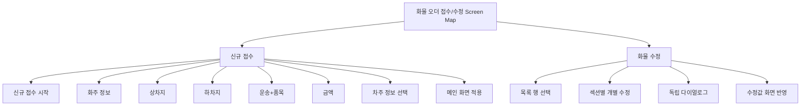
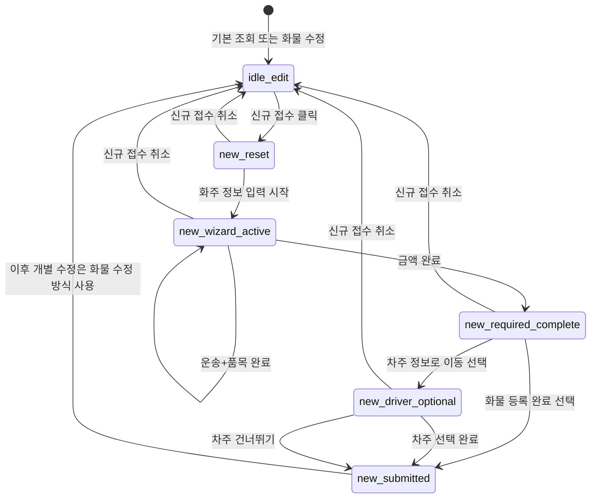
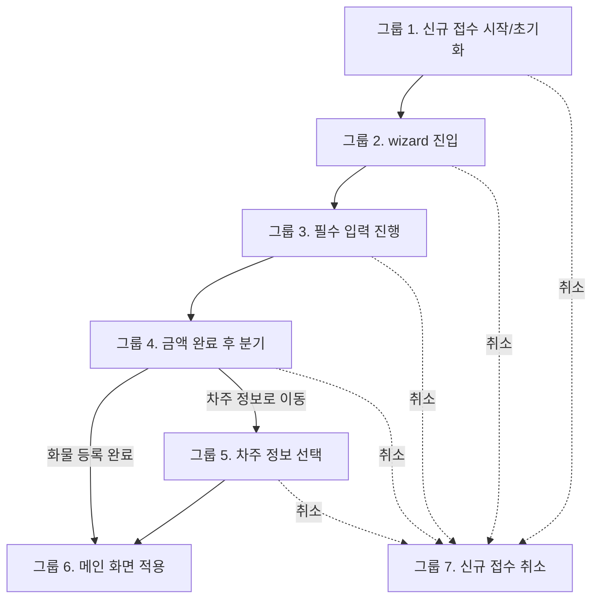
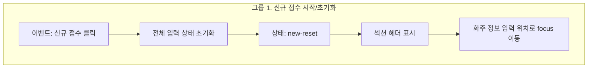
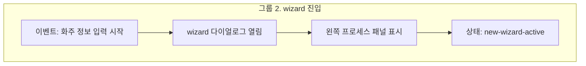
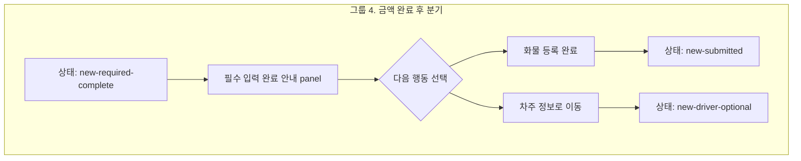
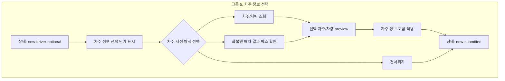
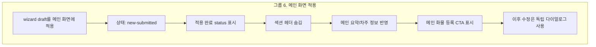
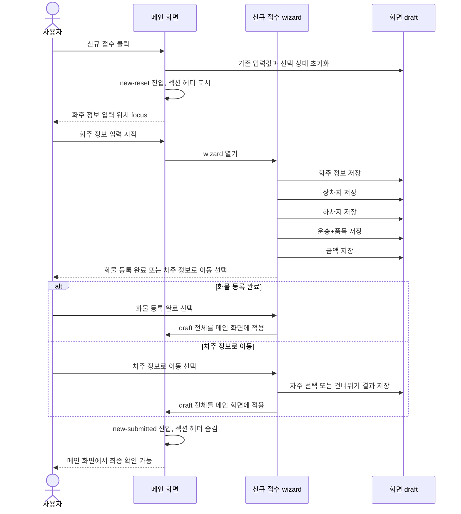

# Screen Map User Flow 기획: 신규 접수 이벤트

## 목적

이 문서는 `screenmap` 왼쪽 user flow를 다시 설계하기 위한 기획 초안입니다.

HTML 구현은 아직 수정하지 않습니다. 먼저 화면 탐색 구조를 `신규 접수`와 `화물 수정` 두 흐름으로 나누고, 그중 `신규 접수`에서 발생하는 이벤트를 다이어그램과 표로 정리합니다.

## 범위

| 구분 | 포함 |
| --- | --- |
| User flow 분류 | `신규 접수`, `화물 수정` |
| 신규 접수 이벤트 | 신규 시작, 초기화, focus, wizard 시작, 단계 완료, 금액 후 분기, 차주 선택, 메인 화면 적용 |
| 화면 상태 | `idle-edit`, `new-reset`, `new-wizard-active`, `new-required-complete`, `new-driver-optional`, `new-submitted` |
| UI 반응 | 섹션 헤더, wizard, 왼쪽 프로세스 패널, 독립 다이얼로그 전환 |
| Data 반영 | draft 초기화, wizard draft 누적, 메인 화면 적용 |

## 제외

| 구분 | 제외 이유 |
| --- | --- |
| 실제 API 등록 | 이번 단계는 screen map 기획이며, 저장 API 설계는 별도 범위 |
| `submit-validating`, `submit-pending`, `submit-failed`, `submit-complete` | 실제 등록 요청 이후 상태이므로 왼쪽 user flow 1차 기획에서 제외 |
| endpoint, payload schema, server validation | 구현 전 계약 결정 영역 |

## 왼쪽 User Flow 분류

왼쪽 pane은 파일/문서 목록이 아니라 사용자가 실제로 수행하는 업무 흐름을 먼저 보여줘야 합니다.

## 신규 접수 상태 흐름

`신규 접수`는 빈 상태에서 순서대로 입력을 모으는 흐름입니다.

`화물 수정`은 이미 존재하는 화물을 기준으로 필요한 섹션만 독립 다이얼로그로 수정하는 흐름입니다.

## 신규 접수 이벤트 다이어그램

아래 다이어그램은 실제 API 등록을 제외하고, 화면 안에서 발생하는 이벤트를 그룹 단위로 표현합니다.

그룹은 사용자가 이해하는 업무 전환 기준으로 나눕니다. 예를 들어 `신규 접수 클릭 -> 전체 입력 상태 초기화 -> 상태: new-reset -> 섹션 헤더 표시`는 하나의 시작 그룹으로 묶습니다.

### 그룹 1. 신규 접수 시작/초기화

Screenmap 반영 상태: 그룹 1은 가운데 pane에서 `master.html?screenmap=1` live preview와 번호 marker로 표현합니다. 버튼형 target인 `신규 접수 클릭`, `화주 정보 focus`는 실제 버튼을 덮지 않도록 callout marker로 표시합니다.

### 그룹 2. Wizard 진입

Screenmap 설계 상태: 그룹 2 live anchor map과 screenmap 준비 상태는 `06-group-2-wizard-entry-anchor-plan.md`에 분리해 정의했습니다.

### 그룹 3. 필수 입력 진행

```mermaid
flowchart TD
  subgraph G3["그룹 3. 필수 입력 진행"]
    subgraph G31["그룹 3-1. 화주 정보"]
      C1["화주/담당자 통합 조회"]
      C2["결과 row 선택"]
      C3["선택 화주/담당자 정보 확인"]
      C4["담당자 추가 등록"]
      C5["화주 정보 적용"]
      C6["상차지 단계 표시"]
    end

    subgraph G32["그룹 3-2. 상차지"]
      C7["상차지 조회 출처/검색"]
      C8["상차지 결과 row 선택"]
      C9["선택 상차지 정보 확인"]
      C10["상차 일시/방법 조건"]
      C11["상차지 적용"]
      C12["하차지 단계 표시"]
    end

    subgraph G33["그룹 3-3. 하차지"]
      C13["하차지 조회 출처/검색"]
      C14["하차지 결과 row 선택"]
      C15["선택 하차지 정보 확인"]
      C16["하차 일시/방법 조건"]
      C17["하차지 적용"]
      C18["운송+품목 단계 표시"]
    end

    subgraph G34["그룹 3-4. 운송+품목"]
      C19["차량 조건 입력"]
      C20["대수/실중량 입력"]
      C21["품목 입력"]
      C22["최근 조합 선택"]
      C23["운송+품목 적용"]
      C24["금액 단계 표시"]
    end

    subgraph G35["그룹 3-5. 금액"]
      C25["결제방법 선택"]
      C26["청구/운송 비용 입력"]
      C27["수수료/조정 금액 입력"]
      C28["금액 조건 적용"]
      C29["상태: new-required-complete"]
    end

    C1 --> C2 --> C3 --> C4 --> C5 --> C6 --> C7 --> C8 --> C9 --> C10 --> C11 --> C12 --> C13 --> C14 --> C15 --> C16 --> C17 --> C18 --> C19 --> C20 --> C21 --> C22 --> C23 --> C24 --> C25 --> C26 --> C27 --> C28 --> C29
  end
```

Screenmap 설계 상태: 그룹 3의 part별 `markerKind`, `targetZone`, `focusRect`, 준비 상태 초안은 `08-group-3-required-inputs-marker-plan.md`에 분리해 정의했습니다. 왼쪽 user flow 세분화 기준과 구현 반영 내역은 `09-group-3-required-inputs-split-plan.md`를 기준으로 합니다. `그룹 3-1. 화주 정보`의 조회, 선택, 선택 정보 preview, 담당자 추가 등록 컴포넌트 설명은 `10-group-3-1-shipper-contact-components-plan.md`, `그룹 3-2`부터 `그룹 3-5`의 주소/운송+품목/금액 컴포넌트 설명은 `11-group-3-2-to-3-5-required-components-plan.md`를 기준으로 합니다.

### 그룹 4. 금액 완료 후 분기

Screenmap 설계 상태: 그룹 4는 `13-group-4-amount-branch-plan.md` 기준으로 단일 node를 유지합니다. marker는 `new-required-complete` panel, API 저장 아님 안내, `차주 정보로 이동`, `화물 등록 완료` 4개로 설계하고, 실제 API endpoint/payload는 이 그룹에서 제외합니다.

### 그룹 5. 차주 정보 선택

Screenmap 설계 상태: 그룹 5는 `14-group-5-driver-choice-plan.md` 기준으로 단일 node를 유지합니다. marker는 차주 선택 단계, 차주/차량 조회 진입, 화물맨 배차 결과 박스, 선택 차주/차량 preview, `건너뛰기`, `차주 정보에 적용` 6개로 설계하고, 실제 화물맨 API/내부 DB endpoint/payload는 이 그룹에서 제외합니다.

### 그룹 6. 메인 화면 적용

Screenmap 설계 상태: 그룹 6은 `15-group-6-main-apply-plan.md` 기준으로 단일 node를 유지합니다. marker는 적용 완료 status, 섹션 헤더 숨김, 요약 반영, 차주 정보 반영, 메인 `화물 등록` CTA, 독립 수정 진입 6개로 설계하고, 실제 API validation/pending/retry/server error는 이 그룹에서 제외합니다.

### 그룹 7. 신규 접수 취소

## 신규 접수 Sequence

## 이벤트 매트릭스

| 순서 | 이벤트 | 현재 상태 | 다음 상태 | UI 반응 | Data 반영 |
| ---: | --- | --- | --- | --- | --- |
| 1 | `신규 접수` 클릭 | `idle-edit` | `new-reset` | 섹션 헤더 표시, 화주 focus | 화면 draft 초기화 |
| 2 | 화주 정보 입력 시작 | `new-reset` | `new-wizard-active` | wizard 열림, 왼쪽 프로세스 패널 표시 | 화주 입력 draft 시작 |
| 3 | 화주 정보 완료 | `new-wizard-active` | `new-wizard-active` | 상차지 단계로 이동 | `Requester` 누적 |
| 4 | 상차지 완료 | `new-wizard-active` | `new-wizard-active` | 하차지 단계로 이동 | 상차 `Location` 누적 |
| 5 | 하차지 완료 | `new-wizard-active` | `new-wizard-active` | 운송+품목 단계로 이동 | 하차 `Location`, route 후보 누적 |
| 6 | 운송+품목 완료 | `new-wizard-active` | `new-wizard-active` | 금액 단계로 이동 | `VehicleRequirement`, `CargoDetail` 누적 |
| 7 | 금액 완료 | `new-wizard-active` | `new-required-complete` | 마지막 분기 표시 | `Pricing` 누적 |
| 8 | `화물 등록 완료` 선택 | `new-required-complete` | `new-submitted` | wizard 닫힘, 섹션 헤더 숨김 | draft 전체를 메인 화면에 적용 |
| 9 | `차주 정보로 이동` 선택 | `new-required-complete` | `new-driver-optional` | 차주 선택 단계 표시 | 차주 draft 대기 |
| 10 | 차주 선택 완료 | `new-driver-optional` | `new-submitted` | wizard 닫힘, 섹션 헤더 숨김 | `DriverAssignment` 포함 적용 |
| 11 | 차주 건너뛰기 | `new-driver-optional` | `new-submitted` | wizard 닫힘, 섹션 헤더 숨김 | 차주 미지정으로 적용 |
| 12 | 신규 접수 취소 | 신규 접수 중 상태 | `idle-edit` | wizard/안내형 헤더 종료 | 입력값 폐기/유지 정책 확인 필요 |

## 신규 접수 단계별 화면 노드

| 왼쪽 node | 상태 | 역할 | 오른쪽 panel 우선 정보 |
| --- | --- | --- | --- |
| 신규 접수 시작 | `new-reset` | 초기화와 첫 입력 유도 | reset 범위, focus, 섹션 헤더 |
| 화주 정보 | `new-wizard-active` | 첫 필수 입력 | `Requester`, validation, source |
| 상차지 | `new-wizard-active` | 상차 주소 확정 | `Location`, 최근 장소, validation |
| 하차지 | `new-wizard-active` | 하차 주소 확정 | `Location`, route 후보, validation |
| 운송+품목 | `new-wizard-active` | 운송 조건과 품목 확정 | `VehicleRequirement`, `CargoDetail` |
| 금액 | `new-required-complete` | 필수 입력 완료와 다음 행동 분기 | `Pricing`, 금액 후 분기 |
| 차주 정보 선택 | `new-driver-optional` | 선택 입력 또는 건너뛰기 | `DriverAssignment`, optional policy, 화물맨 UI boundary |
| 메인 화면 적용 | `new-submitted` | wizard 입력값을 메인 화면에서 확인 | 이후 수정 방식, 독립 다이얼로그 전환 |

## 화물 수정 Flow 1차 정의

화물 수정은 상세 설계를 다음 문서에서 진행합니다. 이번 문서에서는 `신규 접수`와 분리되는 큰 원칙만 둡니다.

| 원칙 | 내용 |
| --- | --- |
| 진입 | 기존 목록 행 선택 또는 기존 화물 조회 상태 |
| 상태 | 기본적으로 `idle-edit` |
| 입력 방식 | 필요한 섹션만 독립 다이얼로그로 수정 |
| 표시 방식 | 섹션 헤더 숨김, 본문 라벨과 값 중심 |
| 신규 접수 wizard | 사용하지 않음 |
| 왼쪽 프로세스 패널 | 표시하지 않음 |

## Screen Map 반영 방향

| 영역 | 반영 방향 |
| --- | --- |
| 왼쪽 pane | 최상위 group을 `신규 접수`, `화물 수정` 2개로 재구성 |
| 신규 접수 node | 이벤트 순서가 보이는 timeline 형태로 표시 |
| 화물 수정 node | `목록 행 선택`, `섹션별 개별 수정`, `독립 다이얼로그`, `수정값 화면 반영`으로 시작 |
| 가운데 pane | 선택 node의 화면 상태와 master HTML 확인 경로 표시 |
| 오른쪽 pane | 해당 node의 기능 설명, data contract, validation, QA, source 표시 |
| 실제 API 정보 | 왼쪽 user flow 1차 기획에서는 제외 |

## 확인 필요

| 항목 | 이유 |
| --- | --- |
| 신규 접수 취소 정책 | 입력값 폐기, 유지, 임시 저장 중 결정 필요 |
| 이전 단계 수정 시 후속 단계 유지 여부 | 주소 변경 시 거리/금액 재계산이 필요할 수 있음 |
| 차주 선택 단계 범위 | `14-group-5-driver-choice-plan.md`에서 화면 UI 기준으로 정리됨. 실제 화물맨/API 연동은 제외 |
| 화물 수정 상세 node | 기존 화면의 수정 단위를 어느 수준까지 왼쪽 flow에 노출할지 결정 필요 |
