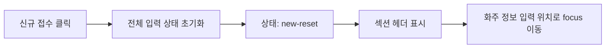
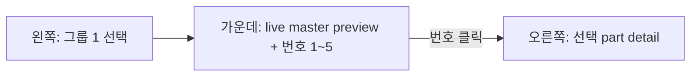

# Screen Map 가운데 섹션 표현 기획

## 목적

이 문서는 `screenmap` 가운데 섹션을 어떻게 표현할지 비교 기획합니다.

현재 왼쪽 user flow는 `신규 접수`와 `화물 수정`으로 나뉘며, `신규 접수`는 그룹 1~7로 구성되어 있습니다. 이번 문서의 1차 기준은 `그룹 1. 신규 접수 시작/초기화`입니다.

## 기준

| 항목 | 기준 |
| --- | --- |
| 문서 위치 | `screenmap/02-center-preview-options.md` |
| 기준 화면 | `../wireframes/final-handoff/baseline/html/cargo-order-admin-hifi-master.html` |
| 적용 대상 | 가운데 pane |
| 1차 대상 그룹 | `그룹 1. 신규 접수 시작/초기화` |
| 구현 전제 | 정적 HTML/CSS/JS, `file://` 동작 |
| 현재 구현 | `master.html` live iframe + fallback marker overlay |

## 그룹 1 이벤트 기준

그룹 1은 아래 흐름을 하나의 이벤트 묶음으로 봅니다.



가운데 섹션은 이 흐름을 사용자가 화면 기준으로 이해하게 만드는 역할을 해야 합니다.

## 비교 대상

| 안 | 이름 | 핵심 표현 |
| --- | --- | --- |
| 1안 | Animated Master Tour | `master.html` 화면을 애니메이션처럼 이동하며 각 컴포넌트를 설명 |
| 2안 | Focused Capture Strip | 그룹 1의 각 컴포넌트에 focus된 캡처 화면을 나열 |
| 3안 | Numbered Screen Overlay | 메인 화면 위에 그룹 1 파트를 번호로 표시하고, 클릭 시 오른쪽 설명 갱신 |

## 비교 표

| 기준 | 1안 Animated Master Tour | 2안 Focused Capture Strip | 3안 Numbered Screen Overlay |
| --- | --- | --- | --- |
| 사용자 이해도 | 높음. 실제 화면 흐름을 영상처럼 따라감 | 높음. 단계별 장면을 빠르게 비교 가능 | 높음. 한 화면 안에서 위치와 의미를 같이 파악 |
| 구현 난이도 | 높음 | 중간 | 낮음~중간 |
| 유지보수성 | 낮음. DOM 위치와 animation target 변경에 약함 | 중간. 캡처 갱신 필요 | 높음. 번호와 설명 데이터만 갱신 가능 |
| `file://` 적합성 | 낮음. iframe, scroll, asset, animation 제약 가능 | 높음. 정적 이미지면 안정적 | 높음. 정적 HTML/CSS/JS로 구현 가능 |
| 확장성 | 중간. 그룹별 tour script가 늘어남 | 중간. 이미지 asset 관리가 커짐 | 높음. 그룹 2~7에도 같은 패턴 적용 가능 |
| 오른쪽 pane 연동 | 가능하지만 timing 동기화 필요 | 이미지 선택 시 연동 가능 | 가장 자연스러움. 번호 클릭이 오른쪽 설명과 1:1 연결 |
| 모바일 대응 | 어려움. 화면 이동 animation이 답답할 수 있음 | 좋음. 세로 리스트로 전환 가능 | 좋음. overlay 대신 step list로 전환 가능 |
| 리스크 | animation 과잉, 성능, 위치 오차 | 캡처 최신성, asset 관리 | 실제 master와 100% 동일해 보이지 않을 수 있음 |
| MVP 적합도 | 낮음 | 중간 | 높음 |

## 1안: Animated Master Tour

### 개념

가운데 pane에서 `master.html` 또는 master 기반 preview를 보여주고, 사용자가 그룹 1을 선택하면 화면이 순서대로 이동합니다.

예상 순서:

1. `신규 접수` 버튼 위치 강조
2. 입력 상태가 초기화되는 영역 설명
3. `new-reset` 상태 badge 또는 신규 접수 모드 설명
4. 섹션 헤더 표시 영역 강조
5. 화주 정보 입력 focus 위치 강조

### 장점

| 항목 | 내용 |
| --- | --- |
| 몰입도 | 실제 화면을 따라가는 느낌이 강함 |
| 설명력 | 이벤트 순서가 시간 흐름으로 보임 |
| 데모 효과 | 이해관계자에게 보여줄 때 인상적 |

### 단점

| 항목 | 내용 |
| --- | --- |
| 구현 난이도 | scroll target, highlight 위치, animation timing이 필요 |
| 안정성 | master HTML 구조가 바뀌면 target이 깨질 수 있음 |
| `file://` 리스크 | iframe 접근, 큰 HTML 로딩, scroll 제어가 불안정할 수 있음 |
| 유지보수 | 그룹마다 tour step script를 관리해야 함 |

### 판단

초기 MVP보다는 후속 데모 기능에 적합합니다. 지금 단계에서 이 방식을 먼저 만들면 기획 검증보다 animation 구현에 비용이 커질 수 있습니다.

## 2안: Focused Capture Strip

### 개념

그룹 1의 이벤트마다 focus된 캡처 이미지를 만들어 가운데 pane에 나열합니다.

예상 캡처:

1. `신규 접수` 버튼 강조 캡처
2. 전체 입력 초기화 후 빈 상태 캡처
3. `new-reset` 상태 캡처
4. 섹션 헤더 표시 캡처
5. 화주 정보 focus 캡처

### 장점

| 항목 | 내용 |
| --- | --- |
| 이해도 | 단계별 전후 상태를 빠르게 비교 가능 |
| 안정성 | 정적 이미지라 `file://`에서 안정적 |
| 문서화 | QA, 기획 리뷰 자료로 재사용 가능 |

### 단점

| 항목 | 내용 |
| --- | --- |
| asset 관리 | 캡처 이미지 생성, 보관, 갱신 정책 필요 |
| 최신성 | master HTML이 바뀌면 캡처가 낡을 수 있음 |
| 상호작용 | 오른쪽 pane과 연결하려면 별도 선택 상태 필요 |

### 판단

정적 handoff에는 좋지만, 지금 바로 구현하면 캡처 asset 생성과 갱신 정책이 먼저 필요합니다. MVP보다는 “검증용 이미지가 준비된 후” 적용하기 좋습니다.

## 3안: Numbered Screen Overlay

### 개념

가운데 pane에 master 화면을 단순화한 preview 또는 master 기반 정적 frame을 두고, 그룹 1의 각 파트를 번호로 표시합니다.

번호를 클릭하면 오른쪽 pane이 해당 파트 설명으로 바뀝니다.

예상 번호:

| 번호 | 파트 | 오른쪽 설명 |
| ---: | --- | --- |
| 1 | `신규 접수` 클릭 | 시작 이벤트, 진입 조건 |
| 2 | 전체 입력 상태 초기화 | reset 범위, draft 초기화 |
| 3 | `new-reset` 상태 | 상태 전환, UI policy |
| 4 | 섹션 헤더 표시 | 신규 접수 안내형 보기 |
| 5 | 화주 정보 focus | 첫 입력 유도, focus rule |

### 장점

| 항목 | 내용 |
| --- | --- |
| MVP 속도 | 정적 HTML/CSS/JS로 빠르게 구현 가능 |
| 이해도 | 화면 위치와 설명을 동시에 연결 |
| 유지보수 | 번호별 data만 바꾸면 됨 |
| 확장성 | 그룹 2~7에도 같은 구조 반복 가능 |
| 오른쪽 pane 연동 | 클릭한 번호가 곧 오른쪽 detail key가 됨 |

### 단점

| 항목 | 내용 |
| --- | --- |
| 실제성 | master HTML live 화면과 완전히 같지 않을 수 있음 |
| 좌표 관리 | 실제 screenshot 위 overlay라면 반응형 좌표 정책 필요 |
| 밀도 | 번호가 많아지면 화면이 복잡해질 수 있음 |

### 판단

MVP로 가장 적합합니다. 특히 현재 `screenmap` 구조가 왼쪽 node 선택과 오른쪽 detail 갱신을 이미 갖고 있으므로, 가운데 pane의 번호 클릭도 같은 패턴으로 확장하기 쉽습니다.

## 추가 아이디어

### 4안: Event Timeline + Screen Anchor

가운데 pane 상단에는 작은 화면 preview를 두고, 하단에는 그룹 1의 이벤트 timeline을 표시합니다. timeline 항목을 클릭하면 preview의 anchor와 오른쪽 설명이 함께 바뀝니다.

| 장점 | 단점 |
| --- | --- |
| 이벤트 순서가 가장 명확함 | 화면 위치 감각은 3안보다 약함 |
| 이미지 asset 없이도 시작 가능 | 시각적 몰입도는 낮음 |

### 5안: Before / After Diff

`idle-edit`와 `new-reset`을 나란히 보여주고, 바뀐 항목만 번호로 표시합니다.

| 장점 | 단점 |
| --- | --- |
| 그룹 1의 핵심인 초기화와 상태 전환을 잘 보여줌 | 그룹 2~7에는 그대로 재사용하기 어려움 |
| reset 범위 리뷰에 좋음 | 화면이 비교표처럼 딱딱해질 수 있음 |

### 6안: Checklist Preview

가운데 pane을 화면 preview보다 검증 checklist 중심으로 구성합니다. 각 이벤트를 체크 항목으로 보여주고, 항목 선택 시 오른쪽 설명을 바꿉니다.

| 장점 | 단점 |
| --- | --- |
| QA와 개발 handoff에 강함 | 화면 중심 handoff라는 목적이 약해짐 |
| 구현이 매우 쉬움 | 사용자가 실제 위치를 상상해야 함 |

## 추천안

### MVP 추천: 3안 Numbered Screen Overlay

가장 먼저 적용할 방식은 `3안 Numbered Screen Overlay`입니다.

이유:

| 기준 | 판단 |
| --- | --- |
| 구현 속도 | 현재 정적 app 구조에 가장 잘 맞음 |
| 사용자 이해도 | 화면 위치와 이벤트 의미를 함께 전달 |
| 유지보수 | 번호, label, 설명 data만 관리하면 됨 |
| `file://` 안정성 | live iframe이나 fetch에 의존하지 않아도 됨 |
| 확장성 | 그룹 1 이후 그룹 2~7에도 같은 패턴 적용 가능 |

초기 MVP 판단은 `Numbered Screen Overlay`였지만, 현재 그룹 1 구현은 `03-live-master-screenmap-mode-plan.md`에 따라 `master.html` live iframe 위에 번호 overlay를 얹는 `live-master-hotspot`으로 개선했습니다.

`screenmap/assets/master-new-order-base.png`는 live iframe 또는 bridge anchor 실패 시 사용하는 fallback 기준 이미지로 유지합니다.

### 후속 확장: 2안 Focused Capture Strip

후속 확장으로는 `2안 Focused Capture Strip`을 추천합니다.

이유:

| 기준 | 판단 |
| --- | --- |
| 리뷰 품질 | 실제 화면 캡처가 있으면 이해관계자 확인이 쉬움 |
| QA 재사용 | 캡처를 acceptance evidence로도 활용 가능 |
| 안정성 | animation보다 정적 handoff에 안정적 |

단, 이 방식은 캡처 asset 위치, 파일명 규칙, 갱신 기준을 먼저 정한 뒤 적용하는 것이 좋습니다.

## MVP 적용 단계

| 단계 | 작업 | 산출물 |
| ---: | --- | --- |
| 1 | 그룹 1의 center preview data 정의 | `group-init.parts[]` |
| 2 | 파트 1~5의 label, short copy, right detail key 정의 | center/right 연결 map |
| 3 | 가운데 preview에 live master iframe과 번호 overlay 렌더링 | 정적 HTML/CSS/JS |
| 4 | 번호 클릭 시 오른쪽 pane detail 갱신 | selected part state |
| 5 | 버튼형 target marker를 callout으로 배치 | `liveMarkerPlacement`, 자동 button placement |
| 6 | 모바일에서는 live preview와 event list를 함께 표시 | responsive layout |

## 그룹 1 Center Data 확정안

`1번` 선택으로 그룹 1의 가운데 섹션 표현은 아래 기준으로 확정합니다.

| 항목 | 확정값 | 이유 |
| --- | --- | --- |
| Center mode | `live-master-hotspot` | 실제 master 화면을 iframe으로 보여주고 fallback marker를 얹음 |
| Preview 기반 | `live-master-fallback-marker` | iframe은 live master를 표시하고, bridge 실패 시 기존 좌표와 fallback image를 사용 |
| Part 개수 | 5개 | 그룹 1 이벤트 흐름과 1:1 대응 |
| 오른쪽 detail 단위 | `part.detailKey` | 번호 클릭과 오른쪽 설명 갱신을 단순하게 연결 |
| Desktop 표현 | live master iframe 위 번호 hotspot | 최신 master 화면을 기준으로 위치 이해 가능 |
| Mobile 표현 | live master iframe + event list | 작은 화면에서도 위치와 순서를 함께 확인 |
| 완료된 확장 | `screenmap.anchor-rects` bridge | DOM anchor 기반 marker 자동 배치, document 좌표 sync, button callout 적용 |

### 그룹 1 Part Map

| 번호 | Part ID | Label | Trigger / 상태 | Center target | 오른쪽 detail focus |
| ---: | --- | --- | --- | --- | --- |
| 1 | `group-init.click-new` | 신규 접수 클릭 | `idle-edit`에서 시작 | header/toolbar action 영역 | 신규 접수 진입 조건과 사용자 action |
| 2 | `group-init.reset-fields` | 전체 입력 상태 초기화 | 클릭 직후 내부 처리 | main form 전체 | reset 범위와 draft 초기화 책임 |
| 3 | `group-init.state-new-reset` | 상태: `new-reset` | 초기화 완료 후 | header status 또는 state badge 영역 | 상태 전환 의미와 UI policy |
| 4 | `group-init.section-headers` | 섹션 헤더 표시 | `new-reset` 진입 후 | section header 영역 | 안내형 보기와 번호 헤더 역할 |
| 5 | `group-init.shipper-focus` | 화주 정보 focus | 화면 render 후 1회 | 화주 정보 섹션 | 첫 입력 유도와 focus rule |

### 구현용 데이터 계약

아래 JSON은 후속 `app.js` 반영 시 그대로 기준 데이터로 사용할 수 있는 형태입니다.

```json
{
  "groupId": "new-order.group-init",
  "label": "그룹 1. 신규 접수 시작/초기화",
  "centerMode": "live-master-hotspot",
  "previewBase": "live-master-fallback-marker",
  "master": {
    "src": "../wireframes/final-handoff/baseline/html/cargo-order-admin-hifi-master.html?screenmap=1",
    "fallbackImage": "./assets/master-new-order-base.png"
  },
  "screenshot": {
    "src": "./assets/master-new-order-base.png",
    "alt": "cargo-order-admin-hifi-master 신규 접수 기준 화면",
    "width": 1408,
    "height": 662
  },
  "mobileFallback": "event-list",
  "parts": [
    {
      "id": "group-init.click-new",
      "number": 1,
      "label": "신규 접수 클릭",
      "shortCopy": "사용자가 신규 접수 흐름을 시작합니다.",
      "event": "clickNewOrder",
      "stateBefore": "idle-edit",
      "stateAfter": "idle-edit",
      "targetZone": "header-action",
      "liveMarkerPlacement": "above",
      "rightDetailKey": "group-init.click-new",
      "detail": "idle-edit에서 신규 접수 흐름으로 진입합니다. 이 시점에는 아직 화면 초기화가 완료되지 않았습니다.",
      "qa": ["AC-A1"]
    },
    {
      "id": "group-init.reset-fields",
      "number": 2,
      "label": "전체 입력 상태 초기화",
      "shortCopy": "기존 입력값과 선택 상태를 비웁니다.",
      "event": "resetDraftFields",
      "stateBefore": "idle-edit",
      "stateAfter": "new-reset",
      "targetZone": "main-form",
      "rightDetailKey": "group-init.reset-fields",
      "detail": "화주, 주소, 운송+품목, 금액, 차주 관련 draft를 초기화합니다.",
      "qa": ["AC-A1", "AC-A2"]
    },
    {
      "id": "group-init.state-new-reset",
      "number": 3,
      "label": "상태: new-reset",
      "shortCopy": "신규 접수 초기 상태로 전환됩니다.",
      "event": "enterNewResetState",
      "stateBefore": "idle-edit",
      "stateAfter": "new-reset",
      "targetZone": "status-area",
      "rightDetailKey": "group-init.state-new-reset",
      "detail": "신규 접수 초기화가 완료된 상태입니다. 이후 화면은 안내형 신규 접수 보기로 바뀝니다.",
      "qa": ["AC-A2"]
    },
    {
      "id": "group-init.section-headers",
      "number": 4,
      "label": "섹션 헤더 표시",
      "shortCopy": "입력 순서를 보여주는 섹션 헤더가 나타납니다.",
      "event": "showGuidedSectionHeaders",
      "stateBefore": "new-reset",
      "stateAfter": "new-reset",
      "targetZone": "section-header",
      "rightDetailKey": "group-init.section-headers",
      "detail": "신규 접수 안내형 보기로 전환해 번호형 섹션 헤더를 표시합니다.",
      "qa": ["AC-A3", "AC-B3", "AC-B6"]
    },
    {
      "id": "group-init.shipper-focus",
      "number": 5,
      "label": "화주 정보 focus",
      "shortCopy": "첫 입력 위치로 focus를 이동합니다.",
      "event": "focusShipperInput",
      "stateBefore": "new-reset",
      "stateAfter": "new-reset",
      "targetZone": "shipper-section",
      "liveMarkerPlacement": "left",
      "rightDetailKey": "group-init.shipper-focus",
      "detail": "화주 정보 섹션 또는 화주 정보 입력 버튼으로 focus를 이동합니다. focus 이동은 render 완료 후 1회만 수행합니다.",
      "qa": ["AC-A4", "AC-A5"]
    }
  ]
}
```

### Center Preview Layout 확정



| 영역 | 표현 |
| --- | --- |
| Preview header | `그룹 1. 신규 접수 시작/초기화`와 현재 part label |
| Preview body | `master.html?screenmap=1` live iframe, 실패 시 fallback image |
| Overlay marker | 번호 `1~5`, active 번호는 accent 색상, 버튼형 target은 callout 배치 |
| Event list | 번호, label, short copy를 세로 목록으로 표시 |
| Right sync | 번호 클릭 시 `rightDetailKey` 기준으로 오른쪽 설명 갱신 |

## 남은 후속 결정

| 항목 | 결정 필요 이유 |
| --- | --- |
| asset 정책 | 2안으로 확장할 경우 캡처 저장 위치와 갱신 규칙 필요 |
| 실제 좌표 보정 | MVP 이후 screenshot overlay로 바꿀 경우 desktop/mobile 좌표 재정의 필요 |
| part detail copy | 오른쪽 설명 문구를 운영/QA/개발 중 어느 톤으로 우선할지 결정 필요 |
