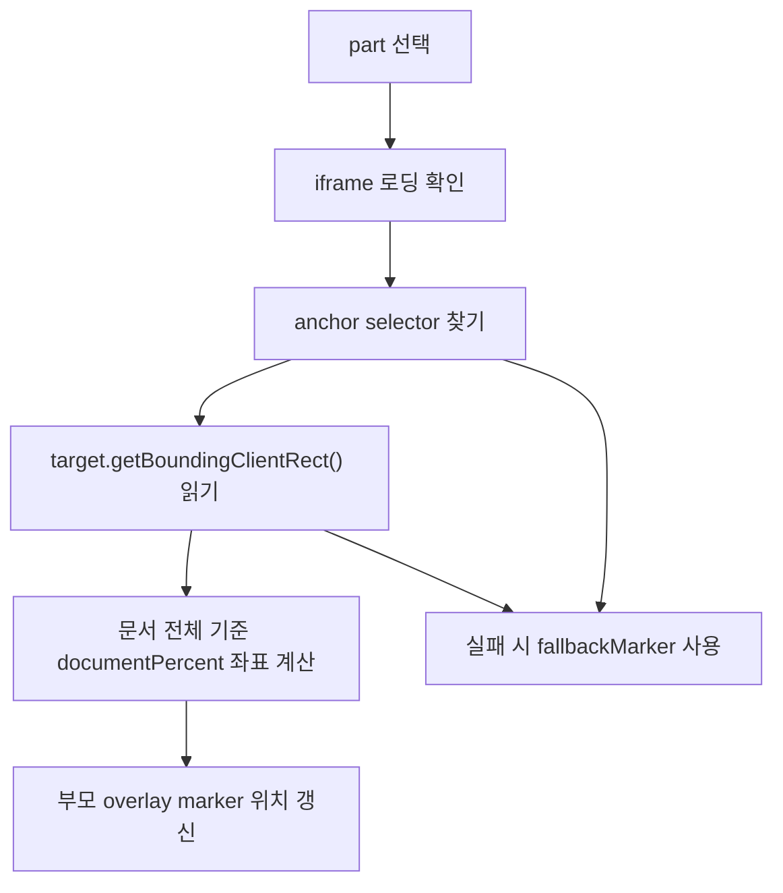

# Live Master Screenmap Mode 전환 기획

## 목적

이 문서는 `screenmap` 가운데 preview를 screenshot 기반에서 `master.html` 기반 live preview로 전환하기 위한 상세 기획입니다.

현재 그룹 1은 1차 구현으로 `master.html` live iframe 위에 fallback marker를 표시합니다. `screenmap/assets/master-new-order-base.png`는 iframe 실패 또는 bridge 실패 시 사용할 fallback 기준 이미지로 유지합니다.

목표는 아래 구조로 전환하는 것입니다.

```text
screenmap/index.html
  -> 가운데 pane
    -> live master iframe
    -> marker overlay
    -> 오른쪽 detail panel
```

핵심 원칙은 다음과 같습니다.

| 원칙 | 설명 |
| --- | --- |
| 화면은 master가 책임 | 최신 UI, 실제 배치, 실제 컴포넌트 상태는 `master.html`을 기준으로 봅니다. |
| 설명은 screenmap이 책임 | flow, part, QA, checklist, 오른쪽 detail은 `screenmap/app.js`가 관리합니다. |
| screenshot은 fallback | iframe 접근 실패나 anchor 계산 실패 때만 기존 캡처 이미지를 사용합니다. |
| 좌표보다 anchor 우선 | 수동 `x/y` 좌표보다 DOM selector 또는 `data-screenmap-anchor`를 우선합니다. |

## 현재 리스크

| 리스크 | 원인 | 영향 |
| --- | --- | --- |
| 캡처 최신성 | `master.html` 변경과 `master-new-order-base.png` 변경이 분리됨 | 화면 handoff가 실제 master와 달라질 수 있음 |
| 좌표 유지보수 | marker가 이미지 비율 기준 `x/y`에 의존 | 버튼이나 섹션 위치가 바뀌면 marker 위치도 따로 수정해야 함 |
| 그룹 확장 비용 | 그룹 2~7마다 캡처 asset이 필요 | asset 생성, 명명, 갱신 정책이 커짐 |

## 추천 결론

최종 추천안은 `live-master-hotspot`입니다.

```text
1순위: master.html iframe + DOM anchor 기반 marker
2순위: master.html iframe + fallback 좌표 marker
3순위: screenshot-hotspot fallback
```

`master.html`을 iframe으로 직접 보여주고, 가능한 경우 iframe 내부 DOM 위치를 읽어 marker를 자동 배치합니다. 실패하면 현재 screenshot 방식으로 되돌아갑니다.

## 단계별 전환 계획

| 단계 | 이름 | 목표 | 산출물 | 코드 영향 |
| ---: | --- | --- | --- | --- |
| 0 | 기술 검증 | `file://`에서 iframe DOM 접근 가능 여부 확인 | probe 결과 문서 | 없음 또는 임시 검증만 |
| 1 | live iframe preview | 가운데 pane에서 `master.html`을 직접 표시 | `live-master-hotspot` mode | `screenmap/app.js`, `styles.css` |
| 2 | selector anchor | 수동 좌표 대신 selector 기반 marker 계산 | `anchor.selector` contract | `screenmap/app.js` |
| 3 | screenmap mode | `master.html?screenmap=1`에서 handoff 전용 보기 제공 | master hook 규칙 | `master.html` 또는 생성 source |
| 4 | group 확장 | 그룹 2~7로 live marker 패턴 확장 | group별 anchor map | `screenmap/app.js` |

### 1단계 구현 상태

구현일: `2026-06-18`

| 항목 | 상태 | 메모 |
| --- | --- | --- |
| `live-master-hotspot` mode | 완료 | 그룹 1에 적용 |
| live iframe 표시 | 완료 | `master.html?screenmap=1&group=...&part=...` 사용 |
| marker 표시 | 완료 | bridge anchor가 있으면 live DOM 좌표 사용, 실패 시 fallback 좌표 사용 |
| screenshot fallback asset | 유지 | `assets/master-new-order-base.png` 유지 |
| DOM anchor bridge 상세 설계 | 완료 | `04-master-screenmap-bridge-design.md` 참고 |
| master HTML 수정 지점 조사 | 완료 | `05-master-html-edit-point-inspection.md` 참고 |
| DOM anchor bridge 구현 | 1차 완료 | `SCREENMAP_BRIDGE_LAYER` 삽입, `screenmap.anchor-rects` 송신 확인 |
| 부모 marker live 좌표 반영 | 1차 완료 | `screenmap/app.js`가 `screenmap.anchor-rects`를 수신해 그룹 1 marker 좌표 갱신 |
| screenmap core view filter | 완료 | `screenmap=1`에서 `.list-ph`, `.ds-section.showcase` 숨김 |
| iframe 내부 scroll 제거 | 완료 | document 전체 높이 기준으로 frame 높이와 marker/focus 좌표 동기화 |
| 버튼형 marker callout | 완료 | bridge target metadata를 기준으로 버튼형 anchor는 버튼 바깥에 marker 표시 |

## 0단계: 기술 검증

### 목표

`screenmap/index.html`이 `file://`에서 열렸을 때, 가운데 iframe으로 로드한 `master.html`의 DOM을 부모 문서가 읽을 수 있는지 확인합니다.

검증 대상:

```js
iframe.contentDocument
iframe.contentWindow.document
iframe.contentDocument.querySelector(...)
```

### 판정 기준

| 판정 | 조건 | 다음 단계 |
| --- | --- | --- |
| 가능 | `contentDocument` 접근 가능, selector 조회 가능 | 1단계와 2단계를 바로 진행 |
| 부분 가능 | iframe 표시는 가능하지만 DOM 접근은 제한됨 | 1단계 진행, marker는 fallback 좌표 사용 |
| 불가 | iframe 표시 또는 로딩 자체가 불안정 | screenshot fallback 유지, dev server 방식 별도 검토 |

### 검증 항목

| 항목 | 확인 방법 |
| --- | --- |
| iframe 로딩 | `load` 이벤트 또는 iframe 내부 `document.title` 확인 |
| DOM 접근 | `querySelector("button")` 결과 확인 |
| 텍스트 검색 | `신규 접수 F3`, `화주 정보 입력` button 탐색 |
| 위치 계산 | `getBoundingClientRect()` 값 확인 |
| 스크롤 영향 | 기본 `screenmap=1`에서 iframe 내부 scroll이 생기지 않는지 확인 |
| 브라우저 차이 | Chrome 기준 우선, 필요 시 Edge 확인 |

### 0단계 probe 결과

검증일: `2026-06-18`

검증 환경:

| 항목 | 값 |
| --- | --- |
| 부모 페이지 | `file:///C:/Work/Dev/Design/.plans/20260430-cargo-order-admin/screenmap/index.html#new-order.group-init` |
| iframe 대상 | `file:///C:/Work/Dev/Design/.plans/20260430-cargo-order-admin/wireframes/final-handoff/baseline/html/cargo-order-admin-hifi-master.html?screenmap=1&group=new-order.group-init&part=group-init.click-new` |
| 브라우저 | Chrome headless, `file://` 직접 로딩 |

판정:

| 항목 | 결과 | 근거 |
| --- | --- | --- |
| iframe 표시 | 가능 | `load` 이벤트 발생, iframe rect `960x520` 확인 |
| `contentWindow` 접근 | 부분 가능 | 객체 참조는 가능 |
| 부모에서 iframe `document` 읽기 | 불가 | Chrome `SecurityError` 발생 |
| 부모에서 iframe `location.href` 읽기 | 불가 | Chrome `SecurityError` 발생 |
| 부모에서 selector 조회 | 불가 | `document` 접근이 막혀 `querySelector` 실행 불가 |
| iframe 내부 script의 `postMessage` | 가능 | iframe 컨텍스트에서 보낸 `screenmap.probe.anchor-rect` 메시지를 부모가 수신 |
| iframe 내부 anchor 탐색 | 가능 | iframe 내부 script 기준으로 `신규 접수 F3` button 탐색 성공 |

대표 에러:

```text
SecurityError: Failed to read a named property 'document' from 'Window': Blocked a frame with origin "null" from accessing a cross-origin frame.
```

최종 판정은 `부분 가능`입니다.

`file://`에서는 부모 `screenmap`이 iframe 내부 DOM을 직접 읽는 방식은 사용할 수 없습니다. 따라서 2단계의 selector anchor 계산을 부모 `screenmap/app.js`만으로 구현하면 안 됩니다.

대신 아래 구조를 우선합니다.

```text
master.html?screenmap=1 내부 script
  -> 자기 DOM에서 data-screenmap-anchor / selector 위치 계산
  -> parent.postMessage({ type: "screenmap.anchor-rects", anchors })

screenmap/index.html
  -> message 수신
  -> live iframe 위 overlay marker 위치 갱신
```

구현 순서도 아래처럼 조정합니다.

| 순서 | 기존 생각 | probe 이후 조정 |
| ---: | --- | --- |
| 1 | 부모가 iframe DOM selector를 직접 읽음 | live iframe 표시 + fallback 좌표 marker |
| 2 | 부모가 selector 기반 위치 계산 | `master.html?screenmap=1` 내부 script가 위치 계산 후 `postMessage` |
| 3 | 나중에 master hook 추가 | `data-screenmap-anchor` hook을 조기 도입해 selector 안정화 |

## 1단계: live iframe preview

### 목표

그룹 1 가운데 preview가 screenshot이 아니라 실제 `master.html`을 표시합니다.

예상 center mode:

```js
centerMode: "live-master-hotspot"
```

예상 데이터:

```js
{
  "groupId": "new-order.group-init",
  "centerMode": "live-master-hotspot",
  "master": {
    "src": "../wireframes/final-handoff/baseline/html/cargo-order-admin-hifi-master.html?screenmap=1",
    "fallbackImage": "./assets/master-new-order-base.png"
  }
}
```

### UX 기준

| 항목 | 기준 |
| --- | --- |
| 화면 표현 | 실제 master 첫 화면을 가운데 pane 안에 축소 표시 |
| marker 위치 | iframe 위 overlay layer에 표시 |
| 클릭 동작 | marker 또는 event card 클릭 시 오른쪽 detail 갱신 |
| master 링크 | 기존 `Master 열기` 링크 유지 |
| 실패 처리 | iframe 접근 실패 시 screenshot preview로 자동 전환 |

### 주의점

iframe 위에 marker를 얹을 때는 iframe 내부에 직접 marker를 넣지 않습니다. 부모 `screenmap`이 iframe 위에 overlay layer를 겹칩니다.

```text
.live-master-frame
  iframe.live-master-iframe
  .live-master-overlay
    button.marker-1
    button.marker-2
```

이렇게 하면 `master.html` 원본을 많이 수정하지 않아도 됩니다.

## 2단계: selector anchor 기반 marker

### 목표

`marker: { x, y }`를 기본값으로 쓰지 않고, 실제 DOM 요소 위치를 기준으로 marker를 배치합니다.

### anchor 우선순위

| 우선순위 | 방식 | 예시 | 특징 |
| ---: | --- | --- | --- |
| 1 | `data-screenmap-anchor` | `[data-screenmap-anchor="new-order.click-new"]` | 가장 안정적 |
| 2 | class selector | `.new-order-main-submit` | 현재 master class를 활용 |
| 3 | text selector | `button` + `신규 접수 F3` | 빠르게 시작 가능 |
| 4 | fallback marker | `{ x: 6.7, y: 95.3 }` | 마지막 안전장치 |

### part data 예시

```js
{
  id: "group-init.click-new",
  number: 1,
  label: "신규 접수 클릭",
  anchor: {
    key: "new-order.click-new",
    selector: "button",
    text: "신규 접수 F3",
    strategy: "center",
    fallbackMarker: { x: 6.7, y: 95.3 }
  }
}
```

### 위치 계산 흐름



### 계산 기준

| 값 | 설명 |
| --- | --- |
| target rect | iframe 내부 요소의 `getBoundingClientRect()` |
| iframe scroll | iframe 내부 스크롤 위치 |
| iframe scale | iframe 실제 표시 크기와 내부 viewport 비율 |
| overlay position | 부모 문서의 overlay layer에서 marker가 놓일 위치 |

## 3단계: `master.html?screenmap=1` mode

### 목표

`master.html`이 screenmap에서 iframe으로 열릴 때만 handoff에 적합한 표시 상태가 됩니다.

### 동작 기준

| 기능 | 설명 |
| --- | --- |
| 불필요 영역 축소 | 하단 상태 예시 모음, 참고 컴포넌트 영역을 줄이거나 접음 |
| 대표 영역 scroll | 기본 core view에서는 금지하고, `screenmapScroll=1`일 때만 선택된 group의 대표 anchor로 scroll |
| anchor 노출 | 주요 요소에 `data-screenmap-anchor` 추가 |
| active focus | 선택된 part만 강조 class 적용 가능 |
| 통신 | 필요 시 `postMessage`로 anchor 위치나 상태를 부모에게 전달 |

### query parameter 설계

```text
cargo-order-admin-hifi-master.html?screenmap=1&group=new-order.group-init&part=group-init.click-new
```

| parameter | 역할 |
| --- | --- |
| `screenmap=1` | screenmap 전용 표시 모드 활성화 |
| `group` | 현재 user flow group |
| `part` | 현재 선택된 part |

### master hook 예시

```html
<button data-screenmap-anchor="new-order.click-new">신규 접수 F3</button>
<span data-screenmap-anchor="new-order.state-new-reset">신규</span>
<section data-screenmap-anchor="new-order.reset-fields">...</section>
<button data-screenmap-anchor="new-order.shipper-focus">화주 정보 입력</button>
```

### master 수정 원칙

| 원칙 | 설명 |
| --- | --- |
| hook만 추가 | 화면 구조를 바꾸기보다 `data-screenmap-anchor` 같은 보조 속성만 추가 |
| normal mode 영향 없음 | `screenmap=1`이 없으면 기존 master 표시와 동일해야 함 |
| CSS 격리 | screenmap 전용 스타일은 `.is-screenmap-mode` 같은 상위 class 아래에 둠 |
| 생성물 관리 | master가 생성 산출물이라면 원본 source 또는 생성 스크립트 쪽에 hook 반영 검토 |

### screenmap bridge message contract

`file://`에서는 부모가 iframe DOM을 직접 읽을 수 없으므로, `master.html?screenmap=1` 내부에서 실행되는 bridge script가 위치 정보를 부모에게 보냅니다.

부모가 iframe에 보내는 메시지:

```js
{
  type: "screenmap.select-part",
  groupId: "new-order.group-init",
  partId: "group-init.click-new"
}
```

iframe이 부모에게 보내는 메시지:

```js
{
  type: "screenmap.anchor-rects",
  groupId: "new-order.group-init",
  viewport: {
    width: 1440,
    height: 900,
    scrollX: 0,
    scrollY: 0
  },
  anchors: {
    "group-init.click-new": {
      found: true,
      rect: { left: 63, top: 952, width: 93, height: 30 },
      strategy: "data-screenmap-anchor"
    }
  }
}
```

에러 또는 일부 anchor 실패 메시지:

```js
{
  type: "screenmap.anchor-rects",
  groupId: "new-order.group-init",
  anchors: {
    "group-init.click-new": {
      found: false,
      fallbackReason: "anchor-not-found"
    }
  }
}
```

부모 `screenmap`의 처리 규칙:

| 조건 | 처리 |
| --- | --- |
| `found: true`와 rect 있음 | rect를 iframe 표시 비율로 변환해 marker 위치 갱신 |
| 일부 anchor 실패 | 해당 part만 `fallbackMarker` 사용 |
| 전체 message timeout | live iframe은 유지하되 `fallbackMarker` 사용 |
| iframe 로딩 실패 | `fallbackImage` screenshot preview로 전환 |

bridge script 실행 시점:

| 시점 | 동작 |
| --- | --- |
| `DOMContentLoaded` | 전체 anchor rect 1회 전송 |
| iframe 내부 scroll | 기본 비활성. `screenmapScroll=1` 예외에서만 rect 재전송 |
| resize | anchor rect 재전송 |
| 부모가 `screenmap.select-part` 전송 | 선택 part 상태 갱신 후 rect 재전송. 기본 core view에서는 내부 scroll 없음 |

## 4단계: 그룹 2~7 확장

그룹 1에서 검증이 끝나면 같은 구조를 그룹 2~7에 적용합니다.

| 그룹 | 주요 anchor 후보 |
| --- | --- |
| 그룹 1. 신규 접수 시작/초기화 | `신규 접수 F3`, 신규 상태 badge, 화주 정보 입력 |
| 그룹 2. Wizard 진입 | 화주 정보 입력 버튼, wizard/dialog, 프로세스 패널 |
| 그룹 3. 필수 입력 진행 | 화주, 상차, 하차, 운송+품목, 금액 입력 버튼 |
| 그룹 4. 금액 완료 후 분기 | 금액 입력 완료 상태, 차주 정보 이동 선택 |
| 그룹 5. 차주 정보 선택 | 차주 선택 단계, 차주/차량 조회, 화물맨 연동 UI, 선택 preview, 건너뛰기 |
| 그룹 6. 메인 화면 적용 | 요약, 등록 버튼, `new-submitted` 상태 |
| 그룹 7. 신규 접수 취소 | 취소 확인, `idle-edit` 복귀 |

## fallback 정책

fallback은 세 단계로 둡니다.

| 단계 | 조건 | 동작 |
| ---: | --- | --- |
| 1 | anchor selector 성공 | DOM 기준 marker 사용 |
| 2 | selector 실패, iframe 표시 성공 | `fallbackMarker` 좌표 사용 |
| 3 | iframe 로딩 실패 | `fallbackImage` screenshot preview 사용 |

사용자에게는 실패를 크게 노출하지 않고, 가운데 pane 하단에 작은 상태만 표시합니다.

예시:

```text
Live master anchor unavailable. Screenshot fallback is shown.
```

제품 화면 문구는 한국어로 정리합니다.

```text
Live master 기준점을 찾지 못해 캡처 기준 보기로 전환했습니다.
```

## 구현 범위 제안

### 1차 구현 범위

| 포함 | 제외 |
| --- | --- |
| 그룹 1만 적용 | 그룹 2~7 전체 확장 |
| iframe live preview | master 내부 대규모 수정 |
| selector/text 기반 anchor와 `postMessage` bridge | animation tour |
| screenshot fallback 유지 | screenshot asset 삭제 |
| desktop/mobile overflow 검증 | animation tour |

### 2차 구현 범위

| 포함 | 설명 |
| --- | --- |
| `data-screenmap-anchor` | selector 안정성을 더 높이는 master hook 정비 |
| `screenmapView` 확장 | `core`, `full` 외에 list/showcase 등 view 분리 검토 |
| 그룹 2~7 anchor map | 그룹별 live marker와 button callout 규칙 확장 |

## Acceptance Criteria

| 항목 | 기준 |
| --- | --- |
| 최신성 | `master.html` 변경이 가운데 live preview에 즉시 반영 |
| marker 정확도 | selector 또는 `data-screenmap-anchor` 기준으로 marker가 실제 요소 근처에 표시 |
| fallback | iframe/anchor 실패 시 screenshot preview로 자동 전환 |
| 기존 UX 유지 | 왼쪽 node 클릭, marker 클릭, 오른쪽 detail 갱신 유지 |
| 링크 유지 | `Master 열기`, source link 상대 경로 유지 |
| `file://` | dev server 없이 `screenmap/index.html` 직접 열기 가능 |
| overflow | desktop/mobile에서 가로 overflow 없음 |
| 문서성 | 구현 후 data contract와 fallback 정책이 문서와 일치 |

## 검증 계획

| 검증 | 방법 |
| --- | --- |
| JS 문법 | `node --check screenmap/app.js` |
| iframe 로딩 | Playwright로 `.live-master-iframe` load 확인 |
| DOM 접근 | iframe 내부에서 `신규 접수 F3` button 조회 |
| marker 위치 | marker가 target rect 근처에 표시되고 버튼형 target을 덮지 않는지 좌표 비교 |
| click sync | marker 1~5 클릭 시 오른쪽 detail 갱신 |
| fallback | 일부 selector를 의도적으로 실패시켜 fallback 동작 확인 |
| mobile | 390px viewport에서 overflow와 event list 확인 |

## 주요 리스크와 대응

| 리스크 | 수준 | 대응 |
| --- | --- | --- |
| `file://` iframe DOM 접근 제한 | medium | 0단계 probe에서 먼저 판정, 실패 시 fallback 좌표 사용 |
| master HTML 용량이 큼 | medium | iframe lazy load, 그룹 1부터 적용, 필요 시 height 제한 |
| selector가 깨짐 | medium | `data-screenmap-anchor` hook으로 전환 |
| iframe 내부 scroll과 overlay 좌표 불일치 | high | 기본 `screenmap=1`에서는 내부 scroll 금지, document 전체 좌표 사용. 현재 1차 대응 완료 |
| 모바일에서 iframe이 너무 작음 | medium | 모바일은 event list 중심, live master는 축소 preview로 보조 표시 |

## 결정이 필요한 질문

| 질문 | 추천 답 |
| --- | --- |
| screenshot asset을 삭제할까요? | 아니요. fallback으로 유지합니다. |
| master.html을 바로 수정할까요? | 대규모 수정은 하지 않고, `screenmap=1` bridge hook만 최소 추가합니다. |
| selector는 무엇부터 쓸까요? | `data-screenmap-anchor`를 우선하고, 없는 경우 class/text selector를 fallback으로 둡니다. |
| dev server를 도입할까요? | MVP에서는 도입하지 않습니다. `file://` 우선을 유지합니다. |

## 추천 다음 작업

1. `06-group-2-wizard-entry-anchor-plan.md` 기준으로 그룹 2 `live-master-hotspot`을 구현합니다.
2. bridge 준비 로직을 `groupId`별 함수로 분리합니다.
3. 그룹 3~7의 anchor map을 정의하고 live marker 패턴을 확장합니다.
4. 필요한 경우 `screenmapView` 값을 추가해 `core`, `full`, `list`, `showcase` 같은 view 분리를 확장합니다.
5. group별 동적 상태 진입 시 no-scroll 좌표와 marker callout이 유지되는지 검증합니다.
