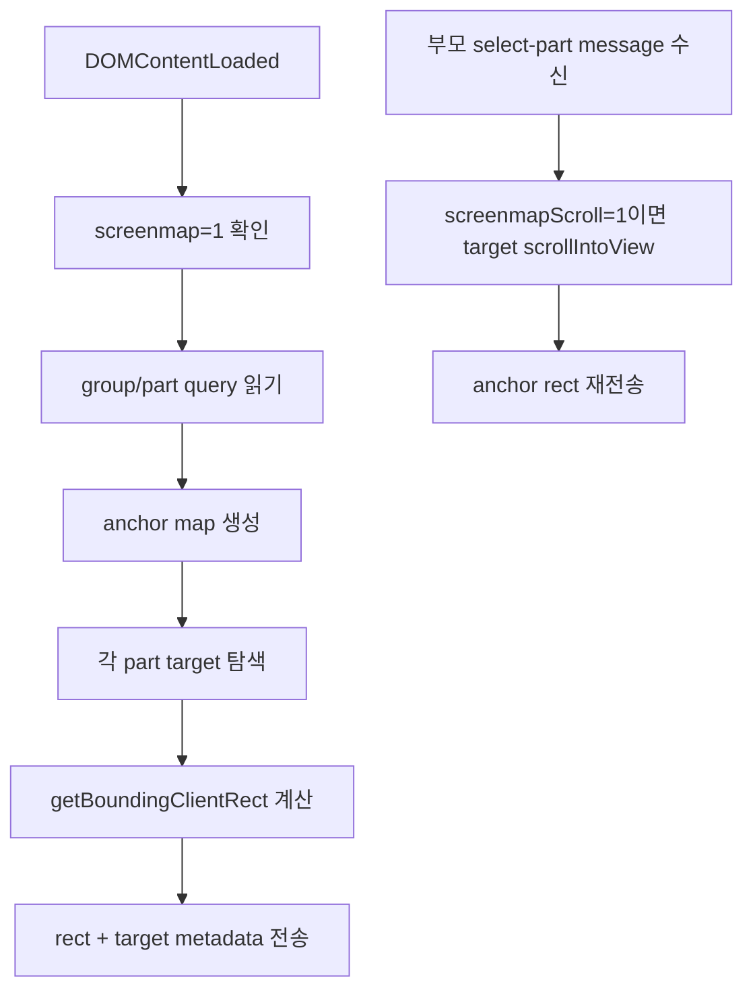

# Master Screenmap Bridge Script 상세 설계

## 목적

이 문서는 `master.html?screenmap=1`에서 실행할 최소 bridge script를 설계합니다.

`file://`에서는 부모 `screenmap/index.html`이 iframe 내부 DOM을 직접 읽을 수 없습니다. 따라서 `master.html` 내부에서 자기 DOM의 anchor 위치를 계산하고, `parent.postMessage(...)`로 부모 screenmap에 전달해야 합니다.

## 설계 결론

1차 bridge는 아래만 수행합니다.

| 책임 | 포함 여부 | 설명 |
| --- | --- | --- |
| `screenmap=1` 감지 | 포함 | query parameter가 있을 때만 bridge 실행 |
| anchor 위치 계산 | 포함 | `data-screenmap-anchor`, class, text fallback 순서로 탐색 |
| 부모로 rect 전달 | 포함 | `screenmap.anchor-rects` message로 rect와 target metadata 전송 |
| 선택 part 수신 | 포함 | `screenmap.select-part` message 수신 |
| 선택 part scroll | 조건부 포함 | 기본 core view에서는 금지, `screenmapScroll=1`일 때만 `scrollIntoView` |
| master UI view filter | 포함 | 기본 `core` view에서 하단 보조 섹션 숨김 |
| marker 직접 렌더링 | 제외 | marker는 부모 screenmap이 iframe 위에 렌더링 |

## 실행 위치

bridge script는 `master.html` 끝부분의 기존 script 이후에 붙이는 것을 기본값으로 합니다.

```html
<script id="screenmap-bridge-script">
  /* bridge code */
</script>
```

원칙:

| 원칙 | 설명 |
| --- | --- |
| normal mode 무영향 | `screenmap=1`이 없으면 즉시 return |
| 전역 오염 최소화 | 필요한 경우 `window.__screenmapBridge` 하나만 노출 |
| 실패 허용 | anchor를 못 찾아도 오류를 던지지 않고 `found: false`로 보고 |
| 구현 메모 UI 금지 | master 화면 안에 debug 문구를 표시하지 않음 |

수정 지점 조사 결과는 `05-master-html-edit-point-inspection.md`에 정리했습니다. 1차 구현은 outer wrapper가 아니라 `__bundler/template` 내부 `</body>` 직전의 `SCREENMAP_BRIDGE_LAYER` 삽입 방식을 권장합니다.

구현 결과:

| 항목 | 상태 | 메모 |
| --- | --- | --- |
| bridge layer 삽입 | 완료 | `tools/inject-screenmap-bridge.mjs`로 `SCREENMAP_BRIDGE_LAYER` 삽입 |
| `screenmap=1` gate | 완료 | query가 없으면 bridge 전역 객체와 message 없음 |
| anchor rect 송신 | 완료 | `screenmap.anchor-rects` message 확인 |
| target metadata 송신 | 완료 | `tagName`, `role`, `className`, `text`, `isButton` 전송 |
| `select-part` 수신 | 완료 | `screenmap.select-part` 수신 후 선택 part 갱신 확인 |
| 부모 marker sync | 1차 완료 | `screenmap/app.js`가 그룹 1 marker를 live 좌표로 갱신 |
| screenmap view filter | 완료 | 기본 `core` view에서 하단 `.list-ph`, `.ds-section.showcase` 숨김 |
| document 좌표 sync | 완료 | iframe 내부 scroll 없이 문서 전체 높이와 `documentPercentX/Y` 사용 |
| button callout | 완료 | 버튼형 target은 marker가 실제 버튼을 덮지 않도록 가장자리 바깥에 표시 |
| 그룹 3 상세 part | 완료 | 3-2~3-5 주소 lookup, 운송+품목 field, 금액 field selector와 `select-part-stable` 재보고 추가 |
| 그룹 3 part 선택 안정화 | 완료 | 같은 wizard step 안에서는 iframe 재생성 없이 기존 dialog를 유지하고 marker/detail만 갱신 |
| 그룹 3 초기 step 직접 오픈 | 완료 | 3-2~3-5 node 진입 시 앞 단계 적용 replay 없이 목표 wizard step dialog를 part 1 상태로 표시 |
| 그룹 4 분기 panel | 완료 | `new-required-complete` panel, API boundary box, `차주 정보로 이동`, `화물 등록 완료` anchor와 상태 준비 로직 추가 |

## Screenmap View Filter

`screenmap=1`은 기본적으로 marker handoff에 필요한 core 화면만 보여줍니다.

| view | parameter | 동작 |
| --- | --- | --- |
| `core` | `screenmap=1` | 하단 오더 목록 placeholder와 상태 예시 모음을 숨김 |
| `full` | `screenmap=1&screenmapView=full` | master HTML 전체를 그대로 표시 |

현재 숨김 대상:

| selector | 이유 |
| --- | --- |
| `.list-ph` | 하단 오더 목록 placeholder가 core marker 확인을 아래로 밀어냄 |
| `.ds-section.showcase` | 상태 예시 모음은 handoff 참고용이며 live marker 대상이 아님 |

core view의 좌표 원칙:

| 항목 | 정책 |
| --- | --- |
| iframe 내부 scroll | 기본 금지 |
| frame 높이 | bridge가 보낸 `documentHeight`를 기준으로 부모 frame이 조정 |
| marker 좌표 | `documentPercentX/Y` 우선 사용 |
| focus 범위 | active part의 live rect를 문서 전체 비율로 변환 |
| 버튼형 marker | target metadata의 `isButton` 또는 `role="button"` 기준으로 callout 배치 |
| 예외 | `screenmapScroll=1`일 때만 iframe 내부 `scrollIntoView` 허용 |

## Query Parameter

iframe URL 예시:

```text
cargo-order-admin-hifi-master.html?screenmap=1&group=new-order.group-init&part=group-init.click-new
```

| parameter | 필수 | 역할 |
| --- | --- | --- |
| `screenmap=1` | 예 | bridge 실행 조건 |
| `group` | 아니오 | 현재 screenmap group |
| `part` | 아니오 | 현재 선택 part |

## Anchor Map

1차 대상은 그룹 1입니다.

| Part ID | 권장 anchor key | 1순위 | 2순위 | 3순위 |
| --- | --- | --- | --- | --- |
| `group-init.click-new` | `new-order.click-new` | `[data-screenmap-anchor="new-order.click-new"]` | button text `신규 접수 F3` | fallback marker |
| `group-init.reset-fields` | `new-order.reset-fields` | `[data-screenmap-anchor="new-order.reset-fields"]` | first main form section wrapper | fallback marker |
| `group-init.state-new-reset` | `new-order.state-new-reset` | `[data-screenmap-anchor="new-order.state-new-reset"]` | header badge text `신규` | fallback marker |
| `group-init.section-headers` | `new-order.section-headers` | `[data-screenmap-anchor="new-order.section-headers"]` | left section label column | fallback marker |
| `group-init.shipper-focus` | `new-order.shipper-focus` | `[data-screenmap-anchor="new-order.shipper-focus"]` | `.new-order-required-action` with text `화주 정보 입력` | fallback marker |

현재 `master.html`에서 바로 활용 가능한 후보:

| 후보 | 용도 |
| --- | --- |
| `.new-order-required-action` | 화주/상차/하차/운송+품목/금액 입력 버튼 |
| `.new-order-main-submit` | 최종 화물 등록 버튼 |
| button text `신규 접수 F3` | 기본 action bar의 신규 접수 버튼 |

## Message Contract

### 부모 -> iframe

선택 part가 바뀔 때 부모 screenmap이 iframe으로 보냅니다.

```js
{
  type: "screenmap.select-part",
  groupId: "new-order.group-init",
  partId: "group-init.shipper-focus"
}
```

### iframe -> 부모

iframe은 anchor 위치를 부모에게 보냅니다.

```js
{
  type: "screenmap.anchor-rects",
  version: 1,
  groupId: "new-order.group-init",
  partId: "group-init.shipper-focus",
  viewport: {
    width: 1440,
    height: 900,
    scrollX: 0,
    scrollY: 0
  },
  anchors: {
    "group-init.shipper-focus": {
      found: true,
      key: "new-order.shipper-focus",
      strategy: "text-selector",
      target: {
        tagName: "button",
        role: "",
        className: "new-order-required-action",
        text: "화주 정보 입력",
        isButton: true
      },
      rect: {
        x: 1292,
        y: 80,
        width: 86,
        height: 30,
        pageX: 1335,
        pageY: 95,
        documentPercentX: 92.7,
        documentPercentY: 10.4,
        documentWidth: 1440,
        documentHeight: 910
      }
    }
  }
}
```

anchor 실패 예시:

```js
{
  type: "screenmap.anchor-rects",
  version: 1,
  groupId: "new-order.group-init",
  anchors: {
    "group-init.shipper-focus": {
      found: false,
      key: "new-order.shipper-focus",
      fallbackReason: "anchor-not-found"
    }
  }
}
```

## Bridge 처리 흐름



## 최소 Pseudocode

```js
(function () {
  var params = new URLSearchParams(window.location.search);
  if (params.get("screenmap") !== "1") return;

  var state = {
    groupId: params.get("group") || "",
    partId: params.get("part") || ""
  };

  var anchors = {
    "group-init.click-new": {
      key: "new-order.click-new",
      textButton: "신규 접수 F3"
    },
    "group-init.shipper-focus": {
      key: "new-order.shipper-focus",
      selector: ".new-order-required-action",
      textButton: "화주 정보 입력"
    }
  };

  function findByText(selector, text) {
    var nodes = Array.prototype.slice.call(document.querySelectorAll(selector));
    return nodes.find(function (node) {
      return normalize(node.textContent).indexOf(text) >= 0;
    }) || null;
  }

  function normalize(value) {
    return String(value || "").replace(/\s+/g, " ").trim();
  }

  function findTarget(partId) {
    var def = anchors[partId];
    if (!def) return null;

    return document.querySelector('[data-screenmap-anchor="' + def.key + '"]')
      || (def.selector ? document.querySelector(def.selector) : null)
      || (def.textButton ? findByText("button", def.textButton) : null);
  }

  function rectFor(target) {
    var rect = target.getBoundingClientRect();
    return {
      left: Math.round(rect.left),
      top: Math.round(rect.top),
      width: Math.round(rect.width),
      height: Math.round(rect.height)
    };
  }

  function collect() {
    var result = {};
    Object.keys(anchors).forEach(function (partId) {
      var target = findTarget(partId);
      if (!target) {
        result[partId] = {
          found: false,
          key: anchors[partId].key,
          fallbackReason: "anchor-not-found"
        };
        return;
      }

      result[partId] = {
        found: true,
        key: anchors[partId].key,
        target: {
          tagName: target.tagName.toLowerCase(),
          role: target.getAttribute("role") || "",
          isButton: target.tagName.toLowerCase() === "button" || target.getAttribute("role") === "button"
        },
        rect: rectFor(target)
      };
    });
    return result;
  }

  function send() {
    window.parent.postMessage({
      type: "screenmap.anchor-rects",
      version: 1,
      groupId: state.groupId,
      partId: state.partId,
      viewport: {
        width: window.innerWidth,
        height: window.innerHeight,
        scrollX: window.scrollX,
        scrollY: window.scrollY
      },
      anchors: collect()
    }, "*");
  }

  window.addEventListener("message", function (event) {
    var data = event.data || {};
    if (data.type !== "screenmap.select-part") return;
    state.groupId = data.groupId || state.groupId;
    state.partId = data.partId || state.partId;

    var target = findTarget(state.partId);
    if (params.get("screenmapScroll") === "1" && target) {
      target.scrollIntoView({ block: "center", inline: "center" });
    }
    window.setTimeout(send, 80);
  });

  window.addEventListener("scroll", throttle(send, 120), true);
  window.addEventListener("resize", throttle(send, 120));

  if (document.readyState === "loading") {
    document.addEventListener("DOMContentLoaded", send);
  } else {
    send();
  }
})();
```

위 코드는 설계용 pseudocode입니다. 실제 구현 시에는 `throttle` helper, anchor map 전체, document 좌표, target metadata, event origin 정책을 함께 넣어야 합니다.

## 부모 Screenmap 처리 설계

부모 `screenmap/app.js`는 다음 상태를 가집니다.

```js
const liveMasterAnchorsByNode = {};
```

message 수신:

```js
window.addEventListener("message", (event) => {
  const data = event.data || {};
  if (data.type !== "screenmap.anchor-rects") return;
  liveMasterAnchorsByNode[data.groupId] = data.anchors;
  renderActiveNode();
});
```

marker 좌표와 placement 선택 우선순위:

| 우선순위 | 조건 | 사용 방식 |
| ---: | --- | --- |
| 1 | bridge anchor found + `liveMarkerPlacement` 있음 | 명시 placement로 iframe rect edge 기준 배치 |
| 2 | bridge anchor found + target이 button | 자동 callout placement로 버튼 바깥 배치 |
| 3 | bridge anchor found | iframe rect center 기준 자동 좌표 |
| 4 | bridge anchor not found | `fallbackMarker` |
| 5 | iframe failed | screenshot fallback |

## 보안 및 안정성 원칙

| 항목 | 기준 |
| --- | --- |
| origin | `file://`에서는 `event.origin`이 `null`일 수 있으므로 `type`과 payload shape로 필터링 |
| 외부 message 무시 | `screenmap.*` type이 아니면 무시 |
| DOM 없음 | target이 없어도 throw하지 않음 |
| rect 값 | 숫자가 아니거나 0 이하이면 `found: false` 처리 |
| 반복 message | scroll/resize는 throttle 적용 |
| UI 영향 | bridge는 marker를 직접 만들지 않음 |

## 1차 구현 Acceptance Criteria

| 항목 | 기준 |
| --- | --- |
| normal mode | `screenmap=1` 없을 때 bridge가 실행되지 않음 |
| message 수신 | 부모가 `screenmap.anchor-rects`를 수신 |
| anchor 탐색 | `group-init.click-new`, `group-init.shipper-focus` 최소 2개 found |
| target metadata | found anchor가 `tagName`, `role`, `className`, `text`, `isButton`을 함께 보냄 |
| 선택 동기화 | 부모가 `screenmap.select-part` 전송 시 iframe이 선택 part 상태와 rect를 갱신 |
| no-scroll | 기본 `screenmap=1`에서는 iframe 내부 scroll이 발생하지 않음 |
| button callout | 버튼형 target marker가 실제 버튼 위를 덮지 않음 |
| fallback | 찾지 못한 part는 `fallbackReason`을 보냄 |
| 오류 안정성 | bridge 오류로 master 화면이 깨지지 않음 |

## 구현 순서

1. `master.html?screenmap=1`에서만 실행되는 bridge script를 추가합니다.
2. 그룹 1의 5개 part anchor map을 bridge에 정의합니다.
3. 부모 `screenmap/app.js`에 `message` listener를 추가합니다. 완료.
4. bridge 좌표가 있으면 marker 위치를 자동 좌표로 대체합니다. 완료.
5. bridge 실패 시 기존 fallback marker를 유지합니다. 완료.
6. 버튼형 target metadata를 보내고 부모 marker를 callout 배치합니다. 완료.
7. Playwright로 `file://` iframe message, marker 위치, click sync, button overlap을 검증합니다. 완료.

## 다음 설계 과제

| 과제 | 설명 |
| --- | --- |
| 그룹 4~7 anchor map | 그룹 3 템플릿을 기준으로 wizard/dialog처럼 동적 상태가 필요한 후속 그룹의 anchor 노출 방식 정의 |
| 생성물 관리 | `master.html`이 생성 산출물이라면 원본 source 수정 위치를 찾아야 함 |
| view 확장 | 필요 시 `core`, `full`, `list`, `showcase` 같은 view 분리 추가 |
