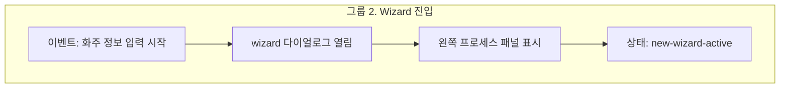

# 그룹 2 Wizard 진입 Live Anchor 설계

## 목적

이 문서는 `new-order.group-wizard-entry`를 `live-master-hotspot`으로 확장하기 위한 anchor map과 screenmap 준비 상태를 정의합니다.

그룹 2는 단순 위치 표시가 아니라 `new-reset`에서 `new-wizard-active`로 전환된 뒤 wizard dialog가 열려야 확인할 수 있습니다. 따라서 marker 좌표보다 먼저 "어떤 상태를 만들어 놓고 anchor를 수집할지"를 정해야 합니다.

## 범위

| 구분 | 포함 |
| --- | --- |
| 대상 node | `new-order.group-wizard-entry` |
| 이벤트 범위 | 화주 정보 입력 시작, wizard 열림, 왼쪽 프로세스 패널 표시, `new-wizard-active` 상태 확인 |
| 기준 master | `../wireframes/final-handoff/baseline/html/cargo-order-admin-hifi-master.html` |
| 구현 방식 | `master.html?screenmap=1` bridge가 상태를 준비하고 anchor rect를 부모 screenmap에 전송 |

이번 문서는 설계 확정용입니다. `app.js`와 bridge 구현 확장은 다음 단계에서 진행합니다.

## 기준 이벤트



## 실제 DOM 확인 결과

검증일: `2026-06-18`

검증 방식:

1. `master.html?screenmap=1&screenmapView=core`를 `file://`로 로드합니다.
2. `window.__newOrderRegistrationFlow.start()`를 호출해 `new-reset`을 만듭니다.
3. `.new-order-required-action`을 클릭해 화주 정보 wizard를 엽니다.
4. wizard 관련 selector와 상태를 확인합니다.

| 항목 | 확인 결과 |
| --- | --- |
| body 상태 | `document.body.dataset.newOrderPhase === "new-wizard-active"` |
| runtime 상태 | `window.__newOrderRegistrationFlow.state.phase === "new-wizard-active"` |
| 현재 step | `window.__newOrderRegistrationFlow.state.step === "shipper"` |
| wizard dialog | `.dialog.dialog--new-order-wizard[data-new-order-step="shipper"]` 존재 |
| process panel | `.dialog.dialog--new-order-wizard .new-order-process-panel` 존재 |
| 현재 step item | `.new-order-step-item[data-step="shipper"][data-state="current"]` 존재 |
| footer CTA | `.dialog.dialog--new-order-wizard .dialog__foot .btn--primary` 존재, text `화주 정보에 적용` |

## Screenmap 준비 상태

그룹 2는 part별로 준비 상태가 다릅니다.

| 준비 상태 | 만드는 방법 | 필요한 part |
| --- | --- | --- |
| `new-reset-ready` | `window.__newOrderRegistrationFlow.start()` 호출 후 `.new-order-required-action` 대기 | `shipper-cta` |
| `wizard-shipper-open` | `new-reset-ready` 이후 `.new-order-required-action` 클릭 또는 동등한 helper 호출 | `dialog-open`, `process-panel`, `state-active` |
| `new-wizard-active-confirmed` | wizard open 후 body/runtime phase와 step 검증 | `state-active` |

원칙:

| 원칙 | 설명 |
| --- | --- |
| no-scroll 유지 | 기본 `screenmap=1`에서는 iframe 내부 `scrollIntoView`를 사용하지 않습니다. |
| 상태 준비 우선 | anchor 수집 전에 runtime 상태를 먼저 만듭니다. |
| 사용자가 보는 흐름 보존 | 가능하면 실제 CTA 클릭 경로를 사용합니다. |
| fallback 허용 | runtime 준비 실패 시 해당 part만 fallback marker를 사용합니다. |

## Anchor Map 초안

| 번호 | Part ID | Label | 준비 상태 | Anchor key | Selector 우선순위 | Placement |
| ---: | --- | --- | --- | --- | --- | --- |
| 1 | `group-wizard-entry.shipper-cta` | 화주 정보 입력 시작 | `new-reset-ready` | `new-order.wizard-entry.shipper-cta` | `[data-screenmap-anchor="new-order.wizard-entry.shipper-cta"]`, `.new-order-required-action`, button text `화주 정보 입력` | `left` |
| 2 | `group-wizard-entry.dialog-open` | wizard 다이얼로그 열림 | `wizard-shipper-open` | `new-order.wizard-entry.dialog` | `[data-screenmap-anchor="new-order.wizard-entry.dialog"]`, `.dialog.dialog--new-order-wizard[data-new-order-step="shipper"]` | `center` |
| 3 | `group-wizard-entry.process-panel` | 왼쪽 프로세스 패널 표시 | `wizard-shipper-open` | `new-order.wizard-entry.process-panel` | `[data-screenmap-anchor="new-order.wizard-entry.process-panel"]`, `.dialog.dialog--new-order-wizard .new-order-process-panel` | `right` |
| 4 | `group-wizard-entry.state-active` | 상태: `new-wizard-active` | `new-wizard-active-confirmed` | `new-order.wizard-entry.state-active` | `[data-screenmap-anchor="new-order.wizard-entry.state-active"]`, `.new-order-step-item[data-step="shipper"][data-state="current"]`, `.dialog.dialog--new-order-wizard[data-new-order-step="shipper"]` | `right` |

Part 1은 버튼형 target이므로 marker가 버튼을 덮지 않도록 `left`를 명시합니다. Part 3, 4는 왼쪽 process panel 내부 또는 인접 영역을 기준으로 하므로 marker는 오른쪽으로 빼서 panel label을 가리지 않게 합니다.

## Bridge 준비 로직 제안

현재 bridge의 `prepareScreenmapState()`는 그룹 1 기준으로 `new-order.group-init`만 다룹니다. 그룹 2 확장 시에는 group별 prepare 함수를 분리하는 것이 좋습니다.

```js
function prepareGroupWizardEntry(partId, callback) {
  waitForRuntime(function (runtime) {
    runtime.start();

    waitForElement(".new-order-required-action", function (button) {
      if (partId === "group-wizard-entry.shipper-cta") {
        callback();
        return;
      }

      button.click();
      waitForElement(
        '.dialog.dialog--new-order-wizard[data-new-order-step="shipper"]',
        callback
      );
    });
  });
}
```

추천 분기:

| groupId | prepare 함수 |
| --- | --- |
| `new-order.group-init` | 기존 그룹 1 준비 로직 유지 |
| `new-order.group-wizard-entry` | `prepareGroupWizardEntry(partId, callback)` |
| 기타 그룹 | 이후 그룹별 준비 로직 추가 |

## 부모 Screenmap Data 계약

그룹 2도 그룹 1과 같은 `live-master-hotspot` 구조를 사용합니다.

```js
{
  groupId: "new-order.group-wizard-entry",
  centerMode: "live-master-hotspot",
  master: {
    src: "../wireframes/final-handoff/baseline/html/cargo-order-admin-hifi-master.html?screenmap=1&group=new-order.group-wizard-entry",
    fallbackImage: "./assets/master-new-order-base.png"
  },
  parts: [
    {
      id: "group-wizard-entry.shipper-cta",
      number: 1,
      liveMarkerPlacement: "left",
      targetZone: "shipper-section"
    },
    {
      id: "group-wizard-entry.dialog-open",
      number: 2,
      targetZone: "wizard-dialog"
    },
    {
      id: "group-wizard-entry.process-panel",
      number: 3,
      liveMarkerPlacement: "right",
      targetZone: "wizard-process-panel"
    },
    {
      id: "group-wizard-entry.state-active",
      number: 4,
      liveMarkerPlacement: "right",
      targetZone: "wizard-state"
    }
  ]
}
```

## Acceptance Criteria

| 항목 | 기준 |
| --- | --- |
| 상태 준비 | 그룹 2 선택 시 `new-reset-ready` 또는 `wizard-shipper-open` 상태를 만들 수 있음 |
| anchor 수집 | 4개 part 중 `shipper-cta`, `dialog-open`, `process-panel`, `state-active`는 live anchor로 잡힘 |
| 상태 확인 | `state-active` part는 `new-wizard-active`와 `shipper` step을 확인한 뒤 표시 |
| marker 배치 | 버튼과 process panel label을 marker가 덮지 않음 |
| no-scroll | 기본 `screenmap=1`에서 iframe 내부 scroll이 발생하지 않음 |
| 오른쪽 연동 | 가운데 part 클릭 시 오른쪽 detail이 해당 part 기준으로 갱신 |
| fallback | runtime 또는 selector 실패 시 해당 part만 fallback 좌표를 사용 |

## 구현 순서 제안

1. `screenmap/app.js`에 `new-order.group-wizard-entry`용 `centerPreviewMaps`를 추가합니다.
2. `tools/inject-screenmap-bridge.mjs`의 anchor map에 그룹 2 part를 추가합니다.
3. bridge 준비 로직을 `groupId`별 함수로 분리합니다.
4. 그룹 2에서 `shipper-cta`는 `new-reset-ready`, 나머지 part는 `wizard-shipper-open`을 만들게 합니다.
5. `node tools/inject-screenmap-bridge.mjs`로 master bridge를 갱신합니다.
6. Playwright로 desktop/mobile에서 marker overlap, no-scroll, 오른쪽 detail sync를 검증합니다.

## 남은 결정

| 항목 | 판단 |
| --- | --- |
| 공개 helper 추가 여부 | 현재 runtime은 `start()`만 공개합니다. bridge가 button click을 사용할지, `openWizardStep("shipper")` 같은 helper를 master runtime에 공개할지 결정이 필요합니다. MVP는 button click 방식이 안전합니다. |
| fallback image | 그룹 2도 우선 `master-new-order-base.png`를 fallback으로 쓰고, wizard fallback 캡처는 후속 검토합니다. |
| group 3 재사용 | 그룹 3은 같은 wizard dialog 안에서 step만 바뀌므로, 그룹 2 준비 로직을 확장해 `openWizardStep(step)` 접근 방식을 다시 검토해야 합니다. |
