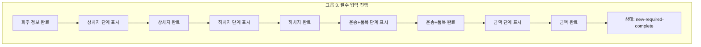

# 그룹 3 필수 입력 진행 Marker 설계

## 목적

이 문서는 `new-order.group-required-inputs`를 live master hotspot으로 확장하기 전에 part별 `markerKind`, `targetZone`, `focusRect` 기준을 확정하기 위한 설계 문서입니다.

그룹 3은 wizard 내부에서 `화주 -> 상차지 -> 하차지 -> 운송+품목 -> 금액 -> new-required-complete`로 이어지는 필수 입력 진행 흐름입니다. 여기서는 실제 API 저장은 다루지 않고, 화면 안에서 step이 어떻게 진행되고 어디를 marker로 설명할지만 정의합니다.

현재 screenmap 구현에서는 이 marker 설계를 그대로 사용하되, 왼쪽 user flow를 `그룹 3-1`부터 `그룹 3-5`까지 세분화해 중앙 preview marker 밀도를 조정합니다. 세분화 기준과 acceptance criteria는 `09-group-3-required-inputs-split-plan.md`를 기준으로 합니다. `그룹 3-1. 화주 정보`는 `10-group-3-1-shipper-contact-components-plan.md`, `그룹 3-2`부터 `그룹 3-5`는 `11-group-3-2-to-3-5-required-components-plan.md` 기준의 세부 컴포넌트 part를 사용합니다.

그룹 3에서 검증된 왼쪽 node, 가운데 live preview, bridge 상태 준비, 오른쪽 detail 기준은 `12-group-3-screenmap-pattern-template.md`를 기준 템플릿으로 확정했습니다.

## 기준 원칙

| 기준 | 적용 |
| --- | --- |
| placement 표준 | `07-marker-placement-standard.md`를 따른다 |
| 단계 표시 | 왼쪽 process panel의 current step row를 `step-item`으로 표시 |
| 완료 이벤트 | dialog footer의 primary CTA를 `action-button`으로 표시 |
| 최종 상태 | `new-required-complete` choice panel을 `dialog-surface`로 표시 |
| 내부 scroll | 기본 `screenmap=1`에서는 iframe 내부 `scrollIntoView`를 사용하지 않는다 |

## 기준 이벤트



## 실제 DOM 확인 결과

검증일: `2026-06-18`

검증 방식:

1. `master.html?screenmap=1&screenmapView=core`를 `file://`로 로드합니다.
2. `window.__newOrderRegistrationFlow.start()`를 호출합니다.
3. `화주 정보 입력` 버튼을 클릭해 wizard를 엽니다.
4. 각 step의 footer primary CTA를 눌러 다음 step으로 이동합니다.
5. current step, dialog body, footer primary CTA의 rect를 수집합니다.

확인된 step:

| Step | Runtime phase | Runtime step | Dialog step | Footer primary |
| --- | --- | --- | --- | --- |
| 화주 | `new-wizard-active` | `shipper` | `shipper` | `화주 정보에 적용` |
| 상차지 | `new-wizard-active` | `load` | `load` | `상차지 적용` |
| 하차지 | `new-wizard-active` | `unload` | `unload` | `하차지 적용` |
| 운송+품목 | `new-wizard-active` | `cargo` | `cargo` | `운송+품목 적용` |
| 금액 | `new-wizard-active` | `money` | `money` | `금액 조건 적용` |
| 필수 완료 | `new-required-complete` | `money` | `money` | `화물 등록 완료` |

## Part 설계

좌표는 `1408 x 920` 기준의 초안입니다. 실제 구현에서는 live anchor를 우선 사용합니다. 단, 그룹 3 wizard 내부 part는 다이얼로그가 닫혔거나 해당 step anchor가 없을 때 fallback marker를 표시하지 않고 `pending-live` 상태로 숨깁니다.

아래 표는 그룹 3의 최초 step/완료 skeleton입니다. 현재 왼쪽 user flow에 표시되는 세부 node는 이 skeleton에 주소 lookup, 운송+품목 field, 금액 field part를 추가해 사용합니다.

| 번호 | Part ID | Label | `markerKind` | `targetZone` | Placement | Marker | `focusRect` |
| ---: | --- | --- | --- | --- | --- | --- | --- |
| 1 | `group-required-inputs.shipper-search` | 화주/담당자 통합 조회 | `search-control` | `wizard-shipper-search` | `above` | `{ x: 85.1, y: 27.0 }` | `{ x: 31.3, y: 25.4, width: 55.5, height: 3.3 }` |
| 2 | `group-required-inputs.shipper-result-select` | 화주/담당자 결과 선택 | `result-row` | `wizard-shipper-result-row` | `left` | `{ x: 49.4, y: 35.4 }` | `{ x: 31.3, y: 30.0, width: 36.2, height: 16.6 }` |
| 3 | `group-required-inputs.shipper-selected-preview` | 선택 화주/담당자 정보 확인 | `detail-panel` | `wizard-shipper-selected-preview` | `right` | `{ x: 77.6, y: 41.1 }` | `{ x: 68.4, y: 30.0, width: 18.5, height: 22.2 }` |
| 4 | `group-required-inputs.shipper-contact-add` | 담당자 추가 등록 | `action-button` | `wizard-shipper-contact-add` | `above` | `{ x: 77.6, y: 74.6 }` | `{ x: 68.4, y: 52.9, width: 18.5, height: 24.5 }` |
| 5 | `group-required-inputs.shipper-complete` | 화주 정보 완료 | `action-button` | `wizard-shipper-apply` | `above` | `{ x: 81.8, y: 80.6 }` | `{ x: 77.8, y: 78.9, width: 7.9, height: 3.3 }` |
| 6 | `group-required-inputs.load-step` | 상차지 단계 표시 | `step-item` | `wizard-step-load` | `right` | `{ x: 21.1, y: 36.2 }` | `{ x: 14.3, y: 34.1, width: 13.6, height: 4.1 }` |
| 7 | `group-required-inputs.load-complete` | 상차지 완료 | `action-button` | `wizard-load-apply` | `above` | `{ x: 82.7, y: 78.0 }` | `{ x: 79.7, y: 76.3, width: 6.1, height: 3.3 }` |
| 8 | `group-required-inputs.unload-step` | 하차지 단계 표시 | `step-item` | `wizard-step-unload` | `right` | `{ x: 21.1, y: 41.2 }` | `{ x: 14.3, y: 39.1, width: 13.6, height: 4.1 }` |
| 9 | `group-required-inputs.unload-complete` | 하차지 완료 | `action-button` | `wizard-unload-apply` | `above` | `{ x: 82.7, y: 78.0 }` | `{ x: 79.7, y: 76.3, width: 6.1, height: 3.3 }` |
| 10 | `group-required-inputs.cargo-step` | 운송+품목 단계 표시 | `step-item` | `wizard-step-cargo` | `right` | `{ x: 21.1, y: 55.3 }` | `{ x: 14.3, y: 53.3, width: 13.6, height: 4.1 }` |
| 11 | `group-required-inputs.cargo-complete` | 운송+품목 완료 | `action-button` | `wizard-cargo-apply` | `above` | `{ x: 82.0, y: 68.9 }` | `{ x: 78.3, y: 67.2, width: 7.4, height: 3.3 }` |
| 12 | `group-required-inputs.money-step` | 금액 단계 표시 | `step-item` | `wizard-step-money` | `right` | `{ x: 21.1, y: 58.6 }` | `{ x: 14.3, y: 56.5, width: 13.6, height: 4.1 }` |
| 13 | `group-required-inputs.money-complete` | 금액 완료 | `action-button` | `wizard-money-apply` | `above` | `{ x: 82.2, y: 70.6 }` | `{ x: 78.6, y: 69.0, width: 7.1, height: 3.3 }` |
| 14 | `group-required-inputs.required-complete` | 상태: `new-required-complete` | `dialog-surface` | `required-complete-panel` | `center` | `{ x: 58.0, y: 49.8 }` | `{ x: 29.0, y: 35.1, width: 57.8, height: 29.4 }` |

## 세부 컴포넌트 확장 Part

| 그룹 | Part ID | Label | `markerKind` | Placement |
| --- | --- | --- | --- | --- |
| 3-2 | `group-required-inputs.load-address-search` | 상차지 조회 출처/검색 | `search-control` | `above` |
| 3-2 | `group-required-inputs.load-result-select` | 상차지 결과 선택 | `result-row` | `left` |
| 3-2 | `group-required-inputs.load-selected-preview` | 선택 상차지 정보 확인 | `detail-panel` | `right` |
| 3-2 | `group-required-inputs.load-condition` | 상차 일시/방법 조건 | `condition-panel` | `right` |
| 3-3 | `group-required-inputs.unload-address-search` | 하차지 조회 출처/검색 | `search-control` | `above` |
| 3-3 | `group-required-inputs.unload-result-select` | 하차지 결과 선택 | `result-row` | `left` |
| 3-3 | `group-required-inputs.unload-selected-preview` | 선택 하차지 정보 확인 | `detail-panel` | `right` |
| 3-3 | `group-required-inputs.unload-condition` | 하차 일시/방법 조건 | `condition-panel` | `right` |
| 3-4 | `group-required-inputs.cargo-vehicle-requirement` | 차량 조건 입력 | `input-group` | `above` |
| 3-4 | `group-required-inputs.cargo-quantity-weight` | 대수/실중량 입력 | `input-group` | `right` |
| 3-4 | `group-required-inputs.cargo-item-input` | 품목 입력 | `input-field` | `above` |
| 3-4 | `group-required-inputs.cargo-recent-combo` | 최근 조합 선택 | `result-row` | `right` |
| 3-5 | `group-required-inputs.money-payment-method` | 결제방법 선택 | `input-field` | `above` |
| 3-5 | `group-required-inputs.money-charge-haul` | 청구/운송 비용 입력 | `money-group` | `right` |
| 3-5 | `group-required-inputs.money-fee-adjustment` | 수수료/조정 금액 입력 | `money-group` | `left` |

상세 fallback 좌표와 component별 설명은 `11-group-3-2-to-3-5-required-components-plan.md`와 `app.js`의 `centerPreviewMaps["new-order.group-required-inputs"].parts`를 기준으로 합니다. 이 좌표는 설계 기준값이며, 실제 화면에서는 live anchor가 없으면 닫힌 다이얼로그 위에 marker를 남기지 않습니다.

## Selector 초안

| Part ID | Selector 우선순위 |
| --- | --- |
| `group-required-inputs.shipper-complete` | `.dialog.dialog--new-order-wizard[data-new-order-step="shipper"] .dialog__foot .btn--primary` |
| `group-required-inputs.shipper-search` | `.dialog.dialog--new-order-wizard .lookup-search` |
| `group-required-inputs.shipper-result-select` | `.dialog.dialog--new-order-wizard .rrow.is-selected`, `.dialog.dialog--new-order-wizard .rrow` |
| `group-required-inputs.shipper-selected-preview` | `.dialog.dialog--new-order-wizard .preview-aside .pcard:first-child` |
| `group-required-inputs.shipper-contact-add` | `.dialog.dialog--new-order-wizard .preview-aside .pcard:nth-of-type(2)` |
| `group-required-inputs.load-step` | `.new-order-step-item[data-step="load"][data-state="current"]` |
| `group-required-inputs.load-complete` | `.dialog.dialog--new-order-wizard[data-new-order-step="load"] .dialog__foot .btn--primary` |
| `group-required-inputs.unload-step` | `.new-order-step-item[data-step="unload"][data-state="current"]` |
| `group-required-inputs.unload-complete` | `.dialog.dialog--new-order-wizard[data-new-order-step="unload"] .dialog__foot .btn--primary` |
| `group-required-inputs.cargo-step` | `.new-order-step-item[data-step="cargo"][data-state="current"]` |
| `group-required-inputs.cargo-complete` | `.dialog.dialog--new-order-wizard[data-new-order-step="cargo"] .dialog__foot .btn--primary` |
| `group-required-inputs.money-step` | `.new-order-step-item[data-step="money"][data-state="current"]` |
| `group-required-inputs.money-complete` | `.dialog.dialog--new-order-wizard[data-new-order-step="money"] .dialog__foot .btn--primary` |
| `group-required-inputs.required-complete` | `.dialog.dialog--new-order-wizard .new-order-apply-panel`, `body[data-new-order-phase="new-required-complete"] .dialog.dialog--new-order-wizard` |

## 준비 상태 설계

그룹 3은 part마다 wizard를 특정 step까지 진행시켜야 anchor가 생깁니다.

| 준비 상태 | 현재 만드는 방법 | 필요한 part |
| --- | --- | --- |
| `wizard-shipper-open` | 그룹 2와 동일하게 `start()` 후 `화주 정보 입력` dialog open | `shipper-*` |
| `wizard-load-open` | `load` wizard step을 직접 open | `load-*`, `unload-step` |
| `wizard-unload-open` | `unload` wizard step을 직접 open | `unload-*`, `cargo-step` |
| `wizard-cargo-open` | `cargo` wizard step을 직접 open | `cargo-*`, `money-step` |
| `wizard-money-open` | `money` wizard step을 직접 open | `money-*` |
| `required-complete-open` | `money` step open 후 금액 적용 이벤트로 완료 panel 표시 | `required-complete` |

초기 구현은 앞 단계 CTA를 순차 실행하는 방식이었지만, `3-2`부터 `3-5`의 초기 화면에서 dialog가 닫히는 문제가 확인되어 현재는 목표 wizard step을 직접 여는 방식으로 확정했습니다. 같은 node 안의 part 이동은 iframe을 재생성하지 않고 `screenmap.select-part` message로 marker/detail만 갱신합니다.

## Part별 설명 초안

| Part ID | 설명 |
| --- | --- |
| `group-required-inputs.shipper-complete` | 선택된 화주 정보를 wizard draft에 반영하고 상차지 step으로 넘어가는 완료 이벤트입니다. |
| `group-required-inputs.load-step` | process panel에서 상차지 step이 current로 바뀌었음을 표시합니다. |
| `group-required-inputs.load-complete` | 선택된 상차지 주소, 상세주소, 담당자, 연락처, 일시/방법 조건을 draft에 반영합니다. |
| `group-required-inputs.unload-step` | process panel에서 하차지 step이 current로 바뀌었음을 표시합니다. |
| `group-required-inputs.unload-complete` | 선택된 하차지 주소와 조건을 draft에 반영하고 운송+품목 step으로 넘어갑니다. |
| `group-required-inputs.cargo-step` | 운송+품목 입력 폼이 열리고 current step이 화물 정보로 이동합니다. |
| `group-required-inputs.cargo-complete` | 톤수, 차종, 대수, 실중량, 품목을 draft에 반영합니다. |
| `group-required-inputs.money-step` | 정산 정보 입력 폼이 열리고 current step이 금액으로 이동합니다. |
| `group-required-inputs.money-complete` | 결제방법, 청구/운송 비용, 수수료, 조정 금액을 draft에 반영합니다. |
| `group-required-inputs.required-complete` | 필수 입력이 끝나 `new-required-complete` 상태가 되고, 다음 행동 분기 panel이 표시됩니다. |

## Data Contract 연결

| Step | Data contract | Validation |
| --- | --- | --- |
| 화주 | `Requester` | 화주 선택 또는 필수 담당자 정보 |
| 상차지 | `Location(load)` | 장소, 주소, 담당자, 연락처, 일시/방법 |
| 하차지 | `Location(unload)` | 장소, 주소, 담당자, 연락처, 일시/방법 |
| 운송+품목 | `VehicleRequirement`, `CargoDetail` | 톤수, 차종, 대수, 실중량, 품목 |
| 금액 | `Pricing`, `PricingAdjustment` | 결제방법, 청구/운송 비용, 수수료, 조정 금액 |
| 필수 완료 | wizard draft | 필수 step 완료 여부 |

## Bridge 구현 메모

현재 bridge는 그룹 3 준비 로직까지 반영되어 있습니다. 세분화 node의 group id도 모두 같은 `prepareGroupRequiredInputs(partId, callback)` 경로로 처리합니다. `그룹 3-2`부터 `그룹 3-5`의 초기 진입은 앞 단계 적용 이벤트를 replay하지 않고 목표 wizard step을 직접 엽니다.

```js
function prepareGroupRequiredInputs(partId, callback) {
  openRequiredInputStepForPart(partId, function () {
    waitForPartTarget(partId, callback);
  });
}
```

추천 mapping:

| Part ID prefix | 준비 step |
| --- | --- |
| `shipper-*` | `wizard-shipper-open` |
| `load-*` | `wizard-load-open` |
| `unload-*` | `wizard-unload-open` |
| `cargo-*` | `wizard-cargo-open` |
| `money-*` | `wizard-money-open` |
| `required-complete` | `required-complete-open` |

## Acceptance Criteria

| 항목 | 기준 |
| --- | --- |
| part 분류 | 현재 구현 기준 29개 base part가 모두 `markerKind`를 가진다 |
| placement | `action-button`은 `above`, `step-item`은 `right`, 완료 panel은 `center`를 기본으로 한다 |
| 상태 준비 | 각 node의 part 1에 맞는 wizard step dialog가 초기 진입 시 바로 열린다 |
| anchor 수집 | current step row와 footer primary CTA를 각각 live anchor로 잡을 수 있다 |
| part 선택 안정화 | 같은 wizard step 안의 part 선택은 iframe과 dialog를 재생성하지 않고 active marker/detail만 갱신한다 |
| no-scroll | 기본 `screenmap=1`에서는 iframe 내부 scroll이 발생하지 않는다 |
| fallback | live anchor 실패 시 표의 fallback `marker`와 `focusRect`로 의미가 유지된다 |
| 기준 템플릿 | 그룹 3 확장 기준은 `12-group-3-screenmap-pattern-template.md`에 정리된 패턴을 따른다 |

## 다음 점검

1. `그룹 3-1`부터 `그룹 3-5`까지 왼쪽 user flow node가 순서대로 표시되는지 확인합니다.
2. 각 세부 node의 중앙 preview marker가 5~6개 안에서 겹치지 않는지 확인합니다.
3. 새 group id에서도 live anchor가 수집되고 fallback marker로 떨어지지 않는지 확인합니다.
4. 그룹 4~7 확장 시 marker가 4개 이상이면 같은 세분화 기준을 적용할지 검토합니다.
