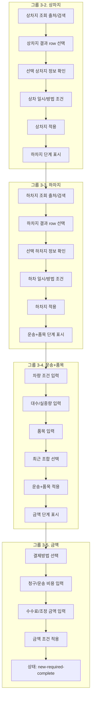

# 그룹 3-2~3-5 필수 입력 컴포넌트 세분화 계획

## 목적

이 문서는 `그룹 3-2. 상차지`부터 `그룹 3-5. 금액`까지를 왼쪽 user flow와 가운데 live master marker에 어떻게 나눠 표현할지 정의합니다.

실제 저장 API, endpoint, payload 확정은 다루지 않습니다. 여기서는 화면에서 어떤 컴포넌트를 보고, 어떤 선택이 wizard draft로 넘어가는지에 집중합니다.

## 세분화 원칙

| 원칙 | 적용 |
| --- | --- |
| 큰 단계보다 컴포넌트 우선 | `상차지 완료` 하나로 묶지 않고 조회, 선택, preview, 조건, 적용을 나눈다 |
| marker 수 제한 | 한 node에서 5~6개 marker 안에 유지한다 |
| 적용 책임 분리 | row 선택은 preview 갱신, footer 적용 버튼은 draft 확정으로 구분한다 |
| 같은 UI의 다른 의미 설명 | 상차지와 하차지는 같은 주소 lookup UI를 쓰지만 출발 조건과 도착 조건으로 따로 설명한다 |
| API 제외 | 실제 API 항목은 backlog/보류로만 표시하고 화면 설명에서 제외한다 |

세분화, dialog 직접 open, 같은 node 내 part 이동 안정화 기준은 `12-group-3-screenmap-pattern-template.md`를 따른다.

## 그룹화 다이어그램

## Component Map

| 그룹 | Part ID | Label | 설명 |
| --- | --- | --- | --- |
| 3-2 | `group-required-inputs.load-address-search` | 상차지 조회 출처/검색 | 최근 사용, 화주 주소록, Kakao 포함 조회 출처와 검색 입력을 설명한다 |
| 3-2 | `group-required-inputs.load-result-select` | 상차지 결과 선택 | row 선택은 적용이 아니라 우측 preview 갱신임을 설명한다 |
| 3-2 | `group-required-inputs.load-selected-preview` | 선택 상차지 정보 확인 | 주소, 상세주소, 담당자, 연락처, 주소록 저장 여부를 확인한다 |
| 3-2 | `group-required-inputs.load-condition` | 상차 일시/방법 조건 | 일시, 작업 방법, 상세 편집 책임을 `HandlingCondition`으로 분리한다 |
| 3-2 | `group-required-inputs.load-complete` | 상차지 완료 | 상차지 값을 wizard draft에 반영한다 |
| 3-2 | `group-required-inputs.unload-step` | 하차지 단계 표시 | 다음 current step 전환을 확인한다 |
| 3-3 | `group-required-inputs.unload-address-search` | 하차지 조회 출처/검색 | 도착지 기준 주소 조회 출처와 검색 입력을 설명한다 |
| 3-3 | `group-required-inputs.unload-result-select` | 하차지 결과 선택 | 하차지 row 선택으로 우측 preview만 갱신한다 |
| 3-3 | `group-required-inputs.unload-selected-preview` | 선택 하차지 정보 확인 | 도착 주소, 담당자, 연락처를 route preview 입력원으로 확인한다 |
| 3-3 | `group-required-inputs.unload-condition` | 하차 일시/방법 조건 | 도착 일시와 작업 방법을 주소와 별도 조건으로 설명한다 |
| 3-3 | `group-required-inputs.unload-complete` | 하차지 완료 | 하차지 값을 wizard draft에 반영한다 |
| 3-3 | `group-required-inputs.cargo-step` | 운송+품목 단계 표시 | 다음 current step 전환을 확인한다 |
| 3-4 | `group-required-inputs.cargo-vehicle-requirement` | 차량 조건 입력 | 톤수와 차종으로 배차 가능 차량 조건을 만든다 |
| 3-4 | `group-required-inputs.cargo-quantity-weight` | 대수/실중량 입력 | 운송 물량과 금액 산정 기초값을 입력한다 |
| 3-4 | `group-required-inputs.cargo-item-input` | 품목 입력 | 기사 전달과 오더 요약에 쓰는 품목명을 확정한다 |
| 3-4 | `group-required-inputs.cargo-recent-combo` | 최근 조합 선택 | 최근 조합은 입력폼만 채우며 적용 전 row에는 반영하지 않는다 |
| 3-4 | `group-required-inputs.cargo-complete` | 운송+품목 완료 | 차량 조건과 품목을 wizard draft에 반영한다 |
| 3-4 | `group-required-inputs.money-step` | 금액 단계 표시 | 다음 current step 전환을 확인한다 |
| 3-5 | `group-required-inputs.money-payment-method` | 결제방법 선택 | 인수증, 선불, 착불, 선착불 같은 처리 방식을 선택한다 |
| 3-5 | `group-required-inputs.money-charge-haul` | 청구/운송 비용 입력 | 청구비용과 운송비용으로 기본 수익 계산 기준을 만든다 |
| 3-5 | `group-required-inputs.money-fee-adjustment` | 수수료/조정 금액 입력 | 수수료, 조정 사유, 조정 대상, 조정 금액과 설명을 입력한다 |
| 3-5 | `group-required-inputs.money-complete` | 금액 완료 | 금액 조건을 wizard draft에 반영한다 |
| 3-5 | `group-required-inputs.required-complete` | 상태: `new-required-complete` | 필수 입력 완료 후 다음 행동 분기 panel을 표시한다 |

## Data Contract

| 영역 | Contract | 사용 이유 |
| --- | --- | --- |
| 상차지/하차지 주소 | `Location` | 주소, 상세주소, 담당자, 연락처 |
| 상차지/하차지 조건 | `HandlingCondition` | 일시, 작업 방법, 주소록 저장 여부, 상세 편집 출처 |
| 최근 주소 | `RecentLocation` | 최근 사용/주소록/Kakao 결과 row |
| route 영향 | `RoutePreview` | 하차지까지 확정된 뒤 지도/거리 preview에 연결 |
| 운송+품목 | `VehicleRequirement`, `CargoDetail` | 톤수, 차종, 대수, 실중량, 품목 |
| 최근 조합 | `RecentCargoCombo` | 최근 운송+품목 조합 입력 보조 |
| 금액 | `Pricing`, `PricingAdjustment` | 결제방법, 청구/운송 비용, 수수료, 조정 금액 |

## Marker Placement

| 유형 | 기본 placement | 적용 part |
| --- | --- | --- |
| 조회 입력 | `above` | `*-address-search` |
| 결과 row | `left` | `*-result-select` |
| 선택 정보 preview | `right` | `*-selected-preview` |
| 일시/방법 조건 | `right` | `*-condition` |
| field group | `above`, `right`, `left` | `cargo-*`, `money-*` |
| 적용 버튼 | `above` | `*-complete` |
| 다음 step row | `right` 또는 `left` | `unload-step`, `cargo-step`, `money-step` |

## Backlog / QA

| 항목 | 적용 그룹 | 이유 |
| --- | --- | --- |
| `P0-VALIDATION` | 3-2~3-5 | 필수값과 선택지 확정 필요 |
| `P0-RECENT-SCOPE` | 3-2~3-4 | 최근 주소/최근 조합의 사용자/조직 범위 확정 필요 |
| `P0-PRIVACY` | 3-2~3-3 | 담당자명, 연락처, 주소 노출 범위 확인 필요 |
| `P1-MAP-PROVIDER` | 3-3 | 하차지 적용 후 route preview provider 확정 필요 |
| `P0-AMOUNT-PERMISSION` | 3-5 | 금액 보기/수정 권한 확인 필요 |
| `P0-SETTLEMENT-EDIT` | 3-5 | 정산 후 조정 가능 여부 확인 필요 |

QA는 `AC-C5`를 기본 기준으로 삼고, 주소 최근 사용은 `AC-ADDR-*`, 운송+품목 최근 조합은 `AC-CARGO-*`, 필수 완료 분기는 `AC-D1`을 함께 연결합니다.

## 구현 반영

| 파일 | 반영 |
| --- | --- |
| `app.js` | `requiredInputSplitGroups`, center preview part, data contract, source link, backlog 연결 |
| `tools/inject-screenmap-bridge.mjs` | 새 part ID의 selector anchor와 준비 단계 mapping 추가 |
| `master.html` | bridge 재삽입 후 `screenmap=1`에서 새 part 좌표 송신 |

## Acceptance Criteria

| 항목 | 기준 |
| --- | --- |
| 왼쪽 flow | `그룹 3-2`부터 `그룹 3-5`까지 세분화 node가 유지된다 |
| 중앙 preview | 각 node는 해당 컴포넌트 part marker만 표시한다 |
| 오른쪽 detail | 각 part 클릭 시 기능 설명, contract, validation, backlog, QA가 갱신된다 |
| live anchor | 새 part가 fallback만 쓰지 않고 master DOM anchor를 우선 사용한다 |
| dialog pending | 다이얼로그가 닫혀 있거나 해당 step anchor가 없으면 marker와 focus를 숨긴다 |
| no-scroll | `screenmap=1` 기본 view에서 iframe 내부 scroll이 생기지 않는다 |
| overflow | marker, detail 텍스트, source link가 패널 밖으로 밀리지 않는다 |
