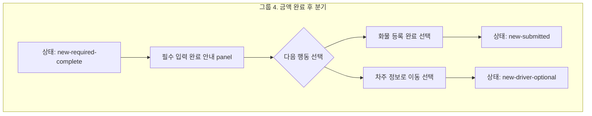

# 그룹 4 금액 완료 후 분기 설계

## 목적

이 문서는 `그룹 4. 금액 완료 후 분기`를 screenmap에서 어떻게 표현할지 정의합니다.

그룹 4는 금액 입력이 끝난 뒤 `new-required-complete` 상태에서 사용자가 다음 행동을 선택하는 구간입니다. 실제 API 등록은 다루지 않고, 화면에서 보이는 분기와 상태 전환만 설명합니다.

## 기준 원칙

| 원칙 | 적용 |
| --- | --- |
| 그룹 3 템플릿 | `12-group-3-screenmap-pattern-template.md`의 단일 node 판단, marker 밀도, API 제외 기준을 따른다 |
| 단일 node 유지 | marker가 4개이므로 하위 node로 세분화하지 않는다 |
| API 제외 | wizard의 `화물 등록 완료`는 실제 저장이 아니라 메인 화면 적용으로 설명한다 |
| 상태 중심 | `new-required-complete -> new-submitted` 또는 `new-driver-optional` 전환을 중심으로 설명한다 |
| live master 우선 | `master.html?screenmap=1`의 required-complete panel과 footer button을 anchor로 사용한다 |

## 그룹화 다이어그램

## 단일 Node 판단

| 판단 기준 | 결론 |
| --- | --- |
| marker 수 | 4개로 유지 가능 |
| 화면 복잡도 | 같은 `new-required-complete` dialog 안의 panel과 footer button만 설명 |
| data contract | `Pricing`, `PricingAdjustment`, `NewOrderDraft` 중심으로 한 화면에서 설명 가능 |
| 사용자 결정 | `화물 등록 완료` 또는 `차주 정보로 이동`의 2갈래 선택 |
| 분할 여부 | 세분화하지 않음 |

## Part 설계

좌표는 후속 구현 시 live anchor를 우선 사용합니다. fallback 좌표는 required-complete panel 기준으로 임시값을 둡니다.

| 번호 | Part ID | Label | `markerKind` | `targetZone` | Placement | 설명 |
| ---: | --- | --- | --- | --- | --- | --- |
| 1 | `group-amount-branch.required-complete-panel` | 필수 입력 완료 안내 | `dialog-surface` | `required-complete-panel` | `center` | 금액까지 완료되어 다음 행동을 선택할 수 있는 상태를 설명한다 |
| 2 | `group-amount-branch.api-boundary-note` | API 저장 아님 안내 | `detail-panel` | `required-complete-api-boundary` | `right` | wizard의 완료가 실제 저장이 아니라 메인 적용이라는 boundary를 설명한다 |
| 3 | `group-amount-branch.go-driver` | 차주 정보로 이동 | `action-button` | `required-complete-go-driver` | `above` | 선택 입력인 차주 정보 단계로 이어진다 |
| 4 | `group-amount-branch.apply-to-main` | 화물 등록 완료 | `action-button` | `required-complete-apply-main` | `above` | API 통신 없이 wizard draft를 메인 화면에 적용한다 |

## Marker Placement

| 유형 | 기준 |
| --- | --- |
| 완료 안내 panel | panel 중앙 또는 안내 box 전체를 `dialog-surface`로 표시 |
| API boundary 문구 | 안내 box 오른쪽 callout으로 표시해 저장 의미 오해를 줄임 |
| `차주 정보로 이동` button | 버튼을 덮지 않도록 `above` callout |
| `화물 등록 완료` button | 버튼을 덮지 않도록 `above` callout |

## Bridge 준비 상태

그룹 4의 초기 화면은 `new-required-complete` 상태의 required-complete panel이 열린 상태여야 합니다.

| 단계 | 기준 |
| --- | --- |
| 초기 진입 | `money` step을 열고 금액 적용 이벤트를 실행해 `new-required-complete` panel을 표시 |
| part 이동 | 같은 panel 안 marker만 바꾸므로 iframe을 재생성하지 않음 |
| anchor 없음 | required-complete panel이 없으면 fallback marker를 보여주지 않고 pending 처리 |
| button anchor | button text 기준으로 `차주 정보로 이동`, `화물 등록 완료`를 구분 |

후속 구현 시 bridge는 그룹 3의 `required-complete` 준비 로직을 재사용할 수 있습니다. 다만 group id는 `new-order.group-amount-branch`로 분리해 source link와 오른쪽 detail을 그룹 4 기준으로 보여줍니다.

## 화면 상태와 이벤트

| 이벤트 | 이전 상태 | 다음 상태 | 화면 의미 |
| --- | --- | --- | --- |
| 금액 조건 적용 완료 | `new-wizard-active` | `new-required-complete` | 필수 입력 완료 panel 표시 |
| `화물 등록 완료` 선택 | `new-required-complete` | `new-submitted` | wizard draft를 메인 화면에 적용 |
| `차주 정보로 이동` 선택 | `new-required-complete` | `new-driver-optional` | 차주 정보 선택 단계 표시 |

`화물 등록 완료`는 실제 API 저장 완료가 아닙니다. 실제 API 통신은 그룹 6 이후 메인 화면의 `화물 등록` 버튼에서만 다룹니다.

## Data Contract

| Contract | 역할 |
| --- | --- |
| `Pricing` | 결제방법, 청구비용, 운송비용이 완료되었는지 확인 |
| `PricingAdjustment` | 수수료, 조정 금액, 조정 사유가 draft에 반영되었는지 확인 |
| `NewOrderDraft` | 필수 입력 전체를 메인 화면에 적용할 준비가 되었는지 나타내는 화면 draft |
| `BranchDecision` | `apply-to-main` 또는 `go-driver` 중 사용자의 다음 행동 선택 |

`BranchDecision`은 screenmap 설명용 이름입니다. 실제 API payload 확정 항목이 아닙니다.

## Validation

| 항목 | 기준 |
| --- | --- |
| 필수 금액 완료 | `Pricing` 필수값이 완료되어야 `new-required-complete`에 진입 |
| 분기 표시 | `화물 등록 완료`, `차주 정보로 이동` 두 선택지가 모두 보여야 함 |
| API boundary | `화물 등록 완료` 선택 시 네트워크 요청이 발생하지 않아야 함 |
| 메인 적용 이동 | `화물 등록 완료` 선택 시 `new-submitted`로 이동 |
| 차주 단계 이동 | `차주 정보로 이동` 선택 시 `new-driver-optional`로 이동 |

## QA

| 항목 | 적용 | 메모 |
| --- | --- | --- |
| `AC-D1` | 상태 | 금액 완료 후 `new-required-complete` 진입 |
| `AC-D2` | 표시 | 두 선택지 표시 |
| `AC-D3` | API boundary | `화물 등록 완료` 선택 시 API 통신 없음 |
| `AC-D5` | 차주 이동 | `차주 정보로 이동` 선택 시 차주 단계 표시 |

## 의도적 제외

| 항목 | 제외 이유 | 후속 위치 |
| --- | --- | --- |
| 실제 등록 endpoint | 그룹 4는 화면 분기만 설명 | 그룹 6 이후 메인 `화물 등록` |
| payload schema | wizard 완료 선택과 직접 관련 없음 | 실제 API 설계 단계 |
| server validation | `new-required-complete` 진입 전 화면 validation과 분리 | 실제 API 전송 전 최종 validation |
| submit loading/failure/success | API 요청 이후 상태 | user flow 1차 범위 밖 |

## Source Link 후보

| 문서 | 이유 |
| --- | --- |
| `source-snapshot/sections/new-order-registration-flow/01-new-order-flow-overview.md` | 금액 후 분기 의미 |
| `source-snapshot/sections/new-order-registration-flow/04-dialog-wizard-flow.md` | wizard footer 선택지와 상태 전환 |
| `source-snapshot/sections/new-order-registration-flow/06-acceptance-criteria.md` | `AC-D1`부터 `AC-D5` |
| `source-snapshot/sections/new-order-registration-flow/08-main-submit-api-policy.md` | `화물 등록 완료`와 실제 API 저장 책임 분리 |

## Acceptance Criteria

| 항목 | 기준 |
| --- | --- |
| node 유지 | `new-order.group-amount-branch`는 단일 node로 유지 |
| marker 수 | 중앙 preview marker는 4개 기준 |
| 초기 상태 | node 진입 시 `new-required-complete` panel이 열린 상태 |
| 선택지 구분 | `화물 등록 완료`와 `차주 정보로 이동` marker가 각각 별도 표시 |
| API 제외 | endpoint, payload schema, server validation은 표시하지 않음 |
| QA 연결 | `AC-D1`, `AC-D2`, `AC-D3`, `AC-D5`를 오른쪽 panel에 연결 |

## 구현 반영

현재 구현 반영 상태는 아래와 같습니다.

| 항목 | 상태 | 메모 |
| --- | --- | --- |
| `app.js` center preview | 완료 | `new-order.group-amount-branch`용 4개 part 추가 |
| bridge anchor selector | 완료 | panel, API boundary box, 두 footer button anchor 추가 |
| bridge 상태 준비 | 완료 | `new-required-complete` panel을 직접 준비 |
| master bridge 재삽입 | 완료 | `screenmap-bridge-20260618-amount-branch` 반영 |
| 브라우저 확인 | 사용자 확인 필요 | `#new-order.group-amount-branch` 새로고침 후 4개 marker와 오른쪽 detail 확인 |
