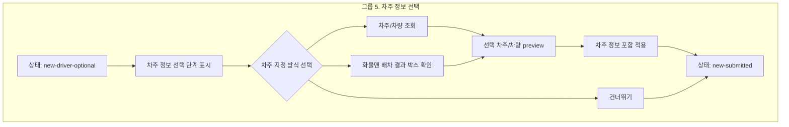

# 그룹 5 차주 정보 선택 설계

## 목적

이 문서는 `그룹 5. 차주 정보 선택`을 screenmap에서 어떻게 표현할지 정의합니다.

그룹 5는 금액 완료 후 `차주 정보로 이동`을 선택했을 때 진입하는 선택 단계입니다. 차주를 선택해 `DriverAssignment`를 draft에 포함하거나, 차주를 지정하지 않고 건너뛰어도 `new-submitted`로 이동할 수 있어야 합니다.

실제 화물맨 API 요청, 내부 DB 저장 API, endpoint, payload schema는 이 문서 범위에서 제외합니다. Screenmap에서는 사용자가 화면에서 보는 선택지, preview, 상태 전환만 설명합니다.

## 기준 원칙

| 원칙 | 적용 |
| --- | --- |
| 그룹 3 템플릿 | `12-group-3-screenmap-pattern-template.md`의 dialog 고정, part marker, pending-live 기준을 따른다 |
| 단일 node 유지 | marker가 6개 이내이므로 `new-order.group-driver-choice` 하나로 유지한다 |
| 선택 단계 강조 | 차주 정보는 필수가 아니며 `건너뛰기`가 정상 흐름임을 명확히 표시한다 |
| API 제외 | 화물맨 연동, 차주 조회, 차주 등록은 실제 요청이 아니라 화면 상태와 버튼 의미만 설명한다 |
| live master 우선 | `master.html?screenmap=1`의 차주 단계 dialog와 footer button을 anchor로 사용한다 |

## 그룹화 다이어그램

## 단일 Node 판단

| 판단 기준 | 결론 |
| --- | --- |
| marker 수 | 6개로 유지 가능 |
| 화면 복잡도 | 같은 `new-driver-optional` wizard step 안에서 설명 가능 |
| data contract | `DriverAssignment`, `NewOrderDraft` 중심으로 한 화면에서 설명 가능 |
| 사용자 결정 | 차주 선택 또는 건너뛰기의 2갈래 결정 |
| 분할 여부 | 세분화하지 않음. 단, 화물맨 상태별 연동 흐름을 실제 구현할 때 별도 node 분리 검토 |

## Part 설계

좌표는 후속 구현 시 live anchor를 우선 사용합니다. fallback 좌표는 차주 단계 dialog 기준으로 임시값을 둡니다.

| 번호 | Part ID | Label | `markerKind` | `targetZone` | Placement | 설명 |
| ---: | --- | --- | --- | --- | --- | --- |
| 1 | `group-driver-choice.driver-step-panel` | 차주 선택 단계 표시 | `dialog-surface` | `driver-step-panel` | `center` | `new-driver-optional` 상태와 선택 단계 진입을 설명한다 |
| 2 | `group-driver-choice.driver-search-entry` | 차주/차량 조회 진입 | `search-control` | `driver-search-entry` | `above` | 내부 DB 차주/차량 조회 다이얼로그 진입 의미를 설명한다 |
| 3 | `group-driver-choice.hwamulman-result-box` | 화물맨 배차 결과 박스 | `result-box` | `driver-hwamulman-result-box` | `right` | 검색어와 무관하게 상단 고정되는 화물맨 배차 결과 박스를 설명하고 실제 API는 제외한다 |
| 4 | `group-driver-choice.driver-result-preview` | 선택 차주/차량 preview | `detail-panel` | `driver-result-preview` | `right` | 선택된 차주명, 연락처, 차량번호, 톤수, 차종 확인 영역을 설명한다 |
| 5 | `group-driver-choice.skip-driver` | 건너뛰기 | `action-button` | `driver-skip` | `above` | 차주 미지정으로도 메인 화면 적용이 가능함을 설명한다 |
| 6 | `group-driver-choice.apply-driver` | 차주 정보에 적용 | `action-button` | `driver-apply-main` | `above` | 차주 선택 결과를 포함해 API 없이 메인 화면에 적용한다 |

## Marker Placement

| 유형 | 기준 |
| --- | --- |
| 차주 단계 dialog | dialog 전체를 `dialog-surface`로 표시해 optional step임을 먼저 이해시킴 |
| 차주/차량 조회 | 조회 버튼과 검색 진입 영역을 덮지 않도록 `above` callout |
| 화물맨 배차 결과 박스 | 결과 박스 내부 row를 가리지 않도록 `right` callout |
| 선택 preview | 차주/차량 값 확인 영역을 `detail-panel`로 표시 |
| footer button | `건너뛰기`, `차주 정보에 적용` 모두 버튼 위쪽 callout으로 표시 |

## Bridge 준비 상태

그룹 5의 초기 화면은 `new-driver-optional` 상태의 차주 정보 선택 단계가 열린 상태여야 합니다.

| 단계 | 기준 |
| --- | --- |
| 초기 진입 | 그룹 4의 `차주 정보로 이동` 결과와 동일하게 차주 단계 dialog를 직접 준비 |
| part 이동 | 같은 차주 단계 안 marker만 바꾸므로 iframe을 재생성하지 않음 |
| anchor 없음 | 차주 단계 dialog나 footer button anchor가 없으면 pending 처리 |
| 화물맨 UI | 실제 외부 연동을 호출하지 않고 master HTML의 정적/시뮬레이션 상태만 사용 |

후속 구현 시 bridge는 그룹 4의 required-complete 준비 이후 `new-driver-optional`로 넘어가는 흐름을 재사용하거나, 그룹 3처럼 목표 wizard step을 직접 여는 방식을 사용할 수 있습니다. 사용자 확인에서 다이얼로그가 닫혔다 열리는 현상이 다시 보이면 그룹 3의 same-node part update 방식을 우선 적용합니다.

## 화면 상태와 이벤트

| 이벤트 | 이전 상태 | 다음 상태 | 화면 의미 |
| --- | --- | --- | --- |
| `차주 정보로 이동` 선택 | `new-required-complete` | `new-driver-optional` | 차주 정보 선택 단계 표시 |
| 차주/차량 선택 후 완료 | `new-driver-optional` | `new-submitted` | `DriverAssignment` 포함해 메인 화면에 적용 |
| `건너뛰기` 선택 | `new-driver-optional` | `new-submitted` | 차주 미지정 상태로 메인 화면에 적용 |
| `이전` 선택 | `new-driver-optional` | `new-required-complete` | 금액 완료 후 분기로 복귀 |

`화물 등록 완료`는 실제 API 저장 완료가 아닙니다. 실제 API 통신은 그룹 6 이후 메인 화면의 `화물 등록` 버튼에서만 다룹니다.

## Data Contract

| Contract | 역할 |
| --- | --- |
| `DriverAssignment` | 차주명, 차주 연락처, 차량번호, 차종, 톤수 등 선택 차주 정보를 담는다 |
| `NewOrderDraft` | 선택 또는 건너뛰기 결과를 메인 화면 적용 전까지 보관한다 |
| `DriverChoiceDecision` | `select-driver` 또는 `skip-driver` 중 사용자 선택을 설명하는 screenmap용 이름 |
| `HwamulmanDriverState` | 화물맨 배차 결과 박스 표시 상태를 설명하는 screenmap용 이름 |

`DriverChoiceDecision`, `HwamulmanDriverState`는 screenmap 설명용 이름입니다. 실제 API payload 확정 항목이 아닙니다.

## Validation

| 항목 | 기준 |
| --- | --- |
| 선택 단계 표시 | `new-driver-optional`에서 차주 정보 단계와 왼쪽 프로세스 패널이 유지되어야 함 |
| 선택 사항 | 차주 미선택 상태에서도 `건너뛰기`로 진행 가능해야 함 |
| 선택 preview | 차주를 선택하면 `DriverAssignment` 핵심 필드가 적용 전 확인되어야 함 |
| 메인 적용 이동 | 차주 선택 완료 또는 건너뛰기 모두 `new-submitted`로 이동 |
| API boundary | 화물맨 연동, 차주 조회, 차주 등록의 실제 API 호출은 이 screenmap 단계에서 다루지 않음 |

## QA

| 항목 | 적용 | 메모 |
| --- | --- | --- |
| `AC-E1` | 선택 사항 | 차주 정보는 필수 입력이 아니며 건너뛰기 가능 |
| `AC-E2` | 차주 선택 | 차주 선택 후 `new-submitted` 전환 가능 |
| `AC-E3` | 건너뛰기 | 차주 미지정 상태로 `new-submitted` 전환 가능 |
| `AC-E4` | 프로세스 패널 | 차주 정보 단계에서도 왼쪽 프로세스 패널 유지 |
| `AC-D5` | 진입 상태 | 그룹 4에서 `차주 정보로 이동` 선택 시 `new-driver-optional` 표시 |

## 의도적 제외

| 항목 | 제외 이유 | 후속 위치 |
| --- | --- | --- |
| 화물맨 API 연동 요청/취소 | 그룹 5는 화면 선택 단계 설명 | 차주 정보 Phase 2 또는 실제 API 설계 |
| 내부 DB 차주 조회 endpoint | screenmap은 조회 UI와 선택 preview만 설명 | 차주 조회 구현 단계 |
| 차주 등록 저장 API | 등록 UI의 의미만 설명 | 차주 등록 구현 단계 |
| 외부 배차 callback | 배차완료 수신은 실시간 연동 범위 | 화물맨 연동 별도 기획 |
| submit loading/failure/success | API 요청 이후 상태 | user flow 1차 범위 밖 |

## Source Link 후보

| 문서 | 이유 |
| --- | --- |
| `source-snapshot/sections/new-order-registration-flow/04-dialog-wizard-flow.md` | 차주 정보 footer와 선택/건너뛰기 정책 |
| `source-snapshot/sections/new-order-registration-flow/06-acceptance-criteria.md` | `AC-E1`부터 `AC-E4` |
| `source-snapshot/sections/driver-info/README.md` | 차주 정보 섹션의 기준 필드와 Phase 2 결정 |
| `source-snapshot/sections/driver-info/05-b-integration-guide.md` | 내부 DB 조회, 화물맨 UI, preview/register 구조 |
| `source-snapshot/sections/driver-info/08-hwamulman-field-state-mapping.md` | 화물맨 상태 문구와 화면 상태 기준 |

## Acceptance Criteria

| 항목 | 기준 |
| --- | --- |
| node 유지 | `new-order.group-driver-choice`는 단일 node로 유지 |
| marker 수 | 중앙 preview marker는 6개 기준 |
| 초기 상태 | node 진입 시 차주 정보 선택 단계가 열린 상태 |
| 선택/건너뛰기 구분 | `차주 선택`, `건너뛰기`, `차주 정보에 적용` 의미가 각각 분리 표시 |
| API 제외 | endpoint, payload schema, 실제 화물맨/DB 호출은 표시하지 않음 |
| QA 연결 | `AC-E1`부터 `AC-E4`, `AC-D5`를 오른쪽 panel에 연결 |

## 구현 전 확인

| 항목 | 상태 | 확인 결과 |
| --- | --- | --- |
| master HTML의 차주 단계 selector | 확인 | wizard dialog는 `.dialog.dialog--new-order-wizard[data-new-order-step="driver"]`로 판별 가능 |
| `건너뛰기` button text와 role | 확인 | driver step decoration에서 `button[data-new-order-driver-skip]`가 footer 첫 번째에 삽입됨 |
| 차주 preview DOM 위치 | 확인 | 차주 조회 dialog의 preview는 `[data-b-driver-preview-panel]`, 선택 행은 `[data-b-driver-result-row]` |
| 화물맨 UI 기본 표시 상태 | 확인 | section row에는 `[data-b-driver-hm-link]`, `[data-b-driver-open="phase2"]`가 있고 실제 API는 호출하지 않음 |

## Selector 조사 결과

2026-06-19 기준 조사 결과입니다. `cargo-order-admin-hifi-master.html`은 bundled template이 한 줄로 포함되어 있으므로, readable flow layer와 reference snapshot을 함께 확인했습니다.

| 대상 | selector / 함수 | 근거 | 구현 메모 |
| --- | --- | --- | --- |
| driver 단계 열기 | `openWizardStep("driver") -> original.openDriverLookup()` | master flow layer | bridge에서는 `callGlobal("openDriverLookup")` 대신 driver phase를 먼저 세팅해야 함 |
| driver phase | `new-driver-optional` | master flow layer | `document.body.dataset.newOrderPhase`와 runtime state를 함께 맞춤 |
| driver wizard dialog | `.dialog.dialog--new-order-wizard[data-new-order-step="driver"]` | master flow layer | `driver-step-panel` anchor 1순위 |
| process panel current step | `.new-order-step-item[data-step="driver"][data-state="current"]` | master flow layer | 필요 시 driver step 상태 보조 anchor로 사용 |
| 건너뛰기 | `[data-new-order-driver-skip]` | master flow layer | `skip-driver` anchor 1순위, fallback은 button text `건너뛰기` |
| driver 완료 | `#dlg-apply` + text `차주 정보에 적용` | master flow layer | `apply-driver` anchor. `applyDriver()` 후 `newOrderApplyToMain("driver-applied")`로 이어짐 |
| 차주/차량 조회 진입 | `.lookup-search`, `#dlg-search` | baseline master | 현재 master의 실제 driver lookup anchor 1순위 |
| 화물맨 배차 결과 박스 | `#driver-results .ext-group`, `#driver-results .ext-group__title` | baseline master | 실제 API 호출 없이 `driverSetMode("hm")` 상태에서 상단 고정 배차 결과 박스를 marker 처리 |
| 차주 조회 결과 | `#driver-results .rrow` | baseline master | preview/apply marker에서는 보기용으로 첫 row를 선택 |
| 선택 preview | `#dlg-preview .pcard`, `#dlg-preview` | baseline master | `driver-result-preview` anchor 1순위 |
| reference 보조 selector | `[data-b-driver-open="phase2"]`, `[data-b-driver-hm-results]`, `[data-b-driver-hm-link]`, `[data-b-driver-preview-panel]` | driver reference snapshot | baseline이 `data-b-driver-*` 구조로 바뀔 때 fallback 후보 |

## 구현 방향 메모

| 구현 지점 | 적용 |
| --- | --- |
| `app.js` | `new-order.group-driver-choice`에 live master center map과 6개 part 추가 |
| `sourceLinks` | `14-group-5-driver-choice-plan.md`, `05-b-integration-guide.md`, `08-hwamulman-field-state-mapping.md` 추가 |
| `qaMap` | source를 `14-group-5-driver-choice-plan.md`로 변경하고 `AC-D5`, `AC-E1`~`AC-E4` 연결 |
| bridge anchors | `group-driver-choice.*` 6개 anchor 추가 |
| bridge state | `prepareGroupDriverChoice()` 추가. `new-driver-optional` phase와 driver step을 직접 준비 |
| pending-live | driver dialog 또는 footer button anchor가 없으면 fallback marker를 숨김 |
