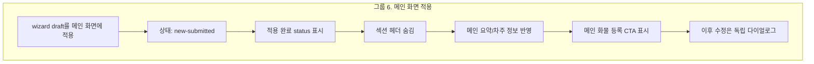

# 그룹 6 메인 화면 적용 설계

## 목적

이 문서는 `그룹 6. 메인 화면 적용`을 screenmap에서 어떻게 표현할지 정의합니다.

그룹 6은 신규 접수 wizard에서 누적한 draft가 메인 화면에 반영된 `new-submitted` 상태입니다. 이 상태는 실제 API 저장 완료가 아니라, 사용자가 메인 화면에서 최종 확인한 뒤 별도 `화물 등록` CTA로 실제 등록을 시작하기 전 단계입니다.

실제 API endpoint, payload schema, idempotency, retry, server validation은 이 문서 범위에서 제외합니다. Screenmap에서는 화면 반영, 상태 메시지, 최종 CTA 표시, 이후 개별 수정 방식만 설명합니다.

## 기준 원칙

| 원칙 | 적용 |
| --- | --- |
| 단일 node 유지 | `new-order.group-main-apply` 하나로 유지한다 |
| pre-API 강조 | `화물 등록 완료`와 메인 `화물 등록`의 의미 차이를 분리한다 |
| live master 우선 | `master.html?screenmap=1`의 `new-submitted` 화면을 직접 표시한다 |
| 실제 API 제외 | 최종 CTA 표시까지만 다루고 클릭 이후 API 흐름은 별도 범위로 둔다 |
| 수정 방식 전환 | `new-submitted` 이후 wizard가 아니라 섹션별 독립 다이얼로그를 사용한다 |

## 그룹화 다이어그램

## Part 설계

| 번호 | Part ID | Label | `markerKind` | `targetZone` | Placement | 설명 |
| ---: | --- | --- | --- | --- | --- | --- |
| 1 | `group-main-apply.status-success` | 적용 완료 status | `status-bar` | `main-apply-status` | `below` | draft가 메인 화면에 적용되었고 최종 등록 CTA로 이어진다는 feedback |
| 2 | `group-main-apply.document-view` | 섹션 헤더 숨김 | `layout-state` | `main-document-view` | `center` | `new-submitted`에서는 안내형 번호 헤더가 숨겨지고 명세서형 보기로 돌아감. 본문 전체 영역이라 바깥 callout 대신 내부 번호로 표시함 |
| 3 | `group-main-apply.summary-applied` | 요약 반영 | `summary-row` | `main-summary-applied` | `right` | wizard draft의 운송/품목/경로 요약이 메인 요약 row에 반영됨 |
| 4 | `group-main-apply.driver-applied` | 차주 정보 반영 | `detail-row` | `main-driver-applied` | `right` | 차주를 선택한 경우 `DriverAssignment`가 차주 정보 row에 반영됨 |
| 5 | `group-main-apply.final-submit-cta` | 메인 화물 등록 CTA | `action-button` | `main-final-submit-cta` | `above` | 실제 API 통신을 시작하는 최종 CTA가 표시됨 |
| 6 | `group-main-apply.independent-edit-entry` | 독립 수정 진입 | `action-button` | `main-independent-edit-entry` | `above` | 이후 수정은 wizard 재개가 아니라 섹션별 `변경`/`수정` 버튼으로 진입 |

## Acceptance 연결

| ID | 그룹 6에서 확인할 기준 |
| --- | --- |
| `AC-B4` | `new-submitted` 이후 섹션 헤더가 숨김 처리된다 |
| `AC-D3` | `화물 등록 완료`는 API 없이 메인 화면에 적용한다 |
| `AC-D4` | 적용 후 상태는 `new-submitted`이다 |
| `AC-D6` | 메인 화면에 최종 CTA인 `화물 등록` 버튼이 표시된다 |
| `AC-F1` | 이후 수정은 독립 다이얼로그로 열린다 |
| `AC-F2` | 이후 수정 시 wizard는 다시 표시되지 않는다 |
| `AC-F3` | 이후 수정 시 왼쪽 프로세스 패널은 표시되지 않는다 |
| `AC-F4` | 이후 수정 시 섹션 헤더는 표시되지 않는다 |

## Source 연결

| source | 사용 이유 |
| --- | --- |
| `source-snapshot/sections/new-order-registration-flow/05-state-and-interaction-matrix.md` | `new-submitted` 상태와 UI 표시 기준 |
| `source-snapshot/sections/new-order-registration-flow/07-main-submit-cta-visibility.md` | 메인 `화물 등록` CTA 표시 정책 |
| `source-snapshot/sections/new-order-registration-flow/06-acceptance-criteria.md` | `AC-B4`, `AC-D3`, `AC-D4`, `AC-D6`, `AC-F1`~`AC-F4` |

## 구현 방향 메모

| 구현 지점 | 적용 |
| --- | --- |
| `app.js` | `new-order.group-main-apply`에 live master center map과 6개 part 추가 |
| `sourceLinks` | `15-group-6-main-apply-plan.md`를 그룹 6 source에 추가 |
| `qaMap` | source를 `15-group-6-main-apply-plan.md`로 변경하고 관련 acceptance 연결 |
| bridge anchors | `group-main-apply.*` 6개 anchor 추가 |
| bridge state | `prepareGroupMainApply()`에서 샘플 wizard 값을 적용하고 `new-submitted` 상태를 준비 |
| 중복 준비 방지 | 초기 진입과 첫 part message가 겹쳐도 `ensureMainApplyReady()`가 준비 작업을 1회만 실행 |
| CTA 잘림 방지 | `screenmap=1` core view에서 actionbar 아래 안전 여백을 추가 |
| pending-live | 적용 완료 화면 anchor가 없으면 fallback marker를 숨김 |
