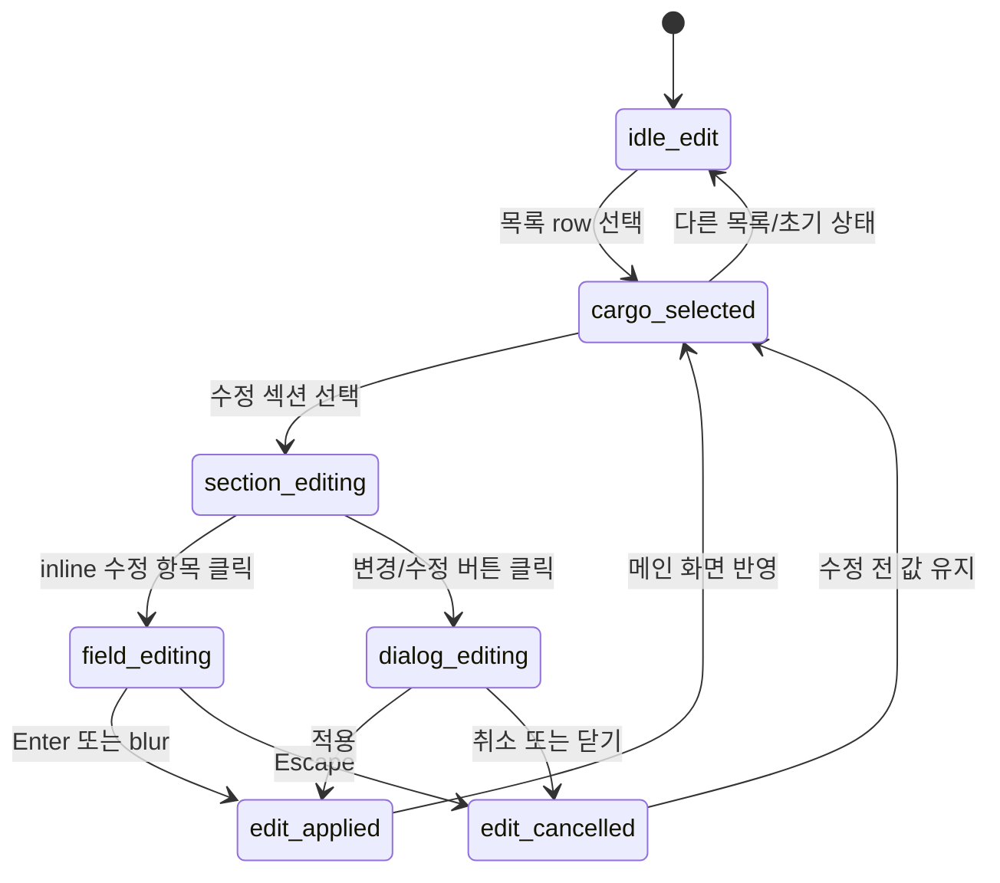
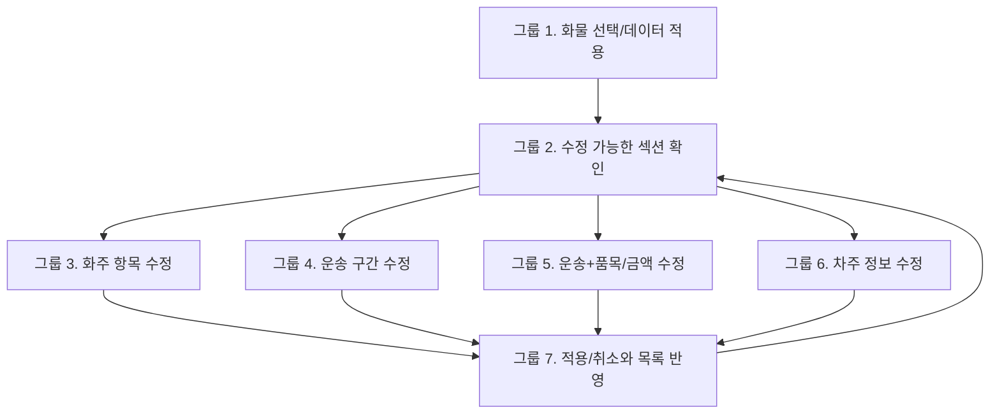
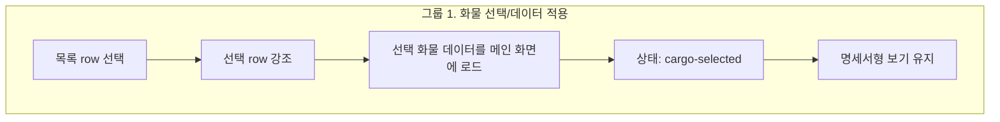
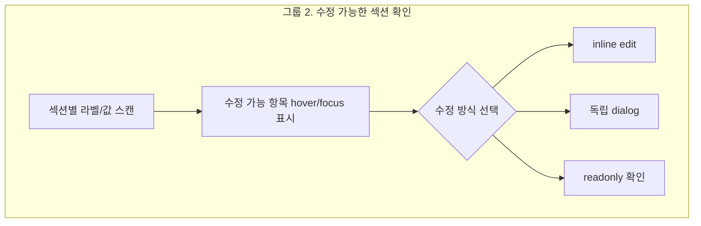
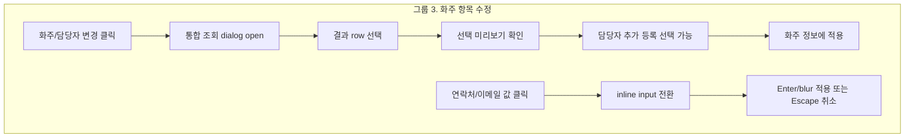
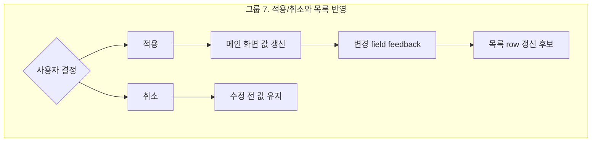

# 화물 수정 유저 플로우 설계

## 목적

이 문서는 `화물 수정` 흐름을 screenmap에 적용하기 전, 선택된 화물의 섹션별 수정 흐름을 정리하는 docs-only 기획 문서입니다.

`신규 접수`가 빈 draft를 wizard로 채우는 흐름이라면, `화물 수정`은 이미 선택된 화물의 명세서형 화면에서 필요한 섹션과 항목만 독립적으로 수정하는 흐름입니다.

이번 문서는 `index.html`, `styles.css`, `app.js`, `master.html`을 수정하지 않습니다.

## 범위

| 구분 | 포함 |
| --- | --- |
| 목록 선택 | 화물 목록 row 선택 후 메인 화면에 선택 화물 데이터 적용 |
| 명세서형 보기 | 섹션 헤더, wizard, 왼쪽 프로세스 패널 없이 라벨/값 중심으로 표시 |
| 섹션별 수정 | 화주, 운송 구간, 화물 운송정보, 화물정보 요약, 차주 정보, 보조 정보 |
| 항목별 수정 | inline edit, dialog, selector, date-time picker, readonly 분류 |
| 적용/취소 | 수정 전 값, 수정 중 상태, 적용 후 반영 위치 정리 |
| Screenmap 후보 | 왼쪽 node, 가운데 preview, 오른쪽 detail 후보 제안 |

## 제외

| 구분 | 제외 이유 |
| --- | --- |
| 실제 저장 연동 상세 확정 | 현재 단계는 화면 상태와 유저 플로우 기획 |
| 서버 저장 성공/실패 처리 | 실제 저장 정책은 후속 개발 범위 |
| 신규 접수 flow 재설계 | 신규 접수는 `01-user-flow-new-order-events.md`와 그룹 1~6 계획을 유지 |
| 화물 목록 전체 리디자인 | row 선택과 수정 후 갱신 흐름만 다룸 |

## 근거 파일

| source | 사용 이유 |
| --- | --- |
| `01-user-flow-new-order-events.md` | 신규 접수와 화물 수정의 상태/흐름 분리 기준 |
| `15-group-6-main-apply-plan.md` | `new-submitted` 이후 독립 수정 진입 기준 |
| `../wireframes/final-handoff/baseline/html/cargo-order-admin-hifi-master.html` | 현재 master의 상태 함수와 수정 반영 메시지 |
| `../wireframes/final-handoff/source-snapshot/root-docs/01-screen-map.md` | 화면 섹션 구조, 목록 선택, 액션 정의 |
| `../wireframes/final-handoff/source-snapshot/root-docs/02-field-inventory.md` | 전체 필드 inventory와 데이터 모델 초안 |
| `../wireframes/final-handoff/source-snapshot/sections/shipper-info/02-wireframe-shipper-info.md` | 화주/담당자 변경, 연락처/이메일 inline edit |
| `../wireframes/final-handoff/source-snapshot/sections/transport-route/04-field-state-mapping.md` | 운송 구간 필드와 계산 메타 |
| `../wireframes/final-handoff/source-snapshot/sections/cargo-transport/04-field-state-mapping.md` | 운송+품목, 금액 필드 상태 |
| `../wireframes/final-handoff/source-snapshot/sections/cargo-transport/07-inline-edit-interaction-plan.md` | 운송+품목/금액 inline edit interaction |
| `../wireframes/final-handoff/source-snapshot/sections/cargo-summary-docs/04-field-state-mapping.md` | 화물정보 요약 override와 재생성 기준 |
| `../wireframes/final-handoff/source-snapshot/sections/driver-info/03-user-flow-driver-info.md` | 차주 정보 조회/변경/등록 flow |
| `../wireframes/final-handoff/source-snapshot/sections/driver-info/04-field-state-mapping.md` | 차주 정보 필드별 수정 가능성 |
| `../wireframes/final-handoff/source-snapshot/sections/reservation-area-tabs/05-state-and-interaction-matrix.md` | 보조 정보 탭의 읽기/이동/메모 추가 책임 |

## 전제 상태

| 상태 | 의미 |
| --- | --- |
| `idle-edit` | 기본 조회/화물 수정 상태. 명세서형 보기이며 신규 접수 header, wizard, process panel은 숨김 |
| `cargo-selected` | 목록 row 선택으로 선택 화물 데이터가 메인 화면에 로드된 상태 |
| `section-editing` | 특정 섹션의 수정 대상 항목을 고르는 상태 |
| `field-editing` | inline edit로 특정 항목을 수정 중인 상태 |
| `dialog-editing` | 독립 다이얼로그로 조회/선택/등록/변경 중인 상태 |
| `edit-applied` | 수정값이 메인 화면에 반영된 상태 |
| `edit-cancelled` | 수정값을 폐기하고 수정 전 값으로 되돌린 상태 |

## 전체 화물 수정 Flow



## 그룹화된 이벤트 다이어그램



### 그룹 1. 화물 선택/데이터 적용



### 그룹 2. 수정 가능한 섹션 확인



### 그룹 3. 화주 항목 수정



### 그룹 4. 운송 구간 수정


### 그룹 5. 운송+품목/금액 수정


### 그룹 6. 차주 정보 수정


### 그룹 7. 적용/취소와 목록 반영



## 섹션별 수정 가능 항목 Inventory

분류 기준:

- `수정 가능`: 현재 source 문서에서 수정 방식이 확인된 항목
- `표시 전용`: 화면에는 보이지만 직접 수정하지 않는 항목
- `[확인 필요]`: 표시 또는 수정 가능성은 있으나 master/source 근거가 부족한 항목

| 섹션 | 항목 | 분류 | UI 유형 | 수정 전 값 | 수정 중 상태 | 적용 후 반영 위치 | 근거 |
| --- | --- | --- | --- | --- | --- | --- | --- |
| 목록 | 목록 row 선택 | 수정 가능 | selector | 선택 row 없음 또는 기존 선택 | row focus/selected | 메인 화면 전체 데이터 | `root-docs/01-screen-map.md`, `sections/cargo-list/00-package-plan.md` |
| 목록 | 화물ID, 처리시간, 상태 | 표시 전용 | readonly | 목록 row 값 | 없음 | 메인 header/status와 목록 row | `root-docs/02-field-inventory.md` |
| Header | 상태 chip | 표시 전용 | readonly | `접수`, `완료`, `취소` | 없음 | header 상태 chip | `root-docs/01-screen-map.md` |
| Header | 거리, 기준금액 chip | 표시 전용 | readonly | 계산된 거리/금액 | 재계산 필요 가능 | header 계산 chip | `root-docs/01-screen-map.md`, `transport-route/04-field-state-mapping.md` |
| Header | 배차 담당자 chip | `[확인 필요]` | readonly | `배차 김민지` | 변경 권한 미정 | header 담당자 chip | `root-docs/01-screen-map.md`, `root-docs/02-field-inventory.md` |
| 화주 정보 | 화주 업체명 | 수정 가능 | dialog | 적용된 업체명 | 통합 조회/결과 선택 | 화주 정보 row | `shipper-info/02-wireframe-shipper-info.md` |
| 화주 정보 | 사업자 번호 | 수정 가능 | dialog | 적용된 사업자 번호 | 통합 조회/결과 선택 | 화주 정보 row | `shipper-info/02-wireframe-shipper-info.md` |
| 화주 정보 | 담당자명 | 수정 가능 | dialog | 적용된 담당자명 | 통합 조회 또는 담당자 추가 | 화주 정보 row | `shipper-info/02-wireframe-shipper-info.md` |
| 화주 정보 | 담당자 연락처 | 수정 가능 | inline edit | 적용된 연락처 | 같은 위치 input | 화주 정보 row | `shipper-info/02-wireframe-shipper-info.md` |
| 화주 정보 | 담당자 이메일 | 수정 가능 | inline edit | 적용된 이메일 | 같은 위치 input | 화주 정보 row | `shipper-info/02-wireframe-shipper-info.md` |
| 화주 정보 | 담당자 역할 | `[확인 필요]` | selector/dialog | 배차/정산/관리 chip | 담당자 추가 또는 변경 | 화주/담당자 preview | `shipper-info/02-wireframe-shipper-info.md` |
| 운송 구간 | 상차지 주소 | 수정 가능 | dialog | 상차지 주소 | 주소 조회/결과 선택 | 운송 구간 상차 row, 지도 탭 | `transport-route/04-field-state-mapping.md` |
| 운송 구간 | 상차 상세주소 | 수정 가능 | dialog | 상세주소 | 선택 preview 또는 상세 입력 | 펼침 상세, 상차 row | `transport-route/04-field-state-mapping.md` |
| 운송 구간 | 상차 담당자/연락처 | 수정 가능 | dialog | 담당자/연락처 | 선택 preview | 펼침 상세, 상차 row | `transport-route/04-field-state-mapping.md` |
| 운송 구간 | 상차 일시 | 수정 가능 | date-time picker | 지금/당일/내일/직접 입력 | 일시 선택 | 상차 row summary | `transport-route/04-field-state-mapping.md`, `root-docs/02-field-inventory.md` |
| 운송 구간 | 상차 방법 | 수정 가능 | selector | 지게차 등 | 방법 선택 | 상차 row summary | `transport-route/04-field-state-mapping.md` |
| 운송 구간 | 하차지 주소 | 수정 가능 | dialog | 하차지 주소 | 주소 조회/결과 선택 | 운송 구간 하차 row, 지도 탭 | `transport-route/04-field-state-mapping.md` |
| 운송 구간 | 하차 상세주소 | 수정 가능 | dialog | 상세주소 | 선택 preview 또는 상세 입력 | 펼침 상세, 하차 row | `transport-route/04-field-state-mapping.md` |
| 운송 구간 | 하차 담당자/연락처 | 수정 가능 | dialog | 담당자/연락처 | 선택 preview | 펼침 상세, 하차 row | `transport-route/04-field-state-mapping.md` |
| 운송 구간 | 하차 일시 | 수정 가능 | date-time picker | 당일/내일/월착/직접 입력 | 일시 선택 | 하차 row summary | `transport-route/04-field-state-mapping.md`, `root-docs/02-field-inventory.md` |
| 운송 구간 | 하차 방법 | 수정 가능 | selector | 지게차 등 | 방법 선택 | 하차 row summary | `transport-route/04-field-state-mapping.md` |
| 운송 구간 | 독차/혼적 | 수정 가능 | selector | 독차 또는 혼적 | 대표 배차 유형 선택 | 운송 구간 보조 chip | `transport-route/04-field-state-mapping.md` |
| 운송 구간 | 긴급/왕복/예약/경유 | 수정 가능 | selector | 선택된 option chip | option toggle | 운송 구간 보조 chip | `transport-route/04-field-state-mapping.md`, `root-docs/02-field-inventory.md` |
| 운송 구간 | 거리 | 표시 전용 | readonly | 계산된 거리 | 재계산 필요 상태 | header 거리 chip, 지도 탭 | `transport-route/04-field-state-mapping.md` |
| 운송 구간 | 기준금액 | 표시 전용 | readonly | 계산된 기준금액 | 재계산 필요 상태 | header 기준 chip, 금액 참고 | `transport-route/04-field-state-mapping.md` |
| 화물 운송정보 | 톤수 | 수정 가능 | selector | 예: `5톤` | select/dropdown | 운송 row, 기준금액 재계산 | `cargo-transport/04-field-state-mapping.md`, `cargo-transport/07-inline-edit-interaction-plan.md` |
| 화물 운송정보 | 차종 | 수정 가능 | selector | 예: `축카고` | select/dropdown | 운송 row, 기준금액 재계산 | `cargo-transport/04-field-state-mapping.md` |
| 화물 운송정보 | 대수 | 수정 가능 | inline edit | 예: `1대` | number input | 운송 row, 금액 확인 후보 | `cargo-transport/07-inline-edit-interaction-plan.md` |
| 화물 운송정보 | 실중량 | 수정 가능 | inline edit | 예: `5.50톤` | decimal input | 운송 row, 화물정보 요약 | `cargo-transport/04-field-state-mapping.md` |
| 화물 운송정보 | 품목 | 수정 가능 | inline edit | 예: `장비 운송` | text input | 품목 row, 화물정보 요약 | `cargo-transport/04-field-state-mapping.md` |
| 금액 | 결제방법 | 수정 가능 | selector | 인수증/선불/착불/선착불 | segmented/select | 금액 row, 수수료 표시 조건 | `cargo-transport/04-field-state-mapping.md` |
| 금액 | 청구비용 | 수정 가능 | inline edit | 청구 금액 | money input | 금액 row, 금액 로그 | `cargo-transport/07-inline-edit-interaction-plan.md` |
| 금액 | 운송비용 | 수정 가능 | inline edit | 운송 금액 | money input | 금액 row, 금액 로그 | `cargo-transport/07-inline-edit-interaction-plan.md` |
| 금액 | 수수료 | 수정 가능 | inline edit | 수수료 또는 미표시 | money input | 금액 row, 선착불 전환 가능 | `cargo-transport/07-inline-edit-interaction-plan.md` |
| 금액 | 수익/차주운임 | 표시 전용 | readonly | 계산값 | 없음 | 금액 row, 금액 로그 | `cargo-transport/04-field-state-mapping.md` |
| 화물정보 요약 | 자동 생성 요약 | 수정 가능 | inline edit | 파생 요약 문장 | text input | 화물정보 요약 row | `cargo-summary-docs/04-field-state-mapping.md` |
| 화물정보 요약 | 재생성 | `[확인 필요]` | command | stale 후보 | 재생성 또는 override 유지 | 화물정보 요약 row | `cargo-summary-docs/04-field-state-mapping.md` |
| 차주 정보 | 차주명 | 수정 가능 | dialog | 적용된 차주명 | 조회/결과 선택 | 차주 정보 row | `driver-info/03-user-flow-driver-info.md`, `driver-info/04-field-state-mapping.md` |
| 차주 정보 | 차량번호 | 수정 가능 | dialog | 적용된 차량번호 | 조회/결과 선택 | 차주 정보 row | `driver-info/04-field-state-mapping.md` |
| 차주 정보 | 차주 연락처 | 수정 가능 | inline edit | 적용된 연락처 | input | 차주 정보 row | `driver-info/04-field-state-mapping.md` |
| 차주 정보 | 톤수 | 수정 가능 | selector | 차주 차량 톤수 | select | 차주 정보 row | `driver-info/04-field-state-mapping.md` |
| 차주 정보 | 차종 | 수정 가능 | selector | 차주 차량 차종 | select | 차주 정보 row | `driver-info/04-field-state-mapping.md` |
| 차주 정보 | 최근 운행 | 표시 전용 | readonly | 최근 운행 정보 | 없음 | 조회 결과 참고 | `driver-info/04-field-state-mapping.md` |
| 보조 정보 - 메모 | 메모 추가 | 수정 가능 | dialog | 기존 메모 목록 | 메모 작성 dialog | 메모 리스트 상단 | `reservation-area-tabs/05-state-and-interaction-matrix.md` |
| 보조 정보 - 금액 로그 | 상세 항목 보기 | 표시 전용 | readonly/expand | 요약 금액 | 상세 펼침 | 금액 로그 탭 | `reservation-area-tabs/05-state-and-interaction-matrix.md` |
| 보조 정보 - 금액 로그 | 금액 입력으로 이동 | 수정 가능 | command | 금액 로그 | 금액 영역 이동 | 기존 금액 입력/row | `reservation-area-tabs/05-state-and-interaction-matrix.md` |
| 보조 정보 - 지도 | 주소 입력으로 이동 | 수정 가능 | command | 지도/주소 상태 | 운송 구간 이동 | 운송 구간 row | `reservation-area-tabs/05-state-and-interaction-matrix.md` |
| 보조 정보 - 지도 | 경로 다시 계산 | `[확인 필요]` | command | 기존 지도 계산 | 계산 중/오류 가능 | 지도, 거리/예상 시간 | `reservation-area-tabs/05-state-and-interaction-matrix.md` |

## 항목별 수정 Flow Matrix

| Flow | 진입 트리거 | 편집 UI | 수정 전 값 | 수정 중 상태 | 적용 | 취소 | Validation | 반영 위치 |
| --- | --- | --- | --- | --- | --- | --- | --- | --- |
| 화주/담당자 변경 | `화주/담당자 변경` | dialog | 기존 화주 row | 조회 결과 선택, preview | `화주 정보에 적용` | 닫기/취소 | 화주 식별, 담당자/연락처 | 화주 정보 row |
| 화주 연락처/이메일 | 값 클릭 또는 focus | inline edit | 기존 연락처/이메일 | input | Enter/blur | Escape | 연락처/이메일 형식 `[확인 필요]` | 화주 정보 row |
| 상차/하차 주소 | 주소 수정/입력 | dialog | 기존 주소 | 조회/선택 preview | `상차지 적용`, `하차지 적용` | 닫기/취소 | 주소, 상세주소 또는 장소명 | 운송 구간 row, 지도 |
| 상차/하차 일시/방법 | 일시/방법 값 클릭 또는 dialog 내부 | date-time picker/selector | 기존 일시/방법 | 조건 선택 | 적용 | 취소 | 정책별 필수 조건 | 운송 구간 row |
| 운송 조건 | 톤수/차종/대수/실중량 값 클릭 | selector/inline edit | 기존 운송 조건 | field editing | Enter/blur/change | Escape | 톤수/차종 필수, 대수 1 이상, 실중량 0 이상 | 운송 row, 기준금액 |
| 품목 | 품목 값 클릭 | inline edit | 기존 품목 | text input | Enter/blur | Escape | 저장 전 안내 가능 | 품목 row, 화물정보 요약 |
| 금액 조건 | 금액 값 클릭 | selector/money input | 기존 금액 | money editing | Enter/blur/change | Escape | 0 이상 금액, 결제방법별 조건 | 금액 row, 금액 로그 |
| 화물정보 요약 | 요약 값 또는 수정 버튼 | inline edit | 자동/override 요약 | text input | 저장 | Escape | 장문 overflow, 빈 값 정책 `[확인 필요]` | 화물정보 요약 row |
| 차주/차량 변경 | `차주/차량 변경` | dialog | 기존 차주 row | 조회/등록/preview | `차주 정보에 적용` | 닫기/취소 | 차주명/차량번호/연락처 | 차주 정보 row |
| 차주 연락처 보정 | 연락처 값 클릭 | inline edit | 기존 차주 연락처 | field editing | Enter/blur | Escape | 연락처 형식 `[확인 필요]` | 차주 정보 row |
| 차주 톤수 보정 | 톤수 값 클릭 | selector | 기존 차주 톤수 | field editing | change | Escape | 운송 조건 톤수와 비교 `[확인 필요]` | 차주 정보 row |
| 차주 차종 보정 | 차종 값 클릭 | selector | 기존 차주 차종 | field editing | change | Escape | 운송 조건 차종과 비교 `[확인 필요]` | 차주 정보 row |
| 메모 추가 | `메모 추가` | dialog | 기존 메모 목록 | textarea/type 선택 | 저장 | 취소 | 내용 필수 | 보조 정보 메모 탭 |

## Data Contract 초안

실제 API contract가 아니라 screenmap 설명용 화면 데이터 contract입니다.

```ts
type EditOrderState =
  | "idle-edit"
  | "cargo-selected"
  | "section-editing"
  | "field-editing"
  | "dialog-editing"
  | "edit-applied"
  | "edit-cancelled";

type EditableFieldStatus = "editable" | "readonly" | "needs-confirmation";

type EditUiType =
  | "inline edit"
  | "dialog"
  | "selector"
  | "date-time picker"
  | "readonly"
  | "command";

type EditField = {
  sectionId: string;
  fieldId: string;
  label: string;
  status: EditableFieldStatus;
  uiType: EditUiType;
  beforeValue?: string;
  editingState?: string;
  appliedTarget: string;
  source: string;
};

type EditPatch = {
  cargoId: string;
  sectionId: string;
  fieldId: string;
  beforeValue?: string;
  nextValue?: string;
  source: "inline" | "dialog" | "command";
  localOnly: true;
};
```

## Validation / Checklist

| 영역 | 확인 기준 |
| --- | --- |
| 신규 접수와 분리 | 화물 수정에서는 wizard, process panel, 번호형 섹션 헤더를 표시하지 않는다 |
| 목록 선택 | row 선택 후 메인 화면 데이터가 `cargo-selected`로 로드된다 |
| 항목 분류 | 모든 항목은 `수정 가능`, `표시 전용`, `[확인 필요]` 중 하나로 표시된다 |
| UI 유형 | 모든 수정 항목은 `inline edit`, `dialog`, `selector`, `date-time picker`, `readonly`, `command` 중 하나로 분류된다 |
| inline edit | Enter/blur 적용, Escape 취소, 행 높이 유지 기준을 가진다 |
| dialog edit | 결과 선택과 적용 버튼을 분리하고, 취소 시 수정 전 값을 유지한다 |
| read-only | 계산값과 조회 참고값은 직접 수정 가능처럼 보이지 않는다 |
| 적용 feedback | 변경된 field 또는 row만 feedback을 받는다 |
| 목록 반영 | 수정 후 목록 row 갱신 여부와 갱신 시점은 `[확인 필요]`로 추적한다 |

## Screenmap 적용 후보

왼쪽 user flow는 4~7개 node 안에서 유지하고, 세부 항목은 가운데 part와 오른쪽 detail로 분리합니다.

| 후보 node id | Label | 역할 | 주요 part 후보 | 상태 |
| --- | --- | --- | --- | --- |
| `edit-order.row-select` | 목록 행 선택 | 선택 화물 데이터를 메인 화면에 적용 | row 선택, 선택 row 강조, 메인 로드, 명세서형 보기 | 아직 구현전 |
| `edit-order.section-scan` | 수정 가능 항목 확인 | 섹션별 editable/readonly 항목을 스캔 | 화주, 운송 구간, 운송+품목, 금액, 차주, 보조 정보 | 아직 구현전 |
| `edit-order.shipper-edit` | 화주 항목 수정 | 화주/담당자 변경과 연락처/이메일 inline edit | 화주 변경 dialog, 담당자 추가, 연락처 inline, 이메일 inline | bridge 연결 |
| `edit-order.route-edit` | 운송 구간 수정 | 상차/하차 주소와 일시/방법 수정 | 상차지, 하차지, 일시/방법, 재계산 필요 | bridge 연결 |
| `edit-order.cargo-money-edit` | 운송+품목/금액 수정 | inline edit 중심의 운송 조건과 금액 조건 수정 | 톤수/차종, 대수/실중량, 품목, 결제방법, 비용 | bridge 연결 |
| `edit-order.driver-edit` | 차주 정보 수정 | 차주/차량 변경과 일부 항목 보정 | 차주 변경 dialog, 등록, 연락처, 톤수/차종 | bridge 연결 |
| `edit-order.apply-review` | 수정값 반영 확인 | 수정 적용/취소 후 메인 화면과 목록 갱신 확인 | 변경 field feedback, 수정 row 반영, 최종 CTA, 취소 복구, 목록 갱신 보류 | bridge 연결 |

적용 결정: 왼쪽 user flow는 위 7개 후보 node를 확정안으로 사용합니다. 기존 `edit-order.section-edit`, `edit-order.dialog-edit`, `edit-order.apply` placeholder 구조는 7개 확장 구조로 대체합니다.

`edit-order.shipper-edit`의 가운데 preview 상세 기준은 `17-edit-order-shipper-edit-marker-plan.md`로 분리했습니다. 이 node는 왼쪽에서는 하나로 유지하지만, 가운데 preview에서는 화주 row, 변경 버튼, 조회 결과, 선택 preview, 담당자 추가 등록, 담당자 연락처 inline edit, 담당자 이메일 inline edit의 7개 part를 사용합니다.

`edit-order.route-edit`의 가운데 preview 상세 기준은 `18-edit-order-route-edit-marker-plan.md`로 분리했습니다. 이 node는 왼쪽에서는 하나로 유지하지만, 가운데 preview에서는 상차/하차 현재 row, 상차지 주소 변경, 상차 상세/담당/조건 수정, 하차지 주소 변경, 하차 상세/담당/조건 수정, 거리/기준금액 확인의 6개 part를 사용합니다.

`edit-order.cargo-money-edit`의 가운데 preview 상세 기준은 `19-edit-order-cargo-money-edit-marker-plan.md`로 분리했습니다. 이 node는 왼쪽에서는 하나로 유지하지만, 가운데 preview에서는 운송+품목 입력 dialog, 최근 조합 선택, 운송 조건 row, 품목 row, 금액 입력 dialog, 금액 계산 preview, 금액 row/계산값 readonly의 7개 part를 사용합니다.

`edit-order.driver-edit`의 가운데 preview 상세 기준은 `20-edit-order-driver-edit-marker-plan.md`로 분리했습니다. 이 node는 왼쪽에서는 하나로 유지하지만, 가운데 preview에서는 차주 현재 row, 차주/차량 변경 dialog, 내부 DB 결과, 화물맨 배차 결과, 선택 preview, 차주 등록, 연락처 inline 보정, 톤수 inline 보정, 차종 inline 보정의 9개 part를 사용합니다.

`edit-order.apply-review`의 가운데 preview 상세 기준은 `21-edit-order-apply-review-marker-plan.md`로 분리했습니다. 이 node는 왼쪽에서는 하나로 유지하지만, 가운데 preview에서는 변경 feedback, 수정 row 반영, 최종 `화물 등록` CTA, dialog 취소 경계, 목록 갱신 보류의 5개 part를 사용합니다. 실제 저장 API와 목록 재조회는 연결하지 않고, 저장 전 화면 검수 범위만 다룹니다.

### 가운데 preview 후보

| node | 가운데 표현 |
| --- | --- |
| 목록 행 선택 | master 하단 목록과 상단 명세서형 화면을 함께 보여주되, 목록 row 선택 marker를 우선 표시 |
| 수정 가능 항목 확인 | 메인 화면 전체에 editable/readonly marker를 분류 표시 |
| 화주 항목 수정 | 화주 row, 연락처/이메일 inline, 화주/담당자 변경 dialog를 part별로 표시 |
| 운송 구간 수정 | 상차/하차 row와 주소 검색 dialog, 일시/방법 조건을 part별로 표시 |
| 운송+품목/금액 수정 | row 내부 inline edit와 계산/readonly 값을 함께 표시 |
| 차주 정보 수정 | 차주 row, 차주/차량 변경 dialog, 내부 DB/화물맨 결과, inline 보정 항목 표시 |
| 수정값 반영 확인 | 변경된 row flash, status message, 목록 갱신 후보 표시 |

### 오른쪽 detail 후보

| detail 영역 | 포함 내용 |
| --- | --- |
| 기능 설명 | 수정 방식, 신규 접수와의 차이, 적용/취소 정책 |
| Data contract | `EditField`, `EditPatch`, 섹션별 field id |
| Validation | 필수값, 형식, 계산값 read-only, stale 후보 |
| 저장 연동 보류 | 실제 저장 연동, 동시 수정, 목록 재조회, 권한 |
| QA | Enter/blur/Escape, dialog 취소, 목록 row 갱신, overflow |
| Checklist | 구현 전 anchor, marker placement, part 수 제한, source link |

## 보류 / 확인 필요

| 항목 | 이유 |
| --- | --- |
| 목록 row 선택 후 실제 데이터 load contract | 현재는 화면 기획 기준이며 실제 API/상태 store 미확정 |
| 수정 후 목록 row 갱신 시점 | 즉시 갱신인지 저장 성공 후 갱신인지 정책 필요 |
| 배차 담당자 chip 수정 권한 | header에 표시되지만 수정 진입점과 권한 미확정 |
| 화주 담당자 역할 변경 | 담당자 추가 시 역할은 있으나 기존 담당자 역할 수정 정책 미확정 |
| 주소 변경 후 거리/기준금액 재계산 트리거 | 계산 결과 표시 정책은 있으나 실제 계산 호출은 미확정 |
| 화물정보 요약 stale 표시 | override와 원본 변경 불일치 표시 방식 미확정 |
| 차주 차량 스펙과 운송 조건 비교 | 톤수/차종 mismatch validation 정책 미확정 |
| 보조 정보 탭의 편집 범위 | 메모 추가는 가능하나 금액/지도는 기존 섹션 이동 중심 |

## 다음 구현 단계

1. `edit-order.shipper-edit`는 `17-edit-order-shipper-edit-marker-plan.md` 기준으로 7개 part preview, 오른쪽 detail, master bridge anchor를 1차 반영했습니다.
2. `edit-order.route-edit`는 `18-edit-order-route-edit-marker-plan.md` 기준으로 6개 part preview, 오른쪽 detail, master bridge anchor를 1차 반영했습니다.
3. `edit-order.cargo-money-edit`는 `19-edit-order-cargo-money-edit-marker-plan.md` 기준으로 7개 part preview, 오른쪽 detail, master bridge anchor를 1차 반영했습니다.
4. `edit-order.driver-edit`는 `20-edit-order-driver-edit-marker-plan.md` 기준으로 9개 part preview, 오른쪽 detail, master bridge anchor를 1차 반영했습니다.
5. `edit-order.apply-review`는 `21-edit-order-apply-review-marker-plan.md` 기준으로 5개 part preview, 오른쪽 detail, master bridge anchor를 1차 반영했습니다.
6. `edit-order.row-select`와 공유할 선택 화물 sample data 준비 방식을 정합니다.
7. `edit-order.section-scan`의 editable/readonly marker 범위를 확정합니다.
8. 실제 API 저장은 screenmap 설명에서 계속 보류하고, 화면 반영/검증/QA 기준만 먼저 연결합니다.
