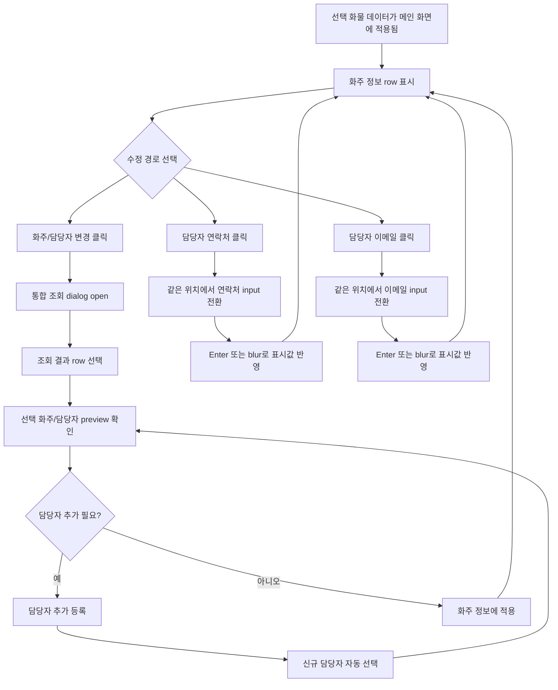

# 화물 수정 화주 항목 수정 Marker/Part 설계

## 목적

이 문서는 화물 수정 flow의 `edit-order.shipper-edit` node를 screenmap 가운데 preview에 어떻게 표현할지 정리합니다.

범위는 선택된 화물의 화주 정보 row에서 `화주/담당자 변경`, `담당자 추가 등록`, `담당자 연락처 inline edit`, `담당자 이메일 inline edit`을 설명하는 것입니다. 실제 저장 연동, 서버 처리, 권한 정책은 이 문서에서 다루지 않습니다.

## 기준 문서

| 문서 | 사용 기준 |
| --- | --- |
| `16-edit-order-section-edit-flow-plan.md` | 화물 수정 7개 node 중 `edit-order.shipper-edit`의 상위 흐름 |
| `10-group-3-1-shipper-contact-components-plan.md` | 신규 접수 화주/담당자 조회, 선택, 담당자 추가 등록 구성 |
| `12-group-3-screenmap-pattern-template.md` | 같은 node 안 part 이동 시 iframe을 재생성하지 않는 기준 |
| `07-marker-placement-standard.md` | `markerKind`, placement, `focusRect` 표준 |
| `../wireframes/final-handoff/source-snapshot/sections/shipper-info/02-wireframe-shipper-info.md` | 화주 row, 통합 조회 dialog, inline edit 원문 |
| `../wireframes/final-handoff/source-snapshot/root-docs/02-field-inventory.md` | 필드 단위 표시/수정 책임 확인 |

## 적용 결정

`edit-order.shipper-edit`는 왼쪽 user flow에서 하나의 node로 유지합니다. 다만 가운데 preview의 part는 7개로 나눕니다.

이유는 화주 수정 흐름이 한 화면 맥락 안에 있지만, 사용자가 확인해야 할 대상이 서로 다르기 때문입니다. 특히 `담당자 연락처`와 `담당자 이메일`은 각각 클릭해서 수정하는 항목이므로 별도 part로 분리합니다.

## 기준 상태

| 항목 | 기준 |
| --- | --- |
| 시작 상태 | 목록에서 선택한 화물 데이터가 메인 화면에 적용된 상태 |
| 표시 화면 | 화주 정보가 이미 채워진 요약 row |
| 기본 동작 | row 안의 수정 가능 항목을 marker로 설명 |
| dialog 동작 | `화주/담당자 변경` part 선택 시 통합 조회 dialog가 열린 상태를 준비 |
| part 이동 | 같은 node의 part 이동에서는 dialog와 선택 상태를 불필요하게 닫고 다시 열지 않음 |
| 제외 범위 | 실제 저장 연동, 서버 validation, 권한, 감사 로그 |

## User Flow 다이어그램

## Part 구성

| No | Part ID | Label | `markerKind` | `targetZone` | 기본 placement | 설명 |
| ---: | --- | --- | --- | --- | --- | --- |
| 1 | `edit-shipper.row-summary` | 현재 화주 정보 row | `form-section` | `selected-shipper-row` | `center` | 선택된 화물에 적용된 화주 업체명, 사업자 번호, 담당자명, 연락처, 이메일을 한 줄로 확인합니다. |
| 2 | `edit-shipper.change-entry` | 화주/담당자 변경 버튼 | `action-button` | `shipper-change-entry` | `above` | 업체명, 사업자 번호, 담당자명을 바꿀 때 통합 조회 dialog로 들어가는 진입점입니다. |
| 3 | `edit-shipper.lookup-result` | 조회 결과 선택 | `result-row` | `shipper-contact-result` | `left` | dialog 안의 결과 row는 클릭 즉시 적용이 아니라 선택 상태만 만듭니다. |
| 4 | `edit-shipper.selected-preview` | 선택 화주/담당자 정보 | `detail-panel` | `shipper-contact-preview` | `right` | 선택된 업체와 담당자 정보를 적용 전에 확인합니다. |
| 5 | `edit-shipper.contact-add` | 담당자 추가 등록 | `detail-panel` | `shipper-contact-add` | `right` | 선택한 화주 맥락에서 새 담당자를 추가하고, 신규 row를 자동 선택하는 영역입니다. |
| 6 | `edit-shipper.contact-phone-inline` | 담당자 연락처 수정 | `input-field` | `shipper-phone-inline` | `above` | 적용된 row에서 담당자 연락처만 같은 위치의 input으로 전환해 임시 수정합니다. |
| 7 | `edit-shipper.contact-email-inline` | 담당자 이메일 수정 | `input-field` | `shipper-email-inline` | `above` | 적용된 row에서 담당자 이메일만 같은 위치의 input으로 전환해 임시 수정합니다. |

## 가운데 Preview 표현 기준

| 화면 상태 | 표시할 part | 기준 |
| --- | --- | --- |
| row 기본 상태 | 1, 2, 6, 7 | 선택 화물의 적용 후 row를 기준으로 보여줍니다. |
| dialog open 상태 | 3, 4, 5 | `화주/담당자 변경` 흐름을 볼 때만 dialog를 엽니다. |
| inline edit 상태 | 6 또는 7 | row 높이가 흔들리지 않게 같은 위치에서 input 전환 상태를 보여줍니다. |

`part 1`은 node 진입 기본 화면입니다. 사용자가 part 3, 4, 5를 선택하면 dialog가 열린 상태를 유지하고, part 6, 7을 선택하면 dialog를 닫은 row 상태에서 inline edit focus를 보여줍니다.

## Detail Panel 설명 단위

오른쪽 detail panel은 part별로 아래 묶음을 보여줍니다.

| 묶음 | 설명 기준 |
| --- | --- |
| 기능 설명 | 사용자가 화면에서 무엇을 클릭하고 무엇을 확인하는지 먼저 적습니다. |
| Data contract | 실제 API가 아니라 화면 draft에 필요한 데이터 책임만 적습니다. |
| Validation | 입력 형식, 선택 전 적용 불가, 취소/복구 조건을 적습니다. |
| 보류 | 저장 연동, 권한, 마스킹 정책처럼 실제 구현 정책이 필요한 항목을 분리합니다. |
| QA | marker 위치, dialog 상태 유지, inline edit 전환, row 높이 유지 여부를 확인합니다. |

## 화면 Data Contract

| 계약 | 필드 | 설명 |
| --- | --- | --- |
| `SelectedCargo` | `cargoId`, `shipperSnapshot` | 선택된 화물이 메인 화면에 적용되어 있다는 전제 상태입니다. |
| `ShipperSummary` | `companyName`, `businessNo`, `contactName`, `contactPhone`, `contactEmail` | 화주 정보 row에 표시되는 5개 값입니다. |
| `ShipperContactCandidate` | `companyName`, `businessNo`, `contactName`, `contactPhone`, `contactEmail`, `roleTags` | dialog 조회 결과와 선택 preview에 쓰는 후보 값입니다. |
| `ContactDraft` | `contactName`, `contactPhone`, `contactEmail`, `roleTags`, `isNew` | 담당자 추가 등록 후 자동 선택되는 임시 값입니다. |
| `InlineEditDraft` | `field`, `beforeValue`, `draftValue`, `commitTrigger` | 연락처/이메일 inline edit에서 수정 중인 필드와 반영 트리거를 구분합니다. |

## Validation / QA 기준

| 항목 | 기준 |
| --- | --- |
| row 표시 | 선택 화물 데이터가 없으면 `edit-order.shipper-edit`로 진입하지 않습니다. |
| 변경 버튼 | marker가 `화주/담당자 변경` 버튼 텍스트와 클릭 영역을 덮지 않습니다. |
| 결과 선택 | 조회 결과 row 클릭은 선택만 수행하고 즉시 메인 row에 반영하지 않습니다. |
| 선택 preview | 적용 전 업체/담당자/연락처/이메일을 한 번 더 확인할 수 있어야 합니다. |
| 담당자 추가 | 선택한 화주가 있는 상태에서만 추가 등록 영역을 보여줍니다. |
| 연락처 inline | `Enter` 또는 blur는 표시값 반영, `Escape`는 이전 값 복구로 설명합니다. |
| 이메일 inline | 이메일 형식 오류, 빈 값 허용 여부, 마스킹 정책은 `[확인 필요]`로 남깁니다. |
| 상태 유지 | 같은 node 안 part 이동에서 불필요하게 iframe을 새로 만들지 않습니다. |
| overflow | row 안 연락처/이메일 input이 다른 field나 변경 버튼을 밀어내지 않습니다. |

## Screenmap 구현 후보

1차 구현에서는 아래 기준으로 `app.js`와 master bridge를 확장했습니다.

1. `centerPreviewMaps["edit-order.shipper-edit"]`에 7개 part를 추가했습니다.
2. `screenmap=1&group=edit-order.shipper-edit&part=...` query로 선택 화물 row, dialog, inline edit 상태를 준비합니다.
3. master bridge에 화주 row, 변경 버튼, dialog 결과 row, preview panel, 담당자 추가 panel, 연락처/email inline field anchor를 추가했습니다.
4. anchor가 잡히지 않는 part는 `pending-live`로 표시하고 fallback marker를 과하게 노출하지 않습니다.
5. source link와 QA map은 이 문서와 `02-wireframe-shipper-info.md`를 함께 연결했습니다.

후속 보정은 브라우저에서 실제 marker 위치를 확인한 뒤 placement와 focus 범위를 조정하는 것입니다.

## 보류와 리스크

| 항목 | 수준 | 대응 |
| --- | --- | --- |
| master anchor 이름 미확정 | medium | live 구현 전 실제 DOM 기준으로 selector를 조사합니다. |
| 선택 화물 sample data 준비 | medium | `edit-order.row-select`와 공유할 edit mode fixture를 먼저 둡니다. |
| 연락처/이메일 validation 정책 | medium | 형식 오류, 빈 값, 마스킹 기준을 `[확인 필요]`로 유지합니다. |
| 담당자 역할 수정 범위 | low | 추가 등록에서만 다루고 기존 담당자 역할 변경은 후속 범위로 둡니다. |

## Acceptance Criteria

| ID | 기준 |
| --- | --- |
| AC-ES-01 | `edit-order.shipper-edit`는 왼쪽에서 하나의 node로 유지하되 가운데 part는 7개로 분리합니다. |
| AC-ES-02 | 담당자 연락처와 담당자 이메일 inline edit는 별도 part로 표시합니다. |
| AC-ES-03 | dialog part는 열린 dialog 상태에서 조회 결과, 선택 preview, 담당자 추가 등록을 각각 설명합니다. |
| AC-ES-04 | 실제 저장 연동 항목은 detail 본문에 연결하지 않고 보류/리스크로만 분리합니다. |
| AC-ES-05 | 후속 구현 시 같은 node 안 part 이동에서 불필요한 iframe 재생성을 피합니다. |
