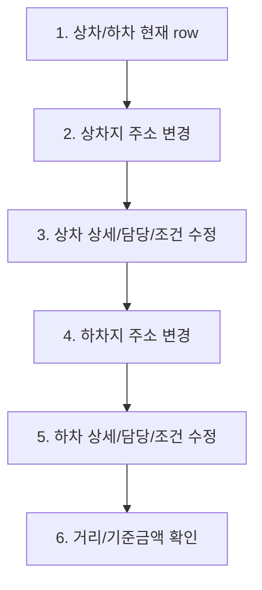

# 화물 수정 그룹 4. 운송 구간 수정 marker plan

## 목적

`edit-order.route-edit`는 선택된 화물의 상차/하차 운송 구간을 수정하는 화면 흐름입니다.

왼쪽 user flow에서는 하나의 그룹으로 유지하되, 가운데 preview에서는 상차와 하차의 주요 조작을 6개 part로 나눕니다. 이렇게 하면 상차/하차 row, 주소 dialog, inline edit, 거리/기준금액 확인 marker가 한 화면에 과밀하게 겹치는 문제를 줄일 수 있습니다.

## 기준 source

| source | 역할 |
| --- | --- |
| `../wireframes/final-handoff/source-snapshot/sections/transport-route/03-user-flow-transport-route.md` | 운송구간 사용자 흐름, 상차/하차 2행 구조, 수정 진입 기준 |
| `../wireframes/final-handoff/source-snapshot/sections/transport-route/04-field-state-mapping.md` | `RoutePoint`, `RouteCalculationReadiness`, 거리/기준금액 상태 기준 |
| `../wireframes/final-handoff/baseline/html/cargo-order-admin-hifi-master.html` | 현재 master UI와 실제 DOM anchor 기준 |
| `./16-edit-order-section-edit-flow-plan.md` | 화물 수정 7개 node 구조와 그룹 4 위치 |

## 범위

포함:

- 상차/하차 row 현재값 확인
- 상차/하차 주소 검색 dialog 진입
- 주소 후보 row 선택과 적용 전 preview 확인
- 상세주소, 담당, 연락처 inline edit
- 일시/방법 조건 cell 확인
- 주소 변경 후 거리/기준금액 확인 필요 상태 표시

제외:

- 실제 주소/거리 계산 API 호출
- 저장 API, pending, retry, server error
- 경유지, 독차/혼적, 긴급/왕복/예약 option의 상세 편집 UI
- 지도 provider 연동

## 6개 part 구조

| part id | label | markerKind | target | 설명 |
| --- | --- | --- | --- | --- |
| `edit-route.row-summary` | 상차/하차 현재 row | `form-section` | `#sec-route` | 선택 화물에 적용된 상차/하차 2행을 기준 상태로 확인 |
| `edit-route.load-address-dialog` | 상차지 주소 변경 | `dialog-surface` | `.dialog .rrow.cols-addr` | 상차 row의 행정주소 변경 진입, 결과 row와 선택 preview 확인 |
| `edit-route.load-inline-fields` | 상차 상세/담당/조건 수정 | `input-field` | 상차 row의 `상세주소` cell | 상세주소, 담당, 연락처는 inline edit, 일시/방법은 조건 cell로 수정 |
| `edit-route.unload-address-dialog` | 하차지 주소 변경 | `dialog-surface` | `.dialog .rrow.cols-addr` | 하차 row의 행정주소 변경 진입, 상차 주소를 덮어쓰지 않는지 확인 |
| `edit-route.unload-inline-fields` | 하차 상세/담당/조건 수정 | `input-field` | 하차 row의 `상세주소` cell | 하차 상세주소, 담당, 연락처, 일시, 방법 수정 위치 확인 |
| `edit-route.recalc-notice` | 거리/기준금액 확인 | `status-badge` | `#hdr-status` | 주소 변경 후 거리/기준금액 chip과 요약 stale 가능성 확인 |

## 상태 흐름

| 단계 | stateBefore | event | stateAfter | 화면 변화 |
| --- | --- | --- | --- | --- |
| 1 | `cargo-selected` | `reviewSelectedRouteRows` | `cargo-selected` | 상차/하차 row가 값 중심으로 표시됨 |
| 2 | `cargo-selected` | `openLoadAddressLookup` | `dialog-editing` | 상차지 주소 검색 dialog 표시 |
| 3 | `cargo-selected` | `editLoadRouteInlineFields` | `field-editing` | 상차 상세주소 cell이 inline input으로 전환 |
| 4 | `cargo-selected` | `openUnloadAddressLookup` | `dialog-editing` | 하차지 주소 검색 dialog 표시 |
| 5 | `cargo-selected` | `editUnloadRouteInlineFields` | `field-editing` | 하차 상세주소 cell이 inline input으로 전환 |
| 6 | `edit-applied` | `reviewRouteRecalculationState` | `cargo-selected` | header 거리/기준 chip과 요약 확인 필요 |

## Data Contract

| contract | 포함 항목 | 비고 |
| --- | --- | --- |
| `RouteSummary` | 상차/하차 2행 표시값 | 메인 화면에 적용된 현재값 |
| `RouteLocationDraft` | 주소 후보, 지명, 상세주소, 담당, 연락처 | 주소 dialog에서 선택 후 적용 전 preview |
| `RouteInlineEditDraft` | 상세주소, 담당, 연락처 수정값 | inline edit input에서 임시 보정 |
| `RouteConditionDraft` | 일시, 방법 | row의 조건 cell 또는 popover로 수정 |
| `RouteRecalcState` | 거리, 기준금액, stale 여부 | 실제 계산 호출은 보류 |
| `EditPatch` | 변경된 필드 목록 | 저장 API payload는 이 문서 범위에서 제외 |

## Validation / QA

| QA ID | 확인 항목 | 기준 |
| --- | --- | --- |
| `AC-ER-01` | 현재 row 표시 | 상차 row와 하차 row가 모두 표시됨 |
| `AC-ER-02` | row 구분 | 상차/하차 label과 값이 서로 섞이지 않음 |
| `AC-ER-03` | 주소 dialog | 상차/하차 주소 dialog가 각각 해당 side로 열림 |
| `AC-ER-04` | inline edit | 상세주소, 담당, 연락처 cell이 같은 위치에서 input으로 전환됨 |
| `AC-ER-05` | 조건 수정 | 일시/방법 cell은 row 안의 독립 조건으로 인식됨 |
| `AC-ER-06` | 재계산 확인 | 거리/기준금액은 변경 후 다시 확인해야 하는 read-only 결과로 설명됨 |

## 구현 기준

- `edit-order.route-edit`는 왼쪽 user flow에서 `bridge 연결` 상태로 표시합니다.
- bridge는 `edit-route.*` part를 찾을 때 live anchor가 없으면 marker를 숨기는 `pending-live` 정책을 따릅니다.
- route sample data 준비는 상차/하차 주소가 이미 있으면 다시 실행하지 않습니다.
- 같은 node 안에서 part를 이동할 때 부모 screenmap은 iframe을 다시 만들지 않고 `screenmap.select-part` message로 현재 iframe에 part 변경만 전달합니다.
- 실제 API 저장과 거리 계산 호출은 오른쪽 detail에서 보류 항목으로만 설명합니다.

## 현재 반영 상태

| 항목 | 상태 |
| --- | --- |
| 왼쪽 user flow status | 반영 |
| 가운데 6개 part preview | 반영 |
| 오른쪽 detail/QA/source link | 반영 |
| master bridge live anchor | 반영 |
| 실제 저장/계산 API 항목 | 제외 |
