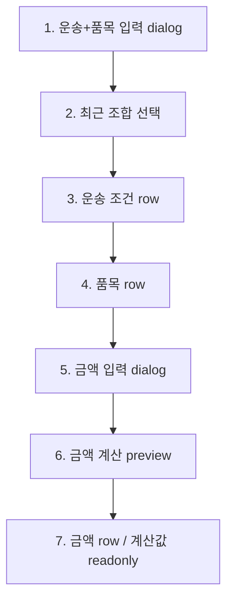

# 화물 수정 그룹 5. 운송+품목/금액 수정 marker plan

## 목적

`edit-order.cargo-money-edit`는 선택된 화물의 차량 조건, 품목, 금액 조건을 수정하는 흐름입니다.

왼쪽 user flow에서는 하나의 그룹으로 유지하되, 가운데 preview에서는 `운송+품목`과 `금액`의 조작 단위를 7개 part로 나눕니다. 운송 조건과 금액 조건은 화면상 같은 섹션 안에 있지만, 입력 dialog와 적용 후 row가 다르므로 marker를 분리합니다.

## 기준 source

| source | 역할 |
| --- | --- |
| `../wireframes/final-handoff/source-snapshot/sections/cargo-transport/04-field-state-mapping.md` | 운송 조건, 금액 조건, 품목 row, 계산값 상태 기준 |
| `../wireframes/final-handoff/source-snapshot/sections/cargo-transport/07-inline-edit-interaction-plan.md` | 적용 후 row의 inline edit interaction 기준 |
| `../wireframes/final-handoff/source-snapshot/sections/cargo-summary-docs/04-field-state-mapping.md` | 품목/중량 변경이 화물정보 요약에 미치는 영향 |
| `../wireframes/final-handoff/baseline/html/cargo-order-admin-hifi-master.html` | 현재 master UI와 실제 DOM anchor 기준 |
| `./16-edit-order-section-edit-flow-plan.md` | 화물 수정 7개 node 구조와 그룹 5 위치 |

## 범위

포함:

- 운송+품목 입력 dialog 진입
- 톤수, 차종, 대수, 실중량, 품목 입력 필드 확인
- 최근 사용 조합 선택 위치 확인
- 적용 후 운송 조건 row와 품목 row 확인
- 금액 입력 dialog 진입
- 결제방법, 청구비용, 운송비용, 수수료, 조정금 입력 위치 확인
- 금액 계산 preview와 적용 후 금액 row 확인
- 수익/차주운임 계산값 read-only 구분

제외:

- 실제 저장 API, pending, retry, server error
- 정산 시스템 연동
- 금액 변경 승인 흐름
- 세금계산서/인수증 발행 연동
- 지도/거리 계산 API 호출

## 7개 part 구조

| part id | label | markerKind | target | 설명 |
| --- | --- | --- | --- | --- |
| `edit-cargo-money.transport-dialog` | 운송+품목 입력 dialog | `dialog-surface` | `#ci-ton`, `#ci-type`, `#ci-item` | 톤수, 차종, 대수, 실중량, 품목 입력 위치 |
| `edit-cargo-money.recent-combo` | 최근 조합 선택 | `result-row` | `#cargo-recent-results .rrow` | 최근 사용 조합은 입력폼만 채우고 즉시 적용하지 않음 |
| `edit-cargo-money.transport-row` | 운송 조건 row | `form-section` | `#sec-cargo-transport .irow--cond` | 적용 후 톤수, 차종, 대수, 실중량 확인 |
| `edit-cargo-money.item-row` | 품목 row | `input-field` | `#sec-cargo-transport .irow--item` | 품목은 운송+품목 박스의 2번째 row로 유지 |
| `edit-cargo-money.money-dialog` | 금액 입력 dialog | `dialog-surface` | `#mi-pay`, `#mi-charge`, `#mi-haul` | 결제방법, 청구비용, 운송비용, 수수료, 조정금 입력 위치 |
| `edit-cargo-money.money-preview` | 금액 계산 preview | `status-badge` | `#mi-formula` | 결제방법별 `수익` 또는 `차주운임` 계산 preview |
| `edit-cargo-money.money-row` | 금액 row / 계산값 readonly | `form-section` | `#sec-cargo-money .irow--money` | 적용 후 금액 row와 계산값 read-only 구분 |

## 상태 흐름

| 단계 | stateBefore | event | stateAfter | 화면 변화 |
| --- | --- | --- | --- | --- |
| 1 | `cargo-selected` | `openCargoInput` | `dialog-editing` | 운송+품목 입력 dialog 표시 |
| 2 | `dialog-editing` | `pickCargoRecent` | `dialog-editing` | 최근 조합 선택, 입력폼 값만 갱신 |
| 3 | `dialog-editing` | `applyCargo` | `field-editing` | 운송 조건 row 표시 |
| 4 | `field-editing` | `editCargoItemInline` | `field-editing` | 품목 row의 inline edit 위치 확인 |
| 5 | `field-editing` | `openMoneyInput` | `dialog-editing` | 금액 입력 dialog 표시 |
| 6 | `dialog-editing` | `moneyPreview` | `dialog-editing` | 계산 preview 갱신 |
| 7 | `dialog-editing` | `applyMoney` | `field-editing` | 금액 row와 read-only 계산값 표시 |

## Data Contract

| contract | 포함 항목 | 비고 |
| --- | --- | --- |
| `VehicleRequirement` | 톤수, 차종, 대수, 실중량 | 기준금액 재계산 후보 |
| `CargoDetail` | 품목명, 실제 중량 | 화물정보 요약 원본 |
| `Pricing` | 결제방법, 청구비용, 운송비용, 수수료, 계산값 | 금액 row 표시 원본 |
| `PricingAdjustment` | 조정 사유, 조정 대상, 조정 금액, 설명 | 금액 로그와 연결되지만 실제 로그 저장은 제외 |
| `EditPatch` | 변경된 필드 목록 | 저장 API payload는 이 문서 범위에서 제외 |

## Validation / QA

| QA ID | 확인 항목 | 기준 |
| --- | --- | --- |
| `AC-ECM-01` | 운송+품목 dialog | 톤수, 차종, 대수, 실중량, 품목 필드가 표시됨 |
| `AC-ECM-02` | 최근 조합 | 최근 조합 선택은 입력폼만 바꾸고 row에는 즉시 반영하지 않음 |
| `AC-ECM-03` | 운송 조건 row | 적용 후 톤수, 차종, 대수, 실중량 row가 표시됨 |
| `AC-ECM-04` | 품목 row | 품목이 금액 row가 아니라 운송+품목의 2번째 row로 표시됨 |
| `AC-ECM-05` | 금액 dialog | 결제방법, 청구비용, 운송비용, 수수료, 조정금 필드가 표시됨 |
| `AC-ECM-06` | 금액 preview | 인수증은 `수익`, 그 외 조건은 `차주운임` 계산 preview를 표시함 |
| `AC-ECM-07` | 계산값 readonly | 적용 후 수익/차주운임은 직접 수정 대상처럼 보이지 않음 |

## 구현 기준

- `edit-order.cargo-money-edit`는 왼쪽 user flow에서 `bridge 연결` 상태로 표시합니다.
- bridge는 `edit-cargo-money.*` part를 찾을 때 live anchor가 없으면 marker를 숨기는 `pending-live` 정책을 따릅니다.
- 운송+품목 sample data가 이미 있으면 `applyCargo()`를 반복 실행하지 않습니다.
- 금액 sample data가 이미 있으면 `applyMoney()`를 반복 실행하지 않습니다.
- 같은 node 안에서 part를 이동할 때 부모 screenmap은 iframe을 다시 만들지 않고 `screenmap.select-part` message로 현재 iframe에 part 변경만 전달합니다.
- 실제 API 저장과 정산 연동은 오른쪽 detail에서 보류 항목으로만 설명합니다.

## 현재 반영 상태

| 항목 | 상태 |
| --- | --- |
| 왼쪽 user flow status | 반영 |
| 가운데 7개 part preview | 반영 |
| 오른쪽 detail/QA/source link | 반영 |
| master bridge live anchor | 반영 |
| 실제 저장/정산 API 항목 | 제외 |
