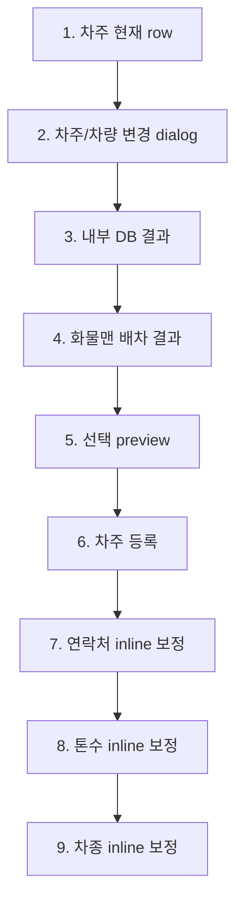

# 화물 수정 그룹 6. 차주 정보 수정 marker plan

## 목적

`edit-order.driver-edit`는 선택된 화물의 차주/차량 정보를 수정하는 흐름입니다.

왼쪽 user flow에서는 하나의 그룹으로 유지하되, 가운데 preview에서는 현재 row, 차주/차량 변경 dialog, 내부 DB 결과, 화물맨 배차 결과, 선택 preview, 차주 등록, 연락처 보정, 톤수 보정, 차종 보정을 9개 part로 나눕니다. 이렇게 하면 신규 접수의 차주 선택 흐름과 겹치지 않으면서도, 화물 수정에서 실제로 확인해야 하는 row 변경과 보정 가능 항목을 따로 설명할 수 있습니다.

## 기준 source

| source | 역할 |
| --- | --- |
| `../wireframes/final-handoff/source-snapshot/sections/driver-info/README.md` | 차주 정보 섹션 목표, Phase 1/Phase 2 결정, 입력 전/적용 후 구조 |
| `../wireframes/final-handoff/source-snapshot/sections/driver-info/03-user-flow-driver-info.md` | 차주/차량 변경, 차주 등록, inline 보정 user flow |
| `../wireframes/final-handoff/source-snapshot/sections/driver-info/04-field-state-mapping.md` | 차주명, 차량번호, 연락처, 톤수, 차종의 수정 가능성 |
| `../wireframes/final-handoff/source-snapshot/sections/driver-info/05-b-integration-guide.md` | 내부 DB 조회와 화물맨 배차 결과가 공존하는 dialog 기준 |
| `../wireframes/final-handoff/baseline/html/cargo-order-admin-hifi-master.html` | 현재 master UI와 실제 DOM anchor 기준 |
| `./16-edit-order-section-edit-flow-plan.md` | 화물 수정 7개 node 구조와 그룹 6 위치 |

## 범위

포함:

- 적용된 차주 row 현재값 확인
- 차주/차량 통합 조회 dialog 진입
- 내부 DB 결과 목록 확인
- 화물맨 배차 결과 상단 고정 박스 확인
- 선택 차주/차량 preview 확인
- 차주 등록 form 위치 확인
- 차주 연락처, 톤수, 차종 inline 보정 위치 확인

제외:

- 실제 화물맨 API 요청, 취소, callback
- 내부 DB 저장 API, 중복 검증 API
- 차량번호 검증 실패 처리
- 차주 마스터 저장 위치 결정
- 운송 조건의 톤수/차종과 차주 차량 스펙 mismatch 정책

## 9개 part 구조

| part id | label | markerKind | target | 설명 |
| --- | --- | --- | --- | --- |
| `edit-driver.row-summary` | 차주 현재 row | `form-section` | `#driver-db .driver-grid` | 적용된 차주명, 차량번호, 연락처, 톤수, 차종, 출처 확인 |
| `edit-driver.change-dialog` | 차주/차량 변경 dialog | `dialog-surface` | `.dialog #driver-results` | 통합 조회 dialog 진입과 검색/필터/적용 footer 확인 |
| `edit-driver.internal-result` | 내부 DB 결과 | `result-row` | `#driver-results .int-block .rrow` | 내부 DB 차주/차량 후보 선택 |
| `edit-driver.hwamulman-result` | 화물맨 배차 결과 | `result-box` | `#driver-results .ext-group` | 검색어와 무관하게 상단 고정되는 화물맨 배차 결과 박스 |
| `edit-driver.selected-preview` | 선택 preview | `detail-panel` | `#dlg-preview .pcard` | 선택한 차주명, 차량번호, 연락처, 톤수, 차종, 출처, 상태 확인 |
| `edit-driver.register-form` | 차주 등록 | `detail-panel` | `#dlg-preview .pform` | 신규 차주 등록 form 위치와 적용 전 상태 확인 |
| `edit-driver.contact-inline` | 연락처 inline 보정 | `input-field` | `#driver-db .driver-grid .cell--edit` 중 `연락처` | 현재 오더 기준 연락처 보정 |
| `edit-driver.ton-inline` | 톤수 inline 보정 | `input-field` | `#driver-db .driver-grid .cell--edit` 중 `톤수` | 현재 오더 기준 차량 톤수 보정 |
| `edit-driver.type-inline` | 차종 inline 보정 | `input-field` | `#driver-db .driver-grid .cell--edit` 중 `차종` | 현재 오더 기준 차량 차종 보정 |

## 상태 흐름

| 단계 | stateBefore | event | stateAfter | 화면 변화 |
| --- | --- | --- | --- | --- |
| 1 | `cargo-selected` | `reviewDriverRow` | `cargo-selected` | 적용된 차주 row 표시 |
| 2 | `cargo-selected` | `openDriverLookup` | `dialog-editing` | 차주/차량 통합 조회 dialog 표시 |
| 3 | `dialog-editing` | `driverSearch` | `dialog-editing` | 내부 DB 결과 row 표시 |
| 4 | `dialog-editing` | `driverSetMode("hm")` | `dialog-editing` | 화물맨 배차 결과 박스 상단 고정 |
| 5 | `dialog-editing` | `pickDriverRow` | `dialog-editing` | 선택 preview 갱신, 적용 버튼 활성화 |
| 6 | `dialog-editing` | `driverRegister` | `dialog-editing` | preview 대신 차주 등록 form 표시 |
| 7 | `cargo-selected` | `editDriverContactInline` | `field-editing` | 연락처 cell이 input으로 전환 |
| 8 | `cargo-selected` | `editDriverTonInline` | `field-editing` | 톤수 cell이 select로 전환 |
| 9 | `cargo-selected` | `editDriverTypeInline` | `field-editing` | 차종 cell이 select로 전환 |

## Data Contract

| contract | 포함 항목 | 비고 |
| --- | --- | --- |
| `DriverAssignment` | 차주명, 차량번호, 연락처, 톤수, 차종, 출처 | 적용된 row와 dialog preview의 공통 원본 |
| `DriverLookupCandidate` | 내부 DB 후보와 화물맨 배차 후보 | 실제 조회 API는 제외 |
| `DriverRegisterDraft` | 차주명, 차량번호, 연락처, 톤수, 차종 | 신규 등록 form의 임시 입력값 |
| `DriverInlineEditDraft` | 연락처, 톤수, 차종 보정값 | 현재 오더 기준 임시 수정 |
| `HwamulmanDriverState` | 연동중, 배차완료, 취소중, 취소실패 | 화면 상태 설명만 포함 |
| `EditPatch` | 변경된 필드 목록 | 저장 API payload는 이 문서 범위에서 제외 |

## Validation / QA

| QA ID | 확인 항목 | 기준 |
| --- | --- | --- |
| `AC-ED-01` | 현재 row 표시 | 차주명, 차량번호, 연락처, 톤수, 차종, 출처가 표시됨 |
| `AC-ED-02` | 변경 dialog | 차주/차량 통합 조회 dialog가 열림 |
| `AC-ED-03` | 내부 DB 결과 | 내부 DB 결과 row가 선택 가능한 목록으로 보임 |
| `AC-ED-04` | 화물맨 결과 | 화물맨 배차 결과 박스가 dialog 상단에 고정됨 |
| `AC-ED-05` | 선택 preview | row 선택 후 preview와 적용 버튼 상태가 갱신됨 |
| `AC-ED-06` | 차주 등록 | 등록 form과 선택 preview가 동시에 보이지 않음 |
| `AC-ED-07` | 연락처 inline 보정 | 연락처는 적용 후 row에서 input으로 보정 가능 |
| `AC-ED-08` | 톤수 inline 보정 | 톤수는 적용 후 row에서 select로 보정 가능 |
| `AC-ED-09` | 차종 inline 보정 | 차종은 적용 후 row에서 select로 보정 가능 |

## 구현 기준

- `edit-order.driver-edit`는 왼쪽 user flow에서 `bridge 연결` 상태로 표시합니다.
- bridge는 `edit-driver.*` part를 찾을 때 live anchor가 없으면 marker를 숨기는 `pending-live` 정책을 따릅니다.
- 차주 row sample data가 이미 있으면 `applyDriver()`를 반복 실행하지 않습니다.
- dialog part 사이를 이동할 때는 dialog를 닫지 않고 내부 DB, 화물맨, preview, 등록 상태만 전환합니다.
- row/inline part로 이동할 때는 dialog를 닫고 적용된 row를 기준으로 marker를 표시합니다.
- 실제 API 저장, 화물맨 연동, 내부 DB 등록은 오른쪽 detail에서 보류 항목으로만 설명합니다.

## 현재 반영 상태

| 항목 | 상태 |
| --- | --- |
| 왼쪽 user flow status | 반영 |
| 가운데 9개 part preview | 반영 |
| 오른쪽 detail/QA/source link | 반영 |
| master bridge live anchor | 반영 |
| 실제 저장/화물맨/API 항목 | 제외 |
