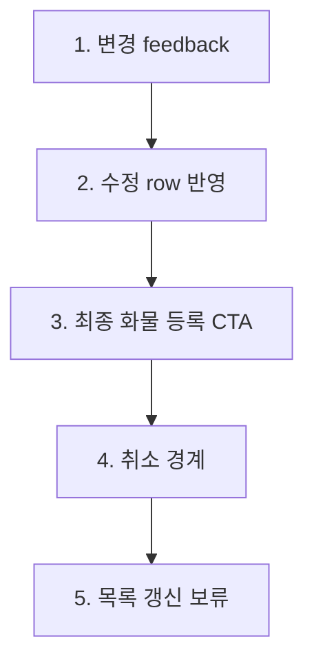

# 화물 수정 그룹 7. 수정값 반영 확인 marker plan

## 목적

`edit-order.apply-review`는 화물 수정 흐름의 마지막 확인 node입니다.

왼쪽 user flow에서는 하나의 그룹으로 유지하되, 가운데 preview에서는 수정값이 메인 화면에 반영되었는지, 최종 `화물 등록` CTA가 보이는지, 취소 시 이전 값 유지 경계가 어디인지, 목록 row 갱신이 아직 보류 정책인지 확인합니다.

## 기준 source

| source | 역할 |
| --- | --- |
| `./16-edit-order-section-edit-flow-plan.md` | 화물 수정 7개 node 구조, 적용/취소와 목록 반영 flow |
| `../wireframes/final-handoff/source-snapshot/root-docs/01-screen-map.md` | 메인 화면, 목록, actionbar 기준 |
| `../wireframes/final-handoff/source-snapshot/root-docs/02-field-inventory.md` | 목록 row와 표시 전용 field 기준 |
| `../wireframes/final-handoff/source-snapshot/sections/new-order-registration-flow/05-state-and-interaction-matrix.md` | `edit-applied`, `edit-cancelled`, pre-API CTA 경계 설명 |
| `../wireframes/final-handoff/baseline/html/cargo-order-admin-hifi-master.html` | 현재 master UI와 실제 DOM anchor 기준 |

## 범위

포함:

- 독립 수정 적용 후 status feedback 확인
- 수정된 row가 메인 화면에 반영되는지 확인
- 최종 `화물 등록` CTA가 보이는지 확인
- 수정 dialog에서 `취소` 버튼이 저장 전 경계인지 확인
- 목록 row 갱신 시점이 아직 보류 정책임을 표시

제외:

- 실제 저장 API, validation API, pending, retry, server error
- 목록 row 실제 재조회 또는 optimistic update
- 동시 수정 충돌 처리
- 수정 이력/감사 로그 저장
- 하단 cargo-list 실제 고밀도 테이블 구현

## 5개 part 구조

| part id | label | markerKind | target | 설명 |
| --- | --- | --- | --- | --- |
| `edit-apply-review.change-feedback` | 변경 feedback | `status-badge` | `.new-order-flow-status.is-visible` | 독립 수정 적용 후 반영 안내 message |
| `edit-apply-review.updated-row` | 수정 row 반영 | `form-section` | `#sec-cargo-transport .irow--cond` | 샘플로 운송+품목 수정값이 메인 row에 반영된 상태 |
| `edit-apply-review.final-submit-cta` | 최종 화물 등록 CTA | `action-button` | `.new-order-main-submit.is-visible` | 실제 저장 API 전 최종 버튼 표시 |
| `edit-apply-review.cancel-boundary` | 취소 경계 | `action-button` | `.dialog__foot-actions .btn--secondary` 중 `취소` | dialog에서 취소하면 적용 전 row 유지 |
| `edit-apply-review.list-update-pending` | 목록 갱신 보류 | `status-badge` | `.actionbar` | 하단 목록 row 갱신 시점은 아직 확인 필요 |

## 상태 흐름

| 단계 | stateBefore | event | stateAfter | 화면 변화 |
| --- | --- | --- | --- | --- |
| 1 | `cargo-selected` | `applyIndependentEdit` | `edit-applied` | 수정 반영 status feedback 표시 |
| 2 | `edit-applied` | `reviewUpdatedRow` | `edit-applied` | 메인 row 값 갱신 확인 |
| 3 | `edit-applied` | `reviewFinalSubmitCta` | `edit-applied` | 최종 `화물 등록` CTA 표시 |
| 4 | `cargo-selected` | `openEditDialogAndCancel` | `edit-cancelled` | 취소 버튼은 저장 전 경계로 표시 |
| 5 | `edit-applied` | `reviewListUpdatePolicy` | `edit-applied` | 목록 row 갱신 시점은 `[확인 필요]`로 유지 |

## Data Contract

| contract | 포함 항목 | 비고 |
| --- | --- | --- |
| `EditPatch` | 변경된 field id, 이전 값, 새 값 | 실제 저장 payload는 제외 |
| `EditFeedbackState` | status message, tone, target row | 화면 feedback 표시용 |
| `CargoOrderDraft` | 현재 메인 화면의 최신 값 | 최종 CTA 전 draft 상태 |
| `ListRefreshPolicy` | 즉시 갱신, 저장 후 갱신, 재조회 필요 여부 | 아직 확인 필요 |
| `EditCancelPolicy` | dialog 취소, inline Escape, 이전 값 유지 | 실제 undo stack은 제외 |

## Validation / QA

| QA ID | 확인 항목 | 기준 |
| --- | --- | --- |
| `AC-EAR-01` | 변경 feedback | 수정 적용 후 status feedback이 표시됨 |
| `AC-EAR-02` | 수정 row 반영 | 적용한 수정값이 메인 row에 표시됨 |
| `AC-EAR-03` | 최종 CTA | 최종 `화물 등록` CTA가 보임 |
| `AC-EAR-04` | 취소 경계 | dialog의 `취소`는 적용 전 값을 유지하는 경계로 설명됨 |
| `AC-EAR-05` | 목록 갱신 보류 | 목록 row 갱신 시점은 실제 API 정책 확정 전까지 보류로 표시됨 |

## 구현 기준

- `edit-order.apply-review`는 왼쪽 user flow에서 `bridge 연결` 상태로 표시합니다.
- bridge는 `edit-apply-review.*` part를 찾을 때 live anchor가 없으면 marker를 숨기는 `pending-live` 정책을 따릅니다.
- apply-review sample state는 운송+품목 독립 수정 적용을 1회 실행해 준비합니다.
- 같은 node 안에서 part 이동 시 이미 준비된 반영 상태가 있으면 `applyCargo()`를 반복 실행하지 않습니다.
- 취소 경계 part만 별도로 dialog를 열고, 다른 part로 이동하면 dialog를 닫은 뒤 반영 상태를 보여줍니다.
- 하단 cargo-list는 core view에서 계속 숨기며, 목록 갱신 보류는 actionbar/오른쪽 detail에서 설명합니다.
- 실제 저장/API, 목록 재조회, pending/retry/server error는 오른쪽 detail에서 보류 항목으로만 설명합니다.

## 현재 반영 상태

| 항목 | 상태 |
| --- | --- |
| 왼쪽 user flow status | 반영 |
| 가운데 5개 part preview | 반영 |
| 오른쪽 detail/QA/source link | 반영 |
| master bridge live anchor | 반영 |
| 실제 저장/API/목록 재조회 | 제외 |
