# Source Of Truth Map

> 목적: 산출물 간 기준 관계를 명확히 하여 이후 high fidelity, 구현, 정리 작업에서 혼선을 줄입니다.

## 기준 레이어

| 레이어 | 기준본 | 설명 |
| --- | --- | --- |
| 원본 화면 분석 | `C:\Work\Dev\Design\.plans\wireframes\cargo-order-admin-20260430\01-screen-map.md` 외 `01~06` | 최초 캡처 기반 정보 구조와 필드 목록 |
| 섹션 기획 | `C:\Work\Dev\Design\.plans\wireframes\cargo-order-admin-20260430\sections` | 섹션별 PRD, wireframe, flow, mapping |
| 기획 통합 HTML | `C:\Work\Dev\Design\.plans\wireframes\cargo-order-admin-20260430\results\wireframe\order-register-new2.0\Cargo Order Wireframe B Original Tone.html` | 현재 B 통합안의 주 기준 |
| 컴포넌트 통일 규칙 | `C:\Work\Dev\Design\.plans\wireframes\cargo-order-admin-20260430\results\wireframe\order-register-new2.0\component-unification-plan` | label mode, hover/focus, placeholder, 버튼 규칙 |
| 구현 clean 참조 | `C:\Work\Dev\Design\.plans\wireframes\cargo-order-admin-20260430\results\wireframe\order-register-new2.0\Cargo Order B Implementation Clean.html` | 기획 문구 제거 후 구현 화면 성격 |
| 디자인 고도화 입력 | `C:\Work\Dev\Design\.plans\wireframes\cargo-order-admin-20260430\claude-design-v2` | AI high fidelity 작업 입력 패키지 |
| 통합 HiFi master | `C:\Work\Dev\Design\.plans\wireframes\cargo-order-admin-20260430\results\html\cargo-order-admin-hifi-master.html` | 현재 통합 HiFi source of truth. 신규 접수 플로우, 보조 정보 탭, 최근 사용 리스트, 최신 디자인 피드백, 배차 담당자 header chip 반영 |
| 신규 HiFi 초기 결과 | `C:\Work\Dev\Design\.plans\wireframes\cargo-order-admin-20260430\results\html\화물 오더 접수수정 (오프라인).html` | 과거 시각 고도화 기준 후보. 현재 최종 안내 기준은 master 파일 |

## 섹션별 기준 문서

| 섹션 | 기준 문서/HTML | 현재 판단 |
| --- | --- | --- |
| 화주 정보 | `sections\shipper-info\README.md`, `shipper-info-section-wireframe.html` | 기준본 |
| 운송구간 | `sections\transport-route\README.md`, `transport-route-address-apply-layouts.html` | 기준본 |
| 화물 운송정보 | `sections\cargo-transport\README.md`, `cargo-transport-section-f-wireframe.html` | 기준본 |
| 화물정보 요약 | `sections\cargo-summary-docs\README.md`, `cargo-summary-docs-section-wireframe.html` | 기준본 |
| 차주 정보 | `sections\driver-info\README.md`, `driver-info-hwamulman-phase2-wireframe.html` | 기준본 |
| 화물 목록 | `sections\cargo-list\00-package-plan.md` | 진행 중 기준 후보 |

## 관계 정리

```mermaid
flowchart TD
  A["원본 캡처 및 01~06 분석 문서"] --> B["섹션별 기획 패키지"]
  B --> C["B Original Tone 통합안"]
  C --> D["Clean 구현 참조"]
  D --> E["Component Unification Plan"]
  B --> F["claude-design-v2 입력 패키지"]
  C --> F
  E --> F
  F --> G["신규 HiFi HTML"]
  G --> H["통합 HiFi master"]
  H --> I["후속 섹션은 master에 병합"]
```

## 기준본 승격 규칙

신규 HiFi HTML이 기준본이 되려면 아래 조건이 필요합니다.

1. B Original Tone의 섹션 구조를 보존해야 합니다.
2. Clean에서 확정한 컴포넌트 상태 규칙을 따라야 합니다.
3. 화주, 운송구간, 화물 운송정보, 화물정보 요약, 차주 정보, 화물 목록의 필드 누락이 없어야 합니다.
4. 다이얼로그와 인라인 수정 흐름이 기존 기획과 충돌하지 않아야 합니다.
5. 고도화 디자인 변경이 업무 흐름을 가리지 않아야 합니다.

## 2026-06-18 최신 결론

현재 통합 HiFi 기준 파일은 `results/html/cargo-order-admin-hifi-master.html`입니다.

이 파일은 신규 접수 flow, 보조 정보 탭, 운송 관련 최근 사용 리스트, 디자인 피드백 정리, 배차 담당자 header chip을 포함합니다. 과거 후보 HTML은 비교와 rollback 참고용으로 유지하되, 사용자와 후속 세션에는 master 파일을 기준으로 안내합니다.

| 범위 | 기준 |
| --- | --- |
| 현재 통합 HiFi 확인 | `results/html/cargo-order-admin-hifi-master.html` |
| 신규 접수 flow | 같은 master 파일에서 `신규(F3)` 클릭 |
| 보조 정보 데이터 있음/없음 | 같은 master 파일의 기본 상태와 신규 접수 초기화 상태 |
| 운송 관련 최근 사용 | 같은 master 파일의 `주소 검색`, `운송+품목 입력` 다이얼로그 |
| 라벨 표시/숨김과 배차 담당자 | 같은 master 파일의 header 상태 영역 |
| 상세 섹션 기획 source of truth | `sections/*` |
| 최신 반영 로그 | `08-reservation-area-tabs-integration-log.md`, `09-transport-dialog-recent-lists-integration-log.md`, `10-hifi-design-polish-and-dispatch-manager-integration-log.md` |

## 2026-06-16 이전 결론

신규 HiFi HTML은 `시각 고도화 기준본`으로 조건부 승격합니다.  
다만 `구현 기준본`이나 `유일한 source of truth`로는 승격하지 않습니다.

| 범위 | 기준 |
| --- | --- |
| 시각 톤, 토큰, 섹션 헤더, 전역 액션 그룹 | 신규 HiFi HTML |
| 업무 필드, 상태, 상세 기획 | `sections/*` |
| interaction/data hook, dialog 접근성 계약 | `Cargo Order B Implementation Clean.html` |
| 기존 B 통합 구조와 하단 목록 기준 | `Cargo Order Wireframe B Original Tone.html` |
| 접수/수정 섹션 후속 기획 | `sections/order-entry-edit` |
| cargo-list | 후순위 보류 |

승격 근거와 제한 사항은 `artifact-audit/hifi-promotion-review-2026-06-16.md`를 기준으로 봅니다.
