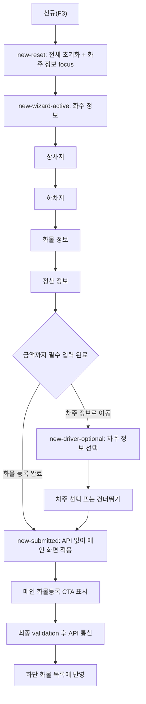
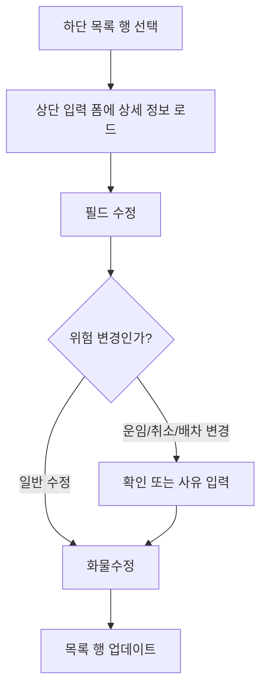

# 03. 와이어프레임

## 목표

이 문서는 새 디자인을 만들기 전, 현재 화면의 업무 정보를 놓치지 않기 위한 와이어프레임입니다. 여기서는 시각 디자인보다 `어떤 정보가 어느 그룹에 있어야 하는지`를 우선합니다.

## 현재 화면 기준 와이어프레임

```text
┌──────────────────────────────────────────────────────────────────────────────┐
│ 프로그램명 / 사업자 / 버전 / 화면명                                           │
├──────────────────────────────────────────────────────────────────────────────┤
│ 기본정보 | 고객관리 | 오더관리 | SMS관리 | 예치금관리 | 정산관리 | 설정 ...     │
├──────────────────────────────────────────────────────────────────────────────┤
│ [지역검색] [신버전오더접수] [구버전오더접수] 예치금 [안내문] 쪽지 [종료]       │
├──────────────────────────────────────────────────────────────────────────────┤
│ (즉시표시) (차주앱 표시일시)  거리/금액  실시간운송료  문의전화  광고  현황    │
├──────────────────────────────────────────────┬───────────────────────────────┤
│ 오더 기본 입력                               │ 배차/일시/의뢰자               │
│ ┌──────────────────────────────────────────┐ │ ┌───────────────────────────┐ │
│ │ 상차지: 지역1 지역2 지역3 상세주소 [검색] │ │ │ [독차] [혼적] [선택]        │ │
│ │ 하차지: 지역1 지역2 지역3 상세주소 [검색] │ │ │ [긴급] [왕복] [예약] [경유] │ │
│ │ 톤수 / 광폭 / 차종 / 추가차종 / 도착 / 대수│ │ └───────────────────────────┘ │
│ │ 운송비구분 / 운송료 / 수수료 / 합계        │ │ ┌───────────────────────────┐ │
│ │ 추가정보                                  │ │ │ 상차방법: 장비 체크         │ │
│ │ 화물정보 메모                             │ │ │ 상차일시: 지금/당일/내일... │ │
│ │ 화물중량 / 안내문                         │ │ │ 하차방법: 장비 체크         │ │
│ │ 증빙 옵션 / 이사화물 / 산재보험 주의       │ │ │ 하차일시: 당일/내일/월착... │ │
│ │ 차주명 / 차량번호 / 차주전화              │ │ └───────────────────────────┘ │
│ └──────────────────────────────────────────┘ │ ┌───────────────────────────┐ │
│                                              │ │ 의뢰자명 / 구분 / 사업자번호│ │
│                                              │ │ 도착 연락처 / 점검          │ │
│                                              │ │ 주선약관 수수료율 표        │ │
│                                              │ └───────────────────────────┘ │
├──────────────────────────────────────────────┴───────────────────────────────┤
│ [신규] [화물등록] [화물수정] [화물복사] [화물취소] [배차취소] ...              │
├──────────────────────────────────────────────────────────────────────────────┤
│ 날짜 | 전체/접수/완료 | 검색기준 | 검색어 | 검색 | 페이징 | 정렬 | 표시 설정   │
├──────────────────────────────────────────────────────────────────────────────┤
│ 화물 목록 테이블                                                               │
│ ID | 처리시간 | 상태 | 상차지 | 하차지 | 화물정보 | 운송료 | 차주 | 차량 ...   │
└──────────────────────────────────────────────────────────────────────────────┘
```

## 확정 개선 방향

확정안은 기존 `대안 B. 2열 유지 + 업무 의미 묶음 정리형`입니다. 이 문서에서는 A/C/D 비교안을 걷어내고, B안을 실제 개선 기준으로 사용합니다.

목표는 현재 화면의 큰 골격을 유지하는 것입니다. 사용자가 이미 익숙한 `상단 입력/수정 영역 + 하단 목록 영역` 구조를 유지하고, 바꾸는 범위는 `시각적 그룹화`, `위험 액션 분리`, `중복 정보 정리`, `목록 가독성 개선` 정도로 제한합니다.

## 변경 최소화 원칙

| 원칙 | 설명 |
| --- | --- |
| 상하 구조 유지 | 상단은 개별 화물 입력/수정, 하단은 등록 화물 목록으로 유지 |
| 좌우 구조 유지 | 좌측은 운송 구간/화물/차주 정보, 우측은 배차/상하차/화주/수수료율 조건으로 유지 |
| 업무 단축키 유지 | `신규(F3)`, 등록, 수정, 취소 흐름은 기존 위치와 의미를 유지 |
| 한 화면 정보량 유지 | 숙련자의 빠른 입력을 위해 핵심 필드는 숨기지 않음 |
| 변화는 라벨과 묶음 중심 | 필드 위치를 크게 옮기기보다 섹션 제목, 간격, 강조만 조정 |
| 최근 사용은 다이얼로그 내부 보조 상태 | 상하차지와 운송+품목 반복 입력을 줄이되 기존 검색/입력/적용 흐름은 유지 |

## 확정 와이어프레임

기존의 좌우 2열 구조는 유지하되, 각 열 내부를 업무 의미에 맞게 정리합니다. 화면이 크게 달라 보이지 않으면서도 `무엇이 운송 조건이고, 무엇이 요약/증빙/차주/화주/수수료 금액/수수료율인지` 더 분명해지는 형태입니다.

```text
┌──────────────────────────────────────────────────────────────────────────────┐
│ Header / 메뉴 / 상태 영역 / 배차 담당자 / 라벨 표시                            │
├──────────────────────────────────────────────────────────────────────────────┤
│ 상태 chip | 거리·기준금액 | 배차 담당자 | 라벨 표시 | 문의 | 현황              │
├──────────────────────────────────────────────┬───────────────────────────────┤
│ 좌측: 오더 입력                              │ 우측: 배차·상하차·화주 조건     │
│ ┌ 운송 구간 ───────────────────────────────┐ │ ┌ 배차 유형 ────────────────┐ │
│ │ 상차지 / 하차지                           │ │ │ 독차/혼적, 긴급/왕복/예약 │ │
│ └──────────────────────────────────────────┘ │ └───────────────────────────┘ │
│ ┌ 화물 운송정보 ───────────────────────────┐ │ ┌ 상차 조건 ────────────────┐ │
│ │ 톤수 / 차종 / 도착 / 대수 / 품목           │ │ │ 상차방법 / 상차일시        │ │
│ │ 운송비구분 / 운송료 / 수수료 / 합계        │ │ │ 상차지 전화 / 초기화       │ │
│ └──────────────────────────────────────────┘ │ └───────────────────────────┘ │
│ ┌ 화물 요약·중량·증빙 ─────────────────────┐ │ ┌ 하차 조건 ────────────────┐ │
│ │ 화물정보 요약 / 중량(톤수 110%)           │ │ │ 하차방법 / 하차일시        │ │
│ │ 전자세금계산서 / 인수증 / 이사화물         │ │ │ 보험료 / 당착·내착         │ │
│ └──────────────────────────────────────────┘ │ └───────────────────────────┘ │
│ ┌ 차주 정보 ───────────────────────────────┐ │ ┌ 화주 정보 ────────────────┐ │
│ │ 차주명 / 차량번호 / 차주 연락처           │ │ │ 의뢰자명 / 구분 / 사업자번호│ │
│ └──────────────────────────────────────────┘ │ │ 도착 연락처 / 점검         │ │
│                                              │ └───────────────────────────┘ │
│                                              │ ┌ 수수료율 정보 ────────────┐ │
│                                              │ │ 주선약관 수수료율          │ │
│                                              │ └───────────────────────────┘ │
├──────────────────────────────────────────────┴───────────────────────────────┤
│ 액션 바: 신규 | 등록 | 수정 | 복사 | 취소 | 배차취소 | 엑셀 | 인쇄 | 정산       │
├──────────────────────────────────────────────────────────────────────────────┤
│ 목록 컨트롤: 날짜 | 상태 탭 | 검색 | 페이징 | 정렬 | 컬럼 저장 | 글씨 크기      │
├──────────────────────────────────────────────────────────────────────────────┤
│ 화물 목록 테이블                                                               │
└──────────────────────────────────────────────────────────────────────────────┘
```

## 정보 묶음 정의

| 묶음 | 포함 항목 | 정리 이유 |
| --- | --- |
| 운송 구간 | 상차지, 하차지, 주소 검색, 최근 장소 후보 | 운임, 거리, 배차 조건의 기준이 되는 최상위 정보 |
| 화물 정보 | 톤수, 차종, 대수, 품목, 화물정보, 중량, 최근 운송+품목 조합 | 실제 운송에 필요한 차량/화물 조건 |
| 정산 정보 | 운송비구분, 운송료, 수수료, 합계 | 고객 청구와 차주 지급의 기준이 되는 금액 조건 |
| 오더 요약·증빙 | 오더 요약, 전자세금계산서, 인수증 우편발송, 이사화물, 안내문, 산재보험 주의사항 | 입력값을 등록 전에 검토하고 증빙/주의 조건을 확인 |
| 차주 정보 | 차주명, 복지, 차량번호, 차주 연락처 | 배차된 기사와 차량 식별 정보 |
| 배차 담당자 | 담당자명, 배차팀/근무 상태, 마지막 확인 시각 | 화물 운송건의 내부 운영 책임자를 항상 확인 |
| 배차 유형 | 독차, 혼적, 긴급, 왕복, 예약, 경유 | 오더의 배차 성격 |
| 상차 조건 | 상차방법, 상차일시, 상차지 전화, 초기화 | 상차 작업 방식과 시간 |
| 하차 조건 | 하차방법, 하차일시, 보험료, 당착/내착 | 하차 작업 방식과 도착 조건 |
| 화주 정보 | 의뢰자명, 의뢰자구분, 의뢰자 사업자번호, 도착 연락처, 조회, 점검 | 화물을 맡긴 주체와 실적신고 관련 정보 |
| 수수료율 정보 | 주선약관 수수료율 표 | 운임 구간별 요율 정보이며 수수료 금액과 분리해서 보조 정보로 둠 |
| 보조 정보 | 메모, 금액 로그, 운송 구간 지도 | 선택된 오더의 후속 판단 정보를 입력 폼과 분리해 확인 |
| 액션 바 | 신규, 화물등록, 화물수정, 화물복사, 화물취소, 배차취소, 엑셀, 인쇄, 정산 | 현재 버튼 기능은 유지하고 성격별로 묶음 |
| 목록 컨트롤 | 날짜, 상태 탭, 검색, 페이징, 정렬, 컬럼 저장, 글씨 크기 | 하단 목록 조회 조건 |
| 화물 목록 | 화물ID, 처리시간, 상태, 상하차지, 화물정보, 운임, 차주/차량, 정산 정보 | 등록된 화물 조회와 수정 진입점 |

## 개선 결정

| 결정 | 반영 내용 |
| --- | --- |
| `추가정보` 명칭 정리 | 실제 의미가 품목에 가까우므로 새 UI에서는 `품목`으로 표기 |
| `화물정보` 역할 정리 | `톤수`, `차종`, `품목`, `운송료` 등을 다시 설명하는 요약 메모로 분리 |
| `중량` 위치 정리 | 톤수 선택 시 110% 기준으로 계산되는 정보이므로 `화물 요약·중량·증빙`에 배치 |
| `수수료` 위치 보정 | 수수료 금액은 `운송료`, `합계`와 같은 정산 정보에 둠 |
| `주선약관 수수료율` 분리 | 계산 기준표이므로 우측의 `수수료율 정보`로 분리 |
| `의뢰자` 명칭 정리 | 업무 의미상 화주이므로 새 UI에서는 `화주 정보`로 묶음 |
| `차주` 명칭 정리 | 차주명, 차량번호, 연락처는 좌측 하단 `차주 정보`로 분리 |
| `예약 영역` 재정의 | 우측 예약 영역은 `보조 정보`로 정리하고 `메모`, `금액 로그`, `운송 구간 지도` 탭을 제공 |
| 운송 관련 최근 사용 | 상하차지 주소 검색은 기존 검색 결과 영역의 초기 상태로 최근 장소를 표시하고, 운송+품목은 최근 조합으로 입력폼만 채움 |
| `배차 담당자` 위치 | 독립 섹션을 늘리지 않고 header 상태 chip 옆에 `배차 김민지` 형태의 작은 chip으로 표시 |
| `라벨 표시` 토글 위치 | 화면 중앙에 떠 보이지 않게 상태 chip 흐름 안에 `Aa` icon button으로 배치하고 tooltip은 한글로 표시 |
| 운송 구간 계산 메타 | 운송 구간 섹션 내부의 중복 계산 메타는 제거하고, header 거리/기준금액 chip과 우측 지도 탭으로 역할 분리 |
| 차주 섹션 여백 | 데이터 적용 상태의 차주 섹션 padding/margin은 다른 섹션과 같은 좌우 기준으로 맞춤 |
| 경고 위치 개선 | 시간 입력 금지, 사업자번호 필수 같은 경고는 관련 필드 바로 아래로 이동 |

## 헤더 상태 영역 와이어프레임 원칙

헤더는 화면 전체 상태를 빠르게 확인하는 영역입니다. 입력 섹션을 늘리지 않고, 항상 봐야 하는 운영 상태만 작은 chip으로 정리합니다.

```text
┌ Header ───────────────────────────────────────────────────────────────┐
│ 화물 오더 접수/수정  신규·미발번  [접수] [거리 428km] [기준 610,000] │
│                                      [배차 김민지] [Aa]              │
└──────────────────────────────────────────────────────────────────────┘
```

| 항목 | 기준 |
| --- | --- |
| 상태 chip | `신규`, `접수`, `완료`, `취소` 같은 오더 상태를 표시 |
| 계산 chip | 거리와 기준금액은 운송 구간 섹션에 중복 표시하지 않고 header에 유지 |
| 배차 담당자 chip | 현재 담당자만 compact하게 노출. 상세 변경/이력은 후속 기획에서 다이얼로그 또는 보조 정보와 연결 |
| 라벨 표시 토글 | `Aa` icon button으로 표시하고, tooltip은 `라벨 표시`/`라벨 숨김`으로만 제공 |
| 모바일 대응 | header가 좁아지면 상태 chip, 배차 담당자, 라벨 토글이 줄바꿈되되 본문 위를 가리지 않음 |

## 섹션별 변경 허용 범위

| 섹션 | 유지할 것 | 바꿔도 되는 것 |
| --- | --- | --- |
| 상단 공통 | 메뉴, 예치금, 쪽지, 종료 위치 | 광고/문의/현황의 시각적 우선순위 |
| 좌측 입력 | 상차지, 하차지, 화물 정보, 정산 정보, 오더 요약, 증빙, 차주 정보의 큰 위치 | 섹션 제목, 간격, 필수 표시, 경고 위치 |
| 우측 조건 | 독차/혼적, 상하차방법, 상하차일시, 화주 정보, 수수료율의 큰 위치 | 상차/하차/화주/수수료율 구획 분리 |
| 보조 정보 | 선택 오더 기준 메모, 금액 로그, 운송 구간 지도 탭 | 헤더명, 탭 순서, 빈 상태 문구, 상세 항목 접기/펼치기 |
| 액션 버튼 | 신규, 등록, 수정, 복사, 취소, 배차취소 기능 | 주요/위험/출력/정산 그룹화 |
| 목록 컨트롤 | 날짜, 상태 목록, 검색, 페이징, 정렬, 글씨 크기 | 탭 표현, 검색 배치, 컬럼 설정 UI |
| 목록 테이블 | 하단 위치, 행 선택 후 상단 편집 흐름 | 상태 배지, 고정 컬럼, 컬럼 그룹 |

## 운송 관련 다이얼로그 와이어프레임 원칙

최근 사용 리스트는 화면 본문에 새 섹션을 추가하지 않습니다. 반복 입력이 많은 다이얼로그 안에서만 초기 후보 또는 보조 후보로 표시합니다.

| 다이얼로그 | 와이어프레임 기준 |
| --- | --- |
| 상차지/하차지 주소 검색 | 검색바 아래 기존 결과 리스트 영역에 최근 장소를 먼저 표시. 검색 실행 후 같은 영역이 기존 주소 검색 결과로 전환 |
| 주소 선택 미리보기 | 기존 우측 `선택 미리보기` 위치와 구조 유지. 최근 장소 클릭도 미리보기만 갱신 |
| 운송+품목 입력 | 입력폼과 최근 조합 후보를 함께 표시. 별도 `선택 요약` 패널은 두지 않음 |
| 적용 버튼 | 최근 항목 클릭만으로 row에 반영하지 않고, 기존 `적용` 버튼이 확정 책임을 유지 |

## 보조 정보 패널 와이어프레임

`보조 정보`는 우측 패널에서 보이는 보조 판단 영역입니다. 입력 폼의 상차지/하차지나 금액 필드를 다시 반복하지 않고, 선택된 오더를 이해하는 데 필요한 보충 정보만 탭으로 보여줍니다.

```text
┌ 보조 정보 ───────────────────────────────┐
│ [메모] [금액 로그] [운송 구간 지도]       │
├─────────────────────────────────────────┤
│ 메모 탭                                 │
│ - 운영자 메모 / 고객 요청 / 배차 특이사항 │
│ - [메모 추가] 클릭 시 다이얼로그          │
├─────────────────────────────────────────┤
│ 금액 로그 탭                            │
│ - 기준 청구금 + 청구 조정금 = 청구금 합계 │
│ - 기준 배차금 + 배차 조정금 = 배차금 합계 │
│ - 수익                                  │
│ - [상세 항목 보기]에서 사유/담당자/일시   │
├─────────────────────────────────────────┤
│ 운송 구간 지도 탭                       │
│ - 지도, 거리, 예상 시간, 경유 여부        │
│ - 주소 미입력 시 빈 상태 안내             │
└─────────────────────────────────────────┘
```

| 상태 | 표시 기준 |
| --- | --- |
| 데이터 있음 | 기존 오더 조회/수정 기본 상태. 메모 목록, 금액 명세, 지도 요약이 표시됨 |
| 신규 접수 초기화 | `신규(F3)` 클릭 후 전체 데이터가 초기화되면 메모, 금액 로그, 운송 구간 지도 모두 빈 상태 표시 |
| 화주만 적용 | 메모 탭은 mock 데이터 표시, 금액 로그와 운송 구간 지도는 빈 상태 유지 |
| 상차지+하차지 적용 | 운송 구간 지도는 mock 데이터 표시 |
| 정산 정보 적용 | 금액 로그는 mock 데이터 표시 |
| 로딩 | 탭 내부에 skeleton 또는 짧은 로딩 문구를 표시하고 탭 구조는 유지 |
| 오류 | 해당 탭 안에서만 오류를 표시하고 다른 탭은 계속 접근 가능 |

## 입력 흐름 와이어프레임



신규 접수 중에는 번호형 섹션 헤더와 wizard 프로세스 패널을 표시한다. `화물 등록 완료`는 서버 저장이 아니라 메인 화면 적용이며, 실제 API 저장은 메인 화면의 `화물등록` 버튼에서만 시작한다.

기본 조회, 기존 화물 수정, `new-submitted` 이후 개별 수정에서는 섹션 헤더와 wizard를 표시하지 않는다. 이 상태는 본문 라벨과 값만 스캔되는 명세서형 보기로 유지한다.

## 수정 흐름 와이어프레임



## 상태별 목록 표현

| 상태 | 현재 표현 | 개선 전 보존 조건 |
| --- | --- | --- |
| 접수 | 파란 글씨 | 목록 필터와 상태 배지에서 반드시 구분 |
| 완료 | 검정 글씨 | 기본 완료 상태로 구분 |
| 취소 | 빨간 글씨 | 취소 사유, 취소자료 감추기와 연결 |
| 선택됨 | 파란 배경 | 선택 행의 상세 정보가 상단 폼에 로드됨 |

## 반응형 고려

| 뷰포트 | 권장 구조 | 주의점 |
| --- | --- | --- |
| Desktop 1280px 이상 | 좌측 입력, 우측 배차/화주 조건, 하단 테이블 | 현재 업무 속도 유지 |
| Tablet 768px-1279px | 입력 그룹을 세로 스택, 테이블은 핵심 컬럼 우선 | 표 컬럼 숨김/고정 필요 |
| Mobile 767px 이하 | 목록 중심, 상세는 별도 화면 또는 하단 시트 | 전체 입력을 한 화면에 넣지 않기 |

## 새 UI에서 반드시 남겨야 할 상호작용

| 상호작용 | 보존 방식 |
| --- | --- |
| `F3` 신규 입력 | 키보드 단축키와 버튼 모두 제공 |
| 목록 행 선택 후 상단 수정 | 선택 행과 편집 중인 오더를 명확히 연결 |
| 취소자료 감추기 | 취소 상태 필터 또는 토글로 유지 |
| 글씨 크기 조절 | 밀도 설정 또는 접근성 설정으로 재해석 |
| 항목 너비 저장/원래대로 | 테이블 컬럼 설정으로 유지 |
| 계산서/인수증/정산처리/서명확인 | 선택 오더 기반 후속 액션으로 유지 |
