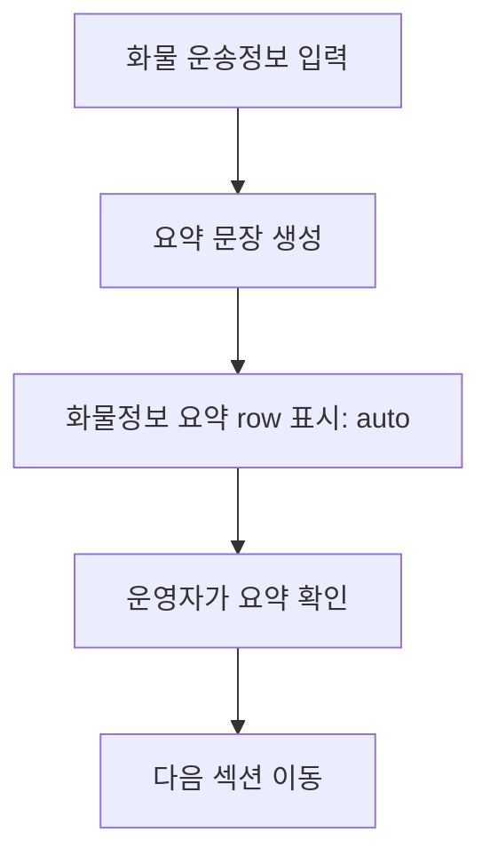
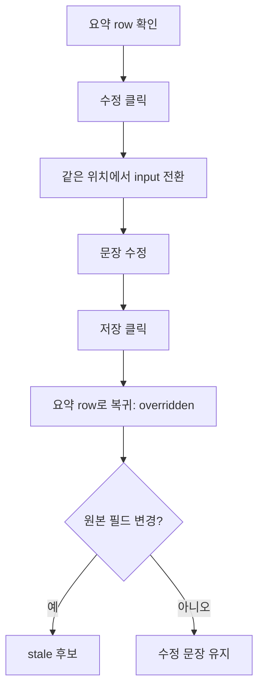

# User Flow - 화물정보 요약

## 1. 기본 확인 흐름

## 2. 값 없음 흐름

| 단계 | 화면 반응 |
| --- | --- |
| 화물 운송정보 없음 | `화물 운송정보 입력 후 요약 생성` 표시 |
| 요약 수정 불가 | action은 `요약 대기`로 표시 |
| 운송정보 입력 후 | 자동으로 값 있음 row로 전환 |

## 3. 수정 흐름

## 4. B 통합본 흐름

1. 사용자가 `3. 화물 운송정보`에서 운송 조건과 품목을 입력합니다.
2. `4. 화물정보 요약`은 파생된 요약 문장을 한 줄 row로 보여줍니다.
3. 필요하면 `수정`으로 문장을 직접 보정합니다.
4. 중량, 증빙, 안내문 관련 작업은 이 섹션에서 처리하지 않습니다.

## 5. 데이터 갱신 흐름

| 상황 | 처리 |
| --- | --- |
| 요약 상태가 `auto`이고 `품목`, `실중량`, `톤수`, `차종`이 변경됨 | 요약 문장을 즉시 재생성 |
| 요약 상태가 `overridden`이고 원본 필드가 변경됨 | 기존 문장을 바로 덮어쓰지 않고 `stale` 후보로 둠 |
| 금액 조건만 변경됨 | 요약 문장에는 기본 영향 없음 |
| 요약 생성에 필요한 핵심값 부족 | `화물 운송정보 입력 후 요약 생성` 표시 |
