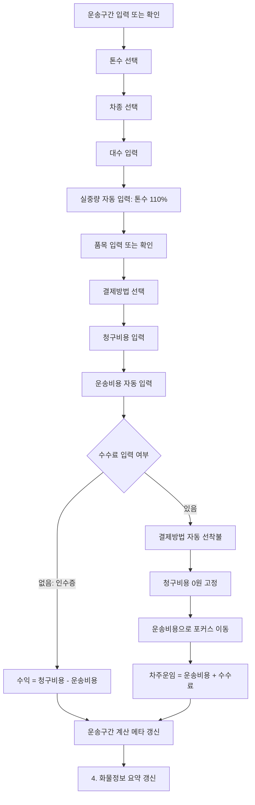
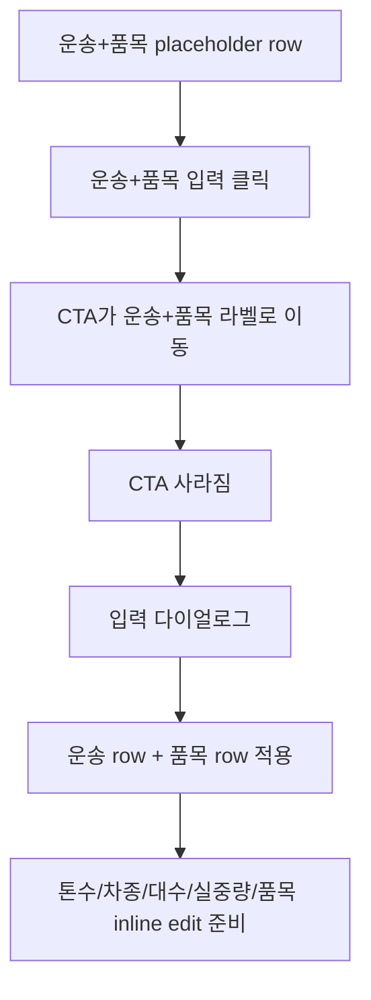
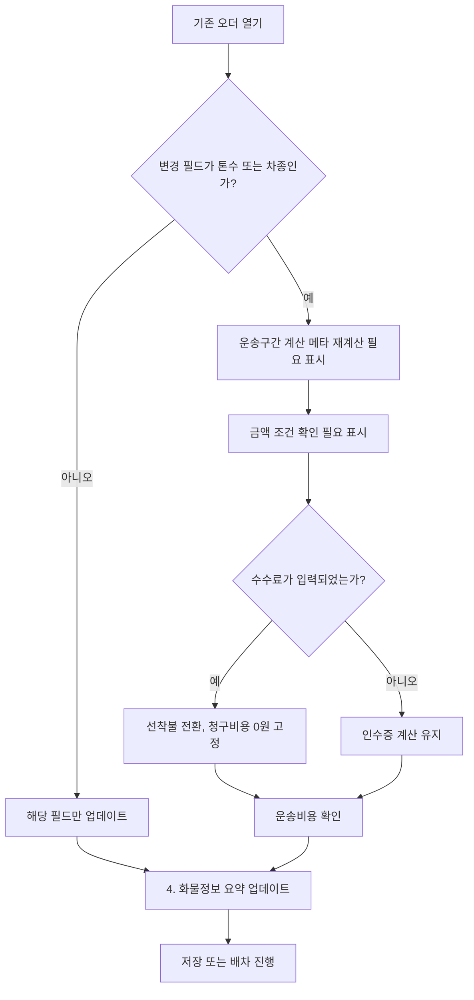

# User Flow: 화물 운송정보 섹션

## 기본 흐름

화물 운송정보 섹션은 운송구간 입력 이후 `운송+품목` 조건과 금액 조건을 완성하는 흐름입니다.

`도착`은 운송구간에 이미 포함된 조건이므로 이 흐름에서 제외합니다.

## 값 없음 상태

| 단계 | 사용자 행동 | 화면 반응 |
| --- | --- | --- |
| 1 | `톤수`, `차종`, `품목`을 아직 선택하지 않음 | `운송+품목` placeholder row와 `운송+품목 입력` 버튼 표시 |
| 2 | `운송+품목 입력` 클릭 | 버튼이 `운송+품목` 라벨 방향으로 슬라이드 |
| 3 | 버튼이 라벨에 닿음 | 다이얼로그가 열리고 적용 후 `운송` row와 `품목` row 표시 |
| 4 | `톤수` 선택 | `실중량=톤수 110%` 자동 입력, 운송구간 계산 메타 정확도 상승 |
| 5 | `결제방법`을 아직 선택하지 않음 | 기본값은 `인수증` 또는 선택 대기 상태 |
| 6 | `청구비용`이 비어 있음 | `운송비용`, 결과 금액은 계산 대기 상태 |
| 7 | 금액 조건이 비어 있음 | `금액` placeholder row와 `금액 조건 선택` 버튼 표시 |

B 통합본 최종안에서는 입력 전 두 placeholder row를 29px 기준으로 맞춥니다. 보조 chip은 `톤수/차종/품목`, `인수증 기본` 정도만 약하게 표시하고, 사용자가 눌러야 할 CTA가 가장 먼저 보이게 합니다.

## 값 있음 상태: 인수증

| 단계 | 입력값 | 화면 반응 |
| --- | --- | --- |
| 1 | `톤수=5톤` | `실중량=5.50`이 자동 입력되고 직접 수정 가능 |
| 2 | `차종=축카고` | 운송구간 계산 메타의 기준 금액 정확도가 올라감 |
| 3 | `대수=1` | 운송 조건 입력 완료 |
| 4 | `결제방법=인수증` | `수수료`는 숨김 또는 비활성 |
| 5 | `청구비용=140,000` | `운송비용=140,000` 자동 입력 |
| 6 | `운송비용=100,000`으로 수정 | `청구비용=140,000` 유지 |
| 7 | `수수료` 없음 | `수익=40,000`으로 표시 |
| 8 | `품목=장비 운송` | `운송+품목` 2번째 row에서 입력하고 `4. 화물정보 요약`에 반영 |

## 값 있음 상태: 선착불

| 단계 | 입력값 | 화면 반응 |
| --- | --- | --- |
| 1 | `수수료=20,000` 입력 | `결제방법`이 자동으로 `선착불`로 변경 |
| 2 | 자동 전환 후 | `청구비용=0원` 고정 |
| 3 | 자동 전환 후 | 포커스가 `운송비용`으로 이동 |
| 4 | `운송비용=100,000` | `차주운임=120,000` 계산 |

## 수정 흐름

## 필드 간 의존성

| 변경 필드 | 영향 받는 영역 | 설명 |
| --- | --- | --- |
| `톤수` | `실중량`, 운송구간 기준 금액 | 실중량은 110% 자동 입력. 기준 금액은 차종과 함께 계산 정확도에 영향 |
| `차종` | 운송구간 기준 금액 | 같은 주소라도 차종에 따라 금액 기준이 달라질 수 있음 |
| `대수` | 금액 조건 확인 | 대수에 따라 운송비용 또는 차주운임 검토가 필요할 수 있음 |
| `실중량` | `4. 화물정보 요약` | `0.00` 단위 입력값이며 사용자가 직접 수정 가능. 요약에서는 실제 중량 표현으로 사용 |
| `품목` | `4. 화물정보 요약` | `운송+품목` 2번째 row에서 입력하고 차주가 이해할 설명에 반영 |
| `결제방법` | `수수료`, `수익/차주운임` 계산식 | `인수증`, `선불`, `착불`, `선착불`에 따라 표시/계산 제어 |
| `청구비용` | `운송비용`, `수익/차주운임` | 입력 시 운송비용에 같은 금액 자동 입력 |
| `운송비용` | `수익/차주운임` | 수정해도 청구비용은 유지 |
| `수수료` | 결제방법, `청구비용`, `차주운임` | 입력 시 자동 선착불, 청구비용 0원 고정 |

## 저장 전 확인 흐름

| 확인 항목 | 조건 | 권장 표시 |
| --- | --- | --- |
| 필수 조건 누락 | `톤수`, `차종`, `대수`, `실중량` 중 누락 | 필드 단위 미입력 표시 |
| 계산 메타 불확정 | `톤수` 또는 `차종` 미선택 | `톤수·차종 선택 후 계산` |
| 결제방법 누락 | `결제방법` 미선택 | `결제방법 선택 필요` |
| 금액 확인 필요 | `결제방법`, `청구비용`, `운송비용`, `수수료` 변경 후 미확인 | `금액 조건 확인 필요` |
| 인수증 수익 불일치 | `청구비용 - 운송비용`과 수익 불일치 | `수익 재계산` |
| 선착불 차주운임 불일치 | `운송비용 + 수수료`와 차주운임 불일치 | `차주운임 재계산` |

## 다음 단계에서 확인할 흐름

1. B 통합본 최종안에서 인수증과 선착불이 같은 컴포넌트 위치를 유지하는지 확인합니다.
2. 값 없음 상태에서 `운송+품목 입력`, `금액 조건 선택` CTA가 각 라벨에 닿아 다이얼로그로 이어지는지 확인합니다.
3. 적용 후 다이얼로그가 닫히고 다시 열리지 않는지 확인합니다.
4. `수수료` 입력 시 자동 선착불 전환과 포커스 이동이 자연스러운지 확인합니다.
5. 인수증은 `수익`, 선착불은 `차주운임`으로 보이는지 확인합니다.
6. 요약 상태가 `auto`일 때 `품목`, `실중량`, `톤수`, `차종` 변경이 `4. 화물정보 요약`을 갱신하는지 확인합니다.
