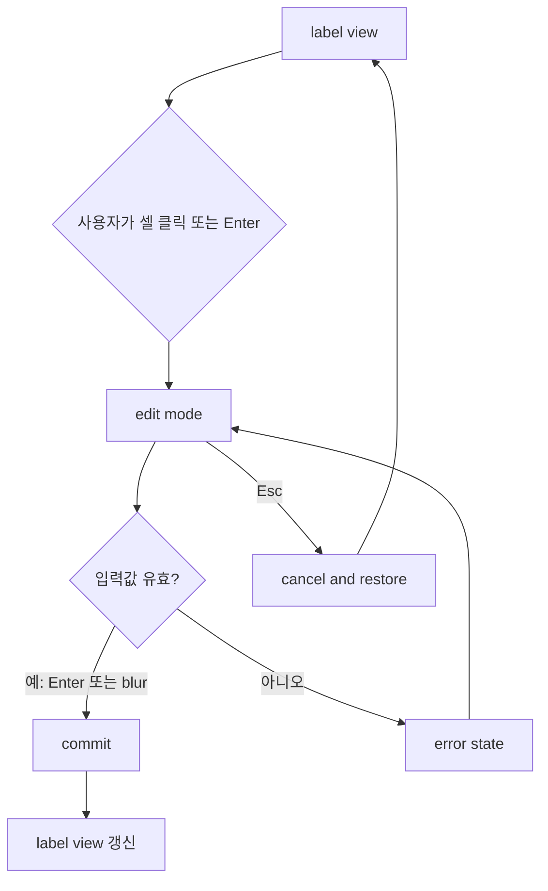

# Inline Edit Interaction Plan: 화물 운송정보

## 목적

화물 운송정보 섹션은 항상 보이는 compact 명세 row를 유지하면서, 입력된 값은 기본적으로 라벨처럼 읽히게 합니다.

값 없음 상태에서 row로 진입하는 방식은 `08-empty-state-activation-transition.md`를 따릅니다. `운송+품목 입력` 또는 `금액 조건 선택` CTA가 대상 라벨에 닿아 사라진 뒤 다이얼로그가 열리고, 적용된 row에서 inline edit가 시작됩니다.

수정이 필요할 때는 별도 팝업을 띄우지 않고, 사용자가 클릭한 셀 안에서 라벨이 입력 컴포넌트로 전환되는 inline edit 방식을 사용합니다.

## 결정 요약

| 결정 | 내용 |
| --- | --- |
| 기본 표시 | 모든 입력값은 라벨처럼 표시 |
| 수정 방식 | 클릭 또는 키보드 진입 시 같은 위치에서 입력 컴포넌트로 전환 |
| 팝업 사용 | 기본 사용하지 않음 |
| 저장 방식 | `Enter`, blur, 또는 row 저장 액션으로 확정 |
| 취소 방식 | `Esc`로 이전 값 복원 |
| 레이아웃 | 라벨과 입력창의 폭/높이를 같게 맞춰 행 흔들림 방지 |
| 진입 전환 | 값 없음 상태에서는 CTA 흡수 전환과 다이얼로그 적용 후 inline edit 가능한 row로 진입 |

## 왜 inline edit인가

| 기준 | inline edit | 팝업 입력 |
| --- | --- | --- |
| 운영 속도 | 빠름. 보는 위치에서 바로 수정 | 클릭, 입력, 닫기 단계가 늘어남 |
| 주변 맥락 | 같은 row의 다른 값을 보면서 수정 가능 | 팝업이 주변 값을 가릴 수 있음 |
| 필드 복잡도 | 단순 선택/숫자/금액에 적합 | 상세 옵션이나 긴 설명에 적합 |
| 이 섹션 적합도 | 높음 | 낮음 |

화물 운송정보의 대부분은 `톤수`, `차종`, `대수`, `실중량`, 금액처럼 짧은 값입니다. 따라서 팝업보다 inline edit가 더 적합합니다.

## 필드별 입력 방식

| 필드 | 기본 표시 | 편집 컴포넌트 | 편집 규칙 |
| --- | --- | --- | --- |
| `톤수` | `5톤` 라벨 | select/dropdown | 선택 시 `실중량`을 톤수 110%로 자동 입력 |
| `차종` | `축카고` 라벨 | select/dropdown | 변경 시 운송구간 기준 금액 재계산 필요 상태 |
| `대수` | `1대` 라벨 | number input | 자연수 입력, 금액 조건 확인 필요 가능 |
| `실중량` | `5.50톤` 라벨 | decimal input | `0.00` 단위, 자동값을 직접 수정 가능 |
| `결제방법` | `인수증` 라벨 | segmented/select | `인수증`, `선불`, `착불`, `선착불` |
| `청구비용` | `140,000` 라벨 | money input | 입력 시 `운송비용`에 같은 값 자동 입력 |
| `운송비용` | `100,000` 라벨 | money input | 수정해도 `청구비용`은 유지 |
| `수수료` | `미표시` 또는 금액 라벨 | money input | 입력 시 자동 `선착불`, `청구비용=0원`, `운송비용` 포커스 |
| `수익` | `40,000` 라벨 | readonly | 인수증에서만 표시, 직접 수정 불가 |
| `차주운임` | `120,000` 라벨 | readonly | 선불/착불/선착불에서 표시, 직접 수정 불가 |
| `품목` | `장비 운송` 라벨 | text input | 한 줄 입력, 긴 값은 row 안에서 말줄임 또는 가로 스크롤 |

## 상태 모델



## 표시 상태

| 상태 | 화면 표현 | 설명 |
| --- | --- | --- |
| `read` | 라벨처럼 표시 | 기본 상태 |
| `hover` | 얇은 점선 또는 옅은 배경 | 수정 가능함을 암시 |
| `focus` | 라인 강조 | 키보드 접근 또는 클릭 진입 |
| `editing` | 같은 위치에서 input/select 표시 | row 높이 유지 |
| `auto-filled` | 작은 `자동` chip | 시스템이 채운 값 |
| `overridden` | 작은 `수정됨` chip | 사용자가 자동값을 바꾼 값 |
| `readonly` | 계산값 라벨 | `수익`, `차주운임` |
| `error` | 붉은 dashed line과 짧은 문구 | 잘못된 금액, 음수, 필수값 누락 |

## 핵심 interaction rules

| 상황 | 동작 |
| --- | --- |
| 셀 클릭 | 해당 셀만 edit mode로 전환 |
| 다른 셀 클릭 | 기존 edit mode는 commit 후 새 셀 edit mode 전환 |
| `Enter` | 현재 값 저장 |
| `Esc` | 이전 값으로 복원 |
| blur | 유효하면 저장, 유효하지 않으면 error 유지 |
| `Tab` | 저장 후 다음 수정 가능한 셀로 이동 |
| 계산값 클릭 | 입력창 전환 없음. 계산 근거 tooltip 또는 chip만 표시 |

## 자동 입력 규칙

| 이벤트 | 자동 처리 |
| --- | --- |
| `톤수` 선택 | `실중량 = 톤수 * 1.1`, `0.00` 단위 표시 |
| `실중량` 직접 수정 | `weight-overridden` 상태로 변경 |
| `청구비용` 입력 | `운송비용`에 같은 금액 자동 입력 |
| `운송비용` 직접 수정 | `manual-overridden` 상태로 변경 |
| `수수료` 입력 | `결제방법=선착불`, `청구비용=0원`, `운송비용`으로 포커스 |
| `결제방법=인수증` 변경 | `수수료` 숨김/비활성, 결과 라벨은 `수익` |
| `결제방법=선불/착불/선착불` 변경 | `수수료` 표시, 결과 라벨은 `차주운임` |

## validation rules

| 필드 | 검증 |
| --- | --- |
| `톤수` | 필수 선택 |
| `차종` | 필수 선택 |
| `대수` | 1 이상 정수 |
| `실중량` | 0 이상, 소수점 2자리까지 |
| `청구비용` | 0 이상 금액 |
| `운송비용` | 0 이상 금액 |
| `수수료` | 인수증 외 조건에서 0 이상 금액 |
| `품목` | 비어 있을 수 있으나 저장 전 안내 가능 |

## 화면 구조 기준

```text
[운송]  톤수(label/edit)  차종(label/edit)  대수(label/edit)  실중량(label/edit)
[품목]  품목(label/edit)
[금액]  결제방법(label/edit)  청구비용(label/edit)  운송비용(label/edit)  수수료(label/edit)  수익/차주운임(readonly)
```

## HTML 반영 상태

`cargo-transport-section-variants.html`의 첫 번째 `항상 노출: compact 명세 row`에 label-to-input 전환 샘플을 반영했습니다.

같은 HTML의 `2. 값 없음: 입력 전` 섹션에는 `08-empty-state-activation-transition.md` 기준으로 CTA 흡수 전환 샘플을 반영했습니다. B 통합본은 F안 기준으로 `운송+품목 입력`, `금액 조건 선택` CTA와 다이얼로그 적용 흐름을 사용합니다.

| 항목 | 반영 |
| --- | --- |
| 클릭/Enter 진입 | 반영 |
| Enter 또는 blur 저장 | 반영 |
| Esc 취소 | 반영 |
| 한 번에 하나의 셀만 edit mode | 반영 |
| 톤수 선택 시 실중량 110% 자동 입력 | 반영 |
| 청구비용 입력 시 운송비용 자동 입력 | 반영 |
| 수수료 입력 시 선착불 전환, 청구비용 0원, 운송비용 포커스 | 반영 |
| 인수증은 `수익`, 그 외 결제방법은 `차주운임` | 반영 |

## 다음 구현 시 확인할 것

1. 실제 브라우저에서 라벨과 input/select의 폭과 높이가 흔들리지 않는지 확인합니다.
2. 자동 입력된 값과 사용자가 수정한 값을 작은 chip으로 구분할지 결정합니다.
3. validation error message를 row 안에 둘지, 하단 안내로 둘지 결정합니다.
4. 모바일에서는 row 가로 스크롤을 허용하고 높이 변화를 최소화합니다.
