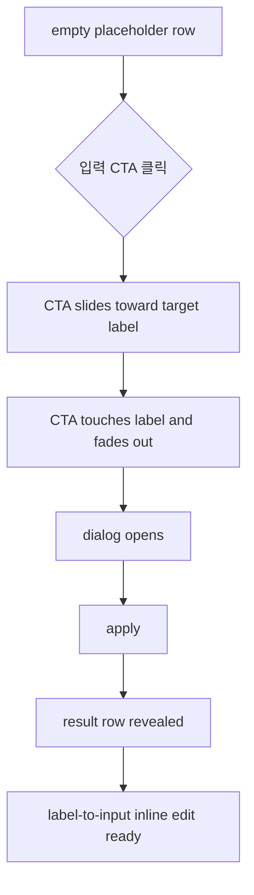

# Empty State Activation Transition: 화물 운송정보

## 목적

값이 없는 상태에서도 현재 화면처럼 compact placeholder를 유지하되, 사용자가 `운송+품목 입력` 또는 `금액 조건 선택`을 누르면 해당 액션이 각 라벨로 흡수된 뒤 다이얼로그로 이어지게 합니다.

이 전환은 빈 화면을 별도 입력 화면처럼 느끼게 하지 않고, 사용자가 “운송 조건 row를 활성화했다”는 맥락을 바로 이해하게 만드는 것이 목적입니다.

## 결정 요약

| 결정 | 내용 |
| --- | --- |
| 패턴 이름 | CTA 흡수 전환 |
| 적용 대상 | `운송+품목`, `금액` 빈 값 상태 |
| 시작 상태 | 라벨, placeholder line, 입력 버튼, 최소 보조 chip |
| 사용자 행동 | `운송+품목 입력` 또는 `금액 조건 선택` 클릭 |
| 전환 방식 | 버튼이 오른쪽에서 왼쪽으로 이동해 대상 라벨에 닿고 사라짐 |
| 완료 상태 | 다이얼로그 적용 후 해당 row가 항상 노출 구조로 표시 |
| 반복 확인 | wireframe에서는 각 row의 `다시 보기` 버튼으로 interaction 재생 |

## 왜 이 방식인가

| 기준 | CTA 흡수 전환 | 즉시 교체 |
| --- | --- | --- |
| 맥락 이해 | 사용자가 누른 버튼이 어떤 row를 여는지 시각적으로 연결됨 | 화면이 갑자기 바뀌어 원인과 결과가 약할 수 있음 |
| 기존 화면 유지 | placeholder 구조를 유지하다가 필요한 row만 활성화 | 빈 값 상태와 값 있음 상태의 차이가 급격함 |
| 운영 속도 | 한 번의 클릭으로 compact row 진입 | 속도는 같지만 피드백이 약함 |
| 와이어프레임 검토 | 전환 의도를 직접 확인 가능 | 상태 비교만 가능 |

## 상태 모델



## Wireframe

### 1. 시작 상태

```text
[운송+품목]  -------------------------------  [운송+품목 입력]  [톤수/차종/품목]
[금액]       -------------------------------  [금액 조건 선택]  [인수증 기본]
```

### 2. 전환 중

```text
[운송+품목]  <--------- [운송+품목 입력]  [톤수/차종/품목]
```

### 3. 완료 상태

```text
[운송]  [톤수: 톤수 선택]  [차종: 차종 선택]  [대수: 1대]  [실중량: 0.00톤]
[품목]  [품목 입력]
```

## Interaction Spec

| 항목 | 기준 |
| --- | --- |
| 이동 방향 | 오른쪽에서 왼쪽, `운송` 라벨 방향 |
| 목표 지점 | 버튼 왼쪽 edge가 대상 라벨 오른쪽 edge에 닿는 지점 |
| 사라짐 방식 | 닿는 시점에 opacity down + scale down |
| row 전환 | 버튼이 사라진 뒤 다이얼로그 적용 시 항상 노출 row reveal |
| 확정 시간 | B 통합본 cargo 전용 버튼 이동 340ms, 적용 후 row reveal 140ms |
| fallback 시간 | animation event 누락 시 560ms 안에 다이얼로그 open 처리 |
| 중복 실행 방지 | animationend와 fallback timer 중 먼저 실행된 1회만 dialog open 처리 |
| 중복 클릭 | 전환 중에는 추가 클릭 무시 |
| 모션 감소 | `prefers-reduced-motion`에서는 슬라이드 없이 즉시 전환 |

## 확정값

| 항목 | 값 | 이유 |
| --- | --- | --- |
| 버튼 이동 시간 | `340ms` | 이동 방향을 인지하되 운영 화면에서 기다림이 길지 않게 조정 |
| row reveal 시간 | `140ms` | 위치 이동 없이 배경 밝기와 opacity만 사용해 텍스트 흐림을 줄임 |
| 라벨 접촉 위치 | 대상 라벨 오른쪽 edge + `4px` | 버튼이 라벨에 닿는 느낌을 주되 라벨을 덮지 않음 |
| 버튼 소멸 scale | `0.92` | 흡수되는 느낌은 남기고 과한 축소감을 줄임 |
| 입력 전 row 높이 | `29px` 기준 | CTA 상태와 적용 후 정보 row 사이의 시각 리듬을 맞춤 |
| 적용 후 row 높이 | `운송/금액 28px`, `품목 29px` 기준 | 정보 밀도를 높이되 손글씨 폰트가 뭉개지지 않게 함 |
| 입력 전 chip | dashed muted 스타일 | `톤수/차종/품목`, `인수증 기본`은 보조 안내로 낮춤 |
| dialog 닫힘 | 적용 후 `<dialog open>` 제거와 `display:none` 확인 | 적용 후 다이얼로그가 남거나 다시 열리지 않게 함 |

## 활성화 후 입력 규칙

전환 완료 후에는 `07-inline-edit-interaction-plan.md`의 label-to-input 규칙을 따릅니다.

| 필드 | 활성화 직후 표시 | 이후 동작 |
| --- | --- | --- |
| `톤수` | `톤수 선택` | 클릭 시 select로 전환 |
| `차종` | `차종 선택` | 클릭 시 select로 전환 |
| `대수` | `1대` | 클릭 시 number input으로 전환 |
| `실중량` | `0.00톤` | 톤수 선택 시 110% 자동 입력, 직접 수정 가능 |

## 적용 범위

| 그룹 | 이번 적용 | 메모 |
| --- | --- | --- |
| 운송+품목 | 적용 | `운송+품목 입력` CTA 후 다이얼로그 적용 시 `운송` row와 `품목` row 표시 |
| 금액 조건 | 적용 | `금액 조건 선택` CTA 후 `결제방법/청구비용/운송비용/수수료/수익` row 표시 |
| 품목 | F안으로 병합 | `운송+품목 입력` CTA 안에서 품목을 함께 입력하고 적용 후 2번째 row로 표시 |

## HTML 반영 상태

`cargo-transport-section-variants.html`의 `2. 값 없음: 입력 전` 섹션과 B 통합본 `Cargo Order Wireframe B Original Tone.html`의 `3. 화물 운송정보` 섹션에 wireframe 확인용 interaction을 반영했습니다. B 통합본은 이후 F안 적용으로 `운송+품목`, `금액` 2개 그룹 구조로 정리했습니다.

| 항목 | 반영 |
| --- | --- |
| `운송+품목 입력` 버튼 | 반영 |
| `금액 조건 선택` 버튼 | 반영 |
| 대상 라벨 방향 흡수 animation | 반영 |
| 항상 노출 row reveal | 반영 |
| `다시 보기` replay | 반영 |
| 모션 감소 대응 | 반영 |
| B 통합본 `운송+품목`/`금액` 적용 | 반영 |
| B 통합본 입력 전/적용 후 최종 row 리듬 | 반영 |
| animationend/fallback 중복 실행 방지 | 반영 |
| 적용 후 dialog 닫힘 보강 | 반영 |

## Acceptance Criteria

| ID | 기준 |
| --- | --- |
| `AC-CT-ACT-001` | 값 없음 상태에서 `운송+품목 입력`, `금액 조건 선택` 버튼이 보인다 |
| `AC-CT-ACT-002` | 버튼 클릭 시 버튼이 대상 라벨 방향으로 이동한다 |
| `AC-CT-ACT-003` | 버튼이 라벨에 닿는 시점에 사라지고 다이얼로그가 열린다 |
| `AC-CT-ACT-004` | 적용 후 `톤수`, `차종`, `대수`, `실중량`, `품목` 또는 금액 row가 항상 노출된다 |
| `AC-CT-ACT-005` | 전환 완료 후 각 필드는 inline edit 규칙으로 수정 가능하다 |
| `AC-CT-ACT-006` | 모션 감소 환경에서는 슬라이드 없이 즉시 전환된다 |
| `AC-CT-ACT-007` | animationend와 fallback이 중복 실행되어 다이얼로그가 다시 열리지 않는다 |
| `AC-CT-ACT-008` | 적용 후 다이얼로그는 `open=false`, `display=none` 상태로 닫힌다 |
