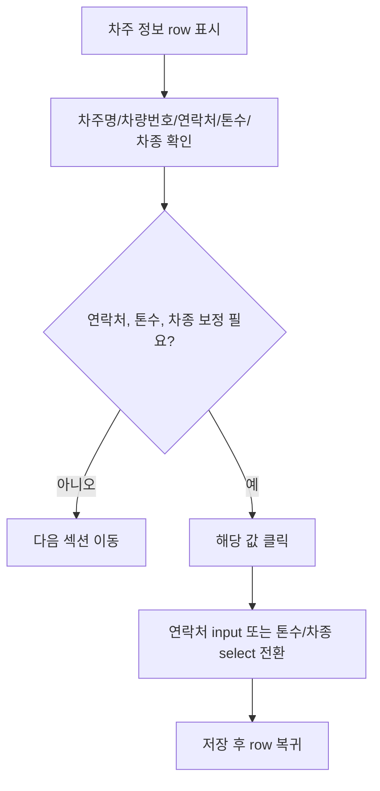
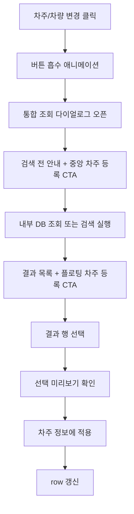
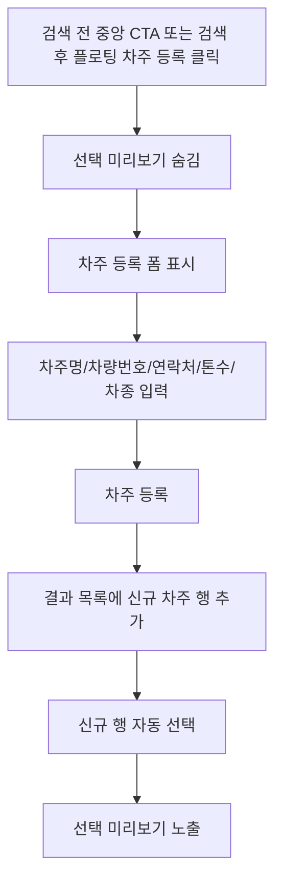

# User Flow - 차주 정보

## 1. 값 있음 확인

## 2. 차주/차량 변경

## 3. 입력 전 상태

| 단계 | 화면 반응 |
| --- | --- |
| 차주 정보 없음 | 빈 row와 `차주 정보 입력` CTA 표시 |
| CTA 클릭 | 버튼이 `차주` 라벨 방향으로 흡수 |
| 조회 다이얼로그 | 검색 전 안내 표시, `내부 DB 조회` 또는 검색 후 목록 표시 |
| 적용 | 값 있음 row로 전환 |

## 4. 차주 등록

## 5. 보류 흐름

| 흐름 | 보류 사유 |
| --- | --- |
| 차량번호 검증 실패 | 실제 검증 규칙 미정 |
| 차주 마스터 저장 | 저장 위치 미정 |
| 톤수/차종 비교 | 화물 운송정보 요구 조건과 차주 차량 스펙 비교 방식 미정 |
