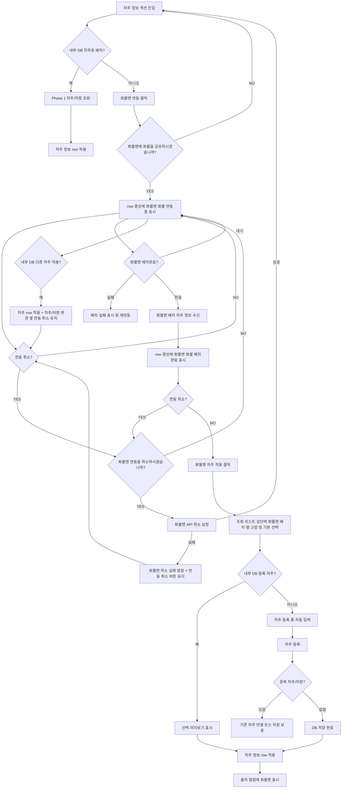
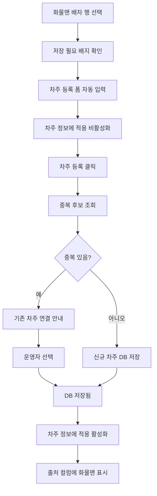

# User Flow - 화물맨 연동 배차

## 1. 전체 흐름

## 2. 연동 전

| 단계 | 화면 반응 |
| --- | --- |
| 화물맨 미연동 | 실제 배치 row의 입력 전/조회 상태 유지 |
| 내부 DB 액션 | 우측 `차주/차량 입력`으로 내부 DB 차주 조회 |
| 일반 등록 액션 | 조회 전 중앙 CTA 또는 조회 후 플로팅 `차주 등록`으로 검색 결과에 없는 차주를 수동 등록 |
| 운영자 판단 | 내부 DB에 적절한 차주가 없거나 외부 배차가 필요하다고 판단 |
| 화물맨 액션 | `차주` 라벨 옆 `화물맨 연동` 클릭 |
| 확인 다이얼로그 | `화물맨에 화물을 공유하시겠습니까?`에서 `YES` 선택 시 연동 시작 |

## 3. 연동중

| 단계 | 화면 반응 |
| --- | --- |
| 연동 요청 성공 | row 중앙에 `화물맨 화물 연동중` 상태 문구 표시 |
| 배차 대기 | 우측 `차주/차량 입력` 액션은 유지, 화물맨 액션은 `연동 취소`로 전환 |
| 다른 차주 적용 | 내부 DB 차주를 적용해도 화물맨 연동은 자동 취소하지 않음 |
| 적용 후 row | `차주/차량 변경` 옆에 `연동 취소`를 유지해 화물맨 API 취소 가능 |
| 연동 취소 클릭 | `화물맨 연동을 취소하시겠습니까?` 확인 다이얼로그 표시 |
| 취소 확인 결과 | `YES`는 화물맨 API 취소 요청, `NO`는 연동중 상태 유지 |
| 취소 요청중 | row 중앙에 `화물맨 API 취소 요청중` 표시 |
| 취소 성공 | 입력 전 상태로 복귀 |
| 취소 실패 | `화물맨 취소 실패` 알림 표시, `연동 취소` 버튼 유지로 재시도 가능 |
| 운영 액션 | 확인 후 API 연동 취소, 내부 차주 선택 병행 검토, 배차완료 수신 대기 |

## 4. 배차 완료

| 단계 | 화면 반응 |
| --- | --- |
| 화물맨 결과 수신 | 화물맨 배차 차주/차량 정보 생성 |
| 입력 전/조회 상태 알림 | row 중앙의 `화물맨 화물 연동중`이 `화물맨 화물 배차완료`로 전환 |
| 연동 취소 클릭 | 배차완료 상태에서도 동일한 취소 확인 다이얼로그 표시, `YES`에서 화물맨 API 취소 요청 |
| 적용 CTA 클릭 | 우측 `화물맨 차주 적용` 클릭 시 기존 차주/차량 통합 조회 다이얼로그 오픈 |
| 조회 다이얼로그 오픈 | 조회 리스트 상단에 화물맨 배차 행 고정 및 기본 선택 |
| 검색어 입력 | 일반 DB 결과만 필터링되고 화물맨 배차 행은 유지 |
| 기존 등록 차주 | 선택 미리보기 노출 후 바로 적용 |
| 신규 차주 | 차주 등록 폼 노출, 등록 완료 후 적용 |

## 5. 다이얼로그 레이아웃 유지 흐름

화물맨 배차완료 후에도 기존 `차주/차량 통합 조회 다이얼로그`의 화면 골격은 유지합니다.

| 기존 영역 | Phase 2 처리 |
| --- | --- |
| 검색 input | 위치와 역할 유지 |
| 중앙/플로팅 `차주 등록` | Phase 1의 일반 신규 차주 등록 진입으로 유지 |
| 조회 리스트 | 최상단에 `화물맨 배차 결과` 행만 추가 |
| 선택 미리보기 | 기존 등록 차주일 때 그대로 재사용 |
| 차주 등록 폼 | 일반 등록은 기본값으로 표시, 화물맨 신규 차주는 수신값 자동 입력 |
| 하단 CTA | 기존 `차주 등록`, `차주 정보에 적용` 위치 유지 |
| 적용 제한 | 신규 차주는 등록 전 `차주 정보에 적용` 비활성화 |

## 6. 수동 차주 등록

수동 차주 등록은 두 가지 진입을 가집니다.

| 진입 | 의미 | 초기값 |
| --- | --- | --- |
| 중앙/플로팅 `차주 등록` | 화물맨 배차와 무관한 일반 신규 차주 등록 | 내부 DB 신규 기본값 |
| 화물맨 신규 차주 행 | 화물맨에서 받은 미등록 차주 저장 | 화물맨 수신값 자동 입력 |

두 진입 모두 기존 다이얼로그의 등록 폼과 하단 CTA 영역을 유지합니다. `차주 등록`은 등록 전 primary 버튼이고, `차주 정보에 적용`은 등록 완료 전까지 비활성화됩니다.

| 상태 | 하단 CTA |
| --- | --- |
| 기존 등록 차주 | `차주 정보에 적용` 활성, `차주 등록` 숨김 |
| 일반 신규 등록 전 | 중앙/플로팅 `차주 등록`으로 폼 진입, 하단 `차주 등록` 노출, `차주 정보에 적용` 비활성 |
| 일반 신규 등록 완료 | 신규 행 자동 추가/선택, `차주 정보에 적용` 활성 |
| 화물맨 신규 등록 전 | 화물맨 수신값 등록 폼 표시, 하단 `차주 등록` 노출, `차주 정보에 적용` 비활성 |
| 화물맨 신규 등록 완료 | `차주 등록` 숨김, `차주 정보에 적용` 활성 |

## 7. 조회 리스트 고정 규칙

| 상황 | 화물맨 배차 행 | 일반 DB 결과 |
| --- | --- | --- |
| 검색어 없음 | 상단 고정 | 전체 또는 기본 추천 표시 |
| 검색어 있음 | 상단 고정 | 검색어에 맞는 결과만 표시 |
| 일반 결과 없음 | 상단 고정 | 빈 결과 안내 |
| DB 저장 완료 | 상단 고정 또는 일반 결과에도 표시 가능 | 저장된 차주로 재검색 가능 |

## 8. 실패 흐름

| 실패 | UI | 액션 |
| --- | --- | --- |
| 화물맨 연동 실패 | `연동 실패` 상태 | 다시 연동 |
| 화물맨 배차 실패 | `배차 실패` 상태 | 내부 DB 차주 조회 또는 재연동 |
| 화물맨 취소 실패 | `화물맨 취소 실패` 알림 | 기존 `연동 취소` 버튼 유지, 확인 후 취소 재시도 |
| DB 저장 실패 | `저장 실패` 배지 | 저장 재시도 |
| 중복 발견 | `중복 후보 있음` 배지 | 기존 차주 연결 또는 신규 저장 보류 |

## 9. Phase 1과의 연결

| 연결 지점 | 기준 |
| --- | --- |
| 차주 정보 row 적용 | 내부 DB 차주와 화물맨 배차 차주 모두 같은 label/value row 구조 사용 |
| 선택 미리보기 | 기존 등록 차주는 기존 미리보기 패턴 사용 |
| 차주 등록 | 일반 신규 등록은 조회 전 중앙 CTA 또는 조회 후 플로팅 CTA에서 진입하고, 화물맨 신규 차주는 같은 폼에 수신값을 채워 저장 |
| 연락처/톤수/차종 보정 | 저장 전/후 모두 현재 오더 기준 보정 가능 |
| 출처 표시 | 화물맨 적용 후 row 마지막 필드에 `출처 / 화물맨` 표시 |
