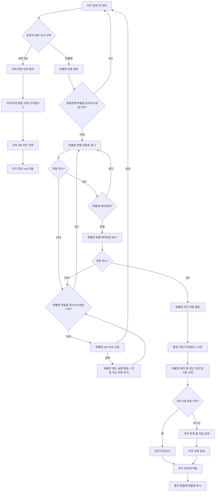

# Phase 1 / 화물맨 공존 UX 기획

## 1. 목적

`5. 차주 정보` 섹션에서 기존 내부 DB 배차와 화물맨 외부 배차를 함께 사용할 수 있는 진입 구조를 정리합니다.

핵심은 Phase 1의 `입력 전/조회 상태`를 없애지 않는 것입니다. 운영자는 기존처럼 내부 DB 차주를 조회해 배차할 수도 있고, 같은 실제 배치 row에서 `화물맨 연동`을 시작해 외부 배차 결과를 받아올 수도 있어야 합니다.

## 2. PRD 관점 요구사항

| ID | 요구사항 | 설명 |
| --- | --- | --- |
| DI-HM-01 | Phase 1 입력 전/조회 상태 유지 | 기존 `차주/차량 입력` 기능을 삭제하지 않음 |
| DI-HM-02 | 내부 DB 배차와 화물맨 배차 공존 | 두 방식은 대체 관계가 아니라 병렬 배차 옵션 |
| DI-HM-03 | 진입 UI 후보 비교 | 2개 버튼, 1개 버튼, 보조 액션 등 복수안 비교 |
| DI-HM-04 | 화물맨 연동중 상태 표시 | 연동 요청 후 배차 대기 상태가 섹션 안에 보여야 함 |
| DI-HM-05 | 화물맨 배차완료 상태 표시 | 입력 전/조회 상태에서도 배차 완료를 즉시 인지할 수 있어야 함 |
| DI-HM-06 | 화물맨 차주 적용 클릭 시 통합 조회 다이얼로그 오픈 | 기존 차주/차량 통합 조회 다이얼로그를 재사용 |
| DI-HM-07 | 화물맨 배차 행 상단 고정 | 검색어와 무관하게 최상단에 고정, 기본 선택 상태 |
| DI-HM-08 | 신규 차주 등록 후 배차 적용 | 내부 DB 미등록 차주는 `차주 등록` 완료 후에만 적용 가능 |
| DI-HM-09 | 기존 등록 차주 즉시 적용 | 내부 DB 등록 차주는 선택 미리보기 후 바로 적용 가능 |
| DI-HM-10 | 적용 후 출처 표기 | 차주 정보 row 마지막 필드에 `출처 / 화물맨`이 남아야 함 |
| DI-HM-11 | 다른 차주 배차 시 연동 취소 유지 | 화물맨 연동 후 내부 DB 차주로 배차되면 `차주/차량 변경` 옆 `연동 취소` 유지 |

## 3. 확정된 실제 배치 row 기준

아래 구조를 Phase 2의 최신 기준으로 사용합니다. 후보 비교는 보조 자료로 남기되, HTML 시안과 B 통합본 반영은 이 기준을 우선합니다.

```text
연동 전
차주 [화물맨 연동] ______________________________ [차주/차량 입력]

연동중
차주 __________________ 화물맨 화물 연동중 ___ [연동 취소] [차주/차량 입력]

배차완료
차주 ________________ 화물맨 화물 배차완료 ___ [연동 취소] [화물맨 차주 적용]

적용 후
차주 | 차주명 | 차량번호 | 차주 연락처 | 톤수 | 차종 | 출처 | [차주/차량 변경]
     | 임동진 | 경기92바7283 | 010-5241-1461 | 5톤 | 축차 | 화물맨 |

화물맨 연동 후 다른 차주 적용
차주 | 차주명 | 차량번호 | 차주 연락처 | 톤수 | 차종 | 출처 | [차주/차량 변경] [연동 취소]
     | 김도윤 | 서울88아5521 | 010-2391-8842 | 5톤 | 카고 | 내부 DB |
```

## 3-1. B 통합본 기획 비교 적용

B 통합본 `Cargo Order Wireframe B Original Tone.html`에서는 실제 구현 순서와 기획 비교 목적을 분리합니다.

| 구분 | B 통합본 표시 | 목적 |
| --- | --- | --- |
| Phase 1 탭 | 내부 DB 차주/차량 조회 실제 컴포넌트 | 먼저 구현할 기본 배차 흐름을 확인 |
| Phase 2 탭 | 화물맨 연동 포함 실제 배치 컴포넌트 | Phase 2 확장 흐름을 같은 레이아웃 안에서 비교 |
| 공통 dialog | 차주/차량 통합 조회, 차주 등록, 선택 미리보기 | Phase 1 사용성을 유지하면서 Phase 2 요소만 추가 |
| 적용 row | `차주명 / 차량번호 / 차주 연락처 / 톤수 / 차종 / 출처` | Phase 2에서 `출처 / 화물맨` 또는 `출처 / 내부 DB`를 명확히 구분 |

기획 시안에서는 Phase 1과 Phase 2를 같은 섹션 안의 탭으로 모두 보여주지만, 실제 개발은 Phase 1을 먼저 구현하고 Phase 2는 화물맨 API 계약 확정 후 확장하는 순서로 진행합니다.

| 기준 | 확정 내용 |
| --- | --- |
| 연동 시작 | `화물맨 연동` 클릭 후 `화물맨에 화물을 공유하시겠습니까?` 확인 |
| 연동 취소 | `연동 취소` 클릭 후 `화물맨 연동을 취소하시겠습니까?` 확인, `YES`에서 화물맨 API 취소 요청 후 입력 전 상태 복귀. 실패 시 알림 표시와 `연동 취소` 버튼 유지 |
| 내부 DB 조회 | `차주/차량 입력`은 연동 전/연동중 상태에서 계속 사용 가능 |
| 배차완료 진입 | `화물맨 차주 적용` 클릭 시 기존 통합 조회 다이얼로그 오픈 |
| 적용 후 표시 | 기존 row의 label/value 구조를 유지하고 `출처` 컬럼만 추가 |

## 3-1. 차주 등록 버튼 UX 후보와 확정안

Phase 2에서도 신규 차주는 수동 등록 후에만 배차 적용이 가능합니다. 따라서 `차주 등록` 버튼은 기존 Phase 1 다이얼로그 학습 비용을 유지하면서, 신규 차주 케이스에서만 자연스럽게 발견되어야 합니다.

| 후보 | 위치 | 장점 | 단점 | 구현 난이도 | 판정 |
| --- | --- | --- | --- | --- | --- |
| A. 하단 CTA 유지 | 신규 차주 등록 폼 하단 | Phase 1 다이얼로그의 손 위치와 동일, `차주 등록` 후 `차주 정보에 적용` 흐름이 명확 | 신규 차주 폼이 열려야 버튼을 볼 수 있음 | low | 확정 |
| B. 상단 상태바 배치 | 다이얼로그 상단 상태 영역 | 신규 차주 상태를 빠르게 인지 | 검색/선택/등록 CTA가 멀어져 흐름이 분리됨 | medium | 보류 |
| C. 조회 행 내부 배치 | 화물맨 배차 결과 행 오른쪽 | 발견성이 높음 | 결과 행과 등록 폼의 책임이 섞이고 행 높이가 커짐 | medium | 보류 |

확정안은 **A. 하단 CTA 유지**입니다.

| 상태 | `차주 등록` 버튼 | `차주 정보에 적용` 버튼 | 규칙 |
| --- | --- | --- | --- |
| 기존 등록 차주 | 숨김 | 활성화 | 선택 미리보기 후 바로 적용 |
| 신규 차주 등록 전 | 노출, primary | 비활성화 | `차주 등록` 완료 전 적용 불가 |
| 신규 차주 등록 완료 | 숨김 | 활성화 | `DB 저장됨` 상태로 전환 후 적용 가능 |
| 내부 DB 차주 선택 | 숨김 | 활성화 | Phase 1과 동일 |

## 4. 진입 UI 후보 비교

### 추천안 A. 기본 버튼 + 보조 화물맨 액션

기존 `차주/차량 입력` 버튼을 우측 주 액션으로 유지하고, `차주` 라벨 옆에 `화물맨 연동`을 보조 액션으로 둡니다.

```text
┌────────────────────────────────────────────────────────────────────────────┐
│ 차주                                                                       │
│ [화물맨 연동]                                      [차주/차량 입력]        │
└────────────────────────────────────────────────────────────────────────────┘
```

| 평가 | 내용 |
| --- | --- |
| 장점 | 기존 Phase 1 흐름이 가장 덜 흔들림 |
| 장점 | 내부 DB 배차와 화물맨 배차가 동시에 보임 |
| 장점 | `화물맨 화물 연동중`, `화물맨 화물 배차완료` 상태를 같은 row에서 자연스럽게 전환 가능 |
| 단점 | 버튼이 2개라 첫 화면이 약간 복잡해질 수 있음 |
| 구현 난이도 | low |
| 추천 여부 | 추천 |

### 대안 B. 1개 대표 버튼 + 액션 선택 메뉴

`차주/차량 입력`을 대표 버튼으로 두고, 버튼 안 또는 옆 메뉴에서 `내부 차주 조회`, `화물맨 연동`을 선택합니다.

```text
┌────────────────────────────────────────────────────────────────────────────┐
│ 차주                                                                       │
│ [차주/차량 입력 ▼]                                                         │
│   - 내부 차주 조회                                                         │
│   - 화물맨 연동                                                            │
└────────────────────────────────────────────────────────────────────────────┘
```

| 평가 | 내용 |
| --- | --- |
| 장점 | 화면이 가장 단순함 |
| 장점 | 외부 배차 서비스가 여러 개로 늘어날 때 메뉴 확장이 쉬움 |
| 단점 | 화물맨 연동 기능이 숨어서 발견성이 떨어질 수 있음 |
| 단점 | 배차 완료 알림을 버튼 안에서 표현하면 상태 인지가 약해질 수 있음 |
| 구현 난이도 | medium |
| 추천 여부 | 보류 |

### 대안 C. 배차 방식 선택 segmented control

상단에 `내부 DB`, `화물맨` 배차 방식을 고르는 segmented control을 두고 아래 액션이 바뀌는 구조입니다.

```text
┌────────────────────────────────────────────────────────────────────────────┐
│ 차주                                                                       │
│ [내부 DB] [화물맨]                                                         │
│ 내부 DB 선택: [차주/차량 입력]                                             │
│ 화물맨 선택: [화물맨 연동] / [화물맨 화물 연동중] / [화물맨 차주 적용]     │
└────────────────────────────────────────────────────────────────────────────┘
```

| 평가 | 내용 |
| --- | --- |
| 장점 | 배차 방식의 의미가 명확함 |
| 장점 | 추후 다른 외부 배차 채널 추가 구조가 선명함 |
| 단점 | 기존 화면보다 구조 변화가 큼 |
| 단점 | 단순 조회를 하려는 운영자에게 한 단계가 더 생김 |
| 구현 난이도 | medium-high |
| 추천 여부 | 확장 단계에서 검토 |

### 대안 D. 상태 row + 기존 버튼 유지

기존 `차주/차량 입력` 버튼은 그대로 두고, 그 아래 작은 상태 row에 화물맨 연동/배차 상태와 액션을 표시합니다.

```text
┌────────────────────────────────────────────────────────────────────────────┐
│ 차주                                                                       │
│ [차주/차량 입력]                                                           │
│ 화물맨: 미연동                                                [연동하기]   │
└────────────────────────────────────────────────────────────────────────────┘
```

| 평가 | 내용 |
| --- | --- |
| 장점 | 버튼 충돌이 적고 상태 설명이 쉬움 |
| 장점 | `연동중`, `배차완료`, `실패` 같은 상태를 안정적으로 표시 가능 |
| 단점 | row height가 늘어나 compact한 B 통합본과 어긋날 수 있음 |
| 구현 난이도 | medium |
| 추천 여부 | A안이 좁을 때 보조안 |

## 5. 추천안

추천은 **A안: 기본 버튼 + 보조 화물맨 액션**입니다.

이유는 기존 Phase 1 화면을 가장 적게 바꾸면서도 화물맨을 별도 배차 경로로 명확히 보여줄 수 있기 때문입니다. 실제 배치 row에서는 좌측의 `화물맨 연동`이 연동 시작점이 되고, 우측 `차주/차량 입력`은 내부 DB 조회 경로로 유지됩니다.

| 상태 | 좌측 화물맨 액션 | 중앙 상태 | 우측 액션 |
| --- | --- | --- | --- |
| 미입력/미연동 | `화물맨 연동` | 비어 있음 | `차주/차량 입력` |
| 화물맨 연동중 | 없음 | `화물맨 화물 연동중` | `연동 취소` 확인/API 취소 요청, `차주/차량 입력` |
| 화물맨 배차완료 | 없음 | `화물맨 화물 배차완료` | `연동 취소` 확인/API 취소 요청, `화물맨 차주 적용` |
| 화물맨 취소 요청중 | 없음 | `화물맨 API 취소 요청중` | API 응답 대기 |
| 화물맨 취소 실패 | 없음 | `화물맨 취소 실패` 알림 | `연동 취소` 버튼 유지로 재시도 |
| 내부 DB 차주 적용 + 화물맨 연동중 | 없음 | 내부 DB 차주 row 표시 | `차주/차량 변경`, `연동 취소` |
| 차주 적용 완료 | 없음 | 차주/차량 값 표시 | `출처 / 화물맨`, `차주/차량 변경` |

## 6. 상태별 화면 구조

### SCR-DI-HM-01. 미입력 / 화물맨 미연동

```text
┌────────────────────────────────────────────────────────────────────────────┐
│ 차주                                                                       │
│ [화물맨 연동]                                      [차주/차량 입력]        │
└────────────────────────────────────────────────────────────────────────────┘
```

| 요소 | 동작 |
| --- | --- |
| `차주/차량 입력` | 기존 차주/차량 통합 조회 다이얼로그 오픈 |
| `화물맨 연동` | 확인 다이얼로그 후 화물맨 연동 요청 시작 |

### SCR-DI-HM-02. 화물맨 연동중

```text
┌────────────────────────────────────────────────────────────────────────────┐
│ 차주                                                                       │
│                         화물맨 화물 연동중        [연동 취소] [차주/차량 입력]│
└────────────────────────────────────────────────────────────────────────────┘
```

| 요소 | 동작 |
| --- | --- |
| `차주/차량 입력` | 연동중이어도 내부 DB 차주 조회 가능 |
| `화물맨 화물 연동중` | 외부 배차 대기 상태를 row 중앙에 표시 |
| `연동 취소` | 취소 확인 다이얼로그 표시, `YES`에서 화물맨 API 취소 요청 후 입력 전 상태로 복귀. 실패 시 알림과 함께 버튼 유지 |

### SCR-DI-HM-03. 화물맨 배차완료

```text
┌────────────────────────────────────────────────────────────────────────────┐
│ 차주                                                                       │
│                         화물맨 화물 배차완료      [연동 취소] [화물맨 차주 적용]│
└────────────────────────────────────────────────────────────────────────────┘
```

| 요소 | 동작 |
| --- | --- |
| `화물맨 화물 배차완료` | 배차 결과가 수신된 상태를 row 중앙에 표시 |
| `화물맨 차주 적용` | 클릭 시 차주/차량 통합 조회 다이얼로그 오픈 |

### SCR-DI-HM-04. 다이얼로그 / 기존 등록 차주

```text
┌────────────────────────────────────────────────────────────────────────────┐
│ 차주/차량 통합 조회                                                        │
├────────────────────────────────────────────────────────────────────────────┤
│ 검색 [                         ]                                           │
│                                                                            │
│ 화물맨 배차 결과 · 기본 선택                                               │
│ ┌ 차주명 ┬ 차량번호 ┬ 연락처 ┬ 톤수 ┬ 차종 ┬ 상태 ┐                       │
│ │ 김상차 │ 서울80바1234 │ 010-1111-2222 │ 1톤 │ 카고 │ 기존 등록 │        │
│ └────────┴──────────┴────────┴─────┴──────┴──────────┘                    │
│                                                                            │
│ 선택 미리보기                                                              │
│ 김상차 / 서울80바1234 / 1톤 카고 / 화물맨 배차                             │
│                                                   [차주 정보에 적용]       │
└────────────────────────────────────────────────────────────────────────────┘
```

| 조건 | 동작 |
| --- | --- |
| 내부 DB 등록 차주 | 선택 미리보기 표시 |
| 적용 버튼 | 즉시 활성화 |
| 적용 후 | 다이얼로그 닫힘, 차주 정보 row 반영 |

### SCR-DI-HM-05. 다이얼로그 / 신규 차주

```text
┌────────────────────────────────────────────────────────────────────────────┐
│ 차주/차량 통합 조회                                                        │
├────────────────────────────────────────────────────────────────────────────┤
│ 화물맨 배차 결과 · 기본 선택                                               │
│ 신규 차주 · 등록 후 배차 가능                                              │
│                                                                            │
│ 차주 등록                                                                  │
│ 차주명 [박화물              ] 차량번호 [인천90아7788]                      │
│ 연락처 [010-3333-4444      ] 톤수 [1톤 ▼] 차종 [윙바디 ▼]                 │
│ 출처   화물맨 배차                                                         │
│                                                                            │
│ [차주 등록]                                      [차주 정보에 적용: 비활성]│
└────────────────────────────────────────────────────────────────────────────┘
```

| 조건 | 동작 |
| --- | --- |
| 내부 DB 미등록 차주 | 차주 등록 폼 표시 |
| 등록 폼 | 화물맨 수신값 자동 입력 |
| 등록 전 적용 | 불가 |
| 등록 완료 후 | `차주 정보에 적용` 활성화 |

### SCR-DI-HM-06. 적용 완료 row

```text
┌────────────────────────────────────────────────────────────────────────────┐
│ 차주 | 차주명 | 차량번호 | 차주 연락처 | 톤수 | 차종 | 출처 | [차주/차량 변경]│
│      | 임동진 | 경기92바7283 | 010-5241-1461 | 5톤 | 축차 | 화물맨 |        │
└────────────────────────────────────────────────────────────────────────────┘
```

| 요소 | 동작 |
| --- | --- |
| `출처 / 화물맨` | 외부 배차를 통해 적용된 정보임을 표시 |
| `차주/차량 변경` | 기존 차주/차량 통합 조회 다이얼로그 오픈 |

### SCR-DI-HM-07. 화물맨 연동 후 다른 차주 적용

```text
┌────────────────────────────────────────────────────────────────────────────┐
│ 차주 | 차주명 | 차량번호 | 차주 연락처 | 톤수 | 차종 | 출처 | [차주/차량 변경] [연동 취소]│
│      | 김도윤 | 서울88아5521 | 010-2391-8842 | 5톤 | 카고 | 내부 DB |      │
└────────────────────────────────────────────────────────────────────────────┘
```

| 요소 | 동작 |
| --- | --- |
| `출처 / 내부 DB` | 현재 배차 차주는 내부 DB 기준임을 표시 |
| `연동 취소` | 현재 차주 배차는 유지하고 화물맨 API 취소만 실행 |
| 취소 실패 | row 상태 영역에 실패 알림을 표시하고 `연동 취소` 버튼 유지 |

## 7. User Flow



## 8. 신규 / 기존 차주 분기 규칙

| 구분 | 기존 등록 차주 | 신규 차주 |
| --- | --- | --- |
| 다이얼로그 기본 표시 | 선택 미리보기 | 차주 등록 폼 |
| 화물맨 행 상태 | `기존 등록` | `신규 차주` |
| `차주 정보에 적용` | 바로 가능 | 등록 전 불가 |
| 필수 선행 액션 | 없음 | `차주 등록` |
| 적용 후 출처 | `출처 / 화물맨` | `출처 / 화물맨` + DB 저장 완료 |
| 운영 안내 | 기존 DB 차주와 매칭됨 | 등록 후 배차 가능 |

## 9. 상태 표시 후보

| 상태 | 추천 표현 | 보조 표현 |
| --- | --- | --- |
| 미연동 | `화물맨 연동` 버튼 | 차주 라벨 옆 보조 버튼 |
| 연동중 | `화물맨 화물 연동중` 상태 문구 | 작은 spinner 또는 대기 배지 |
| 배차완료 | `화물맨 화물 배차완료` 상태 문구 + `화물맨 차주 적용` 버튼 | 알림 점, count badge |
| 취소실패 | `화물맨 취소 실패` 알림 + `연동 취소` 버튼 유지 | 재시도 가능 안내 |
| 신규 차주 | `신규 차주 · 등록 후 배차 가능` | 경고 배지 |
| 기존 등록 차주 | `기존 등록` | 완료 배지 |
| 적용 완료 | 차주 row의 `출처 / 화물맨` 컬럼 | tooltip으로 외부 배차 출처 설명 |

## 10. 구현 난이도와 영향

| 항목 | 난이도 | 영향 |
| --- | --- | --- |
| A안 버튼 공존 | low | 기존 입력 전 구조 유지 |
| 화물맨 상태 전환 | medium | 연동중/배차완료 이벤트 상태 필요 |
| 다이얼로그 상단 고정 행 | medium | 검색 필터와 독립된 row 처리 필요 |
| 신규 차주 등록 선행 규칙 | medium | 적용 버튼 활성/비활성 조건 필요 |
| 출처 컬럼 | low | row 표시 필드 추가 |

## 11. Wireframe / HTML로 옮길 화면 상태 목록

| 화면 ID | 상태 | 필요 여부 |
| --- | --- | --- |
| SCR-DI-HM-01 | 미입력 / 미연동 | 필수 |
| SCR-DI-HM-02 | 화물맨 연동중 | 필수 |
| SCR-DI-HM-03 | 화물맨 배차완료 | 필수 |
| SCR-DI-HM-04 | 다이얼로그 / 기존 등록 차주 | 필수 |
| SCR-DI-HM-05 | 다이얼로그 / 신규 차주 등록 필요 | 필수 |
| SCR-DI-HM-06 | 등록 완료 후 적용 가능 | 필수 |
| SCR-DI-HM-07 | 적용 완료 row / 출처 컬럼 표기 | 필수 |
| SCR-DI-HM-08 | 연동 실패 / 재시도 | 후속 |
| SCR-DI-HM-09 | 중복 후보 발견 | 후속 |

## 12. 결정 필요 항목

| 항목 | 추천 | 비고 |
| --- | --- | --- |
| 입력 전 진입 UI | A안 실제 배치 row | `차주 [화물맨 연동] ... [차주/차량 입력]` |
| 신규 차주 적용 규칙 | 등록 완료 후 적용 가능 | 운영/정산 데이터 안정성 우선 |
| 배차완료 CTA | 오른쪽 액션이 `화물맨 차주 적용`으로 전환 | 사용자가 누를 위치가 유지됨 |
| 출처 표기 | 적용 완료 row 마지막 `출처 / 화물맨` 컬럼 | 차주 정보 자체와 출처를 분리 |
| 일반 등록 진입 | 중앙/플로팅 `차주 등록` | Phase 1의 수동 신규 차주 등록 기능을 유지하되 B 통합본 CTA 위치를 따른다 |
| 등록 버튼 문구 | `차주 등록` | 일반 등록과 화물맨 수신값 저장 모두 같은 등록 행위로 일관 |

## 12-1. Phase 1 `차주 등록` 기능 유지 계획

`차주 등록`은 화물맨 배차 전용 버튼이 아닙니다. Phase 1의 `차주/차량 통합 조회` 다이얼로그에서 검색 결과에 없는 차주를 수동으로 등록하는 기본 기능입니다.

Phase 2에서는 이 버튼을 제거하거나 화물맨 흐름 안으로 숨기지 않고, 검색 전 중앙 CTA와 검색/조회 후 결과 리스트 우측 상단 플로팅 CTA로 유지합니다.

| 구분 | 위치 | 역할 | 출처 표시 |
| --- | --- | --- | --- |
| 일반 차주 등록 | 검색 전 중앙 CTA 또는 검색 후 플로팅 CTA | 검색 결과에 없는 차주/차량을 수동 등록 | `내부 DB 신규` |
| 화물맨 신규 등록 | 화물맨 배차 행이 `신규 차주`일 때 오른쪽 등록 폼 | 화물맨 수신값을 내부 DB에 저장 | `화물맨 배차` |
| 기존 차주 선택 | 조회 리스트 행 선택 | 미리보기 후 바로 적용 | `내부 DB` 또는 `화물맨 배차` |

### 유지할 Phase 1 동작

| Phase 1 동작 | Phase 2 반영 |
| --- | --- |
| `차주 등록` 클릭 시 선택 미리보기 대신 등록 폼 표시 | 동일하게 적용 |
| 등록 필드는 차주명, 차량번호, 연락처, 톤수, 차종 | 동일하게 유지 |
| 등록 완료 시 조회 목록에 신규 행 추가 | 동일하게 적용 |
| 신규 행 자동 선택 후 미리보기 전환 | 동일하게 적용 |
| `차주 정보에 적용`으로 row 반영 | 동일하게 적용 |

## 13. 다이얼로그 레이아웃 유지 원칙

화물맨 Phase 2에서도 기존에 구현된 `차주/차량 통합 조회 다이얼로그`의 기본 레이아웃은 크게 변경하지 않습니다.

화물맨 배차 정보는 새 다이얼로그를 만들거나 큰 구조를 바꾸는 방식이 아니라, 기존 다이얼로그 안에 `상단 우선 행`, `상태 배지`, `신규 차주 등록 전 적용 제한`만 얹는 방식으로 처리합니다.

### 유지할 기본 구조

| 영역 | 유지 기준 |
| --- | --- |
| 검색 영역 | 기존 검색 input, `조회`, 검색 초기화 역할 유지. 일반 `차주 등록`은 검색 전 중앙 CTA/조회 후 플로팅 CTA로 분리 |
| 조회 리스트 | 기존 차주/차량 조회 리스트의 열 구조 유지 |
| 선택 미리보기 | 기존 선택 미리보기 위치와 적용 흐름 유지 |
| 차주 등록 폼 | 기존 등록 폼의 입력 필드 배치 유지 |
| 등록 CTA | 일반 등록 진입은 중앙/플로팅 CTA로 유지하고, 실제 저장 버튼은 등록 폼 하단에 유지 |
| 다이얼로그 크기 | 기존 구현된 다이얼로그 폭과 큰 레이아웃 유지 |

### 변경 허용 범위

| 변경 항목 | 설명 |
| --- | --- |
| 화물맨 우선 행 | 조회 리스트 최상단에 `화물맨 배차 결과` 행 추가 |
| 기본 선택 상태 | 배차 완료 이벤트로 진입하면 화물맨 배차 행을 기본 선택 |
| 상태 배지 | `화물맨 배차`, `기존 등록`, `신규 차주`, `등록 후 배차 가능` 표시 |
| 신규 차주 등록 폼 자동 입력 | 화물맨 수신값을 기존 등록 폼에 미리 입력 |
| 적용 버튼 제한 | 신규 차주는 등록 완료 전 `차주 정보에 적용` 비활성화 |
| 출처 표기 | 적용 후 차주 정보 row에 `출처 / 화물맨` 컬럼 추가 |
| 일반 등록 출처 | 중앙/플로팅 `차주 등록`으로 등록한 행은 `내부 DB 신규`로 표시 |

### 변경하지 않을 범위

| 변경 금지 항목 | 이유 |
| --- | --- |
| 다이얼로그 전체 구조 재설계 | 기존 Phase 1 사용성을 유지하기 위함 |
| 검색 input 위치 변경 | 운영자의 기존 조회 습관 유지 |
| 조회 리스트 열 구조 변경 | 내부 DB 차주와 화물맨 차주를 같은 기준으로 비교하기 위함 |
| 선택 미리보기 위치 변경 | 적용 전 확인 흐름을 유지하기 위함 |
| 등록 폼 필드 재배치 | 신규 차주 등록 학습 비용을 줄이기 위함 |
| 하단 CTA 위치 변경 | 등록 후 적용 흐름의 손 이동을 줄이기 위함 |

### 다이얼로그 적용 원칙 요약

```text
기존 차주/차량 통합 조회 다이얼로그 유지
        +
검색 전 중앙 CTA + 검색 후 플로팅 차주 등록 유지
        +
화물맨 배차 결과 상단 우선 행
        +
기존 등록 차주: 선택 미리보기 재사용
일반 신규 차주: 기존 등록 폼 + 신규 행 자동 선택
화물맨 신규 차주: 기존 등록 폼 자동 입력 + 등록 전 적용 비활성화
```
