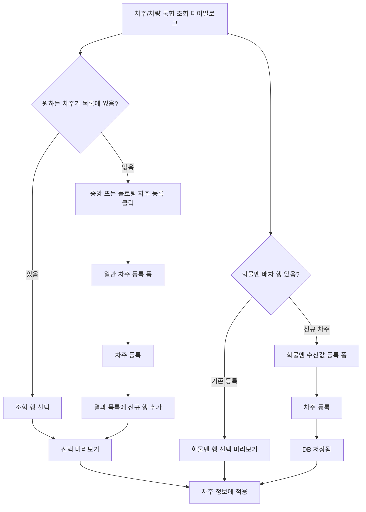

# General Driver Register Plan - Phase 2 다이얼로그 보강

## 1. 목적

`차주 등록`은 화물맨 배차 전용 기능이 아닙니다.

Phase 1의 `driver-info-section-wireframe.html`에 이미 존재하는 일반 등록 기능이며, 검색 결과에 원하는 차주/차량이 없을 때 운영자가 신규 차주를 직접 등록하는 진입입니다.

Phase 2에서는 이 기능을 유지한 상태에서 화물맨 배차 결과만 같은 다이얼로그 안에 추가합니다.

## 2. Phase 1 기준 분석

| 항목 | Phase 1 동작 |
| --- | --- |
| 진입 위치 | 검색 전 결과 영역 중앙 CTA 또는 검색/조회 후 결과 리스트 우측 상단 플로팅 `차주 등록` 버튼 |
| 기본 상태 | 오른쪽 패널은 안내 또는 선택 미리보기 |
| 버튼 클릭 | 선택 미리보기를 숨기고 `차주 등록` 폼 표시 |
| 등록 필드 | 차주명, 차량번호, 차주 연락처, 톤수, 차종 |
| 등록 완료 | 조회 결과 목록 최상단에 신규 행 추가 |
| 자동 선택 | 새로 추가된 행을 자동 선택하고 선택 미리보기로 전환 |
| 적용 | `차주 정보에 적용`으로 row에 반영 |

## 3. Phase 2 적용 원칙

| 원칙 | 적용 기준 |
| --- | --- |
| 일반 등록 유지 | 검색 전 중앙 CTA와 검색 후 플로팅 CTA로 화물맨 상태와 무관하게 사용 가능 |
| 다이얼로그 골격 유지 | 검색 영역, 결과 목록, 오른쪽 패널, 하단/우측 CTA 구조는 Phase 1과 동일 |
| 화물맨과 분리 | 화물맨 배차 결과는 상단 고정 행과 배지로만 구분 |
| 같은 폼 재사용 | 일반 신규 등록과 화물맨 신규 차주 저장 모두 같은 등록 폼을 사용 |
| 출처 분리 | 일반 등록은 `내부 DB 신규`, 화물맨 수신값 등록은 `화물맨 배차`로 표시 |

## 4. 상태별 UI 규칙

| 상태 | `차주 등록` 버튼 | 오른쪽 패널 | 적용 버튼 |
| --- | --- | --- | --- |
| 내부 DB 조회 | 검색 전 중앙 CTA, 조회 후 플로팅 CTA | 안내 또는 선택 미리보기 | 행 선택 후 활성 |
| 일반 신규 등록 | 중앙/플로팅 CTA 클릭으로 진입 | 빈 등록 폼 또는 기본값 입력 | 등록 전 비활성 |
| 일반 등록 완료 | 신규 행 자동 선택 | 선택 미리보기 | 활성 |
| 화물맨 기존 차주 | 검색 바 버튼은 유지 | 화물맨 행 선택 미리보기 | 활성 |
| 화물맨 신규 차주 | 검색 바 버튼은 유지 | 화물맨 수신값이 채워진 등록 폼 | 등록 전 비활성 |
| 화물맨 신규 등록 완료 | 등록 버튼 숨김 | 등록 완료 상태 | 활성 |

## 5. 다이얼로그 흐름

## 6. 구현 반영 기준

| 구현 항목 | 기준 |
| --- | --- |
| 검색 바 | `[조회] [검색 초기화]` 순서, `차주 등록`은 검색 전 중앙 CTA/검색 후 플로팅 CTA로 분리 |
| 일반 등록 진입 | `data-dialog-register-open` 버튼으로 오른쪽 등록 폼 표시 |
| 일반 등록 저장 | 신규 내부 DB 행을 결과 목록에 추가하고 자동 선택 |
| 화물맨 신규 저장 | 외부 배차 행의 수신값을 등록 폼에 자동 입력하고 등록 전 적용 제한 |
| 문구 | 일반 등록은 `차주 등록`, 화물맨 저장 맥락은 `화물맨 수신값으로 차주 등록` |

## 7. 추가 확인 필요

| 항목 | 이유 |
| --- | --- |
| 중복 검증 기준 | 차량번호/연락처가 이미 존재할 때 신규 저장 또는 기존 연결 여부 결정 필요 |
| 저장 범위 | 차주 마스터 저장인지, 현재 오더 임시 등록인지 정책 필요 |
| 화물맨 식별값 | 화물맨 배차 결과와 내부 DB 차주를 연결할 외부 ID 저장 정책 필요 |
