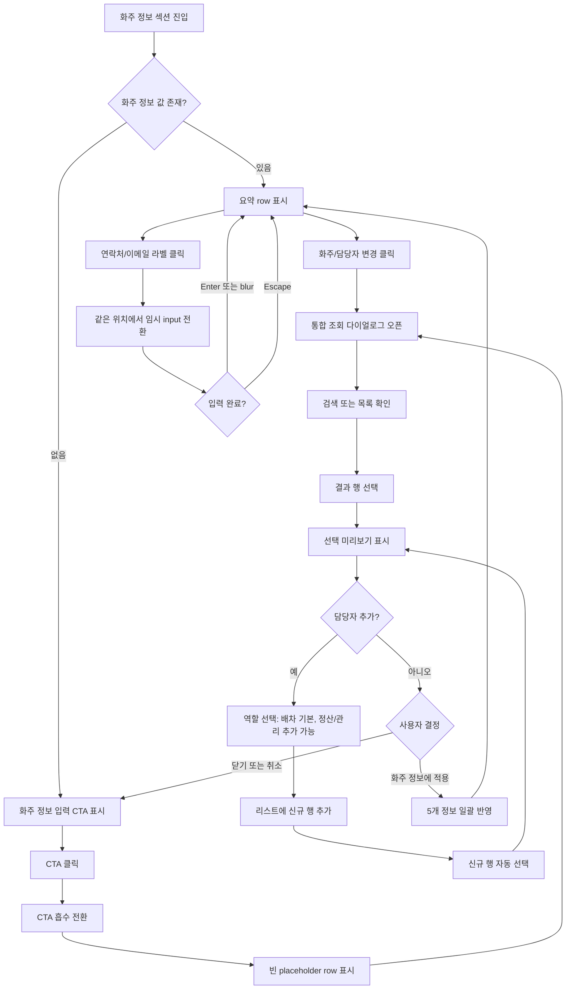

# Wireframe: 화주 정보 섹션

## 설계 목표

화주 정보는 운송구간과 화물 운송정보처럼, 값이 입력된 후에는 입력 폼이 아니라 요약 정보로 보여주는 것이 목표입니다.

기본 화면에서는 `화주 업체명`, `사업자 번호`, `담당자명`, `담당자 연락처`, `담당자 이메일`을 한 줄에서 스캔하고, 수정할 때만 해당 항목이 input으로 전환됩니다.

## Screen 목록

| Screen ID | 이름 | 목적 |
| --- | --- | --- |
| `SCR-SI-001` | 값 있음 요약 row | 입력된 화주 정보를 한 줄로 확인 |
| `SCR-SI-002` | 값 없음 CTA 전환 | 화주 정보가 없을 때 입력 진입을 명확히 표시 |
| `SCR-SI-003` | Inline edit | 특정 항목만 같은 위치에서 수정 |

## 현재 기준 구조

```text
[1 화주 정보]                         [화주 업체와 담당자 연락 정보]

화주 업체명              사업자 번호
업체명 입력              000-00-00000

담당자명       담당자 연락처       담당자 이메일
담당자명 입력   010-0000-0000      name@company.com
```

## 제안 A: 값 있음 요약 row

```text
[1 화주 정보]                                      [필수 5개 항목]

[화주]  화주 업체명       사업자 번호        담당자명      연락처             이메일              [수정]
       로지스팩토리       123-45-67890      김민수        010-1234-5678     minsu@logis.co.kr
```

장점:
- 사용자는 입력창을 모두 읽지 않아도 화주 정보를 빠르게 훑을 수 있습니다.
- 운송구간 D안과 화물 운송정보 row 패턴과 같은 감각을 유지합니다.
- 담당자 연락처와 이메일이 같은 행에 있어 연락 수단 확인이 빠릅니다.

## 제안 B: 값 없음 CTA 전환

```text
값 없음

[화주]  ---------------------------------------------------------   [화주 정보 입력]

CTA 클릭 후

[화주]  화주 업체명 입력   사업자 번호 입력   담당자명 입력   연락처 입력   이메일 입력
        ↓
화주/담당자 통합 조회 다이얼로그 오픈
```

전환 기준:
- `화주 정보 입력` CTA가 왼쪽 `화주` 라벨 방향으로 이동하며 사라집니다.
- 사라진 뒤에는 항상 노출되는 화주 row가 나타납니다.
- 운송정보 섹션의 `운송 조건 선택` 전환과 같은 사용자 경험을 사용합니다.
- 다이얼로그에서 선택을 완료해야 실제 값이 row에 반영됩니다.
- 선택 없이 `닫기` 또는 `취소`를 누르면 row도 닫히고 다시 `화주 정보 입력` CTA 상태로 돌아갑니다.

## 제안 B-1: 화주/담당자 통합 조회 다이얼로그

```text
[화주/담당자 통합 조회]

검색어: [로지스 또는 김민수________________] [조회]
[통합검색] [업체명] [사업자 번호] [담당자명] [연락처] [이메일]

업체명          사업자번호       담당자명   담당자 연락처     담당자 이메일
로지스팩토리    123-45-67890    김민수     010-1234-5678    minsu@logis.co.kr
코덱트 물류     211-86-45210    박서연     010-8181-7061    sy.park@codect.co.kr
한빛산업        407-12-90231    이하준     010-4159-4636    hajun@hanbit.kr
역할            배차 / 정산 / 관리 칩으로 표시

선택 미리보기
업체명 / 사업자 / 담당자 / 연락처 / 이메일 / 역할

[취소] [화주 정보에 적용]
```

선택 기준:
- 행 클릭은 선택만 합니다.
- 오른쪽 미리보기에서 선택값을 확인합니다.
- `화주 정보에 적용`을 눌렀을 때 5개 항목이 한꺼번에 반영됩니다.
- 선택 상태는 행 왼쪽 선택 표시와 오른쪽 미리보기의 `적용 대기` 상태로 함께 표시합니다.
- 담당자 추가 영역은 행을 선택하기 전에는 보이지 않고, 선택 이후 우측 선택 미리보기 하단에 노출합니다.
- 담당자 추가 폼의 역할 구분은 `배차`, `정산`, `관리` 멀티 선택이며, 기본값은 `배차`입니다.
- 담당자 추가 후 새 행에는 `신규` 배지를 표시하고 자동 선택합니다.
- 현재 적용된 화주 정보 요약 row의 `수정` 버튼은 `화주/담당자 변경`으로 바꾸고, 동일한 통합 조회 다이얼로그를 다시 엽니다.
- 다이얼로그 조회 리스트의 연락처/이메일은 직접 input으로 바꾸지 않습니다.

독립 HTML 상태 보기:
- `적용 후 row`, `입력 전/조회`, `수정 기준`, `변경 애니메이션`을 상단 탭으로 전환합니다.
- B 통합본에는 이 탭 구조를 넣지 않고, 확정된 최종 row만 반영합니다.
- 담당자 연락처/이메일 값에는 점선 밑줄을 붙이고, `수정` 배지는 기본 숨김 후 hover/focus 때만 노출합니다.

## 제안 C: 적용된 화주 정보 row Inline edit

```text
기본 표시

[화주 정보 row]
화주   로지스팩토리   123-45-67890   김민수   010-1234-5678   minsu@logis.co.kr   [화주/담당자 변경]

연락처 또는 이메일 hover/focus

화주   로지스팩토리   123-45-67890   김민수   010-1234-5678 [수정]   minsu@logis.co.kr [수정]   [화주/담당자 변경]

적용된 row의 연락처 클릭

화주   로지스팩토리   123-45-67890   김민수   [010-1234-5678 입력중]   minsu@logis.co.kr [수정]   [화주/담당자 변경]
```

입력 기준:
- 다이얼로그에서 화주/담당자를 선택하고 `화주 정보에 적용`한 뒤, 다이얼로그가 닫힌 상태의 화주 정보 row에서 제공합니다.
- 화주 정보 row의 `담당자 연락처`, `담당자 이메일` 라벨을 클릭하면 같은 위치에서 input으로 바뀝니다.
- `Enter` 또는 blur 시 표시값으로 되돌아갑니다.
- `Escape`는 수정 전 값으로 되돌립니다.
- 다이얼로그 조회 리스트 안의 연락처/이메일은 input으로 바꾸지 않습니다.
- 업체명, 사업자 번호, 담당자명 변경은 `화주/담당자 변경`으로 다시 조회합니다.
- validation 상세 문구는 후속 단계에서 정의합니다.

## Field 상태 매핑

| 필드 | 값 있음 표시 | 값 없음 표시 | 수정 방식 |
| --- | --- | --- | --- |
| 화주 업체명 | 업체명 텍스트 | 업체명 입력 | 다이얼로그 재선택 |
| 사업자 번호 | `000-00-00000` 형식 | 사업자 번호 입력 | 다이얼로그 재선택 |
| 담당자명 | 이름 텍스트 | 담당자명 입력 | 다이얼로그 재선택 또는 담당자 추가 |
| 담당자 연락처 | 휴대폰 또는 대표번호 | 연락처 입력 | 적용된 화주 정보 row에서 임시 inline input |
| 담당자 이메일 | 이메일 주소 | 이메일 입력 | 적용된 화주 정보 row에서 임시 inline input |

## 화주/담당자 변경 애니메이션 후보

독립 HTML의 `변경 애니메이션` 탭에서 비교하며, 최종 적용안은 A안입니다.

| 후보 | 이름 | 의도 | 판단 포인트 |
| --- | --- | --- | --- |
| A | 버튼 흡수형 | 기존 CTA 흡수 전환과 가장 일관적 | 최종 적용안 |
| B | Row 하이라이트형 | 변경 범위가 row 전체임을 강조 | 참고 후보 |
| C | 버튼 눌림 + Dialog 확대 | 가장 익숙한 버튼 피드백 | 참고 후보 |
| D | 버튼에서 검색창 연결형 | 변경 액션이 조회 검색으로 이어짐을 표시 | 참고 후보 |
| E | Row 접힘 전환형 | 기존 row가 교체되는 느낌을 강하게 표시 | 참고 후보 |

## User flow



## 담당자 추가 UI 대안

| 대안 | 설명 | 장점 | 단점 | 추천 |
| --- | --- | --- | --- | --- |
| A. 다이얼로그 내부 추가 | 조회 화면 하단에 담당자 추가 폼을 바로 둔다 | 가장 빠르게 접근 가능 | 조회와 입력이 경쟁해 복잡해짐 | 보류 |
| B. 선택 행 아래 펼침 | 선택한 화주 행 또는 결과 영역 아래에 담당자 추가 폼을 펼친다 | 화주 맥락을 유지하면서 담당자만 추가 가능 | 선택 행이 먼저 필요함 | 보류 |
| C. 우측 미니 패널 | 선택 미리보기 하단에 담당자 추가 패널을 연다 | 선택값 확인과 담당자 추가가 같은 맥락에 있음 | 우측 영역이 길어질 수 있음 | 1차 추천 |
 
HTML wireframe에서는 대안 비교 카드는 표시하지 않고, C안을 추천안으로 선택 이후에만 구현합니다.

## B 통합본 반영 기준

1. B 통합본의 `1. 화주 정보` 섹션은 운송구간 상단 1열 요약 row로 반영했습니다.
2. `화주/담당자 변경` 버튼은 A안 `버튼 흡수형` 전환 후 조회 다이얼로그를 엽니다.
3. 조회 결과 선택 후 `화주 정보에 적용`을 누르면 업체명, 사업자 번호, 담당자명, 연락처, 이메일이 row에 반영됩니다.
4. 조회 행을 선택하면 우측 미리보기 하단에서 담당자를 추가할 수 있습니다.
5. 담당자 추가 시 `배차`가 기본 선택되며, `정산`, `관리`는 멀티 선택할 수 있습니다.
6. 신규 담당자 행은 조회 리스트 최상단에 추가되고 자동 선택됩니다.
7. 연락처와 이메일은 적용 후 row에서 같은 위치의 inline input으로 임시 수정합니다.
8. 화주 정보, 운송구간, 화물 운송정보의 주요 row는 32px 전후 높이와 52px 라벨 컬럼 리듬을 기준으로 맞춥니다.
9. 사업자 번호 검증, 담당자 자동완성, 실제 API 연동은 후속 상세 기능으로 분리합니다.
