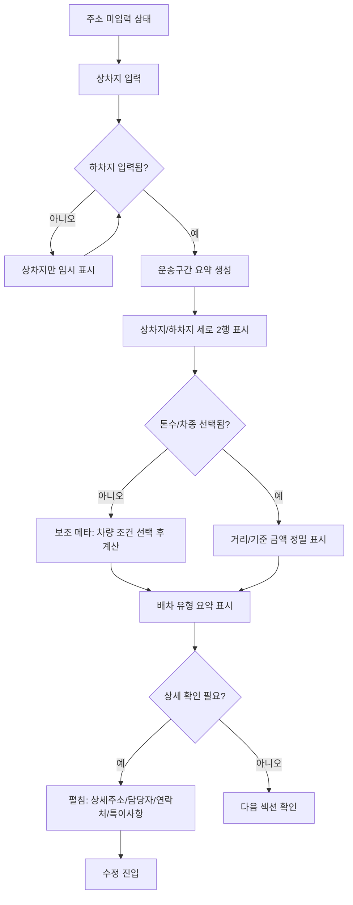

# User Flow: 운송구간 섹션

## 흐름 요약

D `compact-hybrid`를 1차 기준안으로 본다. 사용자는 주소 입력 전에는 빈 상태를 보고, 주소가 적용되면 D안의 닫힘 요약을 먼저 확인하며, 필요할 때만 상세를 열어 라벨이 붙은 상세 정보를 확인한다.



## 1. 주소 미입력 상태

| 항목 | 내용 |
| --- | --- |
| 진입 조건 | 상차지와 하차지 주소가 모두 없거나 좌표가 적용되지 않음 |
| 화면 | 빈 상태 폼시트 |
| 사용자 행동 | 상차지 주소 검색 또는 직접 입력 |
| 다음 상태 | 상차지 입력 |

### 사용자에게 보여줄 내용

```txt
상차지와 하차지를 입력하면 운송구간이 생성됩니다.
주소 검색 또는 직접 입력으로 시작하세요.
```

## 2. 상차지 입력

| 항목 | 내용 |
| --- | --- |
| 진입 조건 | 상차지 주소가 선택됨 |
| 화면 | 상차지 행만 부분 표시 가능 |
| 사용자 행동 | 하차지 주소 검색 또는 직접 입력 |
| 다음 상태 | 하차지 입력 |

### 규칙

- 상차지명 값이 있으면 표시한다.
- 상차지명 값이 없으면 주소부터 표시한다.
- 하차지가 없으면 거리/운송료 계산은 보류한다.
- 상차/하차 주소가 모두 있어도 화물 운송정보의 `톤수`와 `차종`이 없으면 기준 금액은 `차량 조건 선택 후 계산` 상태로 둔다.

## 3. 하차지 입력

| 항목 | 내용 |
| --- | --- |
| 진입 조건 | 하차지 주소가 선택됨 |
| 화면 | 상차지 행과 하차지 행이 세로 2행으로 표시 |
| 사용자 행동 | 운송구간 요약 확인 |
| 다음 상태 | 운송구간 요약 생성 |

## 4. 운송구간 요약 생성

| 표시 항목 | 상차지 | 하차지 |
| --- | --- | --- |
| 행 제목 | `[상차지]` | `[하차지]` |
| 지명 | 값이 있으면 표시 | 값이 있으면 표시 |
| 주소 | 상세주소 제외 | 상세주소 제외 |
| 일시/방법 | `지금 · 지게차` | `당일 · 지게차` |
| 특이사항 | `특이사항 2` | `특이사항 1` |

### 배차 유형 요약

배차 유형은 상차지 또는 하차지 한 행에 속하지 않고 운송구간 전체에 적용된다. 따라서 상차/하차 2행 위 또는 아래에 한 번만 표시한다.

| 조건 | 표시 |
| --- | --- |
| 대표 유형 선택 | 기본값은 `독차`, 사용자가 전환하면 `혼적` 표시. 두 값은 동시에 선택하지 않음 |
| 추가 옵션 있음 | `긴급`, `왕복`, `예약`은 각각 독립 멀티선택이며 선택된 값만 칩으로 추가 |
| 추가 옵션 없음 | 세 옵션이 모두 꺼져 있으면 옵션 칩을 숨기거나 `옵션 없음`을 약하게 표시 |
| 경유지 있음 | `경유 1`처럼 수량 표시 |
| 초기 입력 전 | `배차 유형 선택 전` 문구는 유지 가능하되 대표 기본값은 `독차`로 초기화 |

### 거리/기준 금액 보조 메타

| 조건 | 표시 |
| --- | --- |
| 상차/하차 주소 미완성 | `주소 입력 후 계산` |
| 주소 완료, 톤수 또는 차종 미선택 | `톤수·차종 선택 후 계산` |
| 주소 완료, 톤수/차종 선택 완료 | `거리 15.8km · 기준 금액 105,000원` |
| 톤수 또는 차종 변경 | `차량 조건 변경됨 · 다시 계산` |

거리와 기준 금액은 운송구간 주소만으로 확정하지 않는다. 화물 운송정보의 `톤수`, `차종` 선택값을 함께 보고 더 정확하게 표시한다.

### 표시 방식 선택

| 표시안 | 흐름에서의 의미 |
| --- | --- |
| A `sheet-row` | 운영자가 빠르게 확인하는 기본 명세표 흐름 |
| B `sheet-card` | 행 비교는 유지하면서 상차/하차 구분감을 강화하는 흐름 |
| C `stacked-card` | 설명형 확인 또는 모바일에서 읽기 쉬운 비교 흐름 |
| D `compact-hybrid` | 1차 기준 흐름. B안의 명세 구조를 유지하면서 기본 라벨을 숨겨 row height를 줄이는 흐름 |

### D안 상태 흐름

| 순서 | 상태 | 사용자에게 보이는 변화 |
| --- | --- | --- |
| 1 | 주소 미적용 | 상차/하차 placeholder와 `주소 입력 후 계산` 메타 표시 |
| 2 | 상차 입력 | 상차 행만 값 중심으로 표시하고 하차는 입력 대기 |
| 3 | 닫힘 요약 | 상차/하차 2행이 라벨 없이 컴팩트하게 표시 |
| 4 | 상세 열림 | 상세주소, 담당자/연락처, 특이사항 요약 라벨 표시 |
| 5 | 계산 완료 | 톤수/차종 선택 후 거리와 기준 금액 정밀값 표시 |

### B 통합본 흐름 변경

| 이전 흐름 | 변경 후 |
| --- | --- |
| 1번 운송구간 확인 후 우측 5번 배차 유형 확인 | 1번 운송구간 하단 보조 메타에서 배차 유형을 바로 확인 |
| 6번 상차 조건 섹션에서 상차방법/상차일시 확인 | 상차 행 summary와 펼침 상세에서 확인 |
| 7번 하차 조건 섹션에서 하차방법/하차일시 확인 | 하차 행 summary와 펼침 상세에서 확인 |
| 사용자가 좌측 운송구간과 우측 조건 섹션을 왕복 확인 | full-width 운송구간 안에서 경로, 조건, 계산 메타를 한 번에 스캔 |

## 5. 펼치기/접기

| 항목 | 내용 |
| --- | --- |
| 진입 조건 | 사용자가 상세 펼침을 선택 |
| 펼침 정보 | 상세주소, 담당자명, 연락처, 특이사항 요약 |
| 접기 후 | 기본 2행 요약으로 복귀 |

### 펼침 정보 예시

```txt
상차 상세
상세주소: 18-1 코덱트 후진입차
담당자: 김상차
연락처: 010-1234-5678
특이사항: 진입로 협소, 10분 전 연락 필요
```

## 6. 수정 진입 흐름

| 트리거 | 동작 |
| --- | --- |
| 상차지 행 클릭 | 상차지 검색/주소 입력 필드로 포커스 이동 |
| 하차지 행 클릭 | 하차지 검색/주소 입력 필드로 포커스 이동 |
| 상세 펼침 후 수정 | 담당자/연락처/특이사항 입력 필드로 이동 |

## 예외 흐름

| 예외 | 처리 |
| --- | --- |
| 상차지명 없음 | 지명 줄을 숨기고 주소를 첫 정보로 표시 |
| 하차지명 없음 | 지명 줄을 숨기고 주소를 첫 정보로 표시 |
| 일시 없음 | `일시 미정` 표시 여부는 후속 결정. 기본 HTML 샘플에서는 날짜 있는 상태와 빈 상태를 분리 |
| 방법 없음 | 기본 요약에서는 방법 부분을 숨기고 펼침에서 입력 필요 표시 |
| 특이사항 없음 | 배지를 표시하지 않음 |
