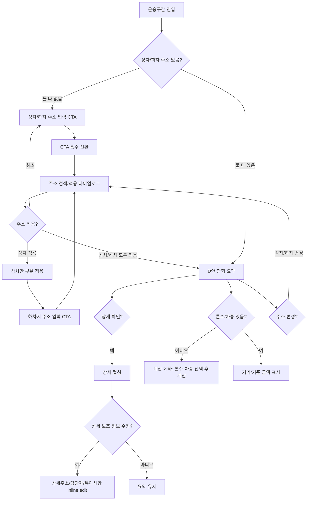

# Additional Wireframe Plan: 운송구간 완성도 보강

## 목적

이 문서는 `화주 정보` 섹션의 1차 마무리 수준을 기준으로, `운송구간` 섹션에 추가로 필요한 와이어프레임 화면을 계획한다.

기존 D안 `compact-hybrid`의 큰 레이아웃은 유지한다. 새 구조를 만드는 것이 아니라, 주소 입력 전/수정/계산 의존성/메타 편집처럼 아직 별도 화면으로 충분히 고정되지 않은 상태를 보강한다.

## 참고 기준

| 구분 | 파일 | 참고 포인트 |
| --- | --- | --- |
| 화주 정보 closeout | `sections/shipper-info/03-closeout-shipper-info.md` | 완료 기준, 검증 상태, 남은 보류 항목 정리 수준 |
| 화주 정보 HTML | `sections/shipper-info/shipper-info-section-wireframe.html` | CTA 흡수 전환, 조회 다이얼로그, 적용 후 row, inline edit |
| 운송구간 closeout | `sections/transport-route/08-closeout-transport-route.md` | D안 기준, B 통합본 반영 상태, 보류 항목 |
| 운송구간 workflow HTML | `sections/transport-route/transport-route-d-workflow.html` | 닫힘/열림/주소 미적용/부분 입력/계산 완료 상태 |
| B 통합본 | `results/wireframe/order-register-new2.0/Cargo Order Wireframe B Original Tone.html` | 실제 통합 화면의 full-width 배치와 오른쪽 메타 영역 |

## 현재 유지할 기준

| 항목 | 유지 기준 |
| --- | --- |
| 기본 레이아웃 | D `compact-hybrid` 유지 |
| 상차/하차 배치 | 좌우 2열이 아니라 세로 2행 유지 |
| B 통합본 폭 | 운송구간은 full-width 유지 |
| 오른쪽 메타 | 상차/하차 2행 오른쪽에 배차 유형, 계산 메타 배치 |
| 기본 요약 | 지명, 주소, 일시/방법, 특이사항 배지만 노출 |
| 펼침 정보 | 상세주소, 담당자/연락처, 특이사항 요약만 노출 |
| 선택 UI | 상차일시/방법, 하차일시/방법 선택 화면은 별도 구현 대상으로 유지 |
| 계산 의존성 | 거리/기준 금액은 주소와 `톤수`, `차종` 선택 후 더 정확하게 표시 |

## 추가 화면 목록

| 우선순위 | Screen ID | 화면/상태 | 목적 | 산출 방식 |
| --- | --- | --- | --- | --- |
| P0 | `SCR-TR-006` | B 통합본 주소 미입력 CTA 흡수 | 화주 정보와 같은 진입 전환으로 주소 입력 시작점을 명확히 함 | 독립 HTML 추가 또는 D workflow 확장 |
| P0 | `SCR-TR-007` | 상차만 입력된 부분 적용 상태 | 상차 입력 후 하차가 남은 중간 상태를 B 통합본 밀도에서 확인 | D workflow 확장 |
| P0 | `SCR-TR-008` | 주소 검색/적용 다이얼로그 | 주소, 지명, 상세주소, 담당자, 연락처를 선택/입력 후 row에 반영 | 신규 와이어프레임 권장 |
| P1 | `SCR-TR-009` | 적용 후 주소 변경 진입 | 적용된 상차/하차 row에서 다시 주소 검색으로 들어가는 흐름 정의 | D workflow 확장 |
| P1 | `SCR-TR-010` | 펼침 상세 inline edit | 상세주소, 담당자/연락처, 특이사항만 펼침 안에서 가볍게 수정 | 신규 상태 추가 |
| P1 | `SCR-TR-011` | 계산 메타 의존성 상태 | 주소만 있음, 톤수/차종 없음, 재계산 필요, 계산 완료 상태를 비교 | 오른쪽 메타 비교안 |
| P2 | `SCR-TR-012` | 배차 유형 편집 popover | 독차/혼적 대표 선택과 긴급/왕복/예약 멀티선택 편집 흐름 정의 | 오른쪽 메타 세부안 |
| P2 | `SCR-TR-013` | 모바일/좁은 폭 대응 | full-width 구조가 1열로 접힐 때 상차/하차/메타 순서 확인 | responsive wireframe |

## P0 화면 1: 주소 미입력 CTA 흡수

화주 정보의 `화주 정보 입력` 버튼과 같은 방식으로, 주소가 없을 때는 큰 입력 폼을 노출하지 않고 CTA가 라벨 방향으로 흡수된 뒤 항상 노출 row로 전환한다.

```text
초기

[운송]  ------------------------------------------------------  [상차지 주소 입력] [하차지 주소 입력]
        배차 유형: 독차(기본)
        계산 메타: 주소 입력 후 계산

상차 CTA 클릭 후

[운송]  [상차] 상차지명 입력 | 주소 입력 | 일시/방법 선택 | 특이사항 0
        [하차] ------------------------------------------------ [하차지 주소 입력]
        배차 유형: 독차(기본)
        계산 메타: 하차지 입력 후 계산
```

### 규칙

| 항목 | 기준 |
| --- | --- |
| 전환 방식 | CTA가 해당 라벨 방향으로 이동하며 사라지고 placeholder row가 나타남 |
| 상차/하차 독립성 | 상차와 하차 CTA는 각각 독립적으로 전환 가능 |
| 실제 값 반영 | 주소 검색/적용 완료 후 row 값으로 치환 |
| 취소 | 주소 선택 없이 닫으면 해당 row는 다시 CTA 상태로 복귀 |
| B 통합본 | 탭 구조 없이 최종 interaction만 반영 |

## P0 화면 2: 상차만 입력된 부분 적용 상태

상차 주소만 적용된 상태는 신규 오더 입력 중 자주 발생할 수 있다. 이 상태가 없으면 운송구간이 갑자기 완성 상태로만 보인다.

```text
[운송 구간]

상차 | 코덱트 후진입차 | 경기 여주시 산북면 후리 | 지금 / 지게차 | 특이사항 2 | 펼침
하차 | ------------------------------------------------------- | [하차지 주소 입력]

오른쪽 메타
배차 유형: 독차(기본)
계산 메타: 하차지 입력 후 계산
```

### 규칙

| 항목 | 기준 |
| --- | --- |
| 상차 row | D안 요약 구조로 표시 |
| 하차 row | 같은 높이의 CTA placeholder로 표시 |
| 계산 메타 | 거리/기준 금액을 확정하지 않고 `하차지 입력 후 계산` 표시 |
| 배차 유형 | 주소 입력 완료 여부와 관계없이 기본 `독차` 표시 |

## P0 화면 3: 주소 검색/적용 다이얼로그

운송구간은 화주 정보와 다르게 좌표, 주소 정규화, 상세주소가 중요하다. 따라서 지명/주소는 단순 inline edit보다 주소 검색/적용 다이얼로그가 더 적합하다.

```text
[상차지 주소 입력]

검색어: [코덱트 후진입차 또는 여주시 산북면________] [검색]

검색 결과
업체/장소명        주소                         최근 사용     선택
코덱트 후진입차    경기 여주시 산북면 후리       최근 3회      ○
산북 물류창고      경기 여주시 산북면 상품리     최근 1회      ○

선택 미리보기
상차지명        코덱트 후진입차
주소            경기 여주시 산북면 후리
상세주소        [18-1 코덱트 후진입차________]
담당자          [김상차______________________]
연락처          [010-1234-5678______________]
특이사항        [진입로 협소, 10분 전 연락 필요]

[취소] [상차지에 적용]
```

### 규칙

| 항목 | 기준 |
| --- | --- |
| 상차/하차 구분 | 같은 다이얼로그를 쓰되 제목과 적용 버튼만 `상차지`, `하차지`로 변경 |
| 검색 결과 | 장소명, 주소, 최근 사용 여부를 한 행으로 표시 |
| 선택 미리보기 | row 반영 전에 지명, 주소, 상세주소, 담당자, 연락처, 특이사항 확인 |
| 적용 시 | 기본 요약 row에는 지명, 주소, 일시/방법, 특이사항 수량만 반영 |
| 상세 반영 | 상세주소, 담당자/연락처, 특이사항 요약은 펼침 상태에 반영 |
| 제외 | 상차일시/방법, 하차일시/방법 선택 UI는 이 다이얼로그에 넣지 않음 |

## P1 화면 4: 적용 후 주소 변경 진입

적용된 row에서 주소를 바꾸는 방식은 화주 정보의 `화주/담당자 변경`과 같은 원리로 둔다. 다만 운송구간은 행이 2개이므로 상차/하차 각각의 변경 진입을 분리한다.

```text
상차 | 코덱트 후진입차 | 경기 여주시 산북면 후리 | 지금 / 지게차 | 특이사항 2 | [변경]
하차 | 무갑리 현장     | 경기 광주시 초월읍 무갑리 | 당일 / 지게차 | 특이사항 1 | [변경]

상차 변경 클릭
→ 상차 row가 짧게 강조
→ 상차지 주소 검색 다이얼로그 오픈
```

### 규칙

| 항목 | 기준 |
| --- | --- |
| row 클릭 | 전체 row 클릭은 펼침과 충돌할 수 있으므로 명시적 `변경` 액션을 우선 검토 |
| 변경 전환 | 화주 정보 A안과 같은 `버튼 흡수형` 또는 row highlight 후보 비교 |
| 적용 후 | 기존 row 위치에서 새 주소 정보로 치환 |
| 취소 | 기존 적용값 유지 |

## P1 화면 5: 펼침 상세 inline edit

상세주소, 담당자/연락처, 특이사항은 좌표 계산과 직접 연결되지 않는 보조 정보다. 따라서 펼침 상태에서 같은 위치의 inline input으로 바꾸는 방식이 적합하다.

```text
상차 상세 펼침

상세주소        18-1 코덱트 후진입차      [수정]
담당자/연락처   김상차 / 010-1234-5678   [수정]
특이사항 요약   진입로 협소               [수정]

상세주소 클릭

상세주소        [18-1 코덱트 후진입차________]
담당자/연락처   김상차 / 010-1234-5678
특이사항 요약   진입로 협소
```

### 규칙

| 항목 | 기준 |
| --- | --- |
| 수정 가능 항목 | 상세주소, 담당자명, 연락처, 특이사항 요약 |
| 수정 제외 항목 | 행정주소, 좌표, 상차/하차 일시, 상차/하차 방법 |
| 표시 방식 | 화주 정보처럼 `수정` 배지는 기본 숨김, hover/focus 때만 노출 |
| 저장 범위 | 현재 오더 적용값 우선. 장소 마스터 저장 여부는 후속 정책 |

## P1 화면 6: 계산 메타 의존성 상태

거리와 기준 금액은 운송구간 주소만으로 확정하지 않는다. 화물 운송정보의 `톤수`, `차종`이 선택되어야 더 정확하게 표시된다.

```text
오른쪽 메타 상태 비교

주소 없음
계산 메타: 주소 입력 후 계산

주소 있음 / 톤수·차종 없음
계산 메타: 톤수·차종 선택 후 거리/기준 금액 계산

주소 있음 / 톤수·차종 있음
계산 메타: 거리 15.8km · 기준 105,000원

차량 조건 변경됨
계산 메타: 차량 조건 변경됨 · 다시 계산
```

### 규칙

| 항목 | 기준 |
| --- | --- |
| 운송구간 책임 | 주소 기반 경로와 계산 가능 상태 표시 |
| 화물 운송정보 책임 | 톤수, 차종, 대수, 실중량 입력 |
| 확정값 표시 | 주소 + 톤수 + 차종이 있을 때만 거리/기준 금액을 확정값처럼 표시 |
| 재계산 | 톤수 또는 차종 변경 시 `재계산 필요` 상태 표시 |

## P2 화면 7: 배차 유형 편집 popover

현재 운송구간은 배차 유형을 오른쪽 메타에 표시한다. 다음 단계에서는 표시만 할지, 바로 편집까지 허용할지 결정해야 한다.

```text
배차 유형: 독차(기본) · 예약 · 경유 없음   [변경]

변경 클릭

대표 유형
(●) 독차    ( ) 혼적

추가 옵션
[ ] 긴급   [ ] 왕복   [x] 예약

경유
경유 없음 / 경유 1 / 경유 2

[취소] [적용]
```

### 규칙

| 항목 | 기준 |
| --- | --- |
| 대표 유형 | `독차`, `혼적`은 단일 선택. 기본은 `독차` |
| 멀티 옵션 | `긴급`, `왕복`, `예약`은 각각 선택 가능하며 모두 미선택 가능 |
| 경유 | 경유 수가 있으면 `경유 N`으로 요약 |
| 중복 방지 | 상차/하차 row 안에는 `독차/예약` 같은 칩을 반복하지 않음 |

## P2 화면 8: 모바일/좁은 폭 대응

full-width 구조가 좁은 화면에서는 상차/하차와 오른쪽 메타가 세로로 접혀야 한다.

```text
모바일

[운송 구간]
상차 | 코덱트 후진입차
      경기 여주시 산북면 후리
      지금 / 지게차 · 특이사항 2

하차 | 무갑리 현장
      경기 광주시 초월읍 무갑리
      당일 / 지게차 · 특이사항 1

배차 유형
독차(기본) · 예약 · 경유 없음

계산 메타
톤수·차종 선택 후 거리/기준 금액 계산
```

### 규칙

| 항목 | 기준 |
| --- | --- |
| 순서 | 상차, 하차, 배차 유형, 계산 메타 순서 |
| 가로 스크롤 | 페이지 전체 가로 스크롤은 금지. 필요한 경우 row 내부만 최소화 |
| CTA | 주소 미입력 CTA는 row 하단이 아니라 해당 상차/하차 자리 안에 표시 |

## User flow 보강안



## B 통합본 반영 전 확인 기준

| 기준 | 확인 방법 |
| --- | --- |
| 기존 D안 유지 | 상차/하차 2행, full-width, 오른쪽 메타 구조가 유지되는지 확인 |
| 화주 정보와 전환 일관성 | CTA 흡수 전환 타이밍과 row 등장 방식이 비슷한지 확인 |
| 주소 검색 분리 | 주소/좌표 변경은 inline edit이 아니라 검색/적용 흐름으로 분리되는지 확인 |
| 상세 수정 범위 | 상세주소, 담당자/연락처, 특이사항만 inline edit인지 확인 |
| 계산 의존성 | 톤수/차종 미선택 상태에서 기준 금액이 확정값처럼 보이지 않는지 확인 |
| 중복 제거 | 상차/하차 row와 오른쪽 메타에 같은 배차/조건 칩이 반복되지 않는지 확인 |
| 모바일 대응 | 페이지 전체 가로 overflow가 없는지 확인 |

## 권장 구현 순서

1. `transport-route-d-workflow.html`에 `SCR-TR-006`, `SCR-TR-007`, `SCR-TR-011`을 먼저 추가한다.
2. 주소 검색/적용 다이얼로그를 별도 상태 또는 새 HTML로 만든다.
3. 펼침 상세 inline edit를 D workflow에 추가한다.
4. B 통합본에는 확정된 흐름만 흡수한다.
5. Playwright 또는 in-app browser로 desktop/mobile overflow와 row height를 검증한다.

## 이번 단계에서는 제외

| 제외 항목 | 이유 |
| --- | --- |
| 실제 HTML 구현 | 이번 단계는 추가 와이어프레임 계획 수립 |
| 실제 주소 검색 API | 개발 단계의 API contract 필요 |
| 상차일시/방법 선택 UI | 기존 결정대로 별도 화면에서 구현 |
| 하차일시/방법 선택 UI | 기존 결정대로 별도 화면에서 구현 |
| 실제 계산 로직 | 화물 운송정보 값과 요금 계산 정책 필요 |
