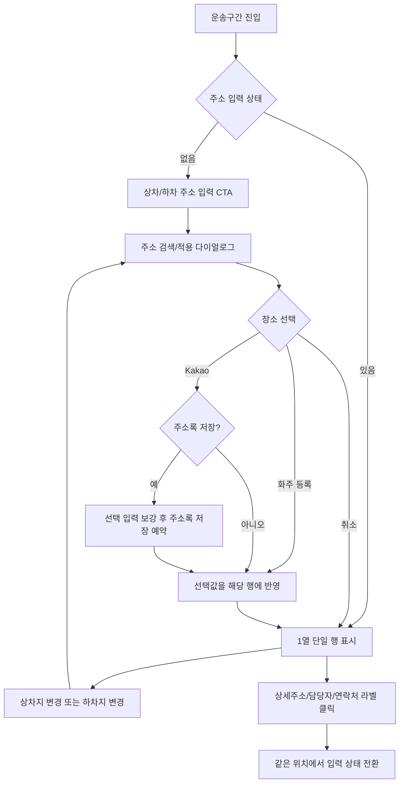

# Package Overview: 운송구간 주소 검색/적용 레이아웃

## 목적

이 문서는 기존 `transport-route-d-workflow.html`을 수정하지 않고, 별도 HTML과 하위 문서 패키지에서 운송구간의 주소 검색/적용 흐름을 정리하기 위한 개요 문서다.

이번 기준은 `1열 단일 행`이다. 상차와 하차는 각각 한 줄 명세표로 표시하고, 각 행 오른쪽 끝에 `상차지 변경`, `하차지 변경` 버튼을 둔다.

## 이번 정리 기준

| 항목 | 기준 |
| --- | --- |
| 기본 레이아웃 | 상차 1행, 하차 1행 |
| 행 구성 | 구분, 지명, 주소, 상세주소, 담당자, 연락처, 일시, 방법, 변경 버튼 |
| 주소 변경 | 각 행 오른쪽 변경 버튼에서 주소 검색/적용 다이얼로그 진입 |
| 통합 검색 | 선택된 화주의 등록 주소록과 Kakao API 검색 결과를 함께 표시 |
| Kakao 결과 저장 | 지명 또는 장소명 입력 후 화주 주소록 저장 여부 선택 |
| 화주 등록 수정 | 상세주소, 지명, 담당자, 연락처가 변경된 경우에만 수정 저장 활성 |
| 제거 범위 | 2열 정리안, 오른쪽 메타 컬럼, 펼침 구조 |
| 유지 범위 | 기존 D workflow 원본, B 원본 톤, 종이 배경, 얇은 선 스타일 |

## 기준 파일

| 파일 | 역할 |
| --- | --- |
| `transport-route-d-workflow.html` | 기존 D workflow 기준. 이번 작업에서는 수정하지 않음 |
| `transport-route-address-apply-layouts.html` | 주소 검색/적용과 1열 단일 행을 확인하는 분리 HTML |
| `address-apply-layouts/` | 주소 검색/적용 HTML 전용 문서 패키지 |
| `09-additional-wireframe-plan-transport-route.md` | 주소 입력 전, 부분 입력, 주소 검색/적용 등 추가 상태 계획 |
| `10-transport-route-quality-gap-review.md` | 화주 정보 수준 대비 운송구간 보강 gap review |
| `Cargo Order Wireframe B Original Tone.html` | B 통합본의 톤과 full-width 운송구간 기준 |

## 화면 목록

| Screen ID | 화면 | 목적 | HTML 반영 |
| --- | --- | --- | --- |
| `SCR-TR-014` | 1열 단일 행 | 상차/하차를 각각 한 줄 명세표로 표시 | 반영 |
| `SCR-TR-015` | 주소 검색/적용 | 상차/하차 변경 버튼에서 검색 다이얼로그 진입 | 반영 |
| `SCR-TR-016` | 선택 미리보기 | 지명, 주소, 상세주소, 담당자, 연락처 확인 | 반영 |
| `SCR-TR-017` | 적용 후 row 갱신 | 선택한 주소 정보를 해당 상차/하차 행에 반영 | 반영 |
| `SCR-TR-018` | 상세 수정 예시 | 상세주소, 담당자, 연락처를 라벨에서 입력 상태로 전환 | 반영 |
| `SCR-TR-019` | 화주 주소록 + Kakao 통합 검색 | 등록 주소와 외부 검색 결과를 함께 선택 | 반영 |

## 1열 단일 행

1열 단일 행은 B 통합본의 큰 레이아웃 변화 없이 주소 정보를 더 직접적으로 확인하기 위한 기준이다.

```text
[운송 구간]

상차 | 코덱트 후진입차 | 경기 여주시 산북면 후리   | 18-1 코덱트 후진입차 | 김상차 | 010-1234-5678 | 지금 | 지게차 | 상차지 변경
하차 | 무갑리 현장     | 경기 광주시 초월읍 무갑리 | 554-7 현장 입구      | 이하차 | 010-9876-5432 | 당일 | 지게차 | 하차지 변경
```

### 판단

| 항목 | 평가 |
| --- | --- |
| 추천도 | 1차 추천 |
| 이유 | 기존 D안과 B 통합본의 흐름을 크게 바꾸지 않으면서 상세주소와 담당자 정보를 바로 볼 수 있음 |
| 장점 | 펼침 없이 상차/하차 핵심 정보를 한 번에 스캔 가능 |
| 주의 | 긴 주소가 많을 수 있으므로 행 내부 컬럼 폭과 줄임 처리 확인 필요 |

## 주소 검색/적용 다이얼로그

주소 검색/적용은 상차와 하차가 같은 컴포넌트를 공유한다. 버튼을 누른 행에 따라 제목과 적용 버튼 문구만 바뀐다.

```text
[상차지 주소 검색]

검색어 [코덱트 후진입차 또는 주소 입력________] [검색]

조회 결과
[화주 등록] 코덱트 후진입차    경기 여주시 산북면 후리       최근 3회
[화주 등록] 무갑리 현장        경기 광주시 초월읍 무갑리     최근 2회
[Kakao]     산북면 후리 18-1   경기 여주시 산북면 후리       외부 검색
[Kakao]     무갑리 554-7       경기 광주시 초월읍 무갑리     중복 가능

선택 미리보기
출처          Kakao 검색 결과
주소          경기 여주시 산북면 후리
상세주소      [18-1 코덱트 후진입차]
상차지명      코덱트 후진입차
담당자        [김상차]
연락처        [010-1234-5678]

[ ] 선택된 화주의 주소록에 저장

[취소] [상차지에 적용]
```

### 적용 기준

| 항목 | 기준 |
| --- | --- |
| 상차/하차 구분 | 다이얼로그 제목과 적용 버튼 문구만 변경 |
| 조회 결과 | 화주 등록 주소록과 Kakao API 결과를 같은 리스트에서 표시 |
| 출처 구분 | `화주 등록`, `Kakao` 배지 사용 |
| row 반영 | 지명, 행정주소, 상세주소, 담당자, 연락처를 해당 행에 반영 |
| 취소 | 기존 row 유지 또는 CTA 상태 복귀 |
| 직접 수정 제외 | 행정주소와 좌표 성격의 값은 inline edit하지 않음 |
| 상세 수정 허용 | 상세주소, 담당자명, 연락처 |
| Kakao 저장 | 지명 또는 장소명이 있어야 선택된 화주의 주소록에 저장 가능 |
| 화주 등록 수정 | 기존값과 달라진 상세주소, 지명, 담당자, 연락처가 있을 때 수정 저장 가능 |

## User Flow



## HTML 구현 기준

| 항목 | 기준 |
| --- | --- |
| 기존 D workflow | 원본 파일 수정 금지 |
| 새 HTML | `transport-route-address-apply-layouts.html` 사용 |
| 톤 | 기존 종이 배경, 손글씨 폰트, 얇은 선 유지 |
| 1열 단일 행 | 같은 데이터로 상차/하차 두 행 표시 |
| 변경 버튼 | `상차지 변경`, `하차지 변경` 버튼을 행 끝에 배치 |
| 다이얼로그 | 화주 등록 주소록과 Kakao 결과를 함께 조회하고, 선택 후 적용 가능하게 구현 |
| 주소록 저장 | Kakao는 지명 입력 시 저장 가능, 화주 등록은 변경 발생 시 수정 저장 가능 |
| 검증 | HTTP 응답, script syntax, 핵심 문구, 다이얼로그 오픈 확인 |

## 결론

이번 주소 검색/적용 분리안은 1열 단일 행과 통합 검색을 기본안으로 고정한다.

2열 비교안, 오른쪽 메타, 펼침 구조는 이 하위 패키지에서 제외한다. 다음 판단은 HTML 확인 후 이 구조를 B 통합본에 반영할지 결정하는 것이다.
# 4차 추가 요약: 주소검색 다이얼로그 UX 보강

| 항목 | 결정 |
| --- | --- |
| 다이얼로그 레이아웃 | 화주 정보 섹션의 `화주/담당자 검색` 다이얼로그와 같은 검색/결과/미리보기 구조로 통일 |
| 조회 결과 | 화주 등록 주소록과 Kakao 결과를 같은 리스트에 표시하고 `출처` 배지로 구분 |
| 화주 등록 선택 | 라벨 미리보기 우선, `수정` 버튼 클릭 시 입력폼 전환 |
| Kakao 선택 | 입력폼 우선, 상세주소/지명/담당자/연락처 보강 |
| 주소록 저장 | 같은 위치에 노출하되 조건 충족 전 비활성화 |
