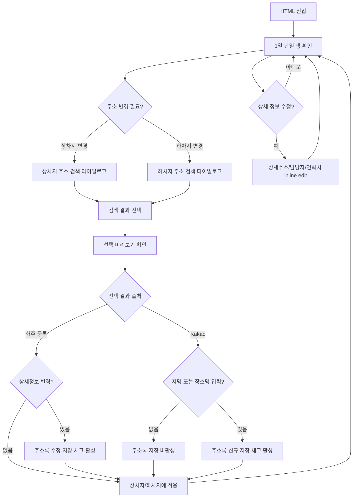

# Wireframe: 운송구간 주소 검색/적용 레이아웃

## 설계 목표

이 wireframe의 목표는 주소 검색/적용 흐름을 기존 D안과 분리해 검토하는 것입니다.

기본 원칙은 `1열 단일 행`, `주소는 다이얼로그 변경`, `상세주소/담당자/연락처는 기본 행 표시`입니다.

## Screen 목록

| Screen ID | 이름 | 목적 |
| --- | --- | --- |
| `SCR-TR-014` | 1열 단일 행 | 상차/하차 정보를 각각 한 줄로 확인 |
| `SCR-TR-016` | 주소 검색/적용 | 상차/하차 공용 주소 검색 다이얼로그 확인 |
| `SCR-TR-017` | 상세 수정 | 상세주소, 담당자, 연락처 수정 범위 확인 |
| `SCR-TR-018` | 화주 주소록 + Kakao 통합 검색 | 두 출처를 함께 조회하고 Kakao 결과 저장 여부 확인 |

## SCR-TR-014 1열 단일 행

```text
[운송 구간]

상차 | 코덱트 후진입차 | 경기 여주시 산북면 후리   | 18-1 코덱트 후진입차 | 김상차 | 010-1234-5678 | 지금 | 지게차 | [상차지 변경]
하차 | 무갑리 현장     | 경기 광주시 초월읍 무갑리 | 554-7                 | 박하차 | 010-9876-5432 | 당일 | 지게차 | [하차지 변경]
```

### 판단

| 항목 | 내용 |
| --- | --- |
| 권장도 | 1차 기준 |
| 유지되는 기준 | 상차/하차 세로 2행 |
| 제거되는 기준 | 2열 비교안, 오른쪽 메타, 펼침 구조 |
| 장점 | 기본 화면에서 상세주소, 담당자, 연락처까지 바로 확인 |
| 주의 | 행이 길어지므로 내부 스크롤 또는 컬럼 폭 조정 필요 |

## SCR-TR-016 주소 검색/적용

```text
[상차지 주소 검색]

검색어 [코덱트 후진입차________________] [검색]

○ 코덱트 후진입차 | 경기 여주시 산북면 후리       | 최근 3회
○ 무갑리 현장     | 경기 광주시 초월읍 무갑리     | 최근 2회
○ 산북 물류창고   | 경기 여주시 산북면 상품리     | 최근 1회

선택 미리보기
지명        [코덱트 후진입차]
주소        [경기 여주시 산북면 후리]
상세주소    [18-1 코덱트 후진입차]
담당자      [김상차]
연락처      [010-1234-5678]

[취소] [상차지에 적용]
```

### 동작 기준

| 항목 | 기준 |
| --- | --- |
| 상차/하차 공용 | 버튼에 따라 제목과 적용 문구만 바뀜 |
| 행 클릭 | 검색 결과 선택과 preview 갱신 |
| 적용 | 같은 데이터가 1열 단일 행에 반영 |
| 취소 | 기존 값 유지 또는 주소 미입력 CTA 상태 유지 |
| 일시/방법 | 이 다이얼로그에서 선택하지 않음 |

## SCR-TR-017 상세 수정

```text
상세 수정

상세주소  18-1 코덱트 후진입차      [수정]
담당자    김상차                    [수정]
연락처    010-1234-5678             [수정]
```

### 수정 기준

| 항목 | 방식 |
| --- | --- |
| 상세주소 | 같은 위치에서 input 전환 |
| 담당자 | 같은 위치에서 input 전환 |
| 연락처 | 같은 위치에서 input 전환 |
| 행정주소 | inline edit 제외 |
| 지명 | 주소 검색/적용 다이얼로그에서 변경 |

## SCR-TR-018 화주 주소록 + Kakao 통합 검색

```text
[상차지 주소 검색]

검색어 [코덱트 후진입차 또는 주소 입력________] [검색]

조회 결과
○ [화주 등록] 코덱트 후진입차 | 경기 여주시 산북면 후리       | 최근 3회
○ [화주 등록] 무갑리 현장     | 경기 광주시 초월읍 무갑리     | 최근 2회
○ [Kakao]     산북면 후리 18-1 | 경기 여주시 산북면 후리 18-1  | 외부 검색
○ [Kakao]     무갑리 554-7     | 경기 광주시 초월읍 무갑리 554-7 | 중복 가능

선택 미리보기
출처        [Kakao 검색 결과]
주소        [경기 여주시 산북면 후리]
상세주소    [18-1]                   선택 입력
상차지명    [산북면 후리 18-1]       저장 시 필수
담당자      [                    ]   선택 입력
연락처      [                    ]   선택 입력

[ ] 선택된 화주의 주소록에 저장

[취소] [상차지에 적용]
```

### 동작 기준

| 항목 | 기준 |
| --- | --- |
| 출처 구분 | 결과 row 안에 `화주 등록`, `Kakao` 배지 표시 |
| 기본 정렬 | 화주 등록 주소록을 먼저, Kakao 검색 결과를 다음에 표시 |
| 주소 | 선택된 주소를 읽기 전용으로 표시. 직접 수정하지 않음 |
| 화주 등록 결과 | 기존값과 다른 상세주소, 지명, 담당자, 연락처가 있을 때 수정 저장 활성 |
| Kakao 결과 | 지명 또는 장소명이 입력되어야 주소록 저장 활성 |
| 선택 입력 | 상세주소, 지명, 담당자, 연락처만 수정 가능 |
| 적용 | 저장 여부와 무관하게 이번 오더의 1열 행에는 적용 가능 |

## Field 상태 매핑

| 필드 | 값 있음 표시 | 값 없음 표시 | 수정 방식 |
| --- | --- | --- | --- |
| 상차지명 | 지명 텍스트 | `상차지 주소 입력` CTA | 주소 검색/적용 |
| 하차지명 | 지명 텍스트 | `하차지 주소 입력` CTA | 주소 검색/적용 |
| 행정주소 | 주소 텍스트 | placeholder line | 주소 검색/적용 |
| 상세주소 | 기본 행 텍스트 | preview input | inline edit 또는 주소 적용 preview |
| 담당자 | 기본 행 텍스트 | preview input | inline edit 또는 주소 적용 preview |
| 연락처 | 기본 행 텍스트 | preview input | inline edit 또는 주소 적용 preview |
| 상차/하차일시 | `지금`, `당일` | 별도 선택 화면 | 이번 범위 제외 |
| 상차/하차방법 | `지게차` | 별도 선택 화면 | 이번 범위 제외 |

## User flow



## B 통합본 반영 기준

1. 1열 단일 행을 기준으로 둔다.
2. 2열 비교안은 반영하지 않는다.
3. 오른쪽 메타 컬럼은 이 하위 패키지 HTML에서 제외한다.
4. 행정주소는 inline edit에서 제외한다.
5. `상차지 변경`, `하차지 변경` 버튼은 각 행의 오른쪽 끝에 둔다.
6. 주소 검색 다이얼로그 안에서는 주소를 읽기 전용으로 두고, 상세주소, 지명, 담당자, 연락처만 수정한다.
7. Kakao 결과를 주소록에 저장하려면 지명 또는 장소명이 필요하다.
8. 화주 등록 결과는 기존값과 달라진 필드가 있을 때만 주소록 수정 저장을 활성화한다.
# SCR-TR-020 주소검색 다이얼로그 레이아웃 보강

화주 정보 섹션의 `화주/담당자 검색` 다이얼로그와 같은 레이아웃 규칙을 적용한다. 좌측은 조회 결과, 우측은 선택 미리보기로 고정하고, 하단에는 취소와 적용 버튼을 둔다.

```text
[상차지 주소 검색]

검색어 [코덱트 후진입차 또는 주소 입력________________] [조회]
[화주 등록 우선] [Kakao 검색 포함] [중복 가능 표시]

┌ 조회 결과 ─────────────────────────────────────────────┐ ┌ 선택 미리보기 ────────────────┐
│ 선택 │ 출처      │ 지명              │ 주소              │ 상태 │ │ [화주 등록]                    │
│ ●    │ 화주 등록 │ 코덱트 후진입차    │ 경기 여주시 산북면 후리 │ 최근 │ │ 주소      경기 여주시 산북면 후리 │
│ ○    │ 화주 등록 │ 무갑리 현장        │ 경기 광주시 초월읍...   │ 최근 │ │ 상세주소  18-1 코덱트 후진입차     │
│ ○    │ Kakao     │ 산북면 후리 18-1   │ 경기 여주시 산북면 후리 │ 외부 │ │ 지명      코덱트 후진입차          │
│ ○    │ Kakao     │ 무갑리 554-7       │ 경기 광주시 초월읍...   │ 중복 │ │ 담당자    김상차                  │
└───────────────────────────────────────────────────────┘ │ 연락처    010-1234-5678        │
                                                           │ [수정]                         │
                                                           │ [ ] 선택된 화주의 주소록에 저장 │
                                                           └────────────────────────────────┘

[취소] [상차지에 적용]
```

## 미리보기 상태

| 선택 출처 | 기본 미리보기 | 입력 전환 | 저장 옵션 |
| --- | --- | --- | --- |
| `화주 등록` | 라벨 모드 | `수정` 버튼 클릭 시 입력폼 모드 | 기존값과 다른 상세주소, 지명, 담당자, 연락처가 있을 때 활성화 |
| `Kakao` | 입력폼 모드 | 별도 전환 없이 바로 입력 | 지명 또는 장소명이 입력되어야 활성화 |

## UX 기준

`화주 등록` 결과는 이미 신뢰된 주소록 데이터이므로 라벨로 먼저 보여준다. 사용자가 특정 버튼을 눌렀을 때만 입력 컴포넌트로 바뀌게 하면 실수로 기존 주소록 값을 바꾸는 부담을 줄일 수 있다.

`Kakao` 결과는 새 주소 후보이므로 입력폼을 바로 보여준다. 상세주소, 지명, 담당자, 연락처를 보강해야 실제 오더에 적용하거나 주소록에 저장할 수 있기 때문이다.
