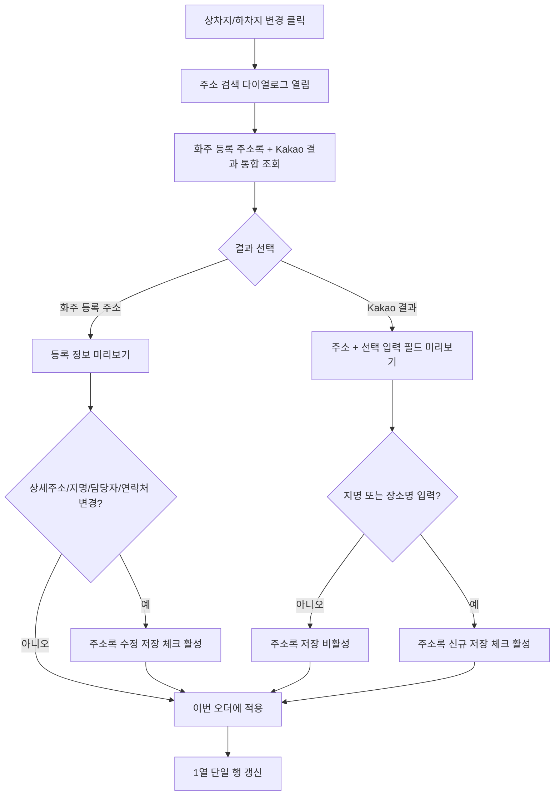

# Plan: 화주 주소록 + Kakao 주소 통합 검색

## 목적

상차지/하차지 주소 검색 다이얼로그에서 선택된 화주의 등록 주소록과 Kakao API 검색 결과를 함께 보여준다.

운영자는 같은 리스트에서 기존 등록 장소를 재사용하거나, Kakao 검색 결과를 이번 오더에 적용할 수 있다. Kakao 결과를 선택한 경우에는 선택 입력값을 보강한 뒤 화주 주소록에 저장할 수 있다.

## 핵심 결정

| 항목 | 결정 |
| --- | --- |
| 추천안 | 통합 리스트 + 출처 배지 + 우측 미리보기 + 주소록 저장 토글 |
| 이유 | 기존 다이얼로그 구조를 크게 바꾸지 않고, 등록 장소와 외부 검색 결과를 한 흐름에서 비교 가능 |
| 저장 기본값 | 저장 체크박스는 항상 같은 위치에 표시하되 조건 충족 시 활성 |
| Kakao 저장 필수값 | 주소록 저장 시 지명 또는 장소명 필수 |
| 화주 등록 수정 | 기존 주소록 결과는 상세주소, 지명, 담당자, 연락처 중 변경이 있을 때만 수정 저장 활성 |
| 수정 가능 필드 | 주소는 고정, 상세주소, 지명, 담당자, 연락처만 수정 가능 |
| 중복 처리 | 같은 주소가 화주 주소록에 있으면 등록 주소록 결과를 우선 노출하고 Kakao 결과에는 `중복 가능` 배지 표시 |

## 대안 비교

| 안 | 구조 | 장점 | 단점 | 판단 |
| --- | --- | --- | --- | --- |
| A | 통합 리스트 + 출처 배지 | 검색 결과를 한 번에 비교, 기존 다이얼로그와 가장 유사 | 결과가 많으면 출처 구분이 약해질 수 있음 | 추천 |
| B | `화주 주소록` / `Kakao 검색` 탭 분리 | 출처 구분이 가장 명확 | 사용자가 탭을 오가야 해서 비교 비용 증가 | 보조안 |
| C | 그룹 헤더로 주소록 먼저, Kakao 다음 | 주소록 우선 원칙이 잘 보임 | 정확도 높은 Kakao 결과가 아래로 밀릴 수 있음 | 운영 정책형 |
| D | 등록 주소록 우선 노출 후 `Kakao로 더 검색` 확장 | 기본 흐름이 단순 | 신규 주소 검색이 한 번 더 늦어짐 | 초보자용 |

## 추천안 와이어프레임

```text
[상차지 주소 검색]

검색어 [코덱트 후진입차 또는 주소 입력________] [검색]

조회 결과
○ [화주 등록] 코덱트 후진입차 | 경기 여주시 산북면 후리       | 최근 3회
○ [화주 등록] 무갑리 현장     | 경기 광주시 초월읍 무갑리     | 최근 2회
○ [Kakao]     산북면 후리 18-1 | 경기 여주시 산북면 후리 18-1  | 외부 검색
○ [Kakao]     무갑리 554-7     | 경기 광주시 초월읍 무갑리 554-7 | 중복 가능

선택 미리보기
출처        [Kakao 검색 결과]
주소        [경기 여주시 산북면 후리]
상세주소    [18-1]                   선택 입력
상차지명    [산북면 후리 18-1]       저장 시 필수
담당자      [                    ]   선택 입력
연락처      [                    ]   선택 입력

[ ] 선택된 화주의 주소록에 저장

[취소] [상차지에 적용]
```

## 컴포넌트 명세

| 컴포넌트 | 타입 | 상태 | 동작 |
| --- | --- | --- | --- |
| 검색어 입력 | Input | default/focus | 장소명 또는 주소를 검색 |
| 검색 결과 row | Button row | default/selected | 클릭 시 우측 미리보기 갱신 |
| 출처 배지 | Badge | `화주 등록`/`Kakao`/`중복 가능` | 데이터 출처를 빠르게 구분 |
| 주소 입력 | Readonly Input | readonly | Kakao/주소록 선택 주소를 고정 표시 |
| 상세주소 입력 | Input | optional | 상세주소 보강 또는 기존 주소록 수정 |
| 지명 입력 | Input | required-for-save | Kakao 결과를 주소록에 저장할 때 필수 |
| 담당자 입력 | Input | optional | 현장 담당자 보강 |
| 연락처 입력 | Input | optional | 현장 연락처 보강 |
| 주소록 저장 | Checkbox | enabled/disabled | Kakao는 지명 입력 시 활성, 등록 주소록은 변경 발생 시 활성 |
| 적용 버튼 | Button | default | 현재 선택값을 상차/하차 행에 반영 |

## User Flow



## Kakao 결과 저장 흐름

1. 사용자가 Kakao 결과를 선택한다.
2. 우측 미리보기에서 주소는 선택값으로 고정 표시한다.
3. 주소는 읽기 전용으로 유지하고 상세주소, 지명, 담당자, 연락처만 수정 가능하게 제공한다.
4. Kakao 결과는 지명 또는 장소명이 입력되어야 `선택된 화주의 주소록에 저장` 체크가 활성화된다.
5. 화주 등록 결과는 기존값과 달라진 상세주소, 지명, 담당자, 연락처가 있을 때만 수정 저장 체크가 활성화된다.
6. 적용 버튼을 누르면 저장 여부와 무관하게 이번 오더 행에는 즉시 반영한다.
7. 개발 단계에서는 같은 이벤트에서 주소록 저장 API를 호출하거나, 오더 저장 시 함께 저장한다.

## B 통합본 인계 기준

| 기준 | 내용 |
| --- | --- |
| 리스트 기준 | 화주 등록 주소록과 Kakao 검색 결과를 같은 리스트에서 표시 |
| 구분 기준 | 결과 row 안에 출처 배지 표시 |
| 저장 기준 | Kakao는 지명 필수, 화주 등록은 변경 발생 시 수정 저장 |
| 수정 기준 | 주소는 고정하고 상세주소, 지명, 담당자, 연락처만 수정 |
| 기존 구조 | 1열 단일 행과 변경 버튼 구조 유지 |
# 4차 레이아웃 보강 결정

주소검색 다이얼로그는 화주 정보 섹션의 `화주/담당자 검색` 다이얼로그와 같은 구조를 따른다. 동일한 구조를 쓰면 운영자는 `검색 -> 결과 선택 -> 우측 미리보기 확인 -> 적용` 흐름을 섹션마다 반복해서 사용할 수 있다.

| 항목 | 결정 |
| --- | --- |
| 다이얼로그 구조 | 검색 영역, 출처 필터, 좌측 조회 결과, 우측 선택 미리보기, 하단 적용 버튼 |
| 조회 결과 | `선택`, `출처`, `지명`, `주소`, `상태` 컬럼으로 구성 |
| 화주 등록 선택 | 라벨 미리보기 우선. `수정` 버튼을 누르면 입력폼으로 전환 |
| Kakao 선택 | 입력폼 미리보기 우선. 상세주소, 지명, 담당자, 연락처를 바로 보강 |
| 주소 필드 | 주소 원문은 읽기 전용으로 유지 |
| 주소록 저장 | 항상 같은 위치에 노출하되, 저장 조건이 충족될 때만 활성화 |

## 미리보기 컴포넌트 상태

| 상태 | 노출 UI | 사용 조건 |
| --- | --- | --- |
| `readonly-mode` | 라벨 미리보기 + `수정` 버튼 | `화주 등록` 주소 선택 직후 |
| `editing-mode` | 입력폼 + `라벨로 보기` 버튼 | `화주 등록` 주소에서 `수정`을 누른 뒤 |
| `form-mode` | 입력폼만 노출 | `Kakao` 주소 선택 직후 |

## 추천 의견

이 방식은 UX/UI 관점에서 적절하다. `화주 등록` 주소는 기존 데이터라 기본 화면에서 라벨로 보호하고, 사용자가 수정 의도를 보였을 때만 입력폼을 열어야 한다. 반대로 `Kakao` 주소는 새 후보라 정보가 비어 있을 가능성이 크므로, 선택과 동시에 입력폼을 보여주는 편이 후속 입력 비용이 낮다.
