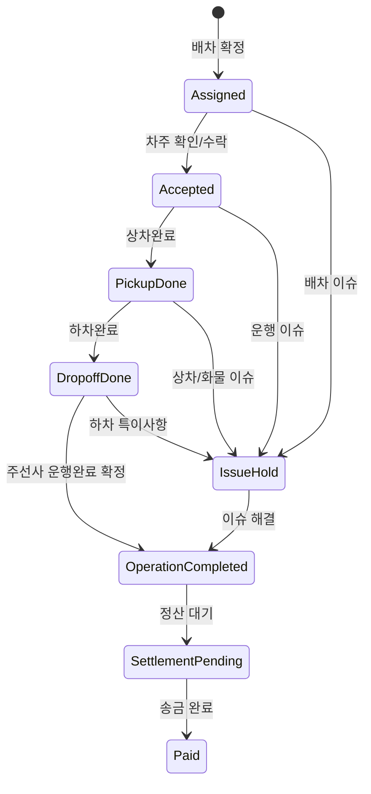

# 차주용 모바일 앱 기능 기획

## 1. Overview

차주용 모바일 앱은 차주가 자신에게 배차된 화물을 확인하고, `상차완료`, `하차완료` 진행 상태를 직접 등록하며, 주선사가 운행완료와 정산 가능 상태를 빠르게 판단할 수 있도록 돕는 업무 앱입니다.

MVP는 `내 배차 목록`, `배차 상세`, `상차완료`, `하차완료`, `운행 내역`, `정산/송금 내역 확인`에 집중합니다. 하차 담당자 확인 링크와 모바일 서명 페이지는 MVP에서 제외하고 Phase 2로 분리합니다.

이번 단계는 API, DB, 백엔드 계약 확정보다 기능 구조, UI/UX, 유저플로우, 와이어프레임 정리에 우선순위를 둡니다.

## 2. 목표와 비목표

| 구분 | 내용 |
| --- | --- |
| 목표 | 차주가 배차받은 화물의 운송 상태를 모바일에서 정확히 공유한다. |
| 목표 | 차주가 `상차완료`, `하차완료`를 직접 등록해 주선사의 실무 확인과 송금 판단 속도를 높인다. |
| 목표 | 운행완료 후 정산/송금 상태를 차주가 직접 조회한다. |
| 비목표 | 차주가 관리자 정산 상태를 직접 확정하거나 수정하는 기능은 제외한다. |
| 비목표 | 신규 화물 오더를 차주가 직접 등록하는 기능은 제외한다. |
| 비목표 | 하차 담당자 확인 링크, 서명 페이지, 화주 확인 보강 플로우는 MVP 이후로 둔다. |
| 비목표 | 화물맨 같은 외부 배차 플랫폼 전체 연동은 MVP 이후로 둔다. |
| 비목표 | 이번 단계에서 API, DB, 백엔드 상세 계약을 확정하지 않는다. |

## 3. 핵심 사용자 시나리오

### 시나리오 A. 오늘 배차 확인

1. 차주가 앱을 열면 `오늘 운행` 또는 `내 배차` 목록을 본다.
2. 배차 카드에서 상차지, 하차지, 시간, 운임, 상태를 확인한다.
3. 필요한 배차를 눌러 상세 화면으로 들어간다.
4. 상차/하차 담당자 연락처, 주소, 품목, 차량 조건, 특이사항을 확인한다.

### 시나리오 B. 운송 상태 공유

1. 차주가 상차지에서 작업을 마친다.
2. `상차완료` 버튼을 누른다.
3. 앱은 상차완료 시각과 필요 시 위치/사진/메모를 저장한다.
4. 관리자/주선사용 시스템의 해당 화물 상태가 상차완료로 갱신된다.
5. 하차지 도착 후 차주가 `하차완료` 버튼을 누른다.

### 시나리오 C. 하차완료 직접 등록

1. 차주가 `하차완료`를 누른다.
2. 앱은 하차완료 시각과 필요 시 위치/사진/메모를 저장한다.
3. 관리자/주선사용 시스템의 해당 화물 상태가 하차완료로 갱신된다.
4. 특이사항이 없다면 주선사는 운행완료와 매입정산 가능 상태로 판단한다.
5. 하차 담당자 확인 링크와 서명은 Phase 2에서 추가한다.

### 시나리오 D. 정산/송금 확인

1. 차주가 `운행 내역`에서 월별 또는 기간별 내역을 조회한다.
2. 각 운행 건의 정산 상태를 확인한다.
3. 주선사가 송금하면 앱에 `송금완료`, 송금일, 송금금액이 표시된다.
4. 금액 이견이 있으면 `정산 문의`로 배차 담당자에게 문의한다.

## 4. 필수 화면 목록

| 화면 | 역할 | MVP 여부 |
| --- | --- | --- |
| 로그인/차주 인증 | 차주 본인과 차량을 식별 | MVP |
| 내 배차 목록 | 현재 배차된 건과 진행 상태 확인 | MVP |
| 배차 상세 | 운송 정보와 상태 버튼 제공 | MVP |
| 운행 내역 | 월별/기간별 운행 목록 조회 | MVP |
| 정산/송금 상세 | 송금 상태와 금액 확인 | MVP |
| 특이사항 보고 | 사진/메모로 이슈 보고 | MVP |
| 하차 담당자 확인 요청 | 차주가 확인 링크 발송/재발송 | Phase 2 |
| 하차 담당자 모바일 확인 페이지 | 서명으로 인수 확인 | Phase 2 |
| 알림함 | 배차, 상태, 정산 알림 확인 | Phase 2 |
| 내 차량/프로필 | 차량번호, 톤수, 차종, 연락처 관리 | Phase 2 |

## 5. 화면별 기능 상세

### 5.1 내 배차 목록

| 항목 | 내용 |
| --- | --- |
| 기본 탭 | `오늘`, `예정`, `진행중`, `완료`, `정산` |
| 필터 | 기간, 상태, 상차일, 정산 상태 |
| 카드 정보 | 상차지, 하차지, 상차 예정, 하차 예정, 운임, 품목, 상태 |
| 주요 액션 | 상세 보기, 배차 담당자 연락, 길찾기 |
| Empty state | 배차 없음, 기간 내 운행 없음, 정산 내역 없음 |

### 5.2 배차 상세

| 영역 | 표시 정보 | 액션 |
| --- | --- | --- |
| 상태 헤더 | 배차 상태, 배차번호, 배차 담당자 | 담당자 전화/문의 |
| 운송 구간 | 상차지/하차지 주소, 담당자, 연락처, 시간 | 전화, 지도, 길찾기 |
| 화물 정보 | 품목, 실중량, 톤수, 차종, 대수, 상하차 방법 | 특이사항 확인 |
| 운임 정보 | 배차금, 조정금, 예상 송금액 | 정산 문의 |
| 진행 버튼 | 상차완료, 하차완료 | 상태 업데이트 |
| 증빙 | 사진, 상태 이력, 메모 | 업로드/조회 |

### 5.3 하차 담당자 확인 페이지(Phase 2)

MVP에서는 이 화면을 만들지 않습니다. 다음 단계에서 인수증 대체 또는 보조 증빙 강화를 위해 별도 기획합니다.

| 항목 | 내용 |
| --- | --- |
| 접근 방식 | SMS/Kakao/문자 링크 또는 앱 공유 링크 |
| 확인 정보 | 배차번호, 화주, 차주, 차량번호, 품목, 하차지, 하차 시각 |
| 확인 방식 | 서명 필수 |
| 추가 입력 | 이름, 연락처, 소속, 메모 |
| 선택 첨부 | 사진, 수량/파손 특이사항 |
| 완료 결과 | 차주 앱과 관리자 시스템에 확인 완료 공유 |

### 5.4 운행 내역

| 항목 | 내용 |
| --- | --- |
| 조회 단위 | 월별, 직접 기간 설정 |
| 필터 | 전체, 운행완료, 정산대기, 송금완료, 보류 |
| 요약 | 기간 총 운행 수, 총 운임, 송금 완료액, 미송금액 |
| 상세 이동 | 운행 건 클릭 시 배차 상세 또는 정산 상세 |

### 5.5 정산/송금 상세

| 항목 | 내용 |
| --- | --- |
| 정산 상태 | 정산대기, 정산검토중, 송금예정, 송금완료, 보류 |
| 금액 | 배차금, 조정금, 차감/추가 금액, 최종 송금액 |
| 송금 정보 | 송금일, 송금 계좌 별칭, 송금 메모 |
| 문의 | 배차 담당자 또는 정산 담당자 문의 |

## 6. 상태 흐름

## 7. 상태별 버튼 정책

| 상태 | 차주 앱 표시 | 주요 버튼 | 관리자 공유 |
| --- | --- | --- | --- |
| `assigned` | 배차됨 | 배차 확인, 담당자 문의 | 차주 확인 전 |
| `accepted` | 운행 준비 | 상차완료 | 차주 확인 완료 |
| `pickup_done` | 상차완료 | 하차완료 | 상차완료 공유 |
| `dropoff_done` | 하차완료 | 정산 확인, 담당자 문의, 특이사항 보고 | 하차완료 공유 |
| `operation_completed` | 운행완료 | 정산 확인 | 매입정산 가능 후보 |
| `settlement_pending` | 정산대기 | 정산 문의 | 정산 처리 전 |
| `paid` | 송금완료 | 송금 상세 | 송금 완료 |
| `issue_hold` | 보류 | 특이사항 보기, 담당자 문의 | 운행완료/정산 차단 |

## 8. 하차 담당자 확인 링크 정책(Phase 2)

하차 담당자 확인 링크와 서명 페이지는 MVP에서 제외합니다. MVP 이후 인수증 대체/보조 증빙과 실무 정산 속도 개선을 강화할 때 다음 정책을 기준으로 별도 기획합니다.

| 정책 | 확정/제안 |
| --- | --- |
| 목적 | 종이 인수증 대체와 운행완료 보조 확인을 둘 다 목표로 한다. |
| 링크 성격 | 확인 액션은 1회성으로 처리하고, 완료 후에는 read-only 확인 화면만 허용한다. |
| 만료 | 하차 시 바로 확인받는 흐름을 기본으로 하되, 링크 유효시간은 24시간으로 둔다. |
| 담당자 연락처 | 주선사가 보유한 하차 담당자 연락처가 있으면 자동 입력하고, 없으면 차주가 연락처를 직접 입력해 발송한다. |
| 확인 방식 | 하차 담당자 서명을 필수 확인 방식으로 사용한다. |
| 미확인 표시 | 하차 담당자가 서명하지 않아도 배차 상태와 별도로 `하차담당자 인증 미확보`를 표시한다. |
| 기록 보관 | 확인자명, 연락처, 서명, 확인 시각, 링크ID, 배차번호, 연락처 출처, 확인 방식, 메모를 저장한다. |
| 예외 | 확인 거절, 파손, 수량 차이, 담당자 불명은 `issue_hold` 또는 관리자 검토 상태로 보낸다. |
| 재발송 | 차주와 배차 담당자 모두 가능하되 발송/재발송 이력을 저장한다. |
| 보안 | 배차 상세 전체가 아니라 확인에 필요한 최소 정보만 노출한다. 운임/정산금과 내부 메모는 노출하지 않는다. |

### 8.1 연락처 출처별 확인 흐름

| 연락처 출처 | 발송 방식 | 신뢰 보강 | 운행완료 처리 |
| --- | --- | --- | --- |
| 주선사/화주가 보유한 하차 담당자 연락처 | 차주가 `하차완료`를 누르면 연락처가 자동 입력된 상태로 발송 | 시스템에 등록된 담당자 연락처이므로 서명 완료를 기본 증빙으로 사용 | 특이사항이 없으면 운행완료 전환 가능 |
| 주선사가 연락처를 보유하지 않음 | 차주가 하차 담당자 연락처를 직접 입력하고 링크 발송 | 차주가 지인 연락처를 넣을 수 있는 리스크가 있으므로 기존 화주용 서비스의 후속 확인 기능으로 신뢰를 보강한다 | 하차 담당자 서명 후에도 `화주 확인 대기` 상태를 표시하고, 화주용 서비스 상세 기획은 후속으로 분리 |
| 하차 담당자 서명 미완료 | 링크 발송 이력만 존재 | `하차담당자 인증 미확보` badge로 표시 | 배차 상태와 별도로 표시하고, 주선사/화주 확인 또는 수동 검토로 처리 |

### 8.2 하차 확인 신뢰 단계

| 단계 | 의미 | 정산 판단 영향 |
| --- | --- | --- |
| `confirmation_not_requested` | 확인 링크를 아직 보내지 않음 | 정산 가능 판단 전 확인 필요 |
| `confirmation_sent` | 링크 발송 완료, 서명 대기 | 하차담당자 인증 미확보 |
| `confirmation_signed` | 하차 담당자 서명 완료 | 연락처 출처에 따라 바로 운행완료 또는 화주 확인 대기 |
| `shipper_verified` | 화주 배차담당자가 기존 화주용 서비스에서 확인 완료 | 운행완료와 매입정산 가능 판단에 가장 강한 근거. 상세 UI는 후속 화주용 서비스 기획에서 정의 |
| `confirmation_missing` | 24시간 내 서명 없음 | 배차 상태와 별도로 인증 미확보 표시 |
| `confirmation_issue` | 확인 거절, 파손, 수량 차이, 담당자 불명 | 보류 또는 관리자 검토 |

## 9. 데이터 연동 초안

| 이벤트 | 생성 주체 | 관리자 시스템 반영 | 차주 앱 반영 |
| --- | --- | --- | --- |
| 배차 확정 | 주선사/배차 담당자 | `DriverAssignment` 생성/확정 | 내 배차 목록에 노출 |
| 차주 확인 | 차주 | 상태 이력 추가 | 배차 상태 `운행 준비` |
| 상차완료 | 차주 | 화물 상태 `상차완료` | 상세 타임라인 업데이트 |
| 하차완료 | 차주 | 화물 상태 `하차완료` | 상세 타임라인 업데이트 |
| 하차 확인 | 하차 담당자 | Phase 2에서 서명 기록 저장, 연락처 출처에 따라 운행완료 또는 화주 확인 대기 | MVP에서는 노출하지 않음 |
| 화주 확인 | 화주 배차담당자 | Phase 2에서 수동 입력 연락처 건의 최종 신뢰 보강. 상세 기능은 후속 화주용 서비스 기획 범위 | MVP에서는 노출하지 않음 |
| 특이사항 보고 | 차주 | 보류/검토 상태 | `보류` 표시 |
| 송금 완료 | 주선사 | 송금 상태 확정 | 내역에 송금 완료 표시 |

## 10. REQ 목록

| REQ-ID | 우선순위 | 요구사항 | 수용 기준 |
| --- | --- | --- | --- |
| `REQ-carowner-dispatch-001` | Must | 차주는 본인에게 배차된 화물 목록을 볼 수 있다. | 배차 확정된 건만 목록에 표시된다. |
| `REQ-carowner-dispatch-002` | Must | 차주는 배차 상세에서 운송 정보를 확인할 수 있다. | 상하차지, 시간, 담당자, 화물, 운임이 표시된다. |
| `REQ-carowner-status-001` | Must | 차주는 상차완료를 등록할 수 있다. | 상태 변경 시 관리자 시스템에 상차완료가 공유된다. |
| `REQ-carowner-status-002` | Must | 차주는 하차완료를 직접 등록할 수 있다. | 상태 변경 시 관리자 시스템에 하차완료가 공유된다. |
| `REQ-carowner-confirm-001` | Could | Phase 2에서 하차 담당자는 링크에서 서명으로 인수 확인을 완료할 수 있다. | MVP에서는 화면과 버튼을 노출하지 않는다. |
| `REQ-carowner-confirm-002` | Could | Phase 2에서 주선사에 하차 담당자 연락처가 없으면 차주가 연락처를 입력해 확인 링크를 보낼 수 있다. | MVP 이후 확인 링크 기획에서 다룬다. |
| `REQ-carowner-confirm-003` | Could | Phase 2에서 하차 담당자가 서명하지 않아도 배차 상태와 별도로 인증 미확보 상태를 표시할 수 있다. | MVP 이후 확인 상태 모델에서 다룬다. |
| `REQ-carowner-shipper-001` | Could | 기존 화주용 서비스에서 수동 입력 연락처 건을 확인할 수 있어야 한다. | 화주용 서비스 UI는 후속 기획에서 다룬다. |
| `REQ-carowner-settlement-001` | Must | 차주는 월별/기간별 운행 내역을 볼 수 있다. | 기간 필터와 상태 필터가 동작한다. |
| `REQ-carowner-settlement-002` | Must | 차주는 송금 완료 여부와 송금 금액을 확인할 수 있다. | 송금일, 금액, 관련 배차가 표시된다. |
| `REQ-carowner-issue-001` | Should | 차주는 특이사항을 사진/메모로 보고할 수 있다. | 보고 시 운행완료 또는 정산 상태가 보류될 수 있다. |
| `REQ-carowner-notify-001` | Should | 차주는 배차/확인/송금 알림을 받을 수 있다. | 주요 상태 전환 시 push 또는 문자 알림이 간다. |

## 11. MVP/후속 마일스톤

| 단계 | 범위 | 완료 기준 |
| --- | --- | --- |
| M1. 배차 조회 | 내 배차 목록, 배차 상세 | 배차 확정 건을 차주 기준으로 조회 |
| M2. 운송 상태 | 상차완료, 하차완료, 상태 타임라인 | 상태 변경이 관리자 시스템에 공유 |
| M3. 정산 조회 | 월별/기간 조회, 송금 상태 | 차주가 송금 완료 내역 확인 |
| M4. 예외 처리 | 특이사항 보고, 보류 상태 | 보류 시 운행완료/정산 자동 전환 차단 |
| M5. Phase 2 하차 확인 | 확인 링크, 서명 페이지, 화주 확인 연결 | MVP 이후 별도 기획과 와이어프레임으로 분리 |
