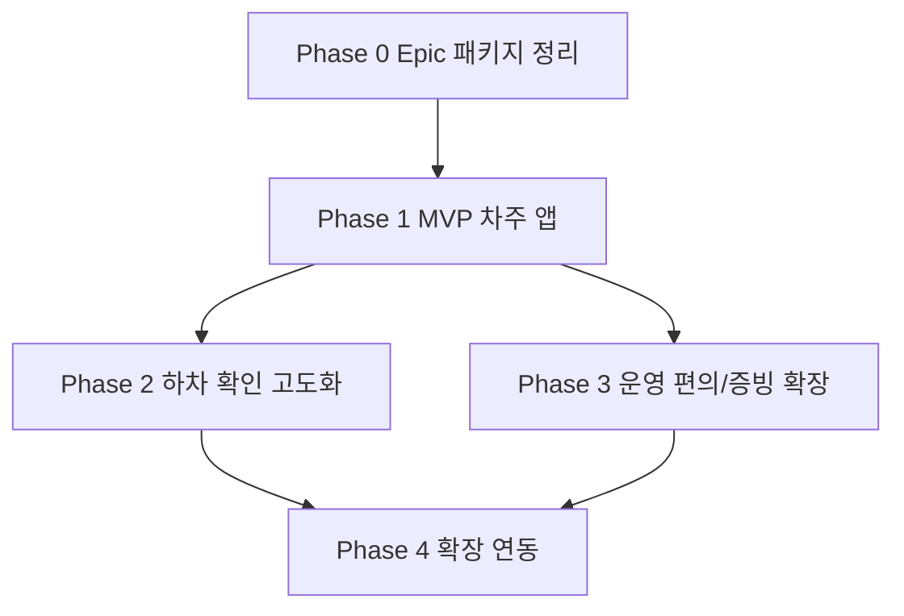

# 차주용 앱 Epic/Phase Roadmap

## 1. Epic 정의

| 항목 | 내용 |
| --- | --- |
| Epic ID | `EPIC-carowner-dispatch-ops` |
| Epic 이름 | 차주용 배차/운행/정산 조회 앱 |
| 목표 | 차주가 모바일에서 배차 내역을 확인하고, `상차완료`, `하차완료`를 직접 공유하며, 운행 내역과 송금 상태를 확인할 수 있게 한다. |
| 핵심 사용자 | 차주, 주선사 배차 담당자, 정산 담당자 |
| 1차 가치 | 차주와 주선사 간 상태 확인 전화를 줄이고, 하차완료 이후 실무 확인과 송금 판단 속도를 높인다. |
| 현재 패키지 역할 | Epic 수준의 기획 패키지. MVP와 후속 Phase의 범위, 우선순위, 화면 방향을 나누는 기준 문서 묶음 |

## 2. Phase 운영 원칙

| 원칙 | 설명 |
| --- | --- |
| MVP 우선 | 첫 출시 범위는 배차 조회, 상태 직접 변경, 운행/정산 조회에 집중한다. |
| 링크/서명 분리 | 하차 담당자 확인 링크, 모바일 서명, 화주 확인 보강은 MVP에서 제외하고 Phase 2로 분리한다. |
| UI/UX 우선 | 이번 기획 단계에서는 API, DB, 백엔드 상세 계약보다 기능, 유저플로우, 화면 구조, 와이어프레임을 우선한다. |
| 운영 리스크 단계화 | 개인정보, 링크 보안, 수동 연락처 악용, 법적 효력 검토는 MVP를 막지 않고 후속 Phase에서 구체화한다. |
| 기존 서비스 연결 | 화주용 서비스는 이미 존재하므로 MVP에서는 상세 설계하지 않고, Phase 2 이후 연결 지점만 다룬다. |

## 3. Phase 요약

| Phase | 이름 | 목적 | 주요 산출물 | 상태 |
| --- | --- | --- | --- | --- |
| Phase 0 | Epic 패키지 정리 | 현재 기획 패키지를 Epic 기준으로 정렬 | 분석, 기능 기획, backlog, 결정사항, roadmap | 정리 완료 |
| Phase 1 | MVP 차주 앱 | 차주가 배차 확인, 상차완료/하차완료 직접 변경, 정산 조회를 할 수 있게 한다 | MVP PRD, 유저플로우, 와이어프레임, 화면별 UX 정책 | 다음 단계 |
| Phase 2 | 하차 확인 고도화 | 하차 담당자 링크/서명으로 인수 확인과 실무 정산 근거를 강화한다 | 링크/서명 유저플로우, 확인 페이지 와이어프레임, 예외 상태 정책 | 후속 |
| Phase 3 | 운영 편의/증빙 확장 | 알림, 사진 증빙, 대기료/추가비, 오프라인 저장 등 현장 사용성을 높인다 | 기능별 기획서, 우선순위 backlog, 추가 화면 와이어프레임 | 후속 |
| Phase 4 | 확장 연동 | 화주용 서비스 확인, 외부 플랫폼, 서류함 등 주변 시스템과 연결한다 | 연동 범위 정의, 서비스별 flow, 운영 정책 | 장기 |

## 4. Phase 0. Epic 패키지 정리

### 목표

현재 패키지를 차주용 앱 전체 Epic의 기준 문서로 정리하고, MVP와 후속 Phase의 경계를 명확히 한다.

### 포함 범위

| 구분 | 내용 |
| --- | --- |
| 기존 문서 분석 | 관리자 final-handoff와 차주 앱 디자인 초안 분석 |
| MVP 재정의 | 하차 담당자 링크를 제외하고 상태 직접 변경 중심으로 정리 |
| backlog 정리 | MVP, Phase 2, Phase 3, Phase 4, Later 후보 분류 |
| 의사결정 기록 | 사용자 결정사항, 가정, 남은 리스크 정리 |
| Roadmap 작성 | Epic 단위 phase 계획 작성 |

### 완료 기준

| 기준 | 완료 조건 |
| --- | --- |
| 범위 정합성 | 모든 문서에서 MVP와 후속 Phase 범위가 충돌하지 않는다. |
| 다음 작업 가능성 | Phase 1 와이어프레임을 바로 시작할 수 있을 정도로 화면과 flow 범위가 분명하다. |
| 후속 보관 | 하차 담당자 링크/서명 정책이 사라지지 않고 Phase 2 항목으로 남아 있다. |

## 5. Phase 1. MVP 차주 앱

### 목표

차주가 배차받은 화물을 확인하고, 운송 중 주요 상태를 직접 공유하며, 운행 내역과 송금 상태를 조회할 수 있는 최소 제품 범위를 확정한다.

### 주요 기능

| 기능 묶음 | 포함 기능 | 우선순위 |
| --- | --- | --- |
| 배차 조회 | 오늘 운행, 내 배차 목록, 배차 상세 | Must |
| 운송 상태 | `상차완료`, `하차완료`, 상태 타임라인 | Must |
| 현장 액션 | 담당자 전화, 지도/길찾기, 주소 복사 | Must |
| 예외 처리 | 특이사항 보고, 사진/메모 optional, 보류 표시 | Should |
| 운행 내역 | 월별/기간별 운행 목록, 상태 필터 | Must |
| 정산/송금 조회 | 송금 상태, 송금일, 송금금액, 정산 문의 | Must |

### Phase 1 내부 실행 단위

| 실행 단위 | 범위 | 목적 | 우선 산출물 |
| --- | --- | --- | --- |
| Phase 1A. 운행 수행 | 내 배차 목록, 배차 상세, 상차완료, 하차완료, 상태 타임라인 | 차주가 오늘 처리할 배차와 다음 액션을 빠르게 수행 | `phase-1-mvp/01-mvp-prd.md`, `phase-1-mvp/02-mvp-user-flows.md`, `phase-1-mvp/03-wireframes-dispatch-execution.md` |
| Phase 1B. 운행/정산 조회 | 운행 내역, 기간/월별 조회, 정산/송금 상태, 정산 문의 | 차주가 운행 결과와 송금 상태를 스스로 확인 | `phase-1-mvp/01-mvp-prd.md`, `phase-1-mvp/02-mvp-user-flows.md`, `phase-1-mvp/04-wireframes-history-settlement-issue.md` |
| Phase 1C. 예외 처리 | 특이사항 보고, 사진/메모 optional, 보류 상태, 담당자 문의 | 문제가 있는 배차를 정상 flow와 분리해 운영자가 확인 가능하게 함 | `phase-1-mvp/01-mvp-prd.md`, `phase-1-mvp/02-mvp-user-flows.md`, `phase-1-mvp/04-wireframes-history-settlement-issue.md` |

### MVP 제외 범위

| 제외 항목 | 후속 위치 | 이유 |
| --- | --- | --- |
| 하차 담당자 확인 링크 | Phase 2 | MVP 복잡도와 보안/신뢰 정책 부담이 큼 |
| 모바일 서명 페이지 | Phase 2 | 링크 flow와 함께 설계해야 함 |
| `하차담당자 인증 미확보` badge | Phase 2 | 확인 링크 상태 모델이 있을 때 의미가 있음 |
| 화주용 서비스 확인 flow | Phase 2 또는 Phase 4 | 기존 서비스와 연결해야 하므로 별도 기획 필요 |
| 외부 플랫폼 연동 | Phase 4 | 데이터 중복과 운영 정책 검토 필요 |

### Phase 1 산출물

| 산출물 | 파일 제안 | 목적 |
| --- | --- | --- |
| MVP PRD | `phase-1-mvp/01-mvp-prd.md` | Phase 1 요구사항과 수용 기준 확정 |
| MVP User Flow | `phase-1-mvp/02-mvp-user-flows.md` | 차주 주요 작업 흐름 정리 |
| MVP Wireframe Spec - 운행 수행 | `phase-1-mvp/03-wireframes-dispatch-execution.md` | 내 배차, 상세, 상태 변경 화면 구조 정의 |
| MVP Wireframe Spec - 조회/예외 | `phase-1-mvp/04-wireframes-history-settlement-issue.md` | 운행 내역, 정산/송금, 특이사항 화면 구조 정의 |
| MVP Screen Map | `phase-1-mvp/05-screen-map.md` | 화면 목록, 진입점, 이동 관계 정리 |
| Traceability & Review | `phase-1-mvp/06-traceability-and-review.md` | REQ/flow/screen 매핑과 self-review |

### Phase 1 화면 우선순위

| 순서 | 화면 | 핵심 질문 |
| --- | --- | --- |
| 1 | 내 배차 목록 | 차주가 오늘 처리할 배차와 다음 액션을 바로 알 수 있는가? |
| 2 | 배차 상세 | 운행 정보, 연락, 길찾기, 상태 변경이 한 화면에서 가능한가? |
| 3 | 상태 변경 modal | `상차완료`, `하차완료`를 실수 없이 확정할 수 있는가? |
| 4 | 운행 내역 | 월별/기간별 운행 결과를 쉽게 찾을 수 있는가? |
| 5 | 정산/송금 상세 | 차주가 송금 상태와 금액을 문의 없이 확인할 수 있는가? |
| 6 | 특이사항 보고 | 이슈가 있는 건을 빠르게 남기고 보류 상태로 전달할 수 있는가? |

### Phase 1 완료 기준

| 기준 | 완료 조건 |
| --- | --- |
| 기능 기준 | MVP Must 기능의 유저플로우와 화면 구조가 모두 정의된다. |
| UX 기준 | 차주가 목록에서 상세로 들어가 `상차완료`, `하차완료`를 완료하는 flow가 끊기지 않는다. |
| 상태 기준 | `assigned`, `driver_confirmed`, `pickup_done`, `dropoff_done`, `operation_completed`, `settlement_pending`, `paid`, `issue_hold`의 표시 문구와 버튼 정책이 정리된다. |
| 정산 기준 | 차주가 볼 수 있는 금액/송금 정보와 숨겨야 할 내부 정산 정보가 구분된다. |

## 6. Phase 2. 하차 확인 고도화

### 목표

하차 담당자의 모바일 링크/서명으로 인수 확인 근거를 강화하고, 주선사가 실무적으로 더 빠르게 운행완료와 송금 가능 여부를 판단할 수 있게 한다.

### 주요 기능

| 기능 묶음 | 포함 기능 | 우선순위 |
| --- | --- | --- |
| 링크 발송 | 하차 담당자 연락처 자동 입력, 차주 수동 입력, 링크 발송/재발송 | Must |
| 모바일 서명 | 하차 담당자 확인 페이지, 서명, 확인 완료 화면 | Must |
| 확인 상태 | `confirmation_sent`, `confirmation_signed`, `confirmation_missing`, `confirmation_issue` | Must |
| 신뢰 보강 | 수동 연락처 입력 건의 화주 확인 대기 | Should |
| 보안/운영 | 24시간 만료, 1회성 처리, 최소 정보 노출, 발송 이력 | Must |

### Phase 2 산출물

| 산출물 | 파일 제안 | 목적 |
| --- | --- | --- |
| 확인 링크 PRD | `10-delivery-confirmation-prd.md` | 링크/서명 요구사항 확정 |
| 확인 링크 User Flow | `11-delivery-confirmation-user-flow.md` | 차주, 하차 담당자, 주선사 flow 분리 |
| 확인 페이지 Wireframe | `12-delivery-confirmation-wireframe.md` | 모바일 링크 화면 구조 정의 |
| 예외 상태 정책 | `13-confirmation-exception-policy.md` | 만료, 미서명, 거절, 수동 연락처 리스크 정리 |

### Phase 2 진입 조건

| 조건 | 이유 |
| --- | --- |
| Phase 1의 하차완료 직접 등록 flow가 확정됨 | 링크 기능은 하차완료 이후 붙는 확장 flow이기 때문 |
| 주선사 실무에서 링크 확인이 송금 판단을 얼마나 줄이는지 확인됨 | 기능 복잡도 대비 효과를 판단해야 함 |
| 하차 담당자에게 노출할 최소 정보가 정해짐 | 개인정보와 운임 정보 노출을 막기 위함 |
| 기존 화주용 서비스의 확인 지점이 정리됨 | 수동 연락처 리스크를 보강하기 위함 |

## 7. Phase 3. 운영 편의/증빙 확장

### 목표

차주가 현장에서 더 적은 문의와 실수로 운행을 완료할 수 있게 하고, 주선사의 수동 확인 업무를 줄인다.

### 후보 기능

| 기능 | 가치 | 우선순위 |
| --- | --- | --- |
| 배차/상하차 예정 알림 | 놓치는 배차와 지연을 줄임 | Should |
| 운행 전 체크리스트 | 차량 조건/품목 확인 누락 방지 | Should |
| 사진 증빙 묶음 | 상차/하차/파손 증빙 강화 | Should |
| 대기료/추가비 요청 | 현장 추가 비용 접수 | Could |
| 오프라인 임시 저장 | 통신 불량 현장 대응 | Could |
| 차량/프로필 관리 | 배차 조건 매칭 정확도 향상 | Could |
| 계좌 정보 확인 | 송금 오류 예방 | Could |

### Phase 3 결정 기준

| 기준 | 판단 방식 |
| --- | --- |
| 반복 문의 감소 | 주선사/차주 문의가 많은 항목부터 우선 |
| 입력 부담 | 현장 입력 시간이 길어지는 기능은 후순위 |
| 개인정보 민감도 | 위치, 계좌, 차량 정보는 별도 동의/보안 정책 필요 |
| 운영 승인 필요성 | 대기료/추가비처럼 금액에 영향이 있는 기능은 승인 flow가 필요 |

## 8. Phase 4. 확장 연동

### 목표

차주 앱을 화주용 서비스, 관리자 시스템, 외부 플랫폼과 연결해 전체 화물 운영 흐름을 확장한다.

### 후보 기능

| 기능 | 연동 대상 | 비고 |
| --- | --- | --- |
| 화주용 서비스 하차 확인 | 기존 화주용 서비스 | Phase 2 수동 연락처 리스크 보강 |
| 세금계산서/서류함 | 관리자 문서 시스템 | 정산 서류 조회 |
| 화물맨 연동 차주 알림 | 외부 배차 플랫폼 | 관리자 Phase 2와 함께 검토 |
| 자동 배차 추천 | 배차/추천 시스템 | 현재 Epic의 핵심 범위 밖 |
| 복수 기사/법인 계정 | 계정/권한 시스템 | 권한 모델 복잡도가 높음 |

## 9. Epic 전체 의존관계

## 10. 다음 실행 순서

| 순서 | 작업 | 결과물 |
| --- | --- | --- |
| 1 | Phase 1 MVP PRD 작성 | `phase-1-mvp/01-mvp-prd.md` |
| 2 | MVP 주요 유저플로우 작성 | `phase-1-mvp/02-mvp-user-flows.md` |
| 3 | Phase 1A 운행 수행 와이어프레임 작성 | `phase-1-mvp/03-wireframes-dispatch-execution.md` |
| 4 | Phase 1B 운행/정산 조회 화면 정책 작성 | `phase-1-mvp/04-wireframes-history-settlement-issue.md` |
| 5 | Phase 1C 특이사항/보류 flow 작성 | `phase-1-mvp/02-mvp-user-flows.md`, `phase-1-mvp/04-wireframes-history-settlement-issue.md` |
| 6 | Phase 2 하차 확인 고도화는 별도 backlog로 보류 | `10-delivery-confirmation-prd.md` 이후 |

## 11. Self-review

| 검토 항목 | 결과 | 메모 |
| --- | --- | --- |
| MVP와 Phase 2 분리 | 통과 | 하차 담당자 링크/서명은 Phase 2로 이동 |
| Phase 분류 일관성 | 통과 | `03` backlog와 `05` roadmap을 MVP, Phase 2, Phase 3, Phase 4 기준으로 정렬 |
| 차주 핵심 flow 보존 | 통과 | 배차 조회, 상차완료, 하차완료, 정산 조회가 Phase 1에 남아 있음 |
| Phase 1 실행 단위 | 통과 | Phase 1A 운행 수행, Phase 1B 운행/정산 조회, Phase 1C 예외 처리로 분리 |
| API/백엔드 과잉 설계 방지 | 통과 | 산출물을 PRD, 유저플로우, 와이어프레임 중심으로 정의 |
| 후속 기획 보존 | 통과 | 링크/서명/화주 확인 보강을 삭제하지 않고 Phase 2로 보관 |
| 남은 리스크 | 확인 필요 | Phase 1에서 정산 금액 노출 범위와 특이사항 보류 문구를 더 구체화해야 함 |
