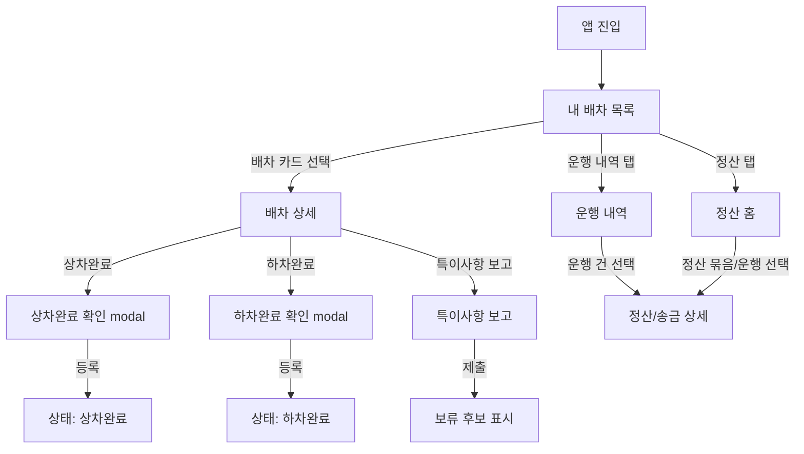
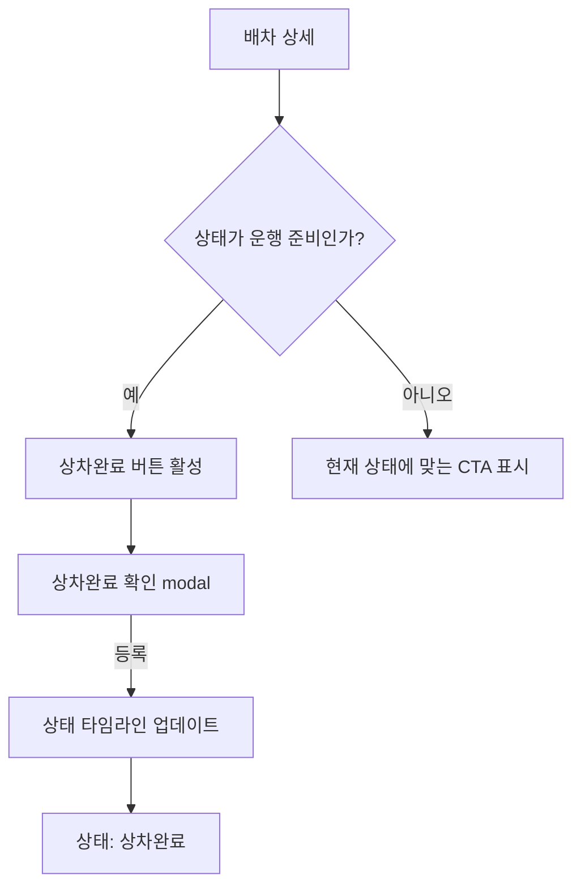
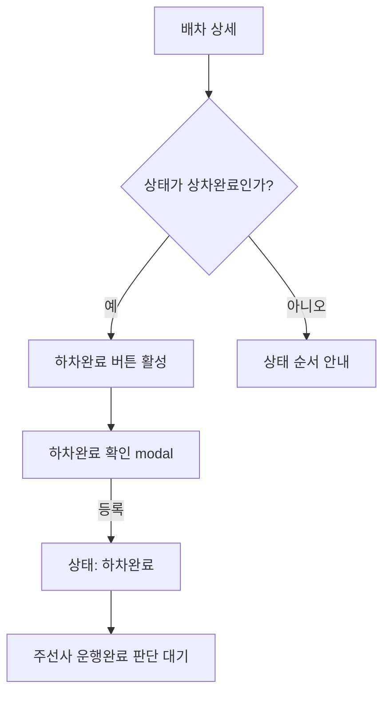
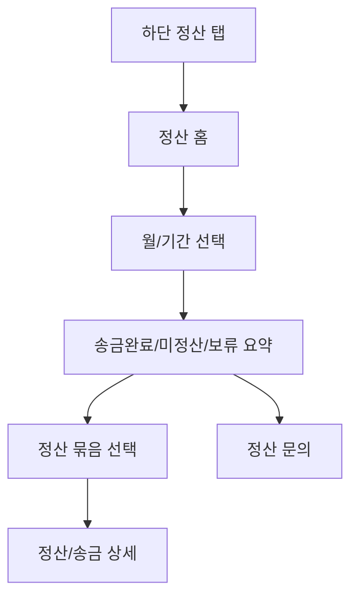
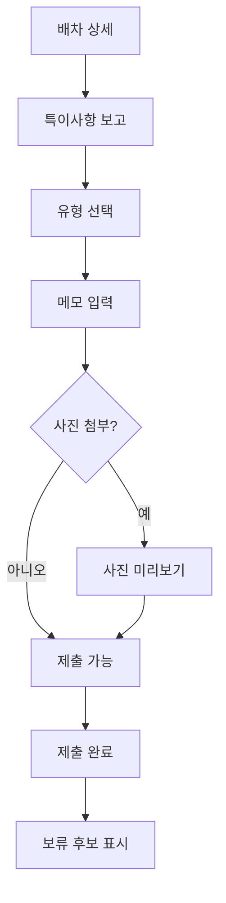

# Phase 1 MVP User Flows

## 1. 상태 정의

| 상태 | 차주 앱 표시 | 의미 | 상태 변경 주체 |
| --- | --- | --- | --- |
| `assigned` | 배차됨 | 차주에게 배차가 확정됨 | 주선사 |
| `driver_confirmed` | 운행 준비 | 차주가 배차를 확인하고 운행 준비 상태가 됨 | 차주 또는 주선사 정책 |
| `pickup_done` | 상차완료 | 차주가 상차완료를 등록함 | 차주 |
| `dropoff_done` | 하차완료 | 차주가 하차완료를 등록함 | 차주 |
| `operation_completed` | 운행완료 | 주선사가 운행완료 및 정산 가능 후보로 판단함 | 주선사 |
| `settlement_pending` | 정산대기 | 송금 전 정산 처리 상태 | 주선사 |
| `paid` | 송금완료 | 송금일과 송금금액이 확정됨 | 주선사 |
| `issue_hold` | 보류 | 특이사항 또는 확인 필요로 운행/정산 판단이 보류됨 | 차주 보고 후 주선사 판단 |

## 2. Overall Flow

## 3. Flow 1. 앱 진입 -> 내 배차 목록 -> 배차 상세

| 항목 | 내용 |
| --- | --- |
| Actor | 차주 |
| Trigger | 차주가 앱을 실행한다. |
| 사용자 액션 | 1. 앱 진입 2. `내 배차 목록` 확인 3. 상태/기간 탭 확인 4. 배차 카드 선택 5. `배차 상세` 진입 |
| 시스템 표시 상태 | 첫 화면은 `내 배차 목록`이다. 카드에는 상차지, 하차지, 예정 시간, 품목, 배차금, 상태 badge, 다음 액션이 표시된다. 상세에는 상태 타임라인과 담당자 문의 CTA가 표시된다. |
| 예외 상태 | 배차 없음: "현재 배차된 운행이 없습니다." / 로딩 실패: "배차 내역을 불러오지 못했습니다." / 보류 건: 카드에 `보류` badge와 문의 CTA를 표시한다. |

## 4. Flow 2. 배차 상세 -> 상차완료

| 항목 | 내용 |
| --- | --- |
| Actor | 차주 |
| Trigger | 차주가 상차지에서 상차 작업을 완료한다. |
| 사용자 액션 | 1. `배차 상세` 확인 2. `상차완료` 버튼 선택 3. 확인 modal에서 상차지/시각/주의 문구 확인 4. `상차완료 등록` 선택 |
| 시스템 표시 상태 | 등록 전 상태가 `운행 준비`이면 `상차완료` CTA가 활성화된다. 등록 후 상세 상태는 `상차완료`, 상태값은 `pickup_done`에 해당하는 문구로 표시된다. 상태 타임라인에는 등록 시각이 추가된다. |
| 예외 상태 | 이미 등록됨: 중복 등록을 막고 기존 등록 시각을 보여준다. / 네트워크 오류: "상차완료를 저장하지 못했습니다. 다시 시도해 주세요." / 보류 건: `상차완료` CTA보다 담당자 문의와 특이사항 확인을 우선 표시한다. |

## 5. Flow 3. 배차 상세 -> 하차완료

| 항목 | 내용 |
| --- | --- |
| Actor | 차주 |
| Trigger | 차주가 하차지에서 하차 작업을 완료한다. |
| 사용자 액션 | 1. `배차 상세` 확인 2. `하차완료` 버튼 선택 3. 확인 modal에서 하차지/시각/권한 안내 확인 4. `하차완료 등록` 선택 |
| 시스템 표시 상태 | 등록 전 상태가 `상차완료`이면 `하차완료` CTA가 활성화된다. 등록 후 상세 상태는 `하차완료`, 상태값은 `dropoff_done`에 해당하는 문구로 표시된다. 화면에는 "주선사 확인 후 운행완료/정산대기로 전환됩니다."를 표시한다. |
| 예외 상태 | 상차완료 전: `하차완료` CTA를 비활성화하고 먼저 상차완료가 필요함을 표시한다. / 특이사항 있음: 보고 제출 후 보류 후보로 표시한다. / 네트워크 오류: 재시도 CTA를 제공한다. |

## 6. Flow 4. 운행 내역 -> 정산/송금 상세

| 항목 | 내용 |
| --- | --- |
| Actor | 차주 |
| Trigger | 차주가 월별 운행 수입, 송금 여부, 송금일을 확인하려 한다. |
| 사용자 액션 | 1. 하단 탭에서 `운행 내역` 선택 2. 월 또는 기간 선택 3. 상태 필터 선택 4. 운행 건 선택 5. `정산/송금 상세` 확인 |
| 시스템 표시 상태 | 운행 내역에는 기간 요약, 운행 건수, 정산대기/송금완료/보류 상태가 표시된다. 상세에는 배차금, 조정 요약, 송금금액, 송금일, 송금상태만 표시된다. 운행 내역에서 진입한 상세는 하단 활성 탭을 `운행 내역`으로 유지한다. |
| 예외 상태 | 내역 없음: "선택한 기간의 운행 내역이 없습니다." / 정산대기: 송금일과 송금금액은 예정 또는 미확정 문구로 표시한다. / 보류: 보류 사유 요약과 담당자 문의 CTA를 표시한다. |

## 7. Flow 4A. 정산 탭 -> 정산 홈 -> 정산/송금 상세

| 항목 | 내용 |
| --- | --- |
| Actor | 차주 |
| Trigger | 차주가 이번 달 얼마가 송금됐고 얼마가 남았는지 빠르게 확인하려 한다. |
| 사용자 액션 | 1. 하단 탭에서 `정산` 선택 2. 월 또는 기간 선택 3. 송금완료/미정산/보류 요약 확인 4. 다음 송금 예정 또는 정산 묶음 선택 5. `정산/송금 상세` 확인 |
| 시스템 표시 상태 | `정산 홈`에는 송금완료 금액, 미정산 금액, 보류 금액, 다음 송금 예정, 상태별 정산 묶음이 표시된다. 건별 상세에는 배차금, 조정 요약, 송금금액, 송금일, 송금상태만 표시된다. 정산 홈에서 진입한 상세는 하단 활성 탭을 `정산`으로 유지한다. |
| 예외 상태 | 정산 정보 없음: "선택한 기간의 정산 정보가 없습니다." / 송금일 미확정: "송금일 확정 전"으로 표시한다. / 보류: 보류 금액과 사유 요약, 담당자 문의 CTA를 표시한다. |

## 8. Flow 5. 배차 상세 -> 특이사항 보고

| 항목 | 내용 |
| --- | --- |
| Actor | 차주 |
| Trigger | 차주가 파손, 수량 차이, 대기, 주소/담당자 이슈, 금액 이견 등 예외를 발견한다. |
| 사용자 액션 | 1. `배차 상세`에서 `특이사항 보고` 선택 2. 이슈 유형 선택 3. 메모 입력 4. 사진 optional 첨부 5. 제출 6. 제출 완료 후 상세로 복귀 |
| 시스템 표시 상태 | 제출 전에는 이슈 유형과 메모 입력 화면을 표시한다. 제출 후 해당 배차는 보류 후보로 표시될 수 있으며, 담당자 문의 CTA가 함께 표시된다. |
| 예외 상태 | 메모 누락: 필수 입력 안내를 표시한다. / 사진 업로드 실패: 사진 없이 제출하거나 재시도할 수 있다. / 이미 보류: 기존 보류 사유와 추가 문의 CTA를 표시한다. |

