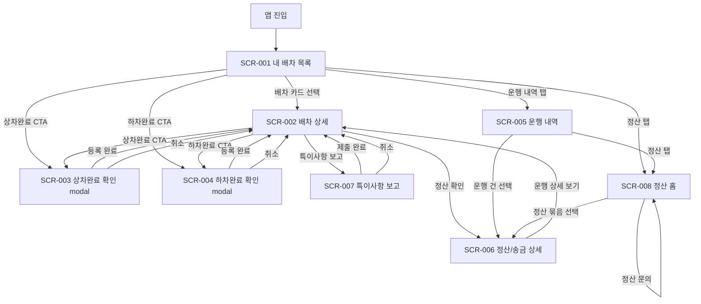

# MVP Screen Map

## 1. 원칙

`내 배차 목록`을 앱의 첫 화면이자 핵심 홈으로 둔다. Phase 1 MVP는 이미 배차된 운행의 수행과 조회가 목적이므로 배차 검색, 신규 오더 수락, 신규 화물 탐색 화면은 포함하지 않는다.

## 2. 화면 목록

| Screen ID | 화면 | 역할 | 진입점 | 주요 이동 |
| --- | --- | --- | --- | --- |
| `SCR-001` | 내 배차 목록 | 오늘/예정/진행 배차 확인 | 앱 진입, 하단 `내 배차` 탭 | `SCR-002`, `SCR-003`, `SCR-004` |
| `SCR-002` | 배차 상세 | 운행 정보, 상태 타임라인, CTA 확인 | 배차 카드 선택 | `SCR-003`, `SCR-004`, `SCR-006`, `SCR-007` |
| `SCR-003` | 상차완료 확인 modal | 상차완료 등록 전 확인 | `상차완료` CTA | 완료 후 `SCR-002` |
| `SCR-004` | 하차완료 확인 modal | 하차완료 등록 전 확인 | `하차완료` CTA | 완료 후 `SCR-002` |
| `SCR-005` | 운행 내역 | 월별/기간별 운행 조회 | 하단 `운행 내역` 탭 | `SCR-006`, `SCR-002` |
| `SCR-006` | 정산/송금 상세 | 송금상태, 송금일, 송금금액 확인 | 운행 카드 선택, 정산 묶음 선택, 상세의 정산 확인 | `SCR-002`, `SCR-005`, `SCR-008`, 담당자 문의 |
| `SCR-007` | 특이사항 보고 | 예외 상황 보고 | 상세의 `특이사항 보고` CTA | 제출 후 `SCR-002` |
| `SCR-008` | 정산 홈 | 월별/기간별 정산 요약, 송금완료/미정산/보류 금액 확인 | 하단 `정산` 탭 | `SCR-006`, 담당자 문의 |

## 3. 탭 구조와 진입점

| 탭 | 기본 화면 | 포함 범위 | 비고 |
| --- | --- | --- | --- |
| 내 배차 | `SCR-001` 내 배차 목록 | 오늘, 예정, 진행, 완료 상태 필터 | 앱 첫 화면 |
| 운행 내역 | `SCR-005` 운행 내역 | 월별/기간 조회, 상태 필터, 정산/송금 상세 이동 | Phase 1B |
| 정산 | `SCR-008` 정산 홈 | 월별/기간 정산 요약, 송금완료/미정산/보류 금액, 다음 송금 예정 | 하단 탭의 고정 기본 화면 |

| 진입점 | 도착 화면 | 조건 |
| --- | --- | --- |
| 앱 실행 | `SCR-001` 내 배차 목록 | 기본 진입 |
| 하단 `내 배차` 탭 | `SCR-001` 내 배차 목록 | 다른 탭에서 복귀 |
| 하단 `운행 내역` 탭 | `SCR-005` 운행 내역 | 운행/정산 조회 목적 |
| 하단 `정산` 탭 | `SCR-008` 정산 홈 | 정산 요약과 상태별 묶음 조회 목적 |
| 배차 카드 선택 | `SCR-002` 배차 상세 | 특정 운행 확인 |
| 운행 카드 선택 | `SCR-006` 정산/송금 상세 | 특정 운행의 정산/송금 확인 |
| 정산 묶음 선택 | `SCR-006` 정산/송금 상세 | 특정 정산 묶음 또는 포함 운행의 상세 확인 |

## 4. 화면 이동 관계

## 5. 뒤로가기/완료 후 이동

| 현재 화면 | 뒤로가기 | 완료 후 이동 | 비고 |
| --- | --- | --- | --- |
| `SCR-001` 내 배차 목록 | 앱 종료 또는 OS 기본 동작 | 해당 없음 | 첫 화면 |
| `SCR-002` 배차 상세 | 이전 목록 또는 운행 내역 | 상태 변경 완료 후 상세 유지 | 상태 타임라인 갱신 |
| `SCR-003` 상차완료 확인 modal | modal 닫기 | `SCR-002` 배차 상세 | `상차완료` 상태 표시 |
| `SCR-004` 하차완료 확인 modal | modal 닫기 | `SCR-002` 배차 상세 | `하차완료` 상태와 주선사 확인 안내 표시 |
| `SCR-005` 운행 내역 | 이전 탭 또는 `내 배차` 탭 | 해당 없음 | 필터 상태 유지 권장 |
| `SCR-006` 정산/송금 상세 | `SCR-005`, `SCR-008` 또는 `SCR-002` | 문의 후 현재 화면 유지 | 운행 카드 진입 시 `운행 내역`, 정산 묶음 진입 시 `정산 홈`, 상세 CTA 진입 시 `배차 상세`로 복귀 |
| `SCR-007` 특이사항 보고 | `SCR-002` 배차 상세 | `SCR-002` 배차 상세 | 제출 후 보류 후보 표시 가능 |
| `SCR-008` 정산 홈 | 이전 탭 또는 `내 배차` 탭 | 문의 후 현재 화면 유지 | 정산 기간/필터 상태 유지 권장 |

## 6. 화면별 상태 책임

| 상태 | 표시 위치 | 변경 주체 | 화면 책임 |
| --- | --- | --- | --- |
| 배차됨 | `SCR-001`, `SCR-002` | 주선사 | 차주가 배차를 확인하도록 표시 |
| 운행 준비 | `SCR-001`, `SCR-002` | 차주 또는 주선사 정책 | `상차완료` CTA 제공 |
| 상차완료 | `SCR-001`, `SCR-002` | 차주 | `하차완료` CTA 제공 |
| 하차완료 | `SCR-001`, `SCR-002` | 차주 | 주선사 확인 전 상태임을 안내 |
| 운행완료 | `SCR-001`, `SCR-005`, `SCR-006`, `SCR-008` | 주선사 | 정산 조회로 연결 |
| 정산대기 | `SCR-005`, `SCR-006`, `SCR-008` | 주선사 | 송금일 미확정 또는 예정 안내 |
| 송금완료 | `SCR-005`, `SCR-006`, `SCR-008` | 주선사 | 송금일과 송금금액 표시 |
| 보류 | 모든 관련 화면 | 차주 보고 후 주선사 판단 | 사유 요약과 담당자 문의 CTA 표시 |

## 7. MVP 제외 화면

| 제외 화면/flow | 이유 | 후속 위치 |
| --- | --- | --- |
| 배차 검색 | Phase 1은 이미 배차된 운행 관리가 목적이다. | Later |
| 신규 오더 수락 | 신규 화물 탐색/수락은 MVP 핵심이 아니다. | Later |
| 하차 담당자 확인 링크 | 보안, 만료, 기록 보관 정책이 필요하다. | Phase 2 |
| 모바일 서명 | 링크 기반 하차 확인 정책과 함께 설계한다. | Phase 2 |
| `하차담당자 인증 미확보` badge | Phase 2 상태 모델이 있어야 의미가 있다. | Phase 2 |
| 화주 확인 보강 flow | 기존 화주용 서비스와 연결해야 한다. | Phase 2 또는 Phase 4 |
