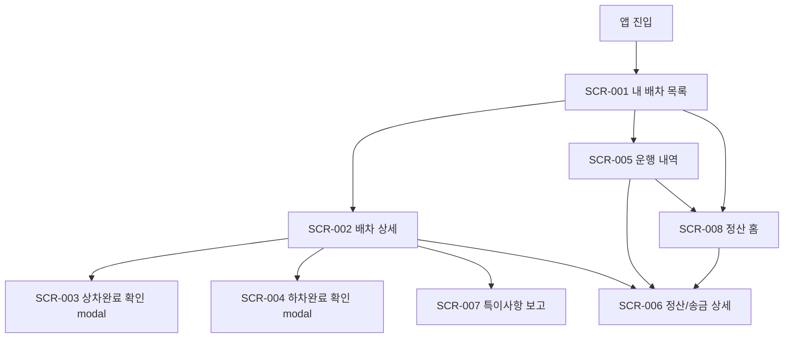

# Phase 1 MVP Publishing Scope

## 1. Target

3차 standalone 디자인 시스템을 유지하면서 Phase 1 MVP 기준의 standalone HTML을 고정한다. 기존 3차의 `정산` 탭은 건별 상세 진입 구조이므로, MVP 결과물에서는 `정산 홈`을 추가하고 하단 `정산` 탭의 기본 도착지를 바꾼다.

## 2. Screen Set

| Screen ID | 화면 | 구현 기준 | 우선순위 |
| --- | --- | --- | --- |
| `SCR-001` | 내 배차 목록 | 첫 화면, 배차 카드, 상태 필터, 다음 CTA | Must |
| `SCR-002` | 배차 상세 | 배차 확인증, 상하차 정보, 상태 타임라인, 문의/특이사항/정산 CTA | Must |
| `SCR-003` | 상차완료 확인 modal | 상차지/시각 확인, 등록 CTA | Must |
| `SCR-004` | 하차완료 확인 modal | 하차지/시각 확인, 운행완료 권한 안내 | Must |
| `SCR-005` | 운행 내역 | 월/기간, 상태 필터, 운행 카드, 건별 정산 상세 진입 | Must |
| `SCR-008` | 정산 홈 | 송금완료/미정산/보류 집계, 다음 송금 예정, 정산 묶음 | Must |
| `SCR-006` | 정산/송금 상세 | 배차금, 조정 요약, 송금금액, 송금일, 송금상태 | Must |
| `SCR-007` | 특이사항 보고 | 유형, 메모, 사진 optional, 제출 후 보류 후보 | Should |

## 3. Navigation

## 4. Required Implementation Changes From 3rd Standalone

| 영역 | 현재 3차 | Phase 1 MVP 변경 |
| --- | --- | --- |
| 화면 상태 | `dispatch`, `detail`, `history`, `settlement`, `issue` | `settlementHome` 추가 |
| 하단 정산 탭 | `screen:'settlement'`, 첫 번째 정산 건 선택 | `screen:'settlementHome'`으로 이동 |
| 정산 상세 | 하단 탭의 기본 화면처럼 동작 | 운행 내역/정산 묶음의 child screen |
| 뒤로가기 | 정산 상세에서 운행 내역으로 복귀 | 진입 경로에 따라 운행 내역 또는 정산 홈으로 복귀 |
| 정산 데이터 | `historyItems` 건별 중심 | `settlementSummary`, `settlementGroups` 추가 또는 파생 |
| 정산 문구 | 건별 송금 상태 중심 | 월/기간 집계 기준과 미정산 산정 기준 명시 |

## 5. Settlement Home Content

| 영역 | 표시 정보 | 문구 예시 |
| --- | --- | --- |
| 기간 선택 | 이번 달, 지난 달, 직접 기간 | `2026.06` |
| 요약 카드 | 송금완료, 미정산, 보류 | `송금완료 470,000원` |
| 다음 송금 예정 | 예정일, 예정 금액, 포함 건수 | `06.28 · 470,000원 · 1건` |
| 상태 필터 | 전체, 정산대기, 송금완료, 보류 | `정산대기 2건` |
| 정산 묶음 | 송금 예정일 또는 상태 기준 묶음 | `06.28 송금 예정` |
| 안내 문구 | 집계 기준 보수적 안내 | `하차완료 건은 주선사 확인 후 정산 집계에 반영됩니다.` |

## 6. Settlement Aggregation Rule

| 상태 | 정산 홈 분류 | 표시 문구 |
| --- | --- | --- |
| `dropoff_done` | 집계 제외 | `주선사 확인 대기` |
| `operation_completed` | 미정산 후보 | `정산 확인 중` |
| `settlement_pending` | 미정산 | `송금 전 정산 처리 중` |
| `paid` | 송금완료 | `송금완료` |
| `issue_hold` | 보류 | `확인 필요` |

## 7. Validation Checklist

| 검증 | 기준 |
| --- | --- |
| 하단 탭 | `정산` 탭 선택 시 `정산 홈` 표시 |
| 운행 내역 | 운행 카드 선택 시 `정산/송금 상세` 표시 |
| 정산 상세 | 차주 노출 항목만 표시 |
| 상태 변경 | 상차완료/하차완료 등록 후 badge와 timeline 변경 |
| 권한 문구 | 하차완료와 운행완료 권한 차이 표시 |
| 제외 범위 | 배차 검색, 신규 오더 수락, 서명/확인 링크 미노출 |
| 모바일 레이아웃 | 390px, 430px 기준 텍스트 겹침 없음 |
| 문서 대조 | `REQ-carowner-mvp-017`, `SCR-008`, Flow 4A 반영 |

## 8. Final Freeze

Phase 1 MVP 퍼블리싱 산출물은 아래 기준으로 고정한다.

| 항목 | 고정 결정 |
| --- | --- |
| 최종 파일 | `publishing/phase-1-mvp/phase-1-mvp-standalone.html` |
| 하단 탭 A안 | 유지 |
| 기존 3차 파일 | 원본 유지 |
| 정산 탭 도착 화면 | `SCR-008 정산 홈` |
| 정산 상세 진입 | `운행 내역` 카드 또는 `정산 홈`의 정산 묶음에서 진입 |
| 정산 홈 집계 기준 | `dropoff_done` 제외, `operation_completed` 이후부터 미정산 후보 |

## 9. Visual QA Result

| 화면 | 원본 대비 결과 | 판정 |
| --- | --- | --- |
| `SCR-001` 내 배차 목록 | 픽셀 차이 `0%` | 3차 디자인 유지 |
| `SCR-005` 운행 내역 | 픽셀 차이 `0%` | 3차 디자인 유지 |
| `SCR-006` 정산/송금 상세 | 차이 `0.9192%`, 하단 활성 탭 영역만 변경 | 의도된 라우팅 반영 |
| `SCR-008` 정산 홈 | 원본에는 없는 신규 도착 화면 | MVP 기능 변경 |

QA 이미지는 커밋하지 않고, 위 표의 픽셀 차이 결과만 고정 기록으로 남긴다.
