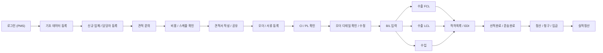
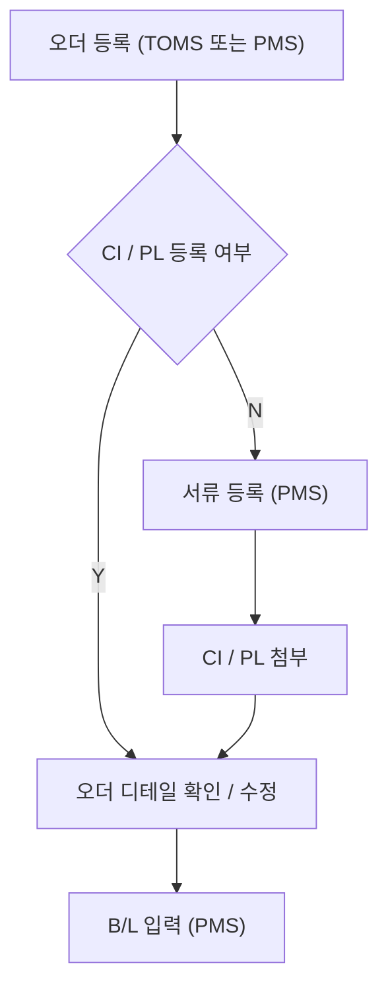
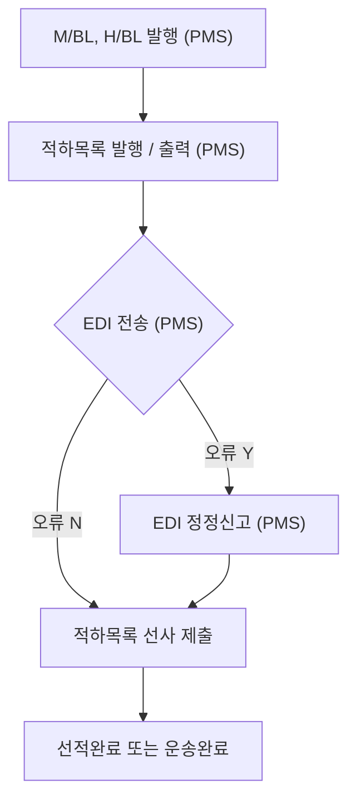

# 사용자/운영 flow

## 1. 전체 flow

## 2. Flow 1. 견적 문의부터 오더 등록

| 단계 | 주체 | 시스템/채널 | 액션 | 완료 기준 |
| --- | --- | --- | --- | --- |
| 1 | 운영자 | `PMS` | 로그인 | 담당자 권한 확인 |
| 2 | 운영자 | `PMS` | 기초 데이터 등록 | 거래처/화물 기본 정보 생성 |
| 3 | 운영자 | `PMS` | 신규 업체/담당자 등록 | 견적/오더에 쓸 연락처 확보 |
| 4 | 화주/운영자 | `TOMS`, 메일 | 견적 문의 접수 | 문의 채널과 요청 조건 기록 |
| 5 | 운영자 | 메일, 유선 | 선사/항공사/콘솔 비용 확인 | 비용과 스케줄 후보 확보 |
| 6 | 운영자 | 다우, 엑셀 | 견적서 작성 | 양식: `견적서` |
| 7 | 운영자 | `TOMS`, 메일, 카톡 | 견적서 공유 | 공유 이력 또는 파일 연결 |
| 8 | 운영자 | `PMS` | 오더/서류 등록 | 오더 초안 생성 |

## 3. Flow 2. `CI / PL` 확인과 `B/L` 입력

| 분기 | 처리 |
| --- | --- |
| `CI / PL 등록 Y` | 오더 디테일 확인/수정으로 바로 이동 |
| `CI / PL 등록 N` | `PMS`에서 서류 등록 후 오더 디테일 확인/수정 |
| 완료 조건 | `B/L 입력`에 필요한 기본 오더/서류 정보가 채워짐 |

## 4. Flow 3. 수출 `FCL`

| 단계 | 주체 | 시스템/채널 | 액션 | 산출물/상태 |
| --- | --- | --- | --- | --- |
| 1 | 운영자 | `PMS` | `B/L 입력` 후 `FCL 수출` 선택 | 수출 `FCL` flow 시작 |
| 2 | 운영자 | 선사 사이트 | 선복 부킹 요청 | 부킹 요청 완료 |
| 3 | 선사 | 선사 사이트 | 선사 승인 | 승인 완료 |
| 4 | 선사 | 선사 사이트 | 부킹 번호 부여 | 부킹 번호 |
| 5 | 운영자 | 선사 사이트 | `S/R 제출` | `S/R` |
| 6 | 운영자 | 선사 사이트 | `VGM 전송` | `VGM` |
| 7 | 운영자 | 선사 사이트 | Master copy `B/L` 수신 | Master copy `B/L` |
| 8 | 운영자/정산 | 선사 사이트 | 선사 비용 송금, 이체증 제출, Master way bill 발행 | 선적/EDI 후속 준비 |

## 5. Flow 4. 수출 `LCL`

| 단계 | 주체 | 시스템/채널 | 액션 | 산출물/상태 |
| --- | --- | --- | --- | --- |
| 1 | 운영자 | `PMS` | `B/L 입력` 후 `LCL 수출` 선택 | 수출 `LCL` flow 시작 |
| 2 | 운영자 | 메일 | 콘솔사에 선적 요청 | 요청 메일 |
| 3 | 운영자 | `PMS`, 메일 | `S/R 출력 후 콘솔사 제출` | 양식: `S/R` |
| 4 | 콘솔사 | 메일 | 콘솔사 Master copy `B/L` 수신 | Master copy `B/L` |
| 5 | 운영자 | 메일 | Master copy `B/L` 이상여부 확인 | 확인 이력 |
| 6 | 운영자 | 메일 | Master way bill 발행 | Master way bill |

## 6. Flow 5. 적하목록과 EDI

| 단계 | 개선 포인트 |
| --- | --- |
| `M/BL`, `H/BL` 발행 | 적하목록 생성의 선행 산출물로 연결 |
| 적하목록 발행/출력 | EDI 전송과 같은 작업 묶음으로 보여야 함 |
| EDI 전송 | 성공/오류 여부를 즉시 확인 |
| EDI 정정신고 | 오류 발생 시 같은 화면에서 재처리 |
| 선사 제출 | 메일/FAX 제출 여부와 제출물을 추적 |

Figma 주석에는 `EDI 전송 / 확인 / 정정 - 한번에 할 수 있도록`이라는 개선 방향이 명시되어 있다.

## 7. Flow 6. 수출 정산

| 단계 | 시스템/채널 | 산출물 |
| --- | --- | --- |
| 선적완료 | 수출 flow | 수출 완료 상태 |
| 매입확인 | 선사 사이트/메일 | 하위 정산 근거 |
| 해외 정산서 | `PMS` | 양식: 해외정산서 |
| 지출결의서 발행 | `PMS` | 양식: 지출결의서 |
| 지출결의서 송금 | 다우 | 송금 처리 |
| 화주 청구서 | `PMS` | 양식: 화주청구서 |
| 세금계산서 발행 | `PMS` | 세금계산서 |
| 입금 확인 | 다우 | 입금 완료 |
| 실적정산 | `PMS` | 최종 완료 |

## 8. Flow 7. 수입 정산 및 `D/O`

| 단계 | 시스템/채널 | 산출물 |
| --- | --- | --- |
| 운송완료 | 수입 flow | 수입 완료 상태 |
| 화주 청구서 | `PMS` | 청구서 |
| 현금 또는 신용거래 | 내부 기준 | 입금/여신 구분 |
| 매입확인 | 선사 사이트/메일 | 비용 근거 |
| 해외 정산서 | `PMS` | 해외 정산서 |
| 지출결의서 | `PMS` | 지출결의서 |
| 송금/이체증 발행 | 다우 | 송금 증빙 |
| `M/D/O` 발급/출력 | `Ulogis`, 선사 | Master `D/O` |
| `H/D/O` 발급/출력 | `PMS` | House `D/O` |
| 화주, 운송사 전달 | `TOMS`, 메일 | 전달 완료 |
| 세금계산서 발행 | `PMS` | 세금계산서 |
| 입금 확인 | 다우 | 입금 완료 |
| 실적정산 | `PMS` | 최종 완료 |

## 9. 운영 화면 후보

| 화면/업무 단위 | 목적 | 포함 액션 |
| --- | --- | --- |
| 오더 접수 홈 | 견적/오더/서류 준비 상태 파악 | 기초 데이터, 업체/담당자, 견적 문의 |
| 견적 작업 상세 | 비용 확인과 견적서 공유 추적 | 비용 확인, 견적서 작성, 공유 이력 |
| 오더/서류 상세 | `CI / PL`과 오더 디테일 확인 | 서류 등록, 오더 수정, `B/L` 입력 |
| 수출 작업 보드 | `FCL/LCL` 단계 추적 | 선복, `S/R`, `VGM`, Master copy |
| EDI 작업 큐 | 적하목록/EDI/정정 통합 처리 | 발행, 출력, 전송, 오류, 정정, 제출 |
| 정산 작업 상세 | 지출/청구/입금/실적정산 추적 | 지출결의서, 청구서, 세금계산서, 입금 |
