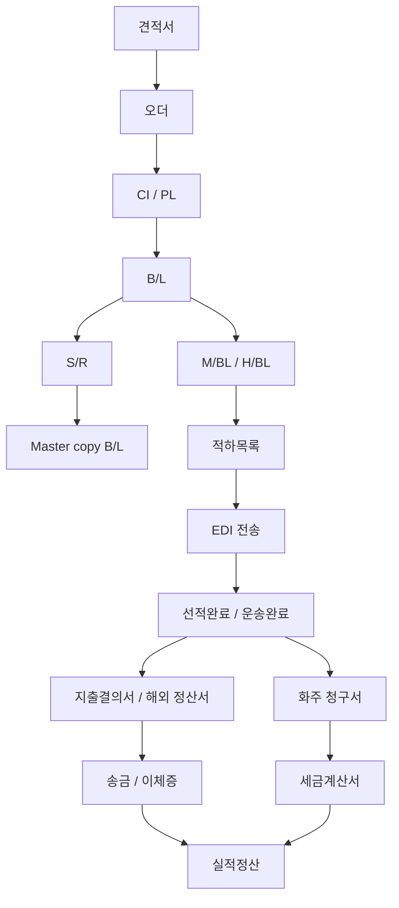

# 시스템/서류 맵

## 1. 시스템 경계

| 시스템/채널 | Figma 표기 | 역할 | 통합 방향 |
| --- | --- | --- | --- |
| `PMS` | 보라색 박스 | 내부 운영의 중심 시스템. 오더, 서류, `B/L`, 적하목록, 정산 처리 | 핵심 상태와 산출물의 기준 시스템 |
| `TOMS` | 회색 박스 또는 텍스트 | 견적 문의, 오더 등록, 일부 전달/공유 채널 | 기존 업무 연계 또는 점진 통합 |
| 메일/카톡/FAX | 회색 박스 | 견적 공유, 선사/콘솔사 요청, 적하목록 제출 | 증빙 첨부/이력화 필요 |
| 다우 | 회색 박스 | 견적서 작성, 지출결의서 송금, 입금 확인 | 회계/입금 상태 연계 후보 |
| 선사 사이트 | 초록색 박스 | 선복 부킹, 승인, 부킹 번호, `S/R`, `VGM`, Master copy `B/L`, 비용 송금/이체증 | 외부 작업 상태와 증빙 등록 |
| 콘솔사 | 회색 박스/메일 | `LCL` 선적 요청, Master copy `B/L` 제공 | 메일 기반 상태 추적 |
| `Ulogis` | 초록색 박스 | 수입 `M/D/O` 발급/출력 | 수입 후속 서류 연계 |
| 유니패스/트래킹 조회 | 노란 주석 | 외부 조회 후보 | 어느 단계에서 조회하는지 정의 필요 |

## 2. 핵심 서류 목록

| 서류/산출물 | Figma 표기 | 생성/수신 위치 | 사용 위치 |
| --- | --- | --- | --- |
| 견적서 | `양식 : 견적서` | 다우/엑셀 | 견적 공유, 오더 전환 |
| `CI / PL` | `양식 : CI / PL` | `PMS` 서류 등록 | 오더 디테일, `B/L` 입력 전 |
| `B/L` | `B/L 입력` | `PMS`, 양재 IT | 수출/수입 분기 |
| `S/R` | `양식 : S/R` | `PMS`, 선사 사이트 | 수출 `FCL/LCL` 선적 요청 |
| `VGM` | `VGM 전송` | 선사 사이트 | 수출 `FCL` |
| Master copy `B/L` | `Master copy B/L 수신` | 선사/콘솔사 | 이상여부 확인, Master way bill |
| Master way bill | `Master way bill 발행` | 메일/선사 | 선적 후속 |
| `M/BL` | `M/BL 발행` | `PMS` | 적하목록 |
| `H/BL` | `H/BL 발행` | `PMS` | 적하목록 |
| 적하목록 | `양식 : 적하목록` | `PMS` | EDI 전송, 선사 제출 |
| 지출결의서 | `양식 : 지출결의서` | `PMS` | 다우 송금 |
| 해외 정산서 | `양식 : 해외정산서` | `PMS` | 지출결의서 발행 |
| 화주 청구서 | `양식 : 화주청구서` | `PMS` | 세금계산서/입금 |
| 세금계산서 | `세금계산서 발행` | `PMS` | 입금 확인 |
| `M/D/O` | `M/D/O 발급, 출력` | `Ulogis`, 선사 | 수입 화주/운송사 전달 |
| `H/D/O` | `H/D/O 발급, 출력` | `PMS` | 수입 화주/운송사 전달 |

## 3. `B/L` 유형 메모

Figma에는 다음 `B/L` 관련 유형이 메모로 남아 있다.

| 유형 | 의미/처리 방향 |
| --- | --- |
| Original `B/L` | 종이 원본 또는 원본 권리증권 성격의 `B/L` 처리 필요 |
| Check `B/L` | 발행 전 검토본 확인 필요 |
| Surrender `B/L` | 원본 없이 화물 인도 가능한 유형으로 별도 상태 필요 |
| Sea way bill | 비유통성 해상화물운송장으로 별도 발행/전달 상태 필요 |
| `AWB` | 항공 화물 운송장. 항공 flow가 포함될 경우 해상 `B/L`과 분리 필요 |

## 4. 상태와 서류 의존관계

## 5. 수출/수입 분기 비교

| 구분 | 수출 `FCL` | 수출 `LCL` | 수입 |
| --- | --- | --- | --- |
| 시작 기준 | `B/L 입력` 후 `FCL 수출` | `B/L 입력` 후 `LCL 수출` | `B/L 입력` 후 수입 |
| 외부 파트너 | 선사 | 콘솔사, 선사 | 선사, 운송사, 화주 |
| 주요 외부 작업 | 선복 부킹, 승인, 부킹 번호, `S/R`, `VGM` | 콘솔사 선적 요청, `S/R` 제출 | 운송 완료, `M/D/O`, `H/D/O` |
| 주요 PMS 작업 | `M/BL`, `H/BL`, 적하목록, EDI | `M/BL`, `H/BL`, 적하목록, EDI | 적하목록, EDI, 정산, `H/D/O` |
| 완료 이벤트 | 선적완료 | 선적완료 | 운송완료 |
| 정산 연결 | 지출결의서, 해외 정산서, 화주 청구서, 세금계산서, 입금 | 동일 | 화주 청구서, 현금/신용거래, `D/O`, 세금계산서, 입금 |

## 6. 데이터 모델 후보

상세 DB 설계는 범위 밖이지만, 후속 구현을 위해 최소 객체 후보를 남긴다.

| 객체 | 설명 | 주요 필드 후보 |
| --- | --- | --- |
| `Customer` | 화주/거래처 | 업체명, 담당자, 연락처, 청구 기준 |
| `Quote` | 견적 문의/견적서 | 문의 채널, 비용 확인 결과, 견적서 파일, 공유 이력 |
| `Order` | 수출입 오더 | 수출입 구분, `FCL/LCL`, 상태, 담당자 |
| `TradeDocument` | `CI / PL`, 견적서 등 서류 | 문서 유형, 파일, 등록 상태 |
| `BillOfLading` | `B/L`, `M/BL`, `H/BL` | 번호, 유형, 발행 상태, 이상여부 |
| `CarrierTask` | 선사/콘솔사 작업 | 부킹, `S/R`, `VGM`, Master copy 수신 |
| `ManifestTask` | 적하목록/EDI 작업 | 적하목록 상태, EDI 결과, 정정신고 여부 |
| `SettlementTask` | 정산/청구/입금 | 지출결의서, 청구서, 세금계산서, 입금 상태 |

## 7. 시스템 통합 우선순위

| 우선순위 | 통합/기능 | 이유 |
| --- | --- | --- |
| 1 | `PMS` 내부 상태 일원화 | Figma의 보라색 단계가 실제 운영 기준이 되어야 함 |
| 2 | 메일/카톡/FAX 증빙 첨부 | 외부 커뮤니케이션이 많아 누락 리스크가 큼 |
| 3 | EDI 전송/확인/정정 통합 화면 | Figma 주석으로 명시된 개선점 |
| 4 | 선사/콘솔사 작업 체크리스트 | 자동 연동 전에도 수동 상태 추적 가치가 큼 |
| 5 | 다우/입금 상태 연계 | 실적정산 자동화의 후속 조건 |
