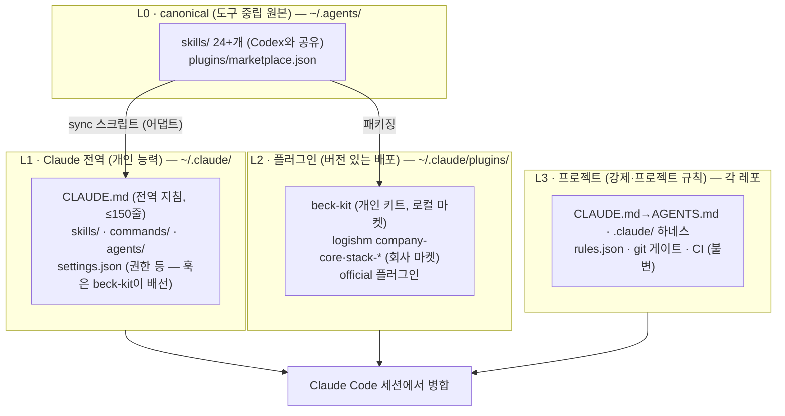
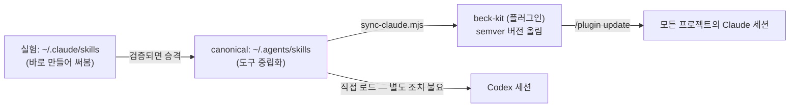

# 02. 아키텍처 — 4계층 구조와 우선순위 규칙

## 1. 전체 그림



| 계층 | 성격 | 무엇을 두나 | 무엇을 두면 안 되나 |
|---|---|---|---|
| **L0 canonical** | 원본 (사람이 편집하는 유일한 곳) | 도구 중립 SKILL.md, 개인 마켓 정의 | 도구 전용 문법, 비밀값 |
| **L1 Claude 전역** | 파생물 + Claude 전용물 | 전역 CLAUDE.md, 어댑트된 스킬, 개인 커맨드/에이전트, 안전 훅 | **품질 강제 훅**, 프로젝트 규칙, 대용량 지침 |
| **L2 플러그인** | 버전 있는 구독물 | 안정화된 키트(beck-kit), 회사 지침 플러그인 | 실험 중인 스킬 (L1에서 익힌 뒤 승격) |
| **L3 프로젝트** | 강제 + 프로젝트 지식 (기존 하네스, **이 기획으로 불변**) | rules.json, 게이트, 프로젝트 스킬·knowledge | 개인 취향, PC 경로 |

## 2. 디렉터리 레이아웃 (목표 상태)

```
C:\Users\beck\
├── .agents\                          # L0 — 도구 중립 (Codex와 공유, 이미 존재)
│   ├── skills\<이름>\SKILL.md          # canonical 스킬 (원본 — Codex는 이 폴더를 네이티브로 직접 로드)
│   └── plugins\
│       ├── marketplace.json            # Codex용 기존 마켓 (Codex 전용 스키마 — Claude와 비호환, 그대로 둠)
│       ├── .claude-plugin\marketplace.json  # ★신규 — Claude용 마켓 정의 (Claude 규약 위치·형식의 별도 파일)
│       └── beck-kit\                   # ★신규 — 개인 키트 플러그인 원본
│           ├── .claude-plugin\plugin.json   # name·version(semver)·description
│           ├── skills\ → L0 선별 어댑트
│           ├── commands\*.md
│           ├── agents\*.md
│           ├── hooks\hooks.json + *.js
│           ├── scripts\doctor.mjs      # /beck-kit:doctor-agentic 엔진
│           └── manifest.sha256         # 파일별 해시 — doctor A3 무결성 대조용
│
├── .claude\                          # L1+L2 — Claude Code 네이티브
│   ├── CLAUDE.md                       # ★신규 — 전역 지침 (≤150줄)
│   ├── settings.json                   # ★확장 — 권한·환경 (훅은 Phase 0 임시 배선 → Phase 2에 beck-kit로 이관·제거)
│   ├── skills\<이름>\SKILL.md          # 실험 스킬만 (안정화되면 beck-kit으로 승격)
│   ├── commands\*.md                   # 실험 커맨드만 (동일 승격 규칙)
│   ├── agents\*.md                     # 실험 에이전트만
│   ├── hooks\                          # Phase 0 임시 — 전역 훅 스크립트 (Phase 2에 beck-kit hooks로 이관 후 이 폴더·배선 제거)
│   │   ├── global-secret-filter.js
│   │   ├── global-danger-guard.js
│   │   └── global-probe.js
│   ├── plugins\                        # L2 — /plugin이 관리 (직접 편집 금지)
│   └── projects\<슬러그>\memory\       # 자동 메모리 (네이티브, 이미 동작)
│
└── Work\Dev\<레포>\                  # L3 — 프로젝트 하네스 (불변)
```

관리 원칙: **`~/.agents` 자체를 git 저장소 `beck-agentic-kit`의 워킹트리로 삼는다** (원격은 GitHub 개인 계정 비공개 레포 — R6가 요구하는 PC 외부 원본). canonical 스킬·beck-kit·Claude 마켓 정의·setup.mjs가 전부 이 한 레포에 있으므로, PC 초기화 시 `git clone <원격> ~/.agents` → `node ~/.agents/setup.mjs`(~/.claude 쪽 생성 담당) 1회로 전체 재구축한다 (R6). 별도 클론 + 복사 배치 방식은 원본-사본 이원화를 만들므로 채택하지 않는다.

## 3. 우선순위·충돌 규칙 (Claude Code 실제 동작 기준)

세션에서 각 계층이 겹칠 때의 규칙을 명시해 둔다 — doctor가 이 규칙 위반(의도치 않은 가림)을 감지한다:

| 자원 | 병합 방식 | 충돌 시 |
|---|---|---|
| 지침 (CLAUDE.md) | **누적** — 전역 + 프로젝트 둘 다 로드 | 충돌하는 내용은 프로젝트가 실질 우선 (더 구체적) → 전역엔 프로젝트와 겹칠 소지가 있는 규칙을 두지 않는 것이 원칙 |
| settings (훅·권한) | **병합** — user < project shared < project local < managed | 같은 이벤트에 훅이 여럿이면 **모두 실행** (덮어쓰기 아님) → 전역 훅은 중복 실행을 가정하고 멱등으로 |
| 커맨드 `/이름` | 스코프별 공존 (user/project/plugin) | 충돌 시 **프로젝트 커맨드 우선** 관례 + 플러그인 커맨드는 네임스페이스 호출(`/beck-kit:wrap`)로 언제든 구분 가능. 하네스 프로젝트와 겹치는 이름(`/wrap` 등)은 doctor(A5·B5)가 충돌 목록으로 보고 |
| 스킬 | 전역+프로젝트+플러그인 모두 발동 후보 | description 겹치면 오발동 → doctor가 이름·설명 유사도 중복 검사 (Codex health-check의 "duplicate 없음" 검사 대응) |
| 서브에이전트 | user + project 공존 | 같은 이름은 project 우선 |
| MCP | user 스코프(`~/.claude.json`) + project(.mcp.json) | 같은 서버명은 프로젝트 우선 |

## 4. 하네스(L3)와의 역할 분담 — 간섭 매트릭스

이 기획의 안전 조건 (G6). 전역 계층이 하네스 동작에 개입하는 지점을 전수 점검한 결과:

| 하네스 기능 | 전역 계층의 개입 | 판정 |
|---|---|---|
| 프로젝트 훅 (guide-loader, rules-guard 등) | 없음 — settings 병합은 추가일 뿐 제거 불가 | 안전 |
| git 게이트·CI | 없음 — 전역 계층은 git 훅을 건드리지 않음 | 안전 |
| 프로젝트 스킬 자동발동 (skill-rules.json) | 전역 스킬과 발동 경합 가능 | **주의** → 전역 스킬 description에 "프로젝트 지침이 있으면 그것을 우선하라" 명문화 + doctor 중복 검사 |
| AGENTS.md 지침 | 전역 CLAUDE.md와 누적 | **주의** → 전역엔 "회사 규칙과 겹치는 개발 프로세스 규칙 금지" (예: 커밋 형식은 전역에 안 씀 — 프로젝트마다 다름) |
| 계측 (.harness-metrics.jsonl) | 전역 probe는 **홈 파일(`~/.claude-global-metrics.jsonl`)에만 기록** — 임의 프로젝트 트리에 파일을 만들면 git status를 오염시켜 R4("모르는 프로젝트에서 무해") 위반 | 안전 — 통합 지표가 필요하면 집계 시점에 `tool` 필드로 병합 |

## 5. 데이터 흐름 — sync와 승격



- **실험 → 승격 규칙**: 새 스킬은 L1에서 바로 만들어 쓴다(마찰 없음). 2주 이상 쓰거나 Codex에서도 필요해지면 canonical로 옮기고 도구 중립화(경로·도구명 일반화)한 뒤 beck-kit 버전을 올린다. L1의 원본은 삭제 (이중화 금지 — doctor가 L1·L2 중복을 잡는다).
- **Codex 반영은 자동이다**: Codex는 `~/.agents/skills`를 네이티브로 직접 로드한다 (실측 근거: Codex health-check의 스킬 66 = 전역 24 + 개인 10 + 플러그인 캐시 32 산식, `~/.codex`에 canonical 복사본 없음). canonical에 두는 것만으로 Codex에 반영되므로 **~/.codex로의 복사 단계를 만들지 않는다** — 비목표 "Codex 전역 환경 개조 금지"와도 정합.
- **sync 스크립트**(`sync-claude.mjs`)는 logishm의 gen-codex-adapter.mjs와 대칭 개념: canonical → Claude 형식(SKILL.md frontmatter 보정, 도구명 치환). 초기에는 수동 복사로 시작해도 무방 (Phase 계획 참조).
