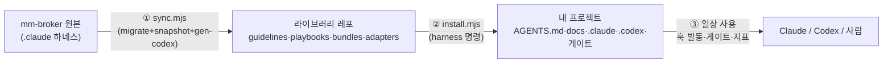
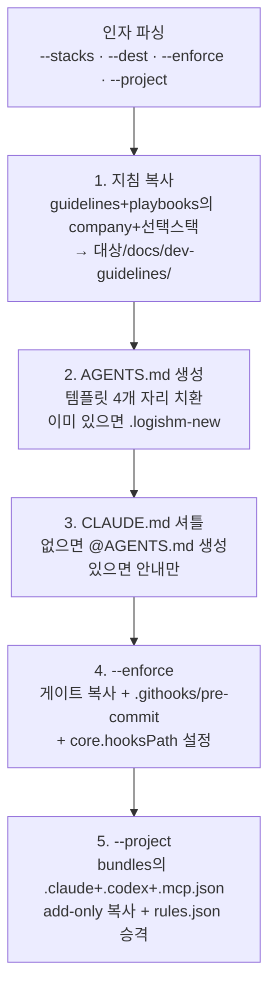

# 03. 전체 플로우 — 원본에서 일상 사용까지

이 시스템에는 큰 흐름이 3개 있다. **① 만들기**(원본 프로젝트 → 라이브러리), **② 설치**(라이브러리 → 내 프로젝트), **③ 사용**(일상 작업에서 훅·게이트가 도는 방식).



---

## ① 만들기 플로우 — `sync.mjs <mm-broker-root>` (라이브러리 관리자용)

mm-broker 원본이 바뀔 때마다 라이브러리를 재생성한다. 원본은 절대 수정하지 않고 읽기만 한다. 3단계가 순서대로 돈다:

### 1-1. `migrate.mjs` — 공유 지침 추출 (Claude 전용 → 도구 중립)

스크립트 안의 **배치 계획표(PLUGINS 상수)** — "어떤 스킬/커맨드/훅이 어느 분류(company-core, stack-*)에 속하는가"(AUDIT.md 분류 결과와 1:1) — 를 따라:

| 입력 (mm-broker) | 변환 | 출력 A (canonical) | 출력 B (Claude 플러그인) |
|---|---|---|---|
| `.claude/skills/<이름>.md` | frontmatter(name/description) 보정 | `guidelines/<그룹>/<이름>.md` | `adapters/…/skills/<이름>/SKILL.md` |
| `.claude/commands/<이름>.md` | 스킬 참조 링크 재작성 | `playbooks/<그룹>/<이름>.md` (상대경로 md 링크로) | `adapters/…/commands/<이름>.md` (`${CLAUDE_PLUGIN_ROOT}` 경로로) |
| `.claude/hooks/*.js` | 루트 계산 패치 (`__dirname` → `process.cwd()`) | — | `adapters/…/hooks/*.js` |

부수 처리: 공유 부적합 값 치환(개인 Notion 계정 → 안내 문구), 라이브러리 미포함(프로젝트 티어) 참조는 그대로 둠, `authoredSkills`(원본이 라이브러리인 지침, 예: notion-issue-workflow)는 역방향 보호(절대 덮지 않음).

### 1-2. `snapshot-claude.mjs` — 프로젝트 하네스 스냅샷

`.claude/` 86파일을 `bundles/mm-broker/.claude/`로 **구조 그대로**(verbatim) 복제한다. 이때:

- **비밀값 스크럽**: 개인 이메일 → `<QA_ACCOUNT>` 등 placeholder (테스트 비밀번호는 오너 판단으로 공개 유지)
- **제외**: `settings.local.json`, 캐시, worktrees, 백업 파일
- **루트 파일 포함**: `CLAUDE.md`(→ 설치 시 AGENTS.md에 인라인될 본문), `.mcp.json`
- **가드 통일 수술**: 스냅샷의 `settings.json`에서 하드코딩 훅(tdd-guard, layer-violation-checker) 호출을 `claude-rules-guard.js pre/post`(rules.json 기반)로 치환하고, 계측 프로브(harness-probe)를 PostToolUse에 추가 — 번들본은 "규칙 단일 소스" 체계를 쓰게 만든다 (원본 mm-broker는 옛 훅 유지)

### 1-3. `gen-codex-adapter.mjs` — Codex 어댑터 생성

Codex가 Claude와 같은 훅 스키마(hooks.json, PreToolUse/PostToolUse, exit 2 차단, additionalContext 주입)를 지원한다는 점을 이용해:

| 생성물 | 만드는 방법 |
|---|---|
| `.codex/hooks.json` | `.claude/settings.json`의 hooks를 복사 + Codex 전용 가드 4개 배선 추가 |
| `.codex/config.toml` | `.mcp.json`을 Codex MCP 포맷(TOML)으로 번역 |
| `.codex/prompts/` | `.claude/commands/` 27개를 그대로 복사 (Codex에서 `/prompts:이름`으로 호출) |
| `.codex/rules.json` + 가드 스크립트 | adapters/codex/의 엔진 4개 + 규칙 예시 복사 |

완료 후 `git diff`로 확인하고 커밋 — 원본과 라이브러리의 드리프트를 이 한 방 동기화로 방지한다.

---

## ② 설치 플로우 — `harness <대상> [옵션]` (모든 사용자)

`harness`는 `scripts/install.mjs`의 별칭이다(package.json bin). 인자에 따라 5단계가 돈다:



각 단계의 주목할 세부:

1. **지침 복사** — guidelines와 playbooks를 같은 루트 아래 나란히 둬야 문서 간 상대링크가 유지된다.
2. **AGENTS.md 생성** — 템플릿의 `{{ROUTING}}`은 **복사된 문서들의 frontmatter description을 읽어 자동 생성**한 "어떤 작업엔 어떤 문서" 표다 (스택을 적게 깔면 표도 그만큼 작아짐). `{{PROJECT_RULES}}`에는 `--project` 번들의 CLAUDE.md 본문이 **인라인**된다 — Claude·Codex가 같은 프로젝트 규칙을 읽게 하는 장치. `{{VERSION}}`은 git 커밋 해시.
3. **CLAUDE.md 셔틀** — 이미 있으면 "최상단에 @AGENTS.md 한 줄 추가하라" 경고만.
4. **--enforce** — 기존 훅 설정(.husky, 다른 hooksPath)이 있으면 **자동 배선을 건너뛰고** 수동 한 줄 안내만 출력(add-only 원칙). rules.json이 없을 때만 안전 기본값(비밀번호 평문 비교 금지 1건)을 생성 — 프로젝트가 만든 rules.json은 보존.
5. **--project** — add-only 복사(있는 파일은 건너뜀 + 개수 보고). 마지막에 **번들의 rules.json을 `enforce/rules.json`으로 승격 복사** — --enforce가 깐 약한 기본 규칙을 프로젝트 레이어 규칙으로 교체해 git 게이트·Codex 가드·Claude 가드가 같은 규칙을 쓰게 한다 (실측에서 발견된 버그의 수정: 약한 기본 rules.json이 가드 규칙을 가리는 문제).

`harness update`는 별도 분기: 라이브러리 클론에서 `git pull`, 실패 시 npm 재설치 폴백.

### 설치 직후 1회 셋업 (파리티 완성에 필요 — 설치기가 못 까는 것)

설치 명령만으로 환경이 끝나지 않는다. 원본 README·PARITY.md가 명시하는 후속 단계: ① `npm install` ② `.env`에 스크럽된 값(`<QA_ACCOUNT>`·`<QA_PASSWORD>`) 채우기 ③ **plannotator 플러그인 + playwright MCP 설치** (PARITY.md가 "외부 의존·환경"으로 분류한, 파일 복사로 전달 불가능한 영역) ④ Codex 사용 시 프로젝트 신뢰(trust) 등록.

### 설치 후 대상 프로젝트의 모습

```
내-프로젝트/
├── AGENTS.md                      입구 (라우팅 표 + 프로젝트 규칙 인라인)
├── CLAUDE.md                      @AGENTS.md 셔틀
├── docs/dev-guidelines/           지침 사본 + enforce/{precommit-gates.mjs, rules.json}
├── .githooks/pre-commit           (--enforce) 게이트 호출 한 줄
├── .claude/                       (--project) Claude 하네스 86파일
├── .codex/                        (--project) Codex 하네스 35파일
└── .mcp.json                      (--project) playwright MCP
```

---

## ③ 사용 플로우 — 일상 작업에서 무엇이 자동으로 도나

Claude Code 세션 기준, `.claude/settings.json` 배선(번들본):

| 시점 (이벤트) | 도는 것 | 성격 |
|---|---|---|
| 프롬프트 입력 (UserPromptSubmit) | `skill-activator.js` — 키워드/의도 매칭 → 관련 스킬 안내 주입<br>`complexity-reminder.js` — 복잡한 요청이면 계획 수립 리마인드 | 안내 (비차단) |
| 편집 직전 (PreToolUse Edit/Write) | `guide-loader.js` — 편집 파일 경로를 skill-rules.json과 매칭 → 맞는 스킬을 컨텍스트로 자동 주입<br>`claude-rules-guard.js pre` — requireTest: 테스트 없는 프로덕션 코드 **차단** | 안내 + 강제 |
| 브라우저 QA 도구 사용 직전 | `qa-knowledge-activator.js` — git 변경 영향 분석 + 페이지 엣지케이스 주입 | 안내 |
| Bash 실행 직전 (git commit 감지) | `simple-design-precommit.js` — staged+import 파일 4규칙 검사, critical/high면 **차단(exit 2)**, --no-verify 우회도 차단 | 강제 |
| 편집 직후 (PostToolUse) | `file-edit-tracker.js` — 수정 파일 기록<br>`claude-rules-guard.js post` — forbiddenImports/Patterns **차단**<br>`harness-probe.cjs` — 지표 기록 | 강제 + 계측 |
| 턴 종료 (Stop) | `solid-reviewer.js`, `build-checker.js`(tsc) | 안내 |
| **git commit 시** (도구 무관) | `.githooks/pre-commit` → `precommit-gates.mjs` — tsc/테스트/린트/비밀값/구조규칙 | **강제 (사람이 커밋해도)** |
| **PR/push 시** (서버) | `ci-gates.yml` → 같은 precommit-gates.mjs — GATE_DIFF_RANGE로 범위만 조정 | **강제 (우회 불가)** |

Codex 세션은 `.codex/hooks.json`이 같은 이벤트에 대응 가드를 배선한다 — 자세히: [05-codex-parity.md](./05-codex-parity.md).

핵심 통찰: **같은 규칙(rules.json)이 3개 시점에서 반복 검사된다** — 편집 시점(도구별 가드) → 커밋 시점(git 게이트) → 서버(CI). 앞 단계를 우회해도 뒤 단계가 잡는 다층 구조다.
