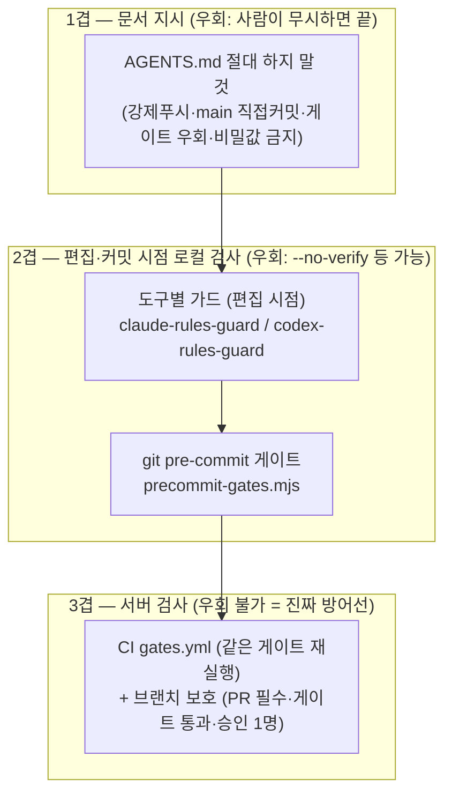

# 04. 강제 체계 — "안내"가 아니라 "막기"의 구현

## 1. 왜 git 훅과 CI인가

Claude·Codex 등 도구마다 자체 훅 방식이 다르다. **git 커밋 훅과 CI는 "누가 어떤 도구로 작업했든" 똑같이 동작하는 유일한 공통 지점**이다. 그래서 최종 방어선을 여기에 둔다.



## 2. 결과 게이트 — `precommit-gates.mjs` (242줄)

커밋 직전과 CI에서 **같은 파일**이 돈다. 설계 특징:

### 게이트 5종 — "프로젝트에 있는 것만" 자동 실행

| # | 게이트 | 실행 조건 (자동 감지) |
|---|---|---|
| 1 | 타입 검사 `npx tsc --noEmit` | `tsconfig.json` 있을 때 |
| 2 | 테스트 `npm run test:changed > test` | package.json에 해당 스크립트 있을 때 |
| 3 | 린트 `npm run lint` | lint 스크립트 있을 때 |
| 4 | **비밀값 스캔** | **항상** — 커밋 변경분(diff의 + 줄)만 검사 |
| 5 | **구조 규칙** | `enforce/rules.json` 있을 때 |

이 "있는 것만 돈다" 설계 덕분에 **문서 전용 레포에 깔아도 고장나지 않는다** (1~3 건너뛰고 4·5만 실행). 실제로 이 Design 레포에서 게이트가 통과하는 이유다.

### 비밀값 스캔 패턴 5종

비밀번호 대입(`password=…`, 한글 "비밀번호" 포함), 계정+비밀번호 페어(`이메일/값`), API 키/토큰 대입, 서비스 토큰 프리픽스(`sk-`, `ghp_`, `xoxb-` 등), PEM 개인 키. **diff의 추가된 줄만** 검사해 기존 코드의 오탐을 피한다.

### 실패 메시지의 설계 — 비개발자 우선

이 스크립트에서 가장 공들인 부분은 검사 로직이 아니라 **실패 출력**이다:

- 구조 규칙 위반: 파일·규칙 이름·hint(고치는 법) + *"잘 모르면 이 메시지를 AI에게 보여주며 '이 규칙대로 고쳐줘'라고 하세요"*
- 명령 실패: 마지막 20줄만 + *"AI에게 'X 실패했어, 고쳐줘'라고 그대로 보여주세요"*
- 비밀값: *"그 값을 코드에서 지우고 .env로 옮기세요"*

**실패 메시지가 곧 다음 행동 지시서**다. 비개발자가 막혔을 때 개발자를 부르지 않고도 AI와 함께 풀 수 있게 한다.

### CI 재사용 장치 — GATE_DIFF_RANGE

로컬에서는 staged 변경을, CI에서는 환경변수 `GATE_DIFF_RANGE`(예: `origin/main...HEAD`)로 지정한 범위를 검사한다. **같은 스크립트를 두 환경에서 재사용**하기 위한 유일한 분기점이다.

## 3. 단일 규칙 소스 — `rules.json`

구조 규칙(레이어·패턴·테스트 요구)은 선언적 JSON 한 파일이 소스다. 형식 3종:

```jsonc
{
  "forbiddenImports": [   // 레이어 import 금지
    { "name": "Service 레이어 db/drizzle/zod import 금지",
      "match": "**/application/**/*.service.ts",     // glob
      "forbid": ["drizzle-orm", "@/db", "zod"],
      "severity": "critical",                        // critical·high=차단, medium=경고
      "hint": "Service는 순수 TypeScript — ORM은 Repository에 위임" }
  ],
  "forbiddenPatterns": [  // 정규식 금지 패턴 (예: 비밀번호 평문 비교, 전체 컬럼 select)
    { "name": "…", "match": "**/*.ts", "pattern": "…", "severity": "high", "hint": "…" }
  ],
  "requireTest": {        // 프로덕션 파일에 대응 테스트 없으면 차단 (= tdd-guard의 선언화)
    "match": ["**/*.ts", "**/*.tsx"], "exclude": ["**/*.test.*", "…"], "severity": "high" }
}
```

이 파일을 읽는 검사기 3개 (모두 같은 glob 변환기·같은 판정 로직을 각자 내장):

| 검사기 | 시점 | 차단 방식 |
|---|---|---|
| `claude-rules-guard.js` | Claude 편집 전(pre=requireTest)/후(post=imports/patterns) | exit 2 + stderr → Claude가 피드백 받아 수정 |
| `codex-rules-guard.mjs` | Codex apply_patch 직전 | `permissionDecision: deny` JSON → 파일 자체가 안 만들어짐 |
| `precommit-gates.mjs` | git commit / CI | exit 1 → 커밋/머지 차단 |

탐색 순서도 통일돼 있다: `docs/dev-guidelines/enforce/rules.json` → `.claude/rules.json` 또는 `.codex/rules.json`. **한 파일 고치면 세 검사기 모두 반영.**

한계(문서에 명시됨): 옛 JS 훅의 휴리스틱 일부(index.ts 감지, try-catch 중괄호 카운팅 등)는 선언적 형식으로 못 옮겨 통합 가드에 없다. 선언화가 커버 못 하는 검사는 여전히 코드 훅으로 남는다는 정직한 트레이드오프.

## 4. Stage 2 — 서버 강제 (우회 불가 층)

1. `templates/ci-gates.yml`을 대상 레포 `.github/workflows/gates.yml`로 복사 → PR·main push마다 같은 게이트가 서버에서 재실행 (`fetch-depth: 0`으로 전체 히스토리를 받아 비밀값 diff 비교 가능하게).
2. 브랜치 보호: main에 "PR 필수 + `gates` 체크 통과 + 승인 1명 + 관리자도 우회 금지" (gh api 한 줄 또는 웹 UI — SETUP-enforcement.md에 복붙 가능한 명령 수록).

명시된 운영 합의: **게이트는 기계적 정확성만 보장한다. 로직 검증은 개발자 PR 리뷰의 몫** — "하네스가 리뷰 부담을 줄여 주지, 개발자를 라인에서 빼 주지는 않는다."

## 5. 계측 — 강제가 실제로 도는지 측정

- `harness-probe.cjs` (비차단, Claude·Codex 공용): 훅이 발사될 때마다 도구/이벤트/참조 파일/스킬 참조 여부를 `.harness-metrics.jsonl`에 한 줄씩 기록. 가드들도 차단(deny) 시 같은 파일에 기록.
- `harness-metrics.mjs <프로젝트>`: 도구별 훅 발사 횟수 · 위반 차단 횟수 · 참조한 스킬 목록 집계.

실측 예 (PARITY.md, 동일 위반 시나리오): Codex 훅 발사 6·차단 1·스킬 참조 2, Claude 발사 4·차단 1·참조 0 (Claude는 주입 방식이라 "읽기"로 안 잡히는 계측 한계까지 문서화돼 있음). **"하네스가 잘 돌아간다"를 감이 아니라 숫자로 확인**하는 장치이며, 정답 여부가 아니라 활성화·감지를 잰다고 한계를 명시한다.
