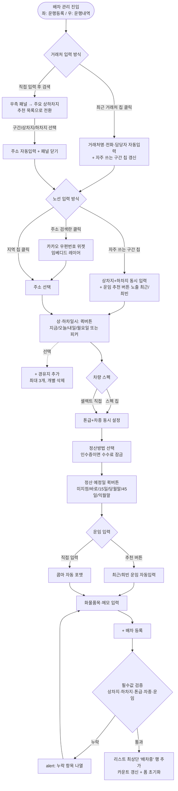
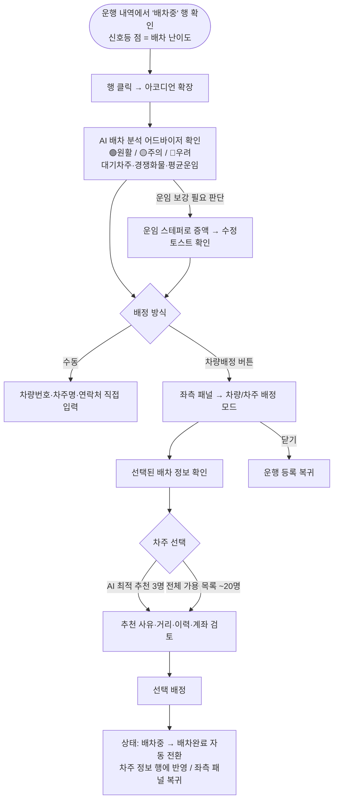
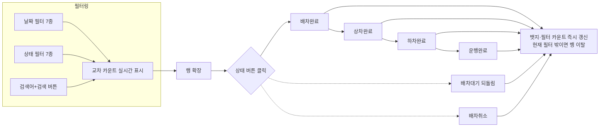
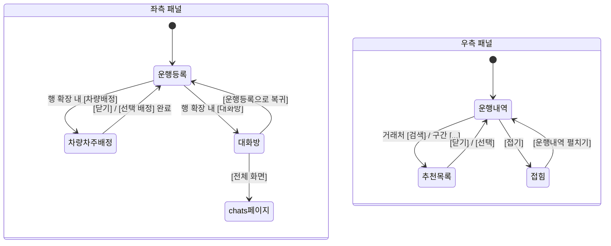

# nbbb1.vercel.app/dispatches — Userflow

분석일: 2026-07-08 · 근거: 실 조작 기반 (01-기능분석-이벤트정리.md 참조)

이 화면의 사용자는 **관제 담당자(배차 매니저)** 1인이며, 핵심 과업은 4개다:
1. 신규 운행 등록  2. 차주 배정  3. 운행 상태 관제  4. 운임/정산 정보 관리 (+ 거래처/차주 소통)

---

## Flow 1. 신규 운행 등록 (해피 패스)



**설계 의도**: 모든 필드에 "직접 입력"과 "원클릭 추천(칩/퀵버튼)"의 이중 경로를 제공 — 반복 업무인 배차 등록의 입력 비용을 최소화하는 흐름.

---

## Flow 2. 차주 배정 (AI 추천)



**설계 의도**: 난이도 신호등(리스트) → AI 어드바이저(확장) → AI 추천 차주(배정 패널)로 이어지는 **3단계 AI 보조 깔때기**. 배정 실패 위험이 높은 건을 리스트 단계에서부터 시각적으로 선별하게 한다.

---

## Flow 3. 운행 상태 관제 (라이프사이클 관리)



## Flow 4. 운임/수수료 수정

```
행 확장 → [운임 및 수수료 정보 수정] 카드
  → 대상 토글(운/수) → 스테퍼(±1만/±5천/±1천) 또는 직접 입력
  → [수정] → 토스트 "수정 완료" → 리스트 운임 컬럼 즉시 반영
```

## Flow 5. 거래처/차주 소통 (대화방)

```
행 확장 → [대화방] (상세 헤더 또는 배정 차주 연락처 옆)
  → 좌측 패널 = 대화방 모드 (상대 정보 + 메시지 스레드)
  → 입력 → [전송] → 버블 즉시 추가
  → [전체 화면] → /chats 페이지 이동   |   [운행등록으로 복귀] → 기본 모드
```

---

## 패널 모드 전환 맵 (전체 상태도)


