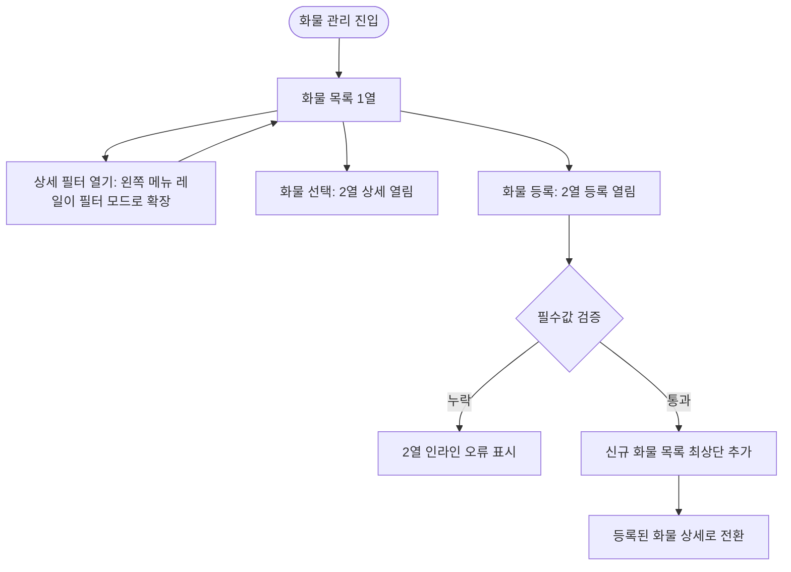
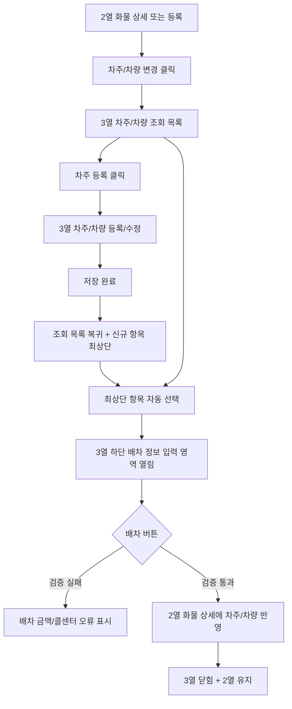
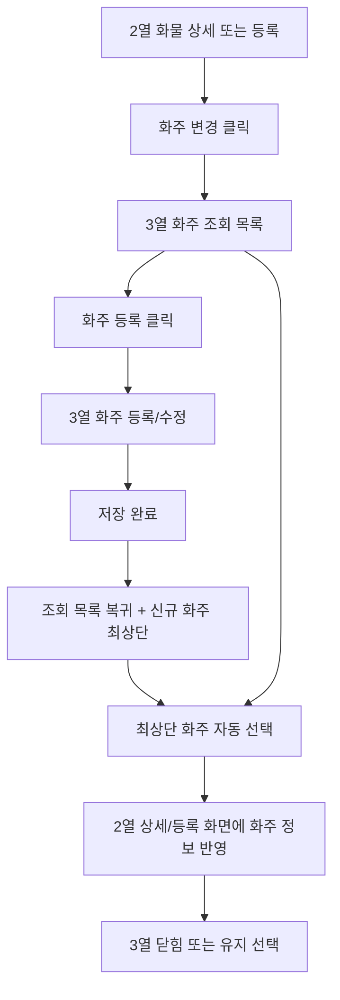

# 화물 관리 사용자 흐름 및 상태 전환

## 1. 사용자와 핵심 과업

주 사용자는 관제 담당자 또는 배차 매니저다. 하루 업무 중 자주 반복되는 과업은 다음 순서로 이어진다.

1. 화물 목록에서 배차가 필요한 오더를 찾는다.
2. 화물 상세를 확인하거나 수정한다.
3. 신규 화물을 등록한다.
4. 화주를 조회, 선택, 신규 등록한다.
5. 차주/차량을 조회, 선택, 신규 등록한다.
6. 배차 금액과 콜센터를 입력하고 배차한다.
7. 배차 상태와 정산 상태를 후속 관리한다.

## 2. 전체 화면 상태

| 상태 | 열 구성 | 진입 이벤트 | 주요 목적 | 종료 이벤트 |
|---|---:|---|---|---|
| `LIST_ONLY` | 1열 | 페이지 진입 | 화물 목록 확인, 검색, 빠른 필터 | 화물 선택, 필터 열기, 화물 등록 |
| `FILTER_OPEN` | 전역 메뉴 사이드바 확장 + 1열 | `상세 필터` 클릭 | 기존 `DB/화/차/정/톡` 메뉴 레일이 필터 사이드바로 전환되어 목록 조건을 좁힘 | 상단 뒤로가기, 조건 초기화 |
| `DETAIL_OPEN` | 2열 | 화물 행 선택 | 화물 상세 조회/수정 | 다른 화물 선택, 패널 닫기 |
| `CREATE_CARGO` | 2열 | `화물 등록` 클릭 | 신규 화물 등록 | 등록 완료, 취소 |
| `DRIVER_LOOKUP` | 3열 | 상세/등록에서 `차주/차량 변경` 클릭 | 차주/차량 조회 및 선택 | 배차 완료, 3열 닫기 |
| `DRIVER_FORM` | 3열 | 3열에서 `차주 등록` 클릭 | 신규 차주/차량 등록 또는 수정 | 저장 후 조회 목록 복귀 |
| `SHIPPER_LOOKUP` | 3열 | 상세/등록에서 `화주 변경` 클릭 | 화주 조회 및 선택 | 선택 완료, 3열 닫기 |
| `SHIPPER_FORM` | 3열 | 3열에서 `화주 등록` 클릭 | 신규 화주 등록 또는 수정 | 저장 후 조회 목록 복귀 |
| `MOBILE_LIST` | 카드 목록 | 모바일 진입 | 필수 정보만 빠르게 스캔 | 카드 선택 |
| `MOBILE_STEP` | 단계형 화면 | 모바일 카드 선택 | 상세/수정/선택 작업 | 뒤로, 저장, 배차 |

## 3. 화물 목록 흐름

### 등록 완료 규칙

- 신규 화물은 목록 최상단에 추가한다.
- 목록 카운트와 상태별 카운트를 갱신한다.
- 2열 등록 화면은 방금 등록된 화물 상세 화면으로 전환한다.
- 방금 등록된 화물이 선택 상태가 된다.

## 4. 차주/차량 선택 및 배차 흐름

### 차주/차량 조회 목록 필수 정보

- 차주명
- 차량번호
- 소속 구분
- 톤급/차종
- 현재 위치 또는 연계지
- 상태: 대기중, 운행중, 휴무, 배차불가
- 최근 배차 이력
- 월 누적 운임
- 계좌 상태
- 추천 사유

### 배차 입력 영역

차주/차량이 선택되면 3열 하단에 배차 정보 입력 영역이 열린다.

필수 입력:

- 배차 금액
- 배차 콜센터

선택 입력:

- 차주 전달 메모
- 콜센터 메모
- 수수료 조정

## 5. 화주 선택/등록 흐름

화주 선택은 차주/차량 선택과 같은 3열 패턴을 사용한다.

### 화주 조회 목록 필수 정보

- 화주명 또는 거래처명
- 담당자
- 연락처
- 사업자번호
- 주요 상차지
- 주요 하차지
- 정산 조건
- 미수/주의 여부
- 최근 운송 건수

## 6. 상태 전환 세부 규칙

| 이벤트 | 변경 전 | 변경 후 | 추가 동작 |
|---|---|---|---|
| 화물 행 선택 | `LIST_ONLY` | `DETAIL_OPEN` | 선택 행 강조, 2열 상세 표시 |
| 다른 화물 행 선택 | `DETAIL_OPEN` | `DETAIL_OPEN` | 2열 내용을 새 화물로 교체 |
| 화물 등록 클릭 | `LIST_ONLY` 또는 `DETAIL_OPEN` | `CREATE_CARGO` | 2열을 등록 폼으로 교체 |
| 화물 등록 완료 | `CREATE_CARGO` | `DETAIL_OPEN` | 목록 최상단 추가, 신규 화물 자동 선택 |
| 상세 필터 클릭 | `LIST_ONLY` | `FILTER_OPEN` | 기존 전역 메뉴 사이드바가 필터 사이드바로 전환, 목록 선택 상태 유지 |
| 차주/차량 변경 클릭 | `DETAIL_OPEN` 또는 `CREATE_CARGO` | `DRIVER_LOOKUP` | 3열 조회 목록 표시 |
| 차주 등록 클릭 | `DRIVER_LOOKUP` | `DRIVER_FORM` | 3열 내용만 등록 폼으로 교체 |
| 차주 등록 완료 | `DRIVER_FORM` | `DRIVER_LOOKUP` | 신규 차주 최상단 추가 및 자동 선택 |
| 배차 완료 | `DRIVER_LOOKUP` | `DETAIL_OPEN` | 2열 상세 갱신, 3열 닫기 |
| 화주 변경 클릭 | `DETAIL_OPEN` 또는 `CREATE_CARGO` | `SHIPPER_LOOKUP` | 3열 화주 목록 표시 |
| 화주 등록 완료 | `SHIPPER_FORM` | `SHIPPER_LOOKUP` | 신규 화주 최상단 추가 및 자동 선택 |

## 7. 검증과 피드백 규칙

기존 분석의 `alert()` 중심 검증은 새 기획에서 인라인 오류로 바꾼다.

- 필수값 누락은 해당 필드 아래에 표시한다.
- 저장/등록/배차 성공은 우상단 토스트로 표시한다.
- 목록 갱신, 카운트 갱신, 선택 상태 변경은 같은 이벤트에서 동시에 반영한다.
- 상태 변경 후 현재 필터 조건에서 제외되면 목록에서 사라질 수 있음을 토스트 또는 빈 상태 문구로 알려준다.
