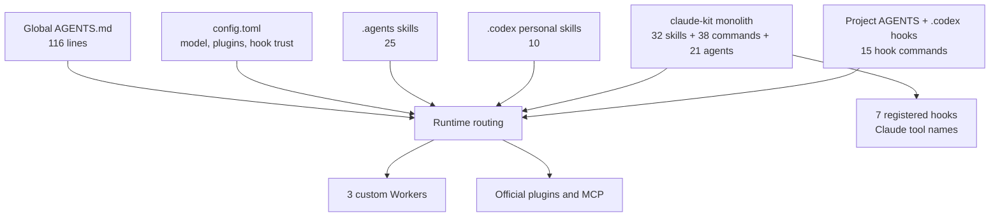

# 01. Baseline Inventory

## 1. 감사 경계

이번 감사는 planning-only다. 현재 설정과 설치 파일을 읽고 mock 입력으로 hook 판정만 확인했다. 전역 설정, plugin, skill, hook, command, agent는 수정하지 않았다. session, rollout, memory 본문은 직접 invocation 근거가 꼭 필요한 경우를 제외하고 조사하지 않았다.

## 2. Source of Truth 순서

1. `C:\Users\beck\.codex\config.toml`, `C:\Users\beck\.codex\AGENTS.md`
2. `C:\Users\beck\.codex\agents`, `C:\Users\beck\.agents\skills`, `C:\Users\beck\.codex\skills`
3. `C:\Users\beck\.codex\local-plugins\claude-kit`
4. 활성 plugin cache와 hook manifest
5. validator, test, mock hook probe
6. 과거 기획 문서와 memory 요약

과거 문서는 설계 의도를 설명하지만 현재 구현의 증거로 단독 사용하지 않았다.

## 3. 현재 수치

| 표면 | 실측 |
|---|---:|
| 전역 `AGENTS.md` | 116 lines |
| 기본 model/effort | `gpt-5.6-terra/medium` |
| Agent 제한 | `max_threads=4`, `max_depth=1` |
| Custom agent | 3개 |
| 사용자 `.agents` skill | 25개 |
| 개인 `.codex` skill | 10개 |
| claude-kit active skill | 32개 + 빈 legacy directory 1개 |
| claude-kit command | 38개 (`dev 21`, `plan 10`, `copy 7`) |
| claude-kit agent | 21개 |
| claude-kit hook 파일 | 14개, manifest active 7개 |
| claude-kit Markdown | 96 files, 11,411 lines |
| Enabled plugin config | 12개 |
| Hook trust | 22개 기록, plugin manifest 기준 7개 인식 |
| 프로젝트 Design hook command | 15개 |
| Design harness metrics | 약 947 KB |

`hook trust 22 - plugin expected 7 = 15`는 Design 프로젝트 hook 15개와 정확히 일치한다. 따라서 health-check의 `stale 15`는 곧바로 삭제할 항목이 아니라 project hook trust를 expected set에 포함하지 않은 분류 한계로 판정한다.

## 4. Capability 상태 모델

| 상태 | 의미 |
|---|---|
| Declared | 문서 또는 설정에 정의됨 |
| Installed | 파일과 manifest가 존재함 |
| Routable | 현재 runtime에서 호출 경로가 있음 |
| Invoked | 실제 호출 증거가 있음 |
| Verified | 재실행 가능한 검증 통과 |
| Valuable | 품질·시간·사용량 가치가 입증됨 |

Installed를 active 또는 valuable로 간주하지 않는다. 상위 capability 판정은 [inventory.json](./inventory.json), 실제 entry file별 기능·점수·처분은 [06-file-level-capability-scorecard.md](./06-file-level-capability-scorecard.md)와 [file-inventory.json](./file-inventory.json)에 기록했다.

## 5. 현재 구조

## 6. 재실행 가능한 증거

| Evidence | 명령 또는 경로 | 결과 |
|---|---|---|
| E-001 | `python C:\Users\beck\.agents\skills\agentic-health-check\scripts\agentic_health_check.py` | core PASS, config WARN, stale 15 |
| E-002 | `C:\Users\beck\.codex\config.toml` | Terra/medium, plugin 12, agents 4/1 |
| E-003 | `C:\Users\beck\.codex\AGENTS.md` | 얇은 global policy와 Advisor/Worker route |
| E-004 | `C:\Users\beck\.codex\agents\*.toml` | 3개 route schema PASS |
| E-005 | skill root 직접 열거 | `.agents 25`, `.codex 10`, claude-kit active 32 |
| E-006 | claude-kit manifest와 `hooks.json` | command 38, agent 21, active hook 7 |
| E-007 | hook mock JSON probe | `Bash`는 DB deny, `exec_command`는 allow; `Edit`는 보안 경고, `apply_patch`는 무반응 |
| E-008 | `C:\Work\Dev\Design\.codex\hooks.json` | 프로젝트 hook command 15 |
| E-009 | Advisor/Worker release와 paired eval | direct/delegated route PASS, planning auto route REJECT |
| E-010 | targeted stale reference scan | `/orchestrate`, TeamCreate, sonnet/haiku, `/tmp`, Claude 명령 다수 |
| E-011 | health-check source inspection | top-level `SKILL.md`만 stale scan; references, agents, hooks 제외 |
| E-012 | source/cache SHA-256 비교 | claude-kit 115개 파일 hash 차이 0, 양쪽 최신 수정 2026-07-07 |

## 7. 입력 문서에서 유지할 원칙

- 능력은 사용자 전역 또는 versioned package에 둘 수 있지만 프로젝트 강제는 프로젝트와 함께 둔다.
- `rules.json` 같은 선언 데이터와 검사 엔진을 분리한다.
- 실제 피해를 막는 마지막 방어선은 tool-specific prompt가 아니라 git/CI 등 도구 무관 지점이다.
- add-only를 모든 파일에 일반화하지 않고 owner가 명확한 파일만 갱신한다.
- Advisor는 Worker 완료 보고가 아니라 diff와 test를 직접 검증한다.

## 8. 기준선 한계

- 모든 skill의 최근 invocation telemetry는 존재하지 않거나 이번 범위에서 읽지 않았다.
- official plugin의 제품 가치와 계정별 사용 빈도는 평가하지 않았다.
- hook mock probe는 matcher와 script 판정만 검증하며 실제 Codex hook dispatcher 내부 동작 전체를 증명하지 않는다.
