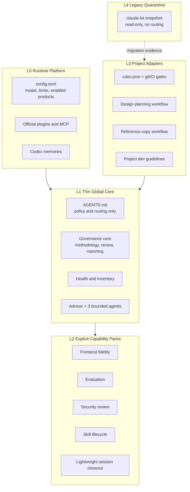

# 03. Disposition and Target Architecture

## 1. 추천 목표 구조

## 2. 구조 원칙

1. 개인 전역 기능은 plugin monolith가 아니라 직접 로드되는 작고 독립적인 skill과 agent를 우선한다.
2. official plugin과 MCP는 제품 기능이며 custom governance와 별도 inventory로 관리한다.
3. global hard block은 기본 0개에서 시작한다. 실제 Codex matcher, isolated negative test, rollback을 모두 통과한 안전 hook만 별도 승인한다.
4. TDD, architecture, planning schema, copy evidence처럼 프로젝트 맥락이 필요한 규칙은 project adapter로 이동한다.
5. command를 workflow의 SSOT로 사용하지 않는다. skill 또는 프로젝트 playbook이 SSOT이고 command는 필요한 경우 얇은 alias만 둔다.
6. 각 capability는 owner, trigger, consumer, dependency, deterministic check, rollback을 가져야 한다.
7. invocation 또는 value 증거가 없는 capability는 자동 승격하지 않는다.

## 3. 처분 요약

| 분류 | 수 | 대표 항목 |
|---|---:|---|
| KEEP | 16 | AGENTS, config, Advisor/Worker, methodology/review/reporting, fidelity, eval, official plugins |
| REWRITE | 7 | health-check, session-wrap, verification, security, claude-kit packaging과 hooks |
| DELETE | 6 | cc-dev-agent, team-orchestrator, strategic-compact, using-superpowers, inactive hooks, Claude env flag |
| PROJECT-ONLY | 4 | claude-kit dev/plan/copy command pack, project harness |
| QUARANTINE | 2 | continuous-learning-v2, legacy claude-kit agents |
| MERGE | 1 | manage-skills + skill-factory |

상위 source와 evidence는 [inventory.json](./inventory.json), 파일별 점수와 최종 이동 대상은 [06-file-level-capability-scorecard.md](./06-file-level-capability-scorecard.md)를 따른다.

## 4. claude-kit 재구조화

### 유지하지 않을 것

- `claude-kit`을 개인 전역 governance monolith로 계속 운영하지 않는다.
- 현재 38개 command를 모두 global routing surface에 유지하지 않는다.
- Claude의 Task/Team/model/path 전제를 Codex compatibility라는 이름으로 보존하지 않는다.
- 같은 version directory에 내용을 계속 덮어쓰는 방식을 version 관리로 간주하지 않는다.

### 이동할 것

| 기존 영역 | 목표 위치 | 처리 |
|---|---|---|
| dev workflow | 프로젝트 하네스 또는 repo playbook | 프로젝트 구조와 TDD 규칙을 코드와 함께 관리 |
| plan workflow | Design repo adapter | `.plans` schema가 있는 프로젝트에서만 활성화 |
| copy workflow | fidelity project adapter | global fidelity skill은 기준만, evidence schema는 프로젝트 소유 |
| security checklist | 경량 global review skill + project gate | global은 리뷰, 강제는 project/CI |
| session compatibility | read-only legacy snapshot | active routing 제거 |
| hook files | project adapter 또는 삭제 | global hook은 별도 pilot 전까지 0개 |
| useful general guidance | 독립 `.agents` skill | stale path와 command 제거 후 개별 test |

### 종료 조건

1. KEEP/REWRITE 대상으로 추출한 capability가 독립 validation을 통과한다.
2. Design 및 대표 개발 프로젝트에서 project adapter smoke가 통과한다.
3. claude-kit을 disable한 fresh session에서 core workflow 회귀가 없다.
4. rollback 시 기존 plugin과 cache를 다시 enable할 수 있다.
5. 위 조건 후에만 active plugin에서 제거하고 snapshot을 quarantine으로 이동한다.

## 5. Guardrail 강도

| 강도 | 허용 대상 | 현재 처리 |
|---|---|---|
| Hard block | credential write, 명백한 destructive command, production write | global 신규 적용 보류; isolated pilot 필요 |
| Project block | TDD, architecture, scope, plan schema, commit gate | project marker + repo-owned rules에서만 |
| Warning | security-sensitive edit, quality reminder | 중복·오탐 측정 후 opt-in |
| Advisory skill | methodology, review, verification, reporting | 명확한 trigger에서 호출 |
| Remove | 일반 리마인더, stale runtime, 무소비자 자동화 | Delete Gate 통과 후 삭제 |

`dev-db-guard`의 의도는 유효하지만 현재 matcher로는 Codex를 보호하지 못한다. global safety hook 후보가 필요하면 `exec_command`와 Windows PowerShell payload를 포함한 별도 eval을 먼저 만든다.

## 6. Delete Gate

DELETE는 기획상 추천일 뿐 즉시 삭제 명령이 아니다. 구현 단계에서 다음을 모두 만족해야 한다.

- active config, manifest, AGENTS, command, skill에서 consumer 0
- 다른 capability dependency 0
- fresh session routing에서 미노출 또는 disable 확인
- 대표 workflow regression PASS
- backup manifest와 restore 절차 존재

하나라도 실패하면 `QUARANTINE`으로 낮춘다.

## 7. 목표 운영 표면

- 전역 정책: `AGENTS.md` 1개
- runtime 설정: `config.toml` 1개
- custom agent: 3개 유지
- global custom hook: claude-kit disable 이후 목표 상태 0개
- core skill: 고유 책임이 확인된 작은 skill만 유지
- project workflow: 각 repo의 AGENTS, `.codex`, docs, git/CI gate
- legacy: routing되지 않는 read-only snapshot

목표는 임의의 skill 개수 제한이 아니다. 같은 trigger와 consumer를 가진 중복 capability가 0이고, 남은 모든 capability가 검증 경로를 갖는 것이다.
