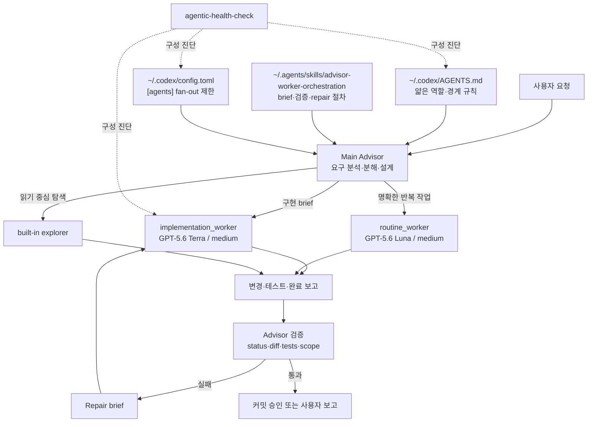
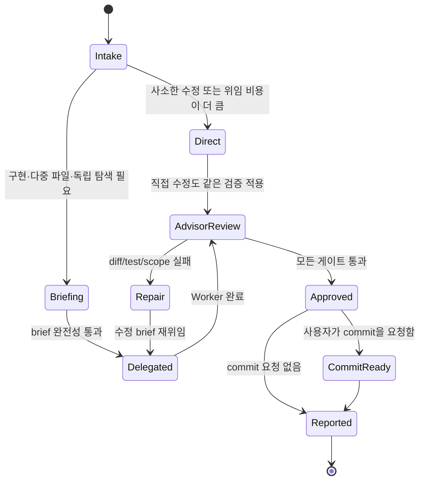

# 02. 전역 아키텍처와 책임 경계

## 1. 적용 표면

## 2. 전역 파일 배치

| 표면 | 목표 경로 | 역할 | MVP 변경 |
|---|---|---|---|
| Global guidance | `C:\Users\beck\.codex\AGENTS.md` | Advisor/Worker 책임, trigger, 금지 사항 | 20줄 안팎 섹션 추가 |
| Orchestration skill | `C:\Users\beck\.agents\skills\advisor-worker-orchestration\` | brief template, 분해, 병렬화, 검증, repair loop | 신규 |
| Implementation Worker | `C:\Users\beck\.codex\agents\implementation-worker.toml` | 일반 구현·테스트 작성 | 신규 |
| Routine Worker | `C:\Users\beck\.codex\agents\routine-worker.toml` | Terra 검증 루프 이후 Luna/medium 반복 작업 | Phase 4 신규 |
| Agent limits | `C:\Users\beck\.codex\config.toml` | runtime thread/depth/CSV timeout 제한 | `[agents]` 추가 후보 |
| Health check | `C:\Users\beck\.agents\skills\agentic-health-check\` | custom agent와 설정 drift 진단 | 확장 |
| Eval definition | `C:\Users\beck\.agents\skills\advisor-worker-orchestration\references\evals\` | versioned golden task, schema, grader template | 신규 정적 자산 |
| Eval run state | `C:\Users\beck\.codex\eval-runs\advisor-worker\` | mutable token/credit log와 pilot report | 신규 실행 상태, skill 배포 제외 |

MVP에서는 plugin, MCP server, hook을 새로 만들지 않는다. 현재 Codex가 제공하는 전역 guidance, skill, custom agent, config만 조합한다.

## 3. 책임 모델

| 작업 | Advisor | Worker | 사용자 |
|---|---|---|---|
| 요구사항 해석 | 소유 | 질문·불명확점 보고 | 최종 의도 제공 |
| source of truth 탐색 | 핵심 파일 직접 확인 | 위임된 범위만 보충 | 필요 시 접근 승인 |
| 작업 분해·설계 | 소유 | 설계 변경 제안만 가능 | 큰 trade-off 승인 |
| 구현·테스트 작성 | 사소한 예외만 | 소유 | 없음 |
| 병렬 파일 소유권 | 지정 | 지정 경로 준수 | 없음 |
| pilot workspace | disposable fixture 또는 전용 clean worktree 지정 | 지정 workspace 밖 접근 금지 | fixture 범위 승인 |
| Worker 결과 검증 | 소유 | 증거 제공 | 없음 |
| 테스트 재실행 | 소유 | 선행 실행 가능 | 없음 |
| commit/push | 사용자 요청 범위에서 Advisor만 | 금지 | 권한 부여·최종 요청 |
| 최종 보고 | 소유 | 내부 완료 보고 | 결과 확인 |

## 4. 실행 상태 흐름

## 5. 위임 여부 결정

다음 중 하나면 Worker 위임을 기본으로 한다.

- 코드와 테스트를 함께 작성한다.
- 3개 이상 파일을 수정한다.
- 구현 예상 시간이 10분을 넘는다.
- 탐색 결과와 구현 로그가 메인 컨텍스트를 크게 오염시킬 수 있다.
- 서로 독립적인 2개 이상 작업을 분리할 수 있다.

다음은 Advisor가 직접 처리할 수 있다.

- 1~2줄 수정처럼 brief 작성·agent 시작 비용이 더 큰 작업.
- 오탈자·명백한 포맷 정리.
- Worker 결과를 반영하는 사소한 마무리.
- 사용자가 subagent 사용을 원하지 않는다고 명시한 작업.

직접 처리 예외도 diff와 테스트 검증을 생략하지 않는다.

## 6. 병렬 실행 규칙

### 기본 허용

- 읽기 중심 codebase exploration.
- 서로 다른 테스트 묶음 실행.
- 로그 분석, 문서 요약, 위험 영역별 review.
- 서로 다른 worktree의 구현.

### 조건부 허용

- 같은 worktree의 쓰기 작업은 `allowed_paths`가 겹치지 않을 때만 허용한다.
- lockfile, generated output, build cache, test DB처럼 명시 경로 밖에서 바뀔 수 있는 공유 쓰기 상태도 겹치지 않아야 한다.
- 공유 파일, barrel export, lockfile, schema, config를 건드리는 Worker는 직렬 실행한다.
- 병렬 결과의 통합 순서는 Advisor가 미리 정한다.
- pilot은 disposable fixture 또는 전용 clean worktree에서만 실행한다. dirty user worktree는 병렬 쓰기 대상이 아니다.

### 금지

- 둘 이상의 Worker가 같은 파일을 동시에 수정.
- Worker가 다른 Worker를 spawn.
- 범위가 모호한 상태에서 `Ultra`와 수동 fan-out을 동시에 사용.
- Worker가 commit·push·PR·배포를 수행.

## 7. 전역 지침 초안의 경계

전역 `AGENTS.md`에는 아래 내용만 둔다.

- 메인 세션은 Advisor라는 역할 선언.
- 구현 위임 trigger와 직접 처리 예외.
- Worker brief에 orchestration skill을 사용한다는 routing.
- Worker 완료 보고를 신뢰하지 않고 diff/test를 직접 확인한다는 원칙.
- 병렬 쓰기 경로 분리, commit/push 금지.
- turn당 Worker 최대 3개는 soft policy이며 `[agents].max_threads`와 다른 제한이라는 설명.

모델별 상세 표, brief template, repair loop, eval 절차는 skill에 둔다. 전역 `AGENTS.md`를 모델 릴리스 노트처럼 만들지 않는다.
